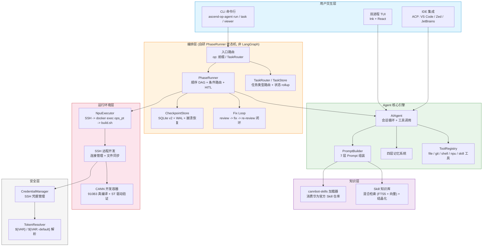
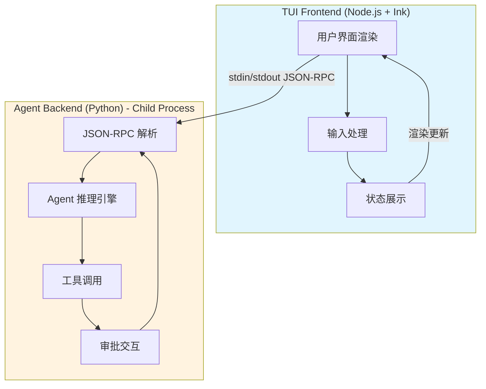
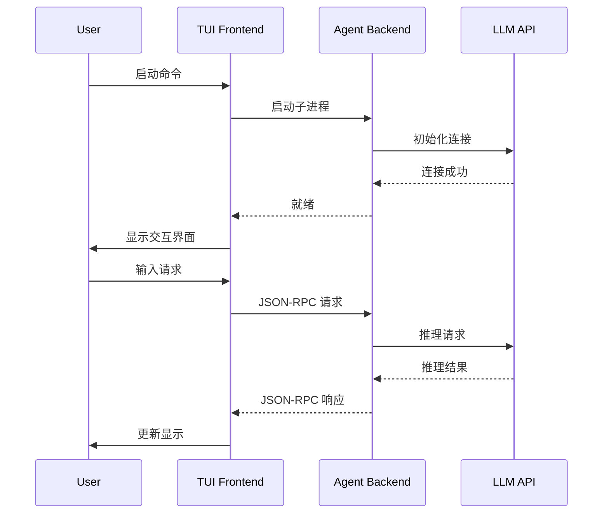

# 架构设计

## 系统架构

整个系统采用**分层架构**设计，从上到下分为六层：用户交互层、编排层、Agent 核心引擎、知识层、运行环境层、安全层。每一层各管一段职责，层间通过明确的接口解耦。



### 编排层：自研 PhaseRunner

项目最关键的技术决策之一是**自研轻量状态机编排器**而非直接使用 LangGraph。编排层由以下模块组成（`src/ascend_op_agent/orchestrator/`）：

| 模块 | 职责 |
|------|------|
| `state_machine.py` | PhaseRunner 顺序 DAG 引擎：按 `nodes` 列表顺序执行、应用 reducer、每节点后持久化 checkpoint、处理 `__interrupt__`（HITL 暂停）和 `__status__`（done/failed 终止）、`resume` 从 checkpoint 续跑 |
| `state.py` | OpState（TypedDict）+ reducer 规则：`messages`/`phase_history` append，`memory_pools`/`retry_counts` dict merge，其余 last-write-wins |
| `checkpoint.py` | CheckpointStore（SQLite v2）：三表 schema（checkpoints / artifacts / pending_approvals）+ WAL + busy_timeout + v1↔v2 迁移 + quarantine LRU |
| `npu_exec.py` | NpuExecutor：SSH -> docker exec ops_pt -> `bash build.sh --soc=ascend910b` 真编译 + ST 驱动精度验证（NPU 执行 + CPU golden + MERE/MARE 比对） |
| `fix_loop.py` | run_fix_loop：review -> fix -> re-review 收敛循环 + compress_transcript token 压缩 |
| `cannbot_loader.py` | cannbot-skills 加载器：消费华为官方 skill 仓库 + SkillUsageRegistry（signal-1 跟踪）+ SKILL_BUNDLES 决策表 |
| `graphs/` | 三路径图定义：`migration.py`（Path-B CUDA/Triton 迁移）、`new_dev.py`（Path-C 全新开发） |
| `nodes/` | 节点实现：`common.py`（make_llm_node）、`hitl.py`（make_hitl_llm_node）、`delivery.py`（交付模式 + 框架适配）、`migration.py`（前端解析）、`validation.py`（compile/precision 真节点 + fix_loop 包装）、`micro_mod.py` |

设计理由：P0 单算子顺序执行场景下，约 50 行的 PhaseRunner 够用且更易调试。LangGraph 的复杂路由/分支条件留到 P1（选择性批量迁移）再评估引入。

### 任务管理层

`task_router/` 与 `task_store/` 在编排层之上提供多任务管理能力（一期-a 已落地，一期-b 规划中）：

- `task_router/commands.py`：显式命令逻辑（list / new / select / progress / run / complain），CLI 与 TUI 共用
- `task_router/executor_dispatch.py`：TaskRouter 按 `task.type`（develop / migrate / analyze / optimize）路由到执行器；一期-a 仅 develop（转 `op:` 调 PhaseRunner），其余 gated on Path A
- `task_store/store.py` + `models.py`：TaskStore（SQLite）+ Task 模型；`state` 由 rollup 实时推导（非 source of truth）
- `task_store/progress.py` + `rollup.py`：任务进展聚合 + 状态推导（draft/running/paused/done/failed）

### 记忆系统（四层）

1. **Working Memory** - 当前会话上下文（MemoryStore，`agent/memory.py`）
2. **Episodic Memory** - 完整会话历史（ChromaDB，`memory/episodic_memory.py`）
3. **Semantic Memory** - Skill 知识向量（SkillIndex + ChromaDB，`skills/index.py`）
4. **Procedural Memory** - 场景化工作流模板（编排器节点链）

## 7层Prompt结构

`agent/prompt_builder.py` 组装的系统 Prompt，从身份到上下文共七层：

1. Agent Identity (SOUL.md)
2. Hermes Help Guidance
3. Tool-aware Behavioral Guidance
4. Custom System Message
5. Persistent Memory (Layer 5，跨节点由 `memory_pools` 持久化)
6. Skills Index（支持编排器 scope 注入 cannbot skill 包，PR-B R5b 路由 + R7 分组渲染）
7. Context Files + Timestamp + Env

## 双进程架构（TUI 模式）

Ascend Op Agent 支持 Hermes Agent 风格的双进程 TUI 交互界面：



### 架构特点

- **TUI Frontend (Node.js + Ink)**
  - 始终保持响应式渲染
  - 处理用户输入和状态展示
  - 通过 stdin/stdout 与后端通信

- **Agent Backend (Python) - Child Process**
  - Agent 推理、工具调用、审批交互
  - 在后台线程池执行，不阻塞前端
  - 使用 JSON-RPC 2.0 协议通信

### 通信协议

```json
// 请求示例
{"jsonrpc": "2.0", "method": "invoke_tool", "params": {"name": "bash", "args": {...}}, "id": 1}

 // 响应示例
{"jsonrpc": "2.0", "result": {"output": "..."}, "id": 1}
```

### 启动流程

