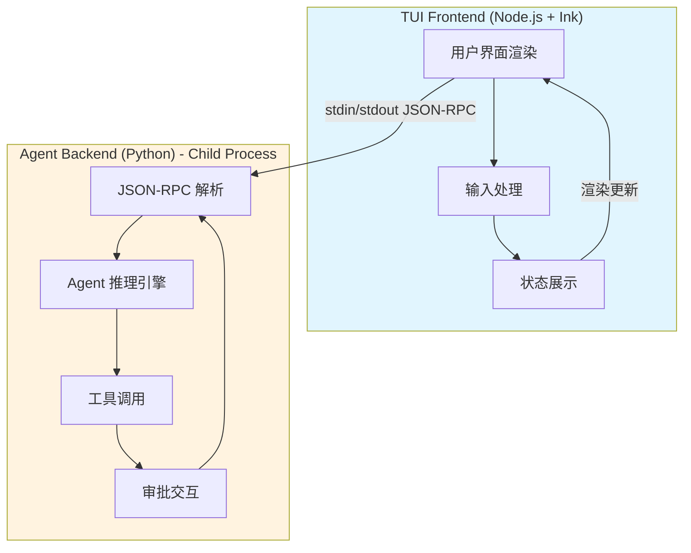
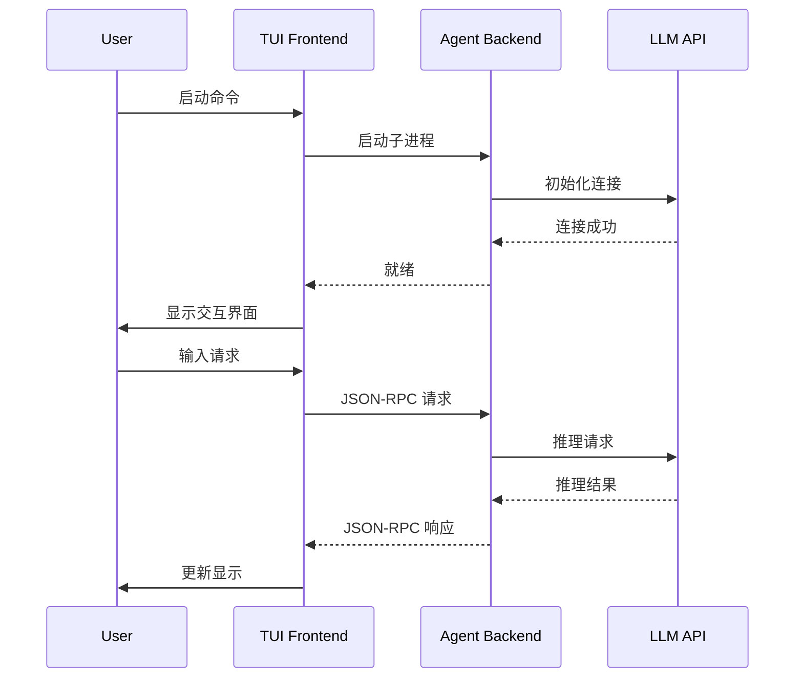

# 架构设计

## 系统架构

```
CLI层
  └── ascend-op-agent

Agent核心层
  ├── AIAgent - 会话管理
  ├── PromptBuilder - 7层Prompt组装
  ├── ToolRegistry - 工具注册
  ├── ContextEngine - 上下文管理（含混合检索）
  └── MemorySystem - 四层记忆系统

工作流层
  └── OperatorWorkflow (Phase0-5 + Phase7 + Phase8)

集成层
  ├── SSHManager - SSH连接和文件同步
  ├── MCPClient - MCP服务器连接
  └── SkillRepository - 技能仓库管理

安全层
  ├── CredentialManager - SSH凭据管理
  └── TokenResolver - Token解析
```

## 记忆系统（四层）

1. **Working Memory** - 当前会话上下文（MemoryStore）
2. **Episodic Memory** - 完整会话历史（ChromaDB）
3. **Semantic Memory** - Skill知识向量（SkillIndex + ChromaDB）
4. **Procedural Memory** - 场景化工作流模板

## 7层Prompt结构

1. Agent Identity (SOUL.md)
2. Hermes Help Guidance
3. Tool-aware Behavioral Guidance
4. Custom System Message
5. Persistent Memory (SQLite)
6. Skills Index
7. Context Files

## 双进程架构（TUI 模式）

Ascend Op Agent 支持 Hermes Agent 风格的双进程 TUI 交互界面：



### 架构特点

- **TUI Frontend (Node.js + Ink)**
  - 始终保持响应式渲染
  - 处理用户输入和状态展示
  - 通过 stdin/stdout 与后端通信

- **Agent Backend (Python) - Child Process**
  - Agent 推理、工具调用、审批交互
  - 在后台线程池执行，不阻塞前端
  - 使用 JSON-RPC 2.0 协议通信

### 通信协议

```json
// 请求示例
{"jsonrpc": "2.0", "method": "invoke_tool", "params": {"name": "bash", "args": {...}}, "id": 1}

 // 响应示例
{"jsonrpc": "2.0", "result": {"output": "..."}, "id": 1}
```

### 启动流程

