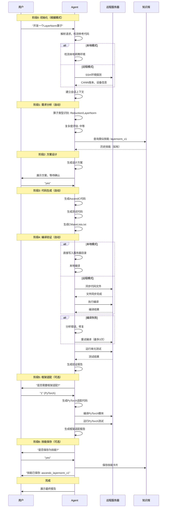
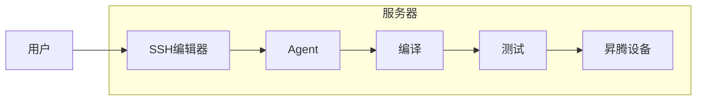
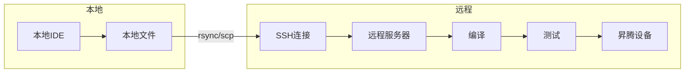

# 从0开发算子 - 完整交互流程需求文档

## Problem Frame

**用户**: 昇腾算子开发者
**场景**: 从0开发一个昇腾算子，或从GPU参考迁移算子到昇腾
**核心诉求**: 高效、自动化、减少人工干预，同时保留关键节点的确认能力
**开发环境**: 支持本地开发和远程开发两种模式（通过配置选择）

---

## 用户偏好确认

| 维度 | 选择 | 说明 |
|------|------|------|
| 交互粒度 | 自动化优先 | Agent完成大部分工作，关键节点确认 |
| 开发环境 | 混合模式 | 本地开发(Agent在服务器)或远程开发(本地编辑+SSH) |
| 算子复杂度 | 混合 | 简单+中等+复杂算子 |
| 开发场景 | 两者并重 | 从0开发 + GPU迁移 |
| 测试验证 | 自动化完整验证 | 编译+单测+性能报告全自动化 |

---

## Requirements

### R1. 会话初始化

当用户发起算子开发请求时，Agent自动执行以下初始化步骤：

**R1.1** 解析用户输入，提取：
- 算子名称
- 算子描述或参考代码
- 输入输出Shape/Dtype
- 性能要求（延迟/吞吐目标）

**R1.2** 检测是否有参考代码：
- 有CUDA/CUTLASS/Triton代码 → 进入GPU迁移流程
- 无参考代码 → 进入从0开发流程

**R1.3** 环境初始化（根据配置的开发模式）：

**本地模式** (development_mode: local):
- Agent在昇腾服务器上直接运行
- 检测本地昇腾环境：CANN版本、设备信息
- 无需SSH连接和文件同步

**远程模式** (development_mode: remote):
- 通过SSH建立到远程服务器的连接
- 执行远程环境探测
- 检测昇腾CANN版本、可用设备
- 确认工具链路径

### R2. 需求分析阶段

Agent自动完成，无需用户干预。

**R2.1** 算子类型识别：
- 分类: Elementwise / Reduction / MatMul / Attention / Transformer / Other
- 识别计算特性: 数据依赖、内存访问模式、并行度

**R2.2** 计算复杂度评估：
- FLOPs估算
- 内存带宽需求
- 建议核数

**R2.3** 生成需求分析报告，包含：
- 算子类型
- 推荐实现路径 (AscendC / CATLASS / Triton)
- 预估难度等级 (简单/中等/复杂)
- 关键设计决策点

### R3. 方案设计阶段

**R3.1** 自动设计实现方案，包括：
- 内存布局选择 (NC1HWC0 / ND / Nz)
- Tiling策略 (Tile大小、划分方式)
- 核间通信方案（如需要）
- 数据流图

**R3.2** (GPU迁移场景额外步骤) 架构映射：
- CUDA → AscendC 指令映射
- 共享内存 → LocalTensor映射
- Thread → Core映射
- 特殊OP替代方案

**R3.3** 生成方案设计文档，等待用户确认：

```
## 方案设计确认

**算子**: {name}
**类型**: {type}
**难度**: {difficulty}

### 实现方案
- 内存布局: {memory_layout}
- Tiling策略: {tiling}
- 核数: {core_count}
- 预计代码行数: {loc}

### 关键设计决策
1. {decision_1}
2. {decision_2}

是否确认此方案？ (yes/no/modify)
```

### R4. 代码生成阶段

用户确认方案后，Agent自动生成以下文件：

**R4.1** 核心代码文件：
- `{operator_name}.cpp` - AscendC实现
- `{operator_name}.h` - 头文件
- `tilling.h` - Tiling参数定义

**R4.2** 测试文件：
- `test_{operator_name}.cpp` - 单元测试
- `CMakeLists.txt` - 构建配置

**R4.3** 工程文件（如需要）：
- `Makefile` 或 `BUILD` 文件
- `operator_config.json` - 算子配置

**R4.4** 代码质量保证：
- 符合项目代码规范
- 必要的注释和文档字符串
- 头文件保护、命名规范

### R5. 编译验证阶段

完全自动化，用户无需干预。

**R5.1** 代码同步（根据开发模式）：

**本地模式**: 无需同步，代码直接写入服务器本地目录

**远程模式**:
- 将代码文件通过rsync/scp传输到远程服务器
- 保持目录结构

**R5.2** 自动编译：
- 执行编译命令
- 捕获编译错误
- **深度修复策略**: 尝试修复所有编译错误，包括：
  - 语法错误和拼写错误
  - 缺失的头文件、库依赖
  - 类型不匹配和声明错误
  - 逻辑错误（需要分析代码上下文）
- 如需用户补充信息才能修复，Agent询问用户
- 修复后重试编译（最多3次）
- 3次后仍失败则报告详细错误和建议

**R5.3** 单测执行：
- 编译测试程序
- 在昇腾设备上运行（本地模式直接运行，远程模式通过SSH执行）
- 收集测试结果

**R5.4** 生成验证报告：

```
## 验证报告

**算子**: {name}
**编译状态**: ✅ 通过 / ❌ 失败
**测试状态**: ✅ 通过 / ❌ 失败
**测试用例数**: {test_count}
**通过率**: {pass_rate}%

### 性能数据
- 延迟: {latency} ms
- 吞吐: {throughput} GFLOPS
- 内存占用: {memory} MB

### 性能测量方法
- 测量工具: [在规划阶段确定]
- 测量条件: 昇腾设备、标准输入Shape、预热后测量
- 测量次数: 多次取平均值

### 详细日志
{log_summary}
```

### R6. 框架适配阶段 (可选)

用户可选择是否执行此步骤。

**R6.1** 框架选择确认：
```
算子开发完成！是否需要AI框架适配？

1. PyTorch适配 - 注册为torch算子
2. TensorFlow适配 - 注册为tf.raw_ops
3. 两者都适配
4. 跳过

请选择 (1/2/3/4):
```

**R6.2** PyTorch适配（如选择）：
- 生成 `torch_adapter.cpp` - PyTorch自定义算子注册
- 生成 `torch_test.py` - PyTorch端到端测试
- 编译并验证PyTorch集成

**R6.3** TensorFlow适配（如选择）：
- 生成 `tf_operator.cc` - TensorFlow OP注册
- 生成 `tf_test.py` - TensorFlow测试
- 编译并验证TF集成

**R6.4** 生成框架适配报告：

```
## 框架适配报告

**PyTorch**: ✅ 已适配 / ❌ 失败
- 注册名称: {pytorch_op_name}
- 测试结果: {result}

**TensorFlow**: ✅ 已适配 / ❌ 失败
- OP名称: {tf_op_name}
- 测试结果: {result}
```

### R7. 技能保存阶段

算子开发完成后，Agent自动询问是否保存为技能：

```
## 开发完成！

是否将此算子实现保存为技能卡片？

技能将包含：
- 算子模板代码
- 最佳实践
- 性能优化经验

保存后可在开发类似算子时复用。

请选择 (yes/no):
```

**R7.1** 如用户选择yes：
- 生成技能卡片（DESCRIPTION.md + 模板代码）
- 保存到本地技能库
- 更新技能索引

**R7.2** 如用户选择no（默认行为）：
- 不保存技能
- 直接完成开发流程
- 向用户展示最终报告

---

## Success Criteria

### SC1. 端到端自动化

用户从发起请求到获得可用的昇腾算子，全程除关键确认点外无需人工干预。

**验证方式**:
- 统计用户干预次数 vs 总步骤数
- 目标: 干预次数 ≤ 3次（方案确认、框架适配选择、技能保存）

### SC2. 正确性保证

所有生成的算子必须通过：
- 编译成功（无警告）
- 单元测试通过（正确性验证）
- 框架适配（如选择）测试通过

**验证方式**:
- 编译错误率 < 5%
- 单测通过率 = 100%
- 框架适配成功率 > 90%

### SC3. 性能达标

算子性能满足用户需求或达到合理水平。

**验证方式**:
- 对比同类型算子的业界基准
- 生成性能报告供用户评估

### SC4. 开发效率

相比纯手动开发，效率显著提升。

**验证方式**:
- 简单算子: < 10分钟完成（从请求到验证）
- 中等算子: < 30分钟完成
- 复杂算子: < 2小时完成

---

## Scope Boundaries

### In Scope

- AscendC算子从0开发
- CUDA/CUTLASS/Triton → AscendC迁移
- CATLASS模板算子开发
- Triton算子开发（昇腾后端）
- 自动化测试验证
- 自动化性能基准测试
- 可选: PyTorch/TensorFlow框架适配
- 可选: 技能保存与复用

### Out of Scope

- 已有昇腾算子项目的增量开发（将在另一流程中处理）
- 算子融合优化（需要更高级的图优化）
- 分布式算子（多设备协作）
- CANN版本适配（假设环境已就绪）
- 硬件故障排查

---

## Key Decisions

### KD1. 自动化优先，用户确认在关键节点

**决策**: 主要流程自动化，关键决策点暂停等待确认。
**理由**: 平衡效率和用户控制力。算子开发是专业工作，用户需要对方案有最终决定权。
**关键确认点**: 方案设计后、框架适配选择、技能保存

### KD2. 混合开发模式

**决策**: 支持本地开发和远程开发两种模式，通过配置文件选择。
**理由**: 不同用户有不同的开发环境和偏好。
**模式说明**:
- **本地模式**: Agent部署在昇腾服务器上，用户SSH到服务器直接开发
- **远程模式**: Agent在本地，代码在本地编辑，通过SSH同步到远程服务器编译测试

### KD3. 编译错误自动修复

**决策**: 编译失败时Agent自动尝试修复（最多3次）。
**理由**: 大部分编译错误是简单的缺失头文件、拼写错误等，可自动化修复。
**限制**: 3次后仍失败则报告给用户

### KD4. 技能保存可选

**决策**: 是否保存为技能由用户决定。
**理由**: 不是所有算子都值得保存为模板，过多技能会造成噪音。
**触发**: 仅在算子开发成功且用户主动选择时

### KD5. 框架适配作为独立步骤

**决策**: 框架适配在算子验证完成后作为可选步骤执行。
**理由**: 很多场景只需算子本身，不需要框架集成。
**流程**: 主流程（开发+验证）→ 用户选择 → 框架适配（如选择）

---

## Interaction Flow Diagram



---

## Checkpoint Summary

| 阶段 | 确认内容 | 用户操作 | 超时处理 |
|------|----------|----------|----------|
| C1: 方案设计 | 实现方案、难度预估 | yes/no/modify | 5分钟无响应自动使用建议方案继续 |
| C2: 框架适配 | 选择适配选项 | 1/2/3/4 | 默认跳过 |
| C3: 技能保存 | 是否保存技能 | yes/no | 默认不保存 |

---

## Development Modes

### 模式对比

| 维度 | 本地模式 | 远程模式 |
|------|----------|----------|
| Agent位置 | 昇腾服务器 | 用户本地/远程服务器 |
| 代码位置 | 服务器本地 | 用户本地 |
| 编辑方式 | SSH到服务器，使用服务器编辑器 | 本地IDE编辑 |
| 编译执行 | Agent直接在服务器执行 | SSH到远程执行 |
| 文件同步 | 无需同步 | rsync/scp同步 |
| 适用场景 | 服务器开发、直接操作服务器 | 本地开发、IDE偏好 |

### 本地模式流程



### 远程模式流程



### 配置方式

```yaml
# config.yaml
development:
  mode: local  # 或 remote
  # 本地模式配置
  local:
    workspace: /workspace/operators
  # 远程模式配置
  remote:
    ssh_host: ascend-server.example.com
    ssh_user: developer
    ssh_key_path: ~/.ssh/id_rsa
    remote_workspace: /workspace/operators
```

---

## Error Handling

| 错误类型 | 模式 | 处理策略 | 用户干预点 |
|----------|------|----------|------------|
| 编译错误（可修复） | 通用 | 深度修复，重试3次 | 3次后失败，报告详情 |
| 编译错误（需改设计） | 通用 | 报告错误，建议修改方案 | 方案调整 |
| 测试失败 | 通用 | 分析失败原因，生成修复建议 | 需用户确认 |
| SSH连接失败 | 远程 | 指数退避重连（1s, 2s, 4s），共3次 | 3次后报告网络/配置问题 |
| 本地环境异常 | 本地 | 报告环境问题，建议检查 | - |
| 远程环境异常 | 远程 | 报告环境问题，建议检查 | - |
| 框架适配失败 | 通用 | 报告失败原因，提供手动指南 | - |

---

## Deferred to Planning

- SSH连接管理的具体实现（重连、密钥管理）
- 文件同步策略（增量vs全量）
- 代码修复的AI策略（深度修复编译错误）
- 性能基准测试的具体指标和工具（测量方法已在R5.4中标注为待定）
- 技能卡片的存储格式和检索机制
- PyTorch/TensorFlow框架适配的版本兼容性（主流版本）

---

## Next Steps

→ `/ce:plan` for structured implementation planning
