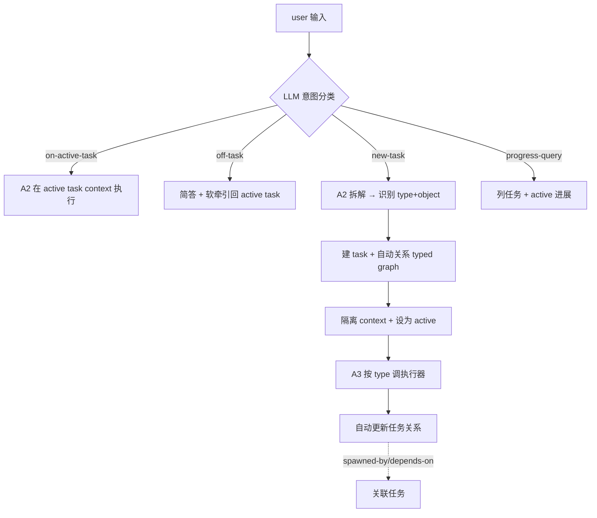

# 任务管理层 + 交互路由

## Summary

在 ascend agent 之上加一层"任务管理 + 交互路由":agent 把用户诉求拆成 4 类任务(migrate / analyze / optimize / develop)之一,每任务有自己的**类型化关系图**(`spawned-by` / `depends-on` / `related-to`,自动构建 + 用户手动编辑)+ **任务级上下文**(执行主域,受控跨任务读关联产物);用户显式选 active task,off-task(闲聊)输入软牵引回主线;可查询/选择任务进展。**task 层 = 纯 runtime(路由/隔离/进展/图),4 type 是 object kind passthrough 到 executor(PhaseRunner/Path A/cannbot),本层不自建 domain flow。**

---

## Problem Frame

前述架构 Q&A 暴露的现状 gap:

- **三种交互模式不统一**:`op:` 前缀(算子开发)/ CLI 子命令(模型迁移)/ 通用 chat fallback —— 用户得知道走哪条路。
- **无任务抽象**:agent 不知在跟哪个任务,上下文 bleed;`session.list_pending` 只列算子断点,非通用任务状态。
- **无结构化进展查询**:进展只前端进度条单向通知 + 算子 checkpoint 断点;chat 内问"进展"靠 agent 用 git/memory 猜。
- **性能分析/优化无 first-class flow**:只有算子开发(PhaseRunner)+ 模型迁移(Path A plan),瓶颈分析、优化方案、融合算子替换都没专门通道。

痛点:多任务并行时上下文混乱、进展不可查、任务关联靠人脑记、闲聊打断任务无牵引。本层把"任务"做成 agent 的 first-class 概念,统一入口 + 隔离上下文 + 显式跟踪。

---

## Key Decisions

- **关系模型 = typed graph(非树/扁平)** —— 关系带类型,任意拓扑,自动构建 + 手动编辑。最灵活,贴合"关联任务 + 手动编辑关系"。
- **上下文 = 任务级 + 受控跨任务读** —— active task context 为执行主域(memory + 对话 + checkpoint);agent 按关系图读关联任务产物,不混入执行上下文。平衡聚焦与关联利用。
- **active task 显式 + 软牵引(非硬阻断)** —— 用户选/切 active;off-task 输入简答 + 牵引回主线,不阻断不丢上下文。对齐"牵引"语义。
- **4 类扁平(含 develop)** —— migrate / analyze / optimize / develop;object(model/op)是任务 payload 非 type 维度。复用 PhaseRunner(develop)+ Path A(migrate)。
- **任务坐在 CheckpointStore thread 之上** —— 1 task = 1+ threads(每阶段/迭代可产 thread);task 是 thread 的逻辑上层,不重写 CheckpointStore。
- **路由 = LLM 意图分类** —— 用户输入分 on-active-task / off-task / new-task / progress-query;机制(plan 期 prompt/规则/hybrid)。
- **analyze/optimize 的内部 flow 留 plan** —— 本 doc 只定它们的 WHAT(输入/输出报告),实现 flow 不深入。
- **层 = runtime passthrough(不自建 domain flow)** —— task 层只做路由/隔离/进展/图;4 type 是 object kind,passthrough 到现有/外部 executor(PhaseRunner/Path A/cannbot-skills)。对齐 positioning pivot(运行时层,知识层引 cannbot 不自研)。
- **task ≠ renamed session** —— task 坐 CheckpointStore thread 之上(1 task = 1+ threads);与 SessionRecordManager 的 session 区别:session = 对话记录树,task = 工作单元(跨 session/线程,带类型 + 关系 + 状态)。**为何新抽象非扩 session**:task 跨多 session/线程(R4)、type-driven executor dispatch(R11-14)、typed relations 跨 session 边(R2)—— 均不适 session 的 per-session 树模型。

---

## Actors

| ID | 角色 | 职责 |
|----|------|------|
| A1 | GPU 算子迁移工程师 | 提诉求、选/切 active task、查进展、手动编辑任务关系 |
| A2 | 任务管理 agent | 路由分类、诉求拆解、任务类型识别、自动关系构建、上下文管理 |
| A3 | 任务执行器 | 按 type 路由到执行器(PhaseRunner develop / Path A migrate / 外部 analyze/optimize executor),本层不实现 analyze/optimize 内部 flow(passthrough)|
| A4 | 任务图存储 | task + relation + context 持久化,坐 CheckpointStore 之上 |

---

## Key Flows

- F1. 用户输入 → 路由分类
  - **Trigger:** A1 任意输入(在或不在 active task 中)。
  - **Steps:** 见下图(意图分类 → 4 分支)。
  - **Outcome:** on-task 执行 / off-task 软牵引 / new-task 建立任务 / progress-query 报告进展。

- F2. 任务拆解:agent 分析诉求 → 识别 type + object → 自动建关系(spawned-by active / depends-on 相关)→ 隔离 context → 调 A3 执行器。
- F3. 受控跨任务读:analyze 任务按 depends-on 关系读关联 migrate 任务的迁移报告(只读产物,不混执行上下文)。

---

## Requirements

### 任务模型与关系

- R1. 任务 = (type ∈ {migrate, analyze, optimize, develop}, object payload, state, context, relations)。type 决定走哪个执行器;object(model/op + 路径)是 payload。
- R2. 任务关系 = typed graph:一期 `spawned-by` / `depends-on`(各 ≥1 consumer:spawned-by 驱动自动构建,depends-on 驱动跨任务读权限);`related-to` / `blocks` / `supersedes` 延到出现第 2 个 consumer 再加。agent 自动 **suggest + 用户确认**(非 silent auto-build)+ 用户手动 add/remove/edit。
- R3. 一个任务可含多个关联任务(经 `spawned-by` 边表达父子);不同任务独立进行(无隐式阻塞,除非 `depends-on`)。
- R4. 任务坐在 CheckpointStore thread 之上:1 task = 1+ threads(每阶段/迭代可产 thread);task 是 thread 的逻辑上层,不重写 CheckpointStore。

### 交互路由

- R5. 用户显式选/切 active task;agent 路由分类用户输入为 on-active-task / off-task / new-task / progress-query。**兜底**:低置信默认 on-active-task + 发 disambiguation prompt(不自动 spawn 新任务);显式命令 `/task <id>` `/progress` 绕过分类器。**opt-out**:配置 always-on-task / explicit-only 模式;一期-b 默认 explicit-only(只用显式命令),fixture 校准达阈后再 default-on 分类器。
- R6. off-task(闲聊)输入:agent 简答 + 软牵引回 active task(不阻断、不丢上下文)。**nudge 模式可配**(off / soft / firm,默认 soft);一期宽松(只明显闲聊才牵引),阈值 plan 实测校准。
- R7. new-task:agent 拆解诉求 → 识别 type + object → 建 task + 自动关系 → 设为 active。
- R8. progress-query:用户可查任务列表 + 单任务进展(state + 阶段 + 子任务 + 产物索引)。**net-new 聚合**:读 R15 rollup 的 task state(single source,不重算)+ 加关系遍历 + 产物索引,sit above `CheckpointStore.list_pending`(需扩 list_all_threads 含 done,非 thin reuse)。

### 上下文隔离

- R9. active task 的 context(memory + 对话 + checkpoint)为执行主域,执行时不混入其他任务 context。
- R10. 受控跨任务读:agent 按关系图读取关联任务的产物(报告/状态),读权限按关系类型定(`depends-on` 可读关联产物;`related-to` 权限随该关系本身延后到出现 consumer)。

### 任务类型 WHAT(4 类)

- R11. **migrate**(模型迁移):输入 model repo + 入口脚本(.py/.sh)+ 可选 profiling;输出 NPU 适配脚本 + 迁移报告。含/不含自定义算子两场景(含 → 触发 Path A migrate-cuda/triton/native-composition;不含 → transfer_to_npu + native adapt)。复用 Path A(`docs/brainstorms/2026-07-06-003-...`)。
- R12. **analyze**(性能分析):输入 model/op + 可选 profiling;输出分析报告(核心瓶颈 op + 优化方案/措施建议)。**边界 vs Path A**:Path A 内置迁移过程中的诊断(inline);独立 analyze 任务做**模型级独立性能分析**(可脱离迁移单独跑)。passthrough 到外部 executor,本层不自建 flow。内部 flow 留 plan。
- R13. **optimize**(性能优化):输入 analyze 报告 / 瓶颈 op;输出优化(替换已有自定义融合算子 / 实现新高性能算子)+ 优化报告。**边界 vs Path A**:Path A 内置迁移过程中的优化(inline);独立 optimize 任务做脱离迁移的瓶颈算子替换/新实现,passthrough 到算子开发(路径 B)/ Path A migrate-cuda/native-composition,本层不自建 flow。内部 flow 留 plan。
- R14. **develop**(算子开发):输入算子需求;输出 AscendC/triton kernel 工程 + 验证。复用现有 PhaseRunner(`op:` 前缀 flow,`state_machine.py`)。

### 任务生命周期

- R15. 任务 state 分两类:**rollup 自 thread states**(running iff 任一 thread running/waiting_confirm;done iff 全 thread done;failed iff 任一 failed 且无 running)+ **task-layer-native**(draft = 建 task 后未 spawn thread;paused = 用户显式暂停,task 层标志 —— CheckpointStore status enum 无 paused/draft,这俩不 rollup)。混合状态优先级 `running > waiting_confirm > failed > paused > done`。对外状态 draft / running / paused / done / failed。可 resume(从 checkpoint 续跑)。

---

## Acceptance Examples

- AE1. **Covers R5, R6.** 用户在 migrate task 中输入"今天天气怎么样" → off-task → agent 简答 + 牵引回 migrate。
- AE2. **Covers R7.** 用户"帮我迁这个模型" → new-task → agent 建 migrate task + 设 active。
- AE3. **Covers R2, R3, R7.** 迁移中发现瓶颈 → agent 自动建 analyze task(`spawned-by` migrate)→ 用户可切去 analyze。
- AE4. **Covers R10.** analyze task `depends-on` migrate → 读关联 migrate 的迁移报告(受控跨任务读,只读产物)。
- AE5. **Covers R8.** 用户"进展怎么样" → progress-query → 列任务 + active task 进展。
- AE6. **Covers R2.** 用户手动 add relation:optimize task `depends-on` 另一 analyze task(一期仅 spawned-by/depends-on 可手动加)。
- AE7. **Covers R15.** 用户 paused 的 task → resume → 从 checkpoint 续跑。
- AE8. **Covers R1, R14.** 用户"开发 add 算子" → new-task type=develop → 调 PhaseRunner。
- AE9. **Covers R12.** analyze 任务(passthrough 路由):用户单独跑模型级性能分析(脱离 migrate)→ 路由到外部 analyze executor → 出分析报告。
- AE10. **Covers R13.** optimize 任务(passthrough):读 analyze 报告 → 路由到算子开发(路径 B)/ Path A native-composition → 出优化。
- AE11. **Covers R9.** active migrate task 执行时,analyze task 的 context 不混入 migrate 执行上下文(隔离单测)。
- AE12. **Covers R4.** 一个 migrate task 跨 3 个 thread(目标分析 / 方案 / 迁移),task state = 3 thread states rollup。

---

## Success Criteria

- 4 任务类型可独立 start + 各自产出报告/产物(migrate/develop 复用现有,analyze/optimize 定 WHAT)。
- 一期-a success:task list + progress-query dogfood(用户能列/选/查任务,无需手动 juggling)。
- 一期-b success:任务关系**建议 + 用户确认**(非 silent auto-build);建议准确率(`spawned-by` / `depends-on`)≥ 80%(对比手工标注,fixture 校准)。
- off-task 软牵引不误伤 on-task 输入(误判率 plan 实测校准,一期宽松)。
- 任务上下文隔离:active task 执行时不混入其他任务 context(单测验证)。
- 问题级 metric(辅助):用户 2-task session 无需手动 context juggling(dogfood 2 周,对比 一期-a 前基线)。

---

## Scope Boundaries

### Phased delivery(推荐,不砍 scope)

- **一期-a(先行验证痛点假设)**:task list(R1 type+state)+ R8 progress-query + R14 develop 复用 + 显式 `/task` `/progress` 命令(绕过分类器,规避 R5 风险)。**不含 migrate/optimize**(gated on Path A plan-done + executor spike,见 Dependencies)。
- **一期-b**:typed graph(R2)+ 上下文隔离(R9/R10)+ LLM 路由分类器(R5/R6)。
- **一期-a → 一期-b go/no-go gate(task 层 falsifier)**:一期-a dogfood 须出 measurable 痛点验证(如 用户自发切任务 ≥N 次/周 或 手动 context-juggling 投诉超阈值);未达则放弃 task 层、记录 finding。R5 fallback 只管 router,本 gate 是 task 层本身的 kill-switch。
- 目的:先验证 task 抽象 + 进展查询的痛点假设,再投 graph/isolation/classifier(3+ persona 共指分期建议)。

### Deferred for later(二期 / plan)

- analyze / optimize 的内部实现 flow(本 doc 定 WHAT,plan 定 HOW)。
- 多用户协作 / 任务调度优先级队列(一期单用户、手动驱动)。
- 任务图可视化(一期 CLI/TUI 文字,图形界面未来)。
- 关系类型扩展(`blocks` / `supersedes` 等,一期三件套)。

### Outside this product's identity

- 通用 chat bot(日常闲聊不是目标,off-task 软牵引回任务主线)。
- 任务模板市场 / 跨项目任务复用。

---

## Dependencies / Assumptions

- **依赖 PhaseRunner**(`orchestrator/state_machine.py`):develop 类型 + optimize 的算子部分。
- **依赖 Path A(hard dependency + delivery gate)**(`docs/brainstorms/2026-07-06-003-...` + `docs/plans/2026-07-07-001-...`):migrate 类型 + optimize 的 native-composition。Path A 仍是 brainstorm/plan 未建;migrate/optimize 类型在 Path A plan-done + executor spike 通过前不启动。
- **依赖 CheckpointStore**(`orchestrator/checkpoint.py`):任务坐其上(R4),thread 级状态 + resume。
- **高风险假设**:LLM 意图分类(路由)准确率足够 —— off-task 误判会打扰任务流;plan 实测 + 阈值校准。
- **假设**:任务关系自动构建靠 LLM 拆解,质量待 fixture 校准。
- **假设**:受控跨任务读的权限模型(`depends-on` vs `related-to` 读什么)plan 期定。

---

## Outstanding Questions

### Deferred to Planning

- 任务图存储 schema(task / relation / context 表,坐 CheckpointStore 之上;task ↔ thread 映射)。
- LLM 意图分类机制(prompt / 规则 / hybrid)+ 软牵引阈值(什么算"明显闲聊")。
- 受控跨任务读的权限模型(关系类型 → 可读字段)。
- 任务关系编辑 UI(TUI 命令 vs CLI 子命令 vs chat 内自然语言)。
- analyze / optimize 的内部 flow(plan,本 doc 只定 WHAT)。

---

## Sources / Research

- 前述架构 Q&A 暴露的 gap:三种交互不统一 / 无任务抽象 / 无进展查询 / 分析优化无 flow。
- 现有路由:`backend.py:113`(`op:` 前缀 → orchestrator,else → 通用 agent)。
- CheckpointStore thread 级:`orchestrator/checkpoint.py:5-7,56-76`(`thread_id` PK)。
- persona:`agent/SOUL.md`(算子开发专精,影响 off-task chat 行为)。
- migrate 类型复用 Path A:`docs/brainstorms/2026-07-06-003-path-a-model-migration-requirements.md` + `docs/plans/2026-07-07-001-feat-path-a-model-migration-plan.md`。
