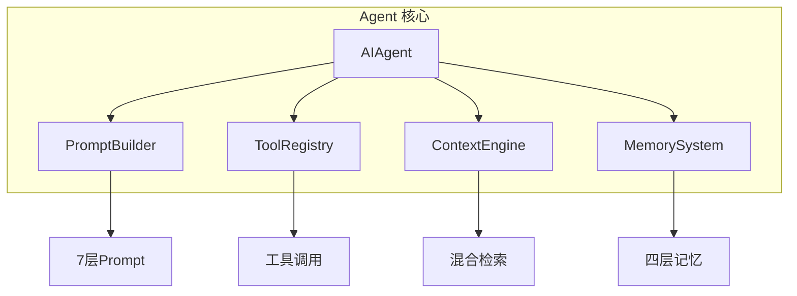
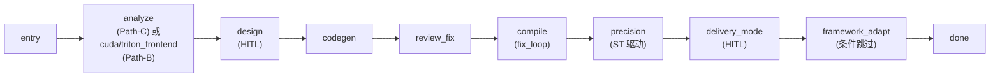
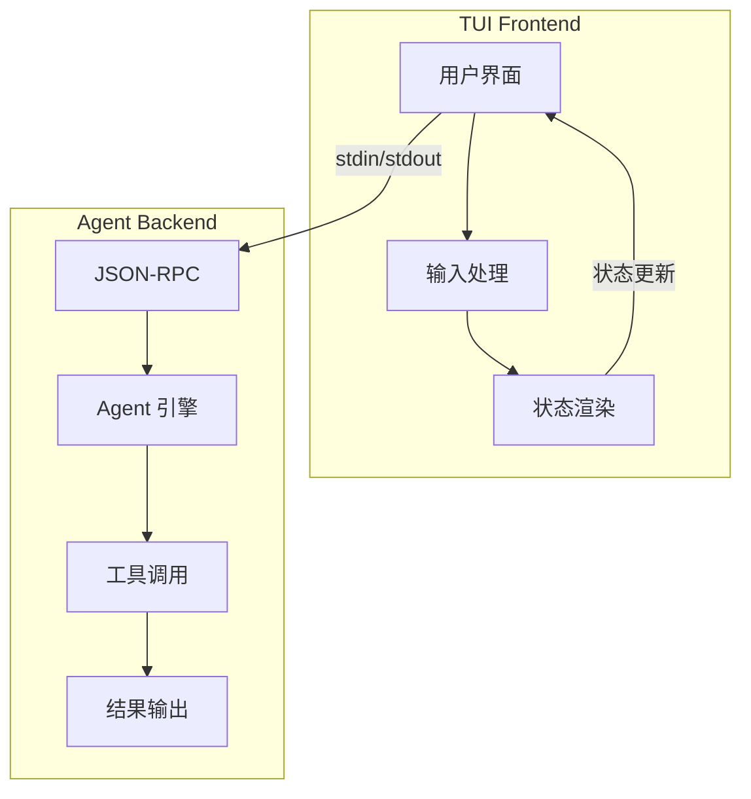

# 开发指南

<!--
Copyright 2026 SimmerChan

Licensed under the Apache License, Version 2.0 (the "License");
you may not use this file except in compliance with the License.
You may obtain a copy of the License at

    http://www.apache.org/licenses/LICENSE-2.0

Unless required by applicable law or agreed to in writing, software
distributed under the License is distributed on an "AS IS" BASIS,
WITHOUT WARRANTIES OR CONDITIONS OF ANY KIND, either express or implied.
See the License for the specific language governing permissions and
limitations under the License.
-->

## 项目结构

```
ascend_op_agent/
├── agent/                  # Agent 核心引擎
│   ├── __init__.py
│   ├── core.py            # AIAgent 主类（会话循环 + 工具调用）
│   ├── memory.py          # Working Memory（MemoryStore）
│   ├── context.py         # 上下文引擎
│   ├── prompt_builder.py  # 7 层 Prompt 组装（含 Layer 6 cannbot scope 注入）
│   ├── tool_registry.py   # 工具注册表
│   ├── skill_standards.py # Skill 命名规范 + R3 trigger 计数
│   ├── session_manager.py # 会话管理
│   ├── session_record.py  # 会话记录持久化（树形结构）
│   ├── SOUL.md            # Agent 身份定义
│   ├── providers/         # LLM 多 Provider 适配器（注册表模式）
│   │   ├── base.py        # BaseLLMAdapter + ToolCallResult + per-provider max_tokens
│   │   ├── anthropic_adapter.py
│   │   ├── openai_adapter.py
│   │   ├── azure_adapter.py
│   │   ├── gemini_adapter.py
│   │   ├── ollama_adapter.py
│   │   └── openrouter_adapter.py
│   └── tools/             # 工具集（file_read/write/search, patch, shell, python_exec, git, npu, skill_manage）
├── orchestrator/          # 编排层（自研 PhaseRunner 状态机，非 LangGraph）
│   ├── __init__.py
│   ├── state_machine.py   # PhaseRunner 顺序 DAG 引擎 + apply_update reducer
│   ├── state.py           # OpState (TypedDict) + APPEND_FIELDS / MERGE_FIELDS
│   ├── checkpoint.py      # CheckpointStore (SQLite v2: WAL + v1↔v2 迁移 + quarantine)
│   ├── npu_exec.py        # NpuExecutor（SSH->docker exec ops_pt->build.sh + ST 驱动）
│   ├── fix_loop.py        # run_fix_loop（review->fix->re-review 闭环）+ compress_transcript
│   ├── cannbot_loader.py  # cannbot-skills 加载器 + SkillUsageRegistry + SKILL_BUNDLES
│   ├── graphs/            # 三路径图定义
│   │   ├── migration.py   # Path-B（CUDA / Triton 迁移）
│   │   └── new_dev.py     # Path-C（全新开发）
│   └── nodes/             # 节点实现
│       ├── common.py      # make_llm_node（fresh AIAgent + markdown fallback）
│       ├── hitl.py        # make_hitl_llm_node（HITL 暂停 + resume 推进）
│       ├── delivery.py    # 交付模式选择 + 框架适配（条件跳过）
│       ├── migration.py   # cuda_frontend / triton_frontend 节点
│       ├── validation.py  # compile/precision 真节点 + fix_loop 包装
│       └── micro_mod.py
├── task_router/           # 任务类型路由（一期-a 显式命令）
│   ├── commands.py        # TaskCommands（list/new/select/progress/run/complain）
│   └── executor_dispatch.py # TaskRouter（按 task.type 路由；develop -> PhaseRunner）
├── task_store/            # 任务存储与状态推导
│   ├── models.py          # Task 模型 + 任务类型 + 状态常量
│   ├── store.py           # TaskStore (SQLite)
│   ├── progress.py        # 任务进展聚合
│   └── rollup.py          # 状态推导（draft/running/paused/done/failed）
├── backend/               # RPC 后端服务
│   ├── __init__.py
│   ├── __main__.py        # 后端入口
│   ├── backend.py         # 后端编排（_build_orchestrator lazy-init op: 路由）
│   └── rpc/
│       ├── __init__.py
│       ├── server.py      # JSONRPCServer（send_notification -> stdout）
│       ├── agent_service.py # AgentAsyncWrapper + _DeltaBatcher（stream delta 节流）
│       ├── notification_queue.py # 通知队列（线程池 -> stdout）
│       └── protocol.py    # 协议定义
├── skills/                # Skill 知识库
│   ├── __init__.py
│   ├── repository.py      # 技能仓库
│   ├── index.py           # SkillsIndex（SQLite FTS5 + 向量混合检索）
│   ├── installer.py       # 技能安装
│   ├── storage.py         # 存储管理
│   ├── models.py          # 数据模型
│   ├── interactive.py     # 交互接口
│   └── usage_tracker.py   # Skill 活跃度追踪埋点（Curator Lite）
├── memory/                # 长期记忆系统
│   ├── episodic_memory.py # 情景记忆（ChromaDB）
│   ├── semantic_memory.py # 语义记忆
│   ├── vector_store.py    # 向量存储
│   ├── system.py          # 系统记忆
│   └── llm_enhancer.py    # LLM 增强
├── ssh/                   # SSH 远程开发
│   ├── manager.py         # SSH 管理器
│   ├── sync.py            # 文件同步
│   ├── env_config.py      # 环境配置
│   └── base_environment.py # 基础环境
├── mcp/                   # MCP 服务器集成
│   ├── client.py          # MCP 客户端
│   ├── lifecycle.py       # 生命周期管理
│   ├── oauth.py           # OAuth 认证
│   └── server_config.py   # 服务器配置
├── acp/                   # ACP 编辑器适配器（VS Code / Zed / JetBrains）
│   ├── adapter.py         # 适配器主类
│   ├── protocol.py        # 协议定义
│   └── session.py         # 会话管理
├── security/              # 安全模块
│   ├── credential_manager.py # 凭据管理
│   └── token_resolver.py  # Token 解析（${VAR} / ${VAR:-default}）
├── workflow/              # 早期工作流工具（compiler/performance 辅助，编排主路径在 orchestrator/）
│   ├── compiler.py
│   ├── performance.py
│   └── models.py
├── config.py              # 配置加载（双文件：config.yaml + .env）
├── cli.py                 # CLI 入口（run/task/skill/mcp/acp/sync/viewer/curator/learn）
├── version.py             # 版本信息
└── __init__.py
```

## 环境设置

### 开发环境要求

- Python >= 3.10
- Node.js >= 16 (用于 TUI 前端)
- Git

### 安装开发依赖

```bash
# 克隆仓库
git clone <repository-url>
cd ascend-op-agent

# 安装项目
pip install -e .

# 安装开发依赖
pip install -e ".[dev]"

# TUI 前端依赖 (可选)
cd frontend && npm install && cd ..
```

### 配置

```bash
# 创建配置
cp config.example.yaml config.yaml

# 创建环境变量文件
mkdir -p ~/.ascend_op_agent
cp .env.example ~/.ascend_op_agent/.env
chmod 600 ~/.ascend_op_agent/.env

# 编辑凭据
vim ~/.ascend_op_agent/.env
```

## 代码规范

### 格式化

```bash
# Black 格式化
black src/ tests/

# Ruff 检查
ruff check src/ tests/

# 自动化修复
ruff check --fix src/ tests/
```

### 导入顺序

```python
# 1. 标准库
import os
import re
from typing import Optional

# 2. 第三方库
import click
from pydantic import BaseModel

# 3. 本地模块
from ascend_op_agent.agent.core import AIAgent
```

### 文档字符串

```python
def method(param: str) -> bool:
    """简短描述

    详细描述（如果需要）。

    Args:
        param: 参数描述

    Returns:
        返回值描述

    Raises:
        ValueError: 异常条件

    Example:
        >>> method("test")
        True
    """
    pass
```

### 许可声明

每个文件必须包含 Apache 2.0 许可头：

```python
# Copyright 2026 SimmerChan
#
# Licensed under the Apache License, Version 2.0 (the "License");
# ...
```

## 测试

### 运行测试

```bash
# 所有测试
PYTHONPATH=src python -m pytest tests/ -v

# 单元测试
PYTHONPATH=src python -m pytest tests/unit/ -v

# 集成测试
PYTHONPATH=src python -m pytest tests/integration/ -v

# 特定文件
PYTHONPATH=src python -m pytest tests/test_config.py -v

# 覆盖率
PYTHONPATH=src python -m pytest tests/ --cov=ascend_op_agent --cov-report=html
```

### 编写测试

```python
import pytest
from ascend_op_agent.module import ClassName


class TestClassName:
    def test_method(self):
        """测试方法"""
        instance = ClassName()
        result = instance.method()
        assert result == expected

    @pytest.mark.asyncio
    async def test_async(self):
        """测试异步方法"""
        result = await async_function()
        assert result is not None
```

## 调试

### 日志调试

后端日志输出到 stderr，级别由 `config.yaml` 的 `logging` 段控制（默认 INFO）：

```bash
ascend-op-agent run
```

### IDE 调试

在 VS Code 中创建 `.vscode/launch.json`:

```json
{
    "version": "0.2.0",
    "configurations": [
        {
            "name": "Python: Module",
            "type": "debugpy",
            "request": "launch",
            "module": "ascend_op_agent",
            "args": ["run", "--local"],
            "env": {
                "PYTHONPATH": "${workspaceFolder}/src"
            }
        }
    ]
}
```

### 常见问题

#### ImportError

确保设置 PYTHONPATH:
```bash
export PYTHONPATH=src
```

#### 前端构建失败

```bash
cd frontend
rm -rf node_modules package-lock.json
npm install
npm run build
```

## 架构说明

### Agent 核心



### 编排器（PhaseRunner 状态机）



> 详见 [工作流说明](workflow.md) 和 [架构设计](architecture.md)。

### TUI 架构



## 模块依赖

```
agent/
├── core.py            # 依赖 providers/, tools/, prompt_builder, memory
├── memory.py          # 依赖 memory/
├── context.py         # 依赖 memory/
├── prompt_builder.py  # 依赖 agent/, skills/ (Layer 6 cannbot scope 注入)
├── tool_registry.py   # 依赖 agent/tools/
└── session_record.py  # 依赖 backend/ (持久化)

orchestrator/
├── state_machine.py   # 依赖 checkpoint, state (无 LangGraph)
├── checkpoint.py      # 依赖 config (CheckpointConfig)
├── npu_exec.py        # 依赖 ssh/ (SSHEnvironment, 可选)
├── fix_loop.py        # 依赖 state_machine.apply_update
├── cannbot_loader.py  # 依赖 vendor/cannbot-skills (submodule)
├── graphs/            # 依赖 nodes/, cannbot_loader, state_machine
└── nodes/             # 依赖 agent/ (AgentFactory), cannbot_loader

task_router/
├── commands.py        # 依赖 task_store/, checkpoint (progress 聚合)
└── executor_dispatch.py # 依赖 task_store, orchestrator (develop 路径)

task_store/
├── store.py           # 依赖 models
├── progress.py        # 依赖 store, checkpoint (list_all_threads)
└── rollup.py          # 依赖 models (状态推导)

backend/rpc/
├── server.py          # 依赖 notification_queue
├── agent_service.py   # 依赖 agent/ (AgentAsyncWrapper + _DeltaBatcher)
└── notification_queue.py # 线程池 -> stdout

skills/
├── index.py           # SkillsIndex（FTS5 + 向量混合检索）
├── repository.py      # 依赖 skills/models
├── installer.py       # 依赖 skills/storage
└── usage_tracker.py   # Curator Lite 活跃度埋点

ssh/
├── manager.py         # 依赖 ssh/, security/
└── sync.py            # 依赖 ssh/base_environment.py

memory/
├── episodic_memory.py # 依赖 memory/vector_store.py
├── semantic_memory.py # 依赖 memory/vector_store.py
└── vector_store.py    # 无循环依赖

acp/
├── adapter.py         # 依赖 acp/
├── protocol.py        # 无循环依赖
└── session.py         # 依赖 acp/protocol.py
```
