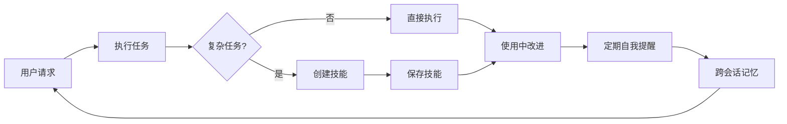
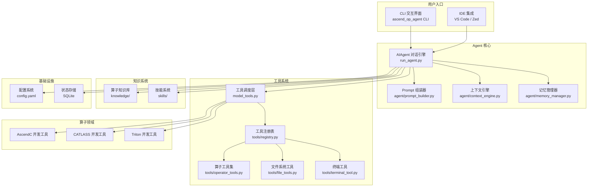
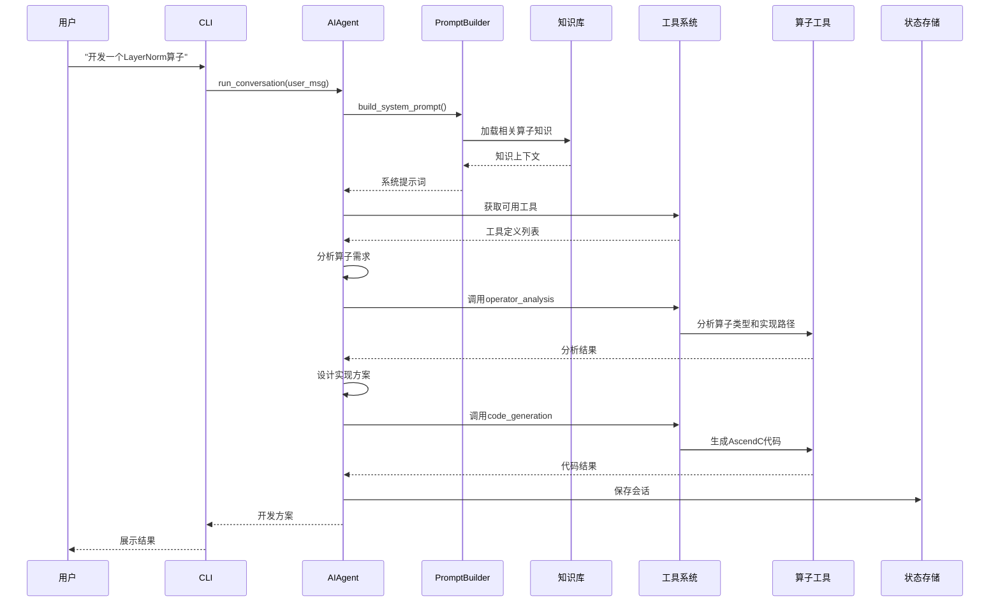
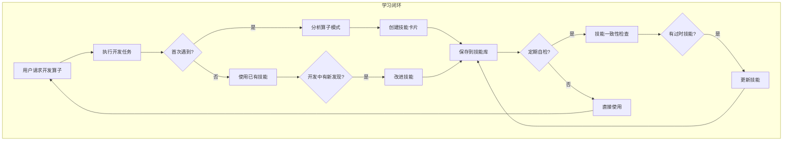
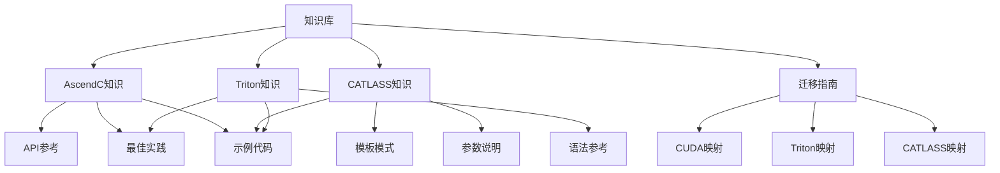
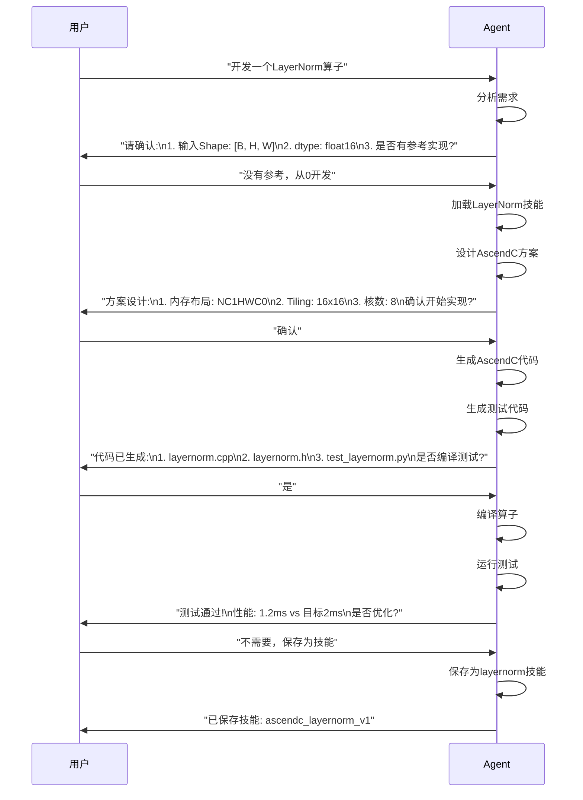

# 昇腾算子开发Agent (Ascend Operator Agent) 需求文档

**日期**: 2026-04-29
**项目路径**: `/Users/huangshilei/Documents/pythonprojects/ascend_op_agent`
**参考架构**: Hermes Agent (NousResearch)
**目标硬件**: 昇腾NPU (Ascend CANN)

---

## 1. 项目概述

### 1.1 背景与目标

昇腾算子开发Agent是一个基于AI Agent架构的自动化算子开发系统，旨在帮助开发者高效完成昇腾硬件上的算子开发工作。系统对标Hermes Agent的自学习闭环机制，针对昇腾算子开发场景进行专项优化。

**核心价值**:
- 降低昇腾算子开发门槛
- 提升算子开发效率
- 积累和复用算子开发经验
- 支持多种算子类型（AscendC、CATLASS、Triton）

### 1.2 竞品分析

#### 1.2.1 开源算子开发Agent调研

| 项目 | 架构特点 | 学习闭环 | 适用场景 | 昇腾支持 |
|------|----------|----------|----------|----------|
| **Hermes Agent** | AIAgent核心 + 工具注册表 + 技能系统 | ✅ 完整(技能自创建/自改进) | 通用AI助手 | ❌ |
| ** nousresearch/hermes-agent** | 多平台网关 + 记忆系统 + RL环境 | ✅ 完整 | 对话/研究/自动化 | ❌ |
| **Operator Agent (Triton)** | Kernel开发辅助 | 部分 | Triton算子 | ⚠️ 第三方集成 |
| **Ascend算子库** | 模板库 | ❌ | 算子实现参考 | ✅ 原生 |

#### 1.2.2 Hermes Agent核心机制分析

**学习闭环机制** (Learning Loop):


**关键子系统**:
1. **AIAgent**: 核心对话引擎，管理完整对话生命周期
2. **工具注册表**: 自注册 + AST自动发现机制
3. **技能系统**: 程序性记忆，30+领域知识包
4. **记忆系统**: FTS5全文搜索 + LLM摘要
5. **上下文压缩**: 迭代中压缩 + 预压缩

#### 1.2.3 架构借鉴与消减

| Hermes Agent模块 | 保留 | 消减 | 替代方案 |
|------------------|------|------|----------|
| 多平台网关 | ❌ | ✅ | 仅CLI/IDE集成 |
| 消息生命周期管理 | ❌ | ✅ | 简化为单会话 |
| 插件系统 | ✅ | - | 保留作为扩展机制 |
| 技能系统 | ✅ | - | 算子开发领域专精 |
| 记忆系统 | ✅ | - | 算子知识库 |
| RL训练环境 | ❌ | ✅ | 不在范围 |
| 凭据池 | ❌ | ✅ | 单模型单API Key |

---

## 2. 系统架构

### 2.1 整体架构图



### 2.2 核心模块职责

| 模块 | 文件位置 | 核心职责 |
|------|----------|----------|
| **AIAgent** | `run_agent.py` | 对话循环、工具调用、上下文管理 |
| **PromptBuilder** | `agent/prompt_builder.py` | 系统提示词七层组装 |
| **ContextEngine** | `agent/context_engine.py` | 上下文压缩策略 |
| **MemoryManager** | `agent/memory_manager.py` | 算子知识记忆管理 |
| **ToolRegistry** | `tools/registry.py` | 工具自注册与发现 |
| **OperatorTools** | `tools/operator_tools.py` | 算子开发专用工具 |
| **KnowledgeBase** | `knowledge/` | 昇腾算子知识库 |

### 2.3 数据流



---

## 3. 开发场景与模式

### 3.1 开发场景矩阵

| 场景 | 输入 | 输出 | 关键差异 |
|------|------|------|----------|
| **S1: 纯昇腾开发** | 算子描述(Prompt) | AscendC算子 | 无参考，从0设计 |
| **S2: GPU迁移开发** | CUDA/CUTLASS/Triton代码 | AscendC算子 | 需架构映射 |
| **S3: 模板库开发** | 算子类型 | CATLASS代码 | 基于模板参数化 |
| **S4: 混合开发** | 算子描述 + 部分参考 | AscendC算子 | 部分参考+自研 |

### 3.2 开发模式

#### 模式一: 空白项目开发
```
用户输入 → 需求分析 → 方案设计 → 代码实现 → 测试验证 → 优化交付
```

**关键步骤**:
1. 解析用户描述的算子逻辑
2. 分析数据流和计算图
3. 设计内存布局和tiling策略
4. 生成AscendC代码框架
5. 生成测试用例
6. 编译验证

#### 模式二: 已有项目开发
```
项目目录 → 理解工程结构 → 算子实现 → 集成验证 → 符合项目规范
```

**关键步骤**:
1. 扫描并理解目标项目的目录结构
2. 识别项目的构建系统(Build System)
3. 理解项目的代码规范和风格
4. 在项目框架内实现算子
5. 运行项目既有测试

---

## 4. 功能模块设计

### 4.1 核心功能列表

#### 4.1.1 算子需求分析 (Operator Analysis)

| 功能 | 描述 | 输入 | 输出 |
|------|------|------|------|
| **算子类型识别** | 识别算子类别(NN/Math/Transformer) | 算子描述/参考代码 | 算子类型 |
| **计算复杂度分析** | 评估算子计算规模 | Shape/Dtype | FLOPs/Memory |
| **依赖分析** | 识别算子依赖的Triton/CUTLASS | 参考代码 | 依赖列表 |
| **等价性验证** | 验证昇腾实现与参考的等价性 | 两份代码 | 等价性报告 |

#### 4.1.2 算子方案设计 (Operator Design)

| 功能 | 描述 | 输入 | 输出 |
|------|------|------|------|
| **架构映射** | CUDA→AscendC架构转换 | CUDA代码 | 映射策略 |
| **内存布局设计** | 输入输出内存布局 | Shape/Dtype | 内存布局方案 |
| **Tiling策略** | 计算分块策略 | Shape/Memory | Tiling参数 |
| **核间通信** | 多核协作方案 | Shape/算子类型 | 核间通信设计 |

#### 4.1.3 算子代码生成 (Code Generation)

| 功能 | 描述 | 输入 | 输出 |
|------|------|------|------|
| **AscendC生成** | 生成AscendC算子代码 | 设计方案 | .cpp/.h文件 |
| **CATLASS生成** | 生成CATLASS模板代码 | 算子类型 | 模板文件 |
| **Triton生成** | 生成Triton算子代码 | 设计方案 | .py文件 |
| **测试用例生成** | 生成单测和集成测 | 算子定义 | test_*.py |

#### 4.1.4 算子编译验证 (Build & Verify)

| 功能 | 描述 | 输入 | 输出 |
|------|------|------|------|
| **工程创建** | 创建昇腾算子工程 | 算子配置 | 工程目录 |
| **编译构建** | 编译算子为.so | 源代码 | .so文件 |
| **单测执行** | 运行单元测试 | 测试代码 | 测试结果 |
| **性能测试** | 性能基准测试 | 算子二进制 | 性能报告 |

#### 4.1.5 算子优化 (Optimization)

| 功能 | 描述 | 输入 | 输出 |
|------|------|------|------|
| **性能分析** | 分析瓶颈和优化点 | Profiling数据 | 瓶颈报告 |
| **内存优化** | 优化内存访问模式 | 算子代码 | 优化建议 |
| **计算优化** | 优化计算流程 | 算子代码 | 优化建议 |

### 4.2 工具集设计

```python
# 工具集定义
TOOLSETS = {
    "operator": {
        "description": "昇腾算子开发工具集",
        "tools": [
            "analyze_operator",
            "design_operator",
            "generate_ascendc",
            "generate_catlass",
            "generate_triton",
            "generate_tests",
        ],
        "includes": []
    },
    "build": {
        "description": "算子编译构建工具集",
        "tools": [
            "create_project",
            "build_operator",
            "run_tests",
            "profile_operator",
        ],
        "includes": []
    },
    "file": {
        "description": "文件操作工具集",
        "tools": [
            "read_file",
            "write_file",
            "list_directory",
            "search_files",
        ],
        "includes": []
    },
    "terminal": {
        "description": "终端执行工具集",
        "tools": [
            "execute_command",
            "execute_ascend_toolchain",
        ],
        "includes": []
    },
    "knowledge": {
        "description": "知识库工具集",
        "tools": [
            "query_knowledge",
            "store_knowledge",
            "search_patterns",
        ],
        "includes": []
    }
}
```

### 4.3 工具注册机制

沿用Hermes Agent的自注册模式:

```python
# tools/ascendc_tool.py
from tools.registry import registry, tool_error, tool_result

def analyze_operator_handler(args: dict, **kw) -> str:
    """分析算子需求"""
    operator_desc = args.get("operator_description", "")
    reference_code = args.get("reference_code", None)
    # ... 分析逻辑
    return tool_result({
        "operator_type": "elementwise",
        "suggested_implementation": "AscendC",
        "complexity": "medium"
    })

def check_ascend_tool_available() -> bool:
    """检查昇腾工具链是否可用"""
    import os
    return bool(os.getenv("ASCEND_TOOLCHAIN_PATH"))

# 自注册
registry.register(
    name="analyze_operator",
    toolset="operator",
    schema=ANALYZE_OPERATOR_SCHEMA,
    handler=analyze_operator_handler,
    check_fn=check_ascend_tool_available,
    emoji="🔍",
)
```

---

## 5. 学习闭环机制

### 5.1 核心设计

借鉴Hermes Agent的"自创建、自改进"机制，针对算子开发领域定制:



### 5.2 技能系统设计

**技能分类**:
```python
SKILL_CATEGORIES = {
    "ascendc": {
        "description": "AscendC算子开发技能",
        "skills": [
            "ascendc_elementwise",
            "ascendc_matmul",
            "ascendc_reduction",
            "ascendc_softmax",
        ]
    },
    "catlass": {
        "description": "CATLASS模板开发技能",
        "skills": [
            "catlass_gemm",
            "catlass_attention",
            "catlass_layernorm",
        ]
    },
    "migration": {
        "description": "GPU到昇腾迁移技能",
        "skills": [
            "cuda_to_ascendc",
            "triton_to_ascendc",
            "cutlass_to_ascendc",
        ]
    },
    "optimization": {
        "description": "算子优化技能",
        "skills": [
            "memory_tiling",
            "pipeline_optimization",
            "vectorization",
        ]
    }
}
```

**技能结构**:
```yaml
# skills/ascendc_elementwise/DESCRIPTION.md
---
name: ascendc_elementwise
category: ascendc
description: AscendC逐元素算子开发模式
version: 1.0.0
author: auto-learned
last_updated: 2026-04-29
patterns:
  - elementwise
  - unary
  - binary
templates:
  - source: |
      class {{operator_name}}Kernel : public Kernel {
      public:
          {{operator_name}}Kernel(...) {}
          void Compute(const Tensor& input, Tensor& output) {
              // 逐元素计算逻辑
          }
      };
  - test: |
      TEST_F({{operator_name}}Test, Basic) {
          // 测试用例
      }
best_practices:
  - 使用LocalTensor进行数据访问
  - 合理设置tile大小
  - 避免不必要的内存拷贝
```

### 5.3 记忆系统设计

**记忆类型**:
1. **会话记忆**: 当前开发会话的上下文
2. **算子记忆**: 历史算子开发经验
3. **技能记忆**: 技能的使用和改进历史
4. **模式记忆**: 常见算子模式和解法

**存储结构**:
```python
# SQLite Schema
CREATE TABLE operator_memory (
    id INTEGER PRIMARY KEY,
    operator_name TEXT,
    operator_type TEXT,
    implementation_hash TEXT,
    created_at TIMESTAMP,
    usage_count INTEGER,
    feedback_score REAL,
    metadata JSON
);

CREATE TABLE skill_memory (
    id INTEGER PRIMARY KEY,
    skill_name TEXT,
    category TEXT,
    content TEXT,
    version INTEGER,
    updated_at TIMESTAMP,
    usage_count INTEGER
);

CREATE TABLE pattern_memory (
    id INTEGER PRIMARY KEY,
    pattern_name TEXT,
    pattern_type TEXT,
    code_snippet TEXT,
   适用场景 TEXT,
    created_at TIMESTAMP
);
```

---

## 6. 领域知识库

### 6.1 昇腾算子知识库结构



### 6.2 知识库内容来源

| 来源 | 类型 | 更新频率 |
|------|------|----------|
| AscendC官方文档 | API/教程 | 随CANN版本 |
| CANN算子库 | 实现参考 | 定期同步 |
| CATLASS仓库 | 模板模式 | 定期同步 |
| 用户贡献 | 最佳实践 | 按需 |
| Agent自学习 | 模式积累 | 持续 |

---

## 7. 配置系统

### 7.1 配置结构

```yaml
# config.yaml
agent:
  model: "claude-sonnet-4-6"
  provider: "anthropic"
  max_iterations: 100

operator:
  default_backend: "ascendc"
  enable_optimization: true
  test_on_build: true

build:
  ascend_toolchain_path: "${ASCEND_TOOLCHAIN_PATH}"
  compile_flags: "-O3 -std=c++17"
  output_dir: "./build"

knowledge:
  skills_dir: "./skills"
  memory_db: "~/.ascend_op_agent/memory.db"
  enable_learning: true

tools:
  enabled_toolsets:
    - operator
    - build
    - file
    - terminal
    - knowledge
```

### 7.2 环境变量

| 变量 | 描述 | 必需 |
|------|------|------|
| `ASCEND_TOOLCHAIN_PATH` | 昇腾工具链路径 | 是 |
| `ASCEND_CANN_PATH` | CANN安装路径 | 是 |
| `ASCEND_DEVICE_ID` | 设备ID | 否 |
| `ANTHROPIC_API_KEY` | Anthropic API Key | 是 |

---

## 8. 用户交互流程

### 8.1 典型开发流程



### 8.2 会话示例

```bash
$ ascend_op_agent chat

> 开发一个FlashAttention算子，针对昇腾910B优化

[Agent] 我来帮你开发FlashAttention算子。让我先了解一下当前环境...

## 需求分析

**算子类型**: Attention
**目标硬件**: Ascend 910B
**参考实现**: 暂无，将从0设计

## 方案设计

| 项目 | 设计 |
|------|------|
| 输入 | Q[K,V]: [B, H, S, D], SeqLen: 8192 |
| 输出 | O: [B, H, S, D] |
| 内存布局 | ND |
| Tiling策略 | 块大小: 64x64 |
| 核数 | 16 |

## 实现路径

1. **阶段1**: 基于标准Attention实现基础版本
2. **阶段2**: 集成Flash Attention算法
3. **阶段3**: 针对910B的矩阵乘法优化

是否按此计划执行? (yes/no/modify)

>
```

---

## 9. 技术栈

### 9.1 核心技术依赖

| 组件 | 版本 | 用途 |
|------|------|------|
| Python | >=3.10 | 主语言 |
| Anthropic SDK | latest | LLM调用 |
| SQLite | - | 状态存储 |
| rich | latest | CLI美化 |
| click | latest | CLI框架 |

### 9.2 昇腾依赖

| 组件 | 来源 | 用途 |
|------|------|------|
| CANN | 昇腾官方 | 算子开发SDK |
| AscendPy | pip | Python绑定 |
| atlas_opp | CANN | 算子性能分析 |

---

## 10. 项目结构

```
ascend_op_agent/
├── README.md
├── CLAUDE.md
├── pyproject.toml
├── config.yaml
├── src/
│   ├── run_agent.py          # AIAgent核心
│   ├── cli.py                # CLI入口
│   └── hermes_state.py       # 状态存储
├── agent/
│   ├── __init__.py
│   ├── prompt_builder.py     # Prompt组装
│   ├── context_engine.py     # 上下文压缩
│   ├── context_compressor.py # 压缩实现
│   ├── memory_manager.py     # 记忆管理
│   └── memory_provider.py    # 记忆提供者
├── tools/
│   ├── __init__.py
│   ├── registry.py           # 工具注册表
│   ├── model_tools.py       # 工具调度
│   ├── toolsets.py          # 工具集定义
│   ├── file_tools.py        # 文件操作
│   ├── terminal_tool.py     # 终端执行
│   ├── operator_tools.py    # 算子开发工具
│   │   ├── analyze.py
│   │   ├── design.py
│   │   ├── ascendc_gen.py
│   │   ├── catlass_gen.py
│   │   ├── triton_gen.py
│   │   └── test_gen.py
│   └── ascend_tools.py       # 昇腾工具链
├── knowledge/
│   ├── ascendc/
│   │   ├── api_reference.md
│   │   ├── best_practices.md
│   │   └── examples/
│   ├── catlass/
│   │   ├── templates/
│   │   └── patterns/
│   ├── migration/
│   │   ├── cuda_to_ascendc.md
│   │   ├── triton_to_ascendc.md
│   │   └── cutlass_to_ascendc.md
│   └── common/
│       └── architecture.md
├── skills/
│   ├── ascendc_layernorm/
│   │   ├── DESCRIPTION.md
│   │   └── template.py
│   ├── ascendc_matmul/
│   ├── catlass_gemm/
│   └── migration_cuda/
├── tests/
│   ├── unit/
│   ├── integration/
│   └── tools/
└── docs/
    ├── architecture.md
    ├── development_guide.md
    └── skills_guide.md
```

---

## 11. 里程碑规划

### Phase 1: 核心框架 (2周)
- [ ] 项目基础结构搭建
- [ ] AIAgent核心实现
- [ ] 基础工具系统
- [ ] CLI界面

### Phase 2: 算子开发能力 (3周)
- [ ] AscendC代码生成
- [ ] 需求分析和方案设计
- [ ] 测试用例生成
- [ ] 编译验证

### Phase 3: 学习闭环 (2周)
- [ ] 技能系统
- [ ] 记忆系统
- [ ] 知识库
- [ ] 自我改进机制

### Phase 4: 高级功能 (3周)
- [ ] GPU迁移能力
- [ ] CATLASS支持
- [ ] Triton支持
- [ ] 性能优化

---

## 12. 附录

### 12.1 参考资源

1. [Hermes Agent架构文档](https://github.com/NousResearch/hermes-agent)
2. [AscendC算子开发文档](https://www.hiascend.com/document/detail/zh/CANNCommunityEdition/900beta2/opdevg/Ascendcopdevg/atlas_ascendc_map_10_0002.html)
3. [CATLASS仓库](https://gitcode.com/cann/catlass)
4. [算子库ops-nn](https://gitcode.com/cann/ops-nn)

### 12.2 术语表

| 术语 | 解释 |
|------|------|
| AscendC | 昇腾C语言，用于编写昇腾NPU算子 |
| CATLASS | CANN Tensor Library of Accelerators，昇腾模板库 |
| Tiling | 将大计算划分小Tile以适应硬件 |
| LocalTensor | AscendC中的本地张量抽象 |
| WorkQueue | AscendC中的工作队列 |

---

*文档版本: 1.0.0*
*创建日期: 2026-04-29*
*作者: SimmerChan*
