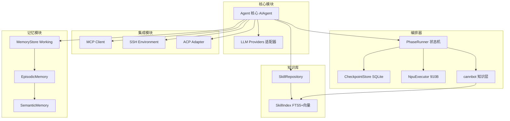

# 模块文档

<!--
Copyright 2026 SimmerChan

Licensed under the Apache License, Version 2.0 (the "License");
you may not use this file except in compliance with the License.
You may obtain a copy of the License at

    http://www.apache.org/licenses/LICENSE-2.0

Unless required by applicable law or agreed to in writing, software
distributed under the License is distributed on an "AS IS" BASIS,
WITHOUT WARRANTIES OR CONDITIONS OF ANY KIND, either express or implied.
See the License for the specific language governing permissions and
limitations under the License.
-->

本目录包含 Ascend Op Agent 各核心模块的详细文档。

## 文档索引

| 模块 | 说明 |
|------|------|
| [workflow.md](./workflow.md) | 工作流引擎 - 自研 PhaseRunner 状态机编排器（三路径 A/B/C） |
| [mcp.md](./mcp.md) | MCP 服务器集成 - 外部工具扩展 |
| [skills.md](./skills.md) | Skill 知识库 - cannbot 知识层 + self-built skill 结晶化 |
| [ssh.md](./ssh.md) | SSH 远程开发 - 910B 容器拓扑 + 文件同步 |
| [memory.md](./memory.md) | 记忆系统 - 四层记忆架构 |
| [acp.md](./acp.md) | ACP 编辑器适配器 - IDE 集成 |
| [llm_providers.md](./llm_providers.md) | LLM Provider 配置 - 多 Provider 适配器 + 三 provider 轮询 |

## 模块关系

## 快速导航

### 工作流引擎
- [三路径](./workflow.md#三条路径)
- [节点流](./workflow.md#节点流-path-c-新开发)
- [PhaseRunner](./workflow.md#phaserunner)
- [CheckpointStore](./workflow.md#checkpointstore)
- [NpuExecutor](./workflow.md#npuexecutor)
- [fix_loop](./workflow.md#fix-loop)

### MCP 服务器集成
- [传输模式](./mcp.md#传输模式)
- [MCPServerConfig](./mcp.md#mcpserverconfig)
- [OAuth 认证](./mcp.md#mpcoauthmanager)
- [服务器池](./mcp.md#服务器池)

### Skill 知识库
- [cannbot 知识层](./skills.md#cannbot-skills-知识层)
- [SKILL.md 格式](./skills.md#skillmd-格式)
- [Skill Crystallization /learn](./skills.md#skill-crystallization-learn)
- [Skill Curator Lite](./skills.md#skill-curator-lite-tier-0)
- [混合检索](./skills.md#检索策略)

### SSH 远程开发
- [910B 容器拓扑](./ssh.md#910b-容器拓扑)
- [SSHEnvironment](./ssh.md#sshenvironment-推荐)
- [文件同步](./ssh.md#filesync)
- [RemoteEnvConfig](./ssh.md#remoteenvconfig)

### 记忆系统
- [四层记忆](./memory.md#四层记忆)
- [MemorySystem](./memory.md#统一接口-memorysystem)
- [向量存储](./memory.md#向量存储)
- [LlmEnhancer](./memory.md#llm-增强-llmenhancer)

### ACP 编辑器适配器
- [ACPAdapter](./acp.md#acpadapter)
- [协议方法](./acp.md#协议方法)
- [ACPSession](./acp.md#acpsession-sessionmanager)

### LLM Provider 配置
- [Adapter 内部机制](./llm_providers.md#adapter-内部机制)
- [三 Provider 轮询](./llm_providers.md#三-provider-轮询-minimax-glm-ark)
- [Provider 切换](./llm_providers.md#provider-切换)
