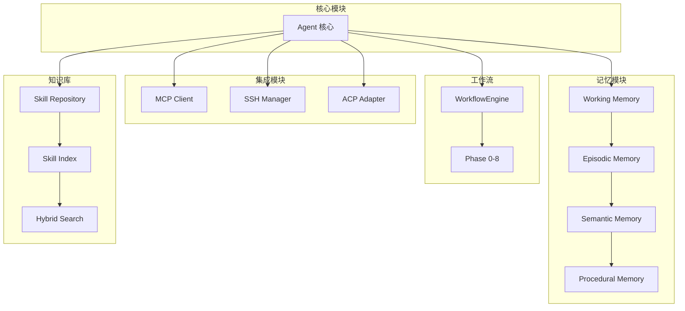

# 模块文档

<!--
Copyright 2026 SimmerChan

Licensed under the Apache License, Version 2.0 (the "License");
you may not use this file except in compliance with the License.
You may obtain a copy of the License at

    http://www.apache.org/licenses/LICENSE-2.0

Unless required by applicable law or agreed to in writing, software
distributed under the License is distributed on an "AS IS" BASIS,
WITHOUT WARRANTIES OR CONDITIONS OF ANY KIND, either express or implied.
See the License for the specific language governing permissions and
limitations under the License.
-->

本目录包含 Ascend Op Agent 各核心模块的详细文档。

## 文档索引

| 模块 | 说明 |
|------|------|
| [mcp.md](./mcp.md) | MCP 服务器集成 - 外部工具扩展 |
| [skills.md](./skills.md) | Skill 知识库 - 经验积累和复用 |
| [ssh.md](./ssh.md) | SSH 远程开发 - 远程服务器开发 |
| [memory.md](./memory.md) | 记忆系统 - 四层记忆架构 |
| [acp.md](./acp.md) | ACP 编辑器适配器 - IDE 集成 |
| [workflow.md](./workflow.md) | 工作流引擎 - 六阶段算子开发 |

## 模块关系

## 快速导航

### MCP 服务器集成
- [传输模式](./mcp.md#传输模式)
- [OAuth 认证](./mcp.md#mcpoauthmanager)
- [服务器池](./mcp.md#服务器池)

### Skill 知识库
- [SKILL.md 格式](./skills.md#skillmd-格式)
- [混合检索](./skills.md#混合检索)
- [远程仓库](./skills.md#远程-git-仓库)

### SSH 远程开发
- [SSHEnvironment](./ssh.md#sshenvironment)
- [文件同步](./ssh.md#文件同步)
- [会话快照](./ssh.md#会话快照)

### 记忆系统
- [四层记忆](./memory.md#四层记忆)
- [向量存储](./memory.md#向量存储)
- [LLM 增强](./memory.md#llm-增强)

### ACP 编辑器适配器
- [协议方法](./acp.md#协议方法)
- [会话管理](./acp.md#acpsession)
- [IDE 集成](./acp.md#使用示例)

### 工作流引擎
- [阶段说明](./workflow.md#阶段说明)
- [数据模型](./workflow.md#数据模型)
- [事件回调](./workflow.md#事件和回调)
