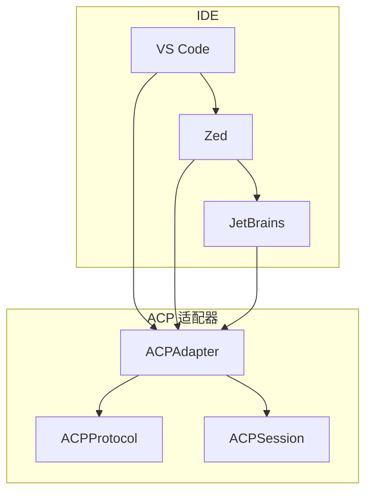

# ACP 编辑器适配器

<!--
Copyright 2026 SimmerChan

Licensed under the Apache License, Version 2.0 (the "License");
you may not use this file except in compliance with the License.
You may obtain a copy of the License at

    http://www.apache.org/licenses/LICENSE-2.0

Unless required by applicable law or agreed to in writing, software
distributed under the License is distributed on an "AS IS" BASIS,
WITHOUT WARRANTIES OR CONDITIONS OF ANY KIND, either express or implied.
See the License for the specific language governing permissions and
limitations under the License.
-->

## 概述

ACP (Agent Code Protocol) 编辑器适配器允许 Ascend Op Agent 与主流 IDE（VS Code、Zed、JetBrains）集成。

## 支持的 IDE

| IDE | 状态 | 通信方式 |
|-----|------|----------|
| VS Code | ✅ 已支持 | JSON-RPC via stdio |
| Zed | ✅ 已支持 | JSON-RPC via stdio |
| JetBrains | 🔄 开发中 | JSON-RPC via stdio |

## 架构



## 核心组件

### ACPAdapter

```python
from ascend_op_agent.acp.adapter import ACPAdapter

adapter = ACPAdapter(
    editor="vscode",  # vscode, zed, jetbrains
    workspace_root="/path/to/workspace"
)

# 初始化
await adapter.initialize()

# 处理请求
response = await adapter.handle_request(request)

# 关闭
await adapter.shutdown()
```

### ACPProtocol

```python
from ascend_op_agent.acp.protocol import ACPProtocol, ACPRequest, ACPResponse

# 创建请求
request = ACPRequest(
    method="initialize",
    params={
        "editor": "vscode",
        "workspace": "/path/to/workspace",
        "capabilities": ["inline-completion", "diagnostics"]
    }
)

# 发送请求
response = await adapter.send_request(request)
```

### ACPSession

```python
from ascend_op_agent.acp.session import ACPSession

session = ACPSession(
    adapter=adapter,
    session_id="session-123"
)

# 开始会话
await session.start()

# 发送消息
await session.send("hello")

# 接收消息
message = await session.receive()

# 结束会话
await session.end()
```

## 协议方法

### 初始化

```json
// 请求
{
    "jsonrpc": "2.0",
    "method": "initialize",
    "params": {
        "editor": "vscode",
        "workspace": "/path/to/workspace",
        "capabilities": ["inline-completion"]
    },
    "id": 1
}

// 响应
{
    "jsonrpc": "2.0",
    "result": {
        "status": "initialized",
        "agent_version": "0.1.0"
    },
    "id": 1
}
```

### 推理请求

```json
// 请求
{
    "jsonrpc": "2.0",
    "method": "推理",
    "params": {
        "prompt": "实现一个 MatMul 算子",
        "context": {}
    },
    "id": 2
}
```

### 工具调用

```json
// 请求
{
    "jsonrpc": "2.0",
    "method": "invoke_tool",
    "params": {
        "name": "bash",
        "args": {"command": "ls -la"}
    },
    "id": 3
}

// 响应
{
    "jsonrpc": "2.0",
    "result": {
        "output": "total 64\ndrwxr-xr-x  5 user staff  160 May  4 20:15 .\n..."
    },
    "id": 3
}
```

## 使用示例

### VS Code 集成

1. 安装 VS Code 扩展
2. 配置扩展连接到 Agent

```json
{
    "acp.agentPath": "/path/to/ascend-op-agent",
    "acp.server": "stdio"
}
```

### Zed 集成

1. 安装 Zed 扩展
2. 配置 `settings.json`

```json
{
    "acp": {
        "agentPath": "/path/to/ascend-op-agent"
    }
}
```

### JetBrains 集成

1. 安装 IntelliJ/GoLand/... 插件
2. 配置插件

```properties
acp.agent.path=/path/to/ascend-op-agent
acp.communication.mode=stdio
```

## 延迟初始化

ACP 适配器使用延迟初始化以避免启动时序问题：

```python
# 内部使用 asyncio.Lock
async def _ensure_initialized(self):
    async with self._init_lock:
        if not self._initialized:
            await self._do_initialize()
```

## 错误处理

```python
from ascend_op_agent.acp.adapter import ACPError

try:
    await adapter.handle_request(request)
except ACPError as e:
    print(f"ACP 错误: {e.code} - {e.message}")
except Exception as e:
    print(f"未知错误: {e}")
```

## 配置

```yaml
acp:
  editor: "vscode"  # vscode, zed, jetbrains
  workspace: "/path/to/workspace"
  timeout: 300  # 请求超时（秒）
  retry: 3       # 重试次数
```
