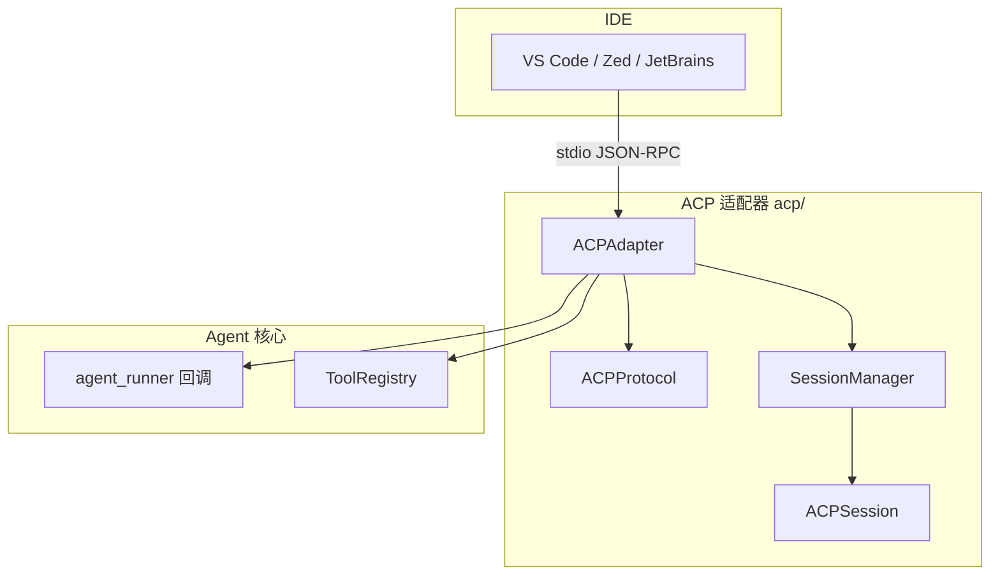

# ACP 编辑器适配器

<!--
Copyright 2026 SimmerChan

Licensed under the Apache License, Version 2.0 (the "License");
you may not use this file except in compliance with the License.
You may obtain a copy of the License at

    http://www.apache.org/licenses/LICENSE-2.0

Unless required by applicable law or agreed to in writing, software
distributed under the License is distributed on an "AS IS" BASIS,
WITHOUT WARRANTIES OR CONDITIONS OF ANY KIND, either express or implied.
See the License for the specific language governing permissions and
limitations under the License.
-->

## 概述

ACP (Agent Client Protocol) 编辑器适配器使 Ascend Op Agent 可作为 VS Code、Zed、
JetBrains 等编辑器的 AI 后端运行。通过 stdio 进行 JSON-RPC 2.0 通信，复用
`backend/rpc/protocol.py` 的 JSONRPCProtocol 实现。

## 支持的 IDE

| IDE | 状态 | 通信方式 |
|-----|------|----------|
| VS Code | ✅ 已支持 | JSON-RPC via stdio |
| Zed | ✅ 已支持 | JSON-RPC via stdio |
| JetBrains | ✅ 已支持 | JSON-RPC via stdio |

## 架构



## 核心组件

### ACPAdapter

整合协议处理、会话管理和工具路由的主类：

```python
from ascend_op_agent.acp import ACPAdapter

adapter = ACPAdapter(
    agent_runner=lambda user_input: agent.run(user_input),  # Agent 运行回调
    tool_registry=tool_registry,        # 工具注册表（可选）
    session_timeout=30 * 60,           # 会话超时（秒），默认 30 分钟
)

# 运行 stdio 循环（阻塞，读取 stdin 处理消息）
await adapter.run()

# 关闭
adapter.shutdown()
```

主要方法：
- `handle_message(raw_message)` -- 处理收到的 JSON-RPC 消息字符串
- `send_notification(method, params)` -- 向编辑器发送通知
- `run()` -- 启动 stdio 主循环（async）
- `shutdown()` -- 关闭适配器

输出通过 `asyncio.Lock` 串行化，避免并发消息交错。

### ACPProtocol

ACP 1.0 协议处理器，扩展 JSON-RPC 2.0：

```python
from ascend_op_agent.acp.protocol import ACPProtocol

protocol = ACPProtocol()
request, notification = protocol.parse_message(raw_json)  # 解析消息
protocol.validate_method("agent.run")                     # 校验方法白名单
protocol.validate_params("agent.run", {"user_input": "..."})  # 校验参数
response = protocol.build_success_response(id=1, result={...})
error = protocol.build_error_response(id=1, code=-32601, message="method not found")
notif = protocol.build_notification("notifications/status", {"status": "running"})
```

### ACPSession / SessionManager

`ACPSession` 是会话数据对象，`SessionManager` 管理会话生命周期与超时清理：

```python
from ascend_op_agent.acp import SessionManager, ACPSession

manager = SessionManager(timeout_seconds=30 * 60)
session = manager.create_session(session_id="sess-1", editor_info={"name": "vscode"})
manager.update_session(session.session_id)   # 更新最后活动时间
expired = session.is_expired(timeout_seconds=30 * 60)
manager.cleanup_expired()                     # 清理超时会话
```

`ACPSession` 字段：`session_id` / `editor_info` / `created_at` / `last_activity` /
`context` / `capabilities`。

## 协议方法

| 方法 | 方向 | 参数 | 说明 |
|------|------|------|------|
| `initialize` | Editor -> Agent | `clientInfo`, `capabilities` | 初始化会话，传递客户端能力 |
| `agent.run` | Editor -> Agent | `user_input` | 运行 Agent 对话 |
| `agent.compose` | Editor -> Agent | `messages` | 发送组合消息 |
| `tools/list` | Editor -> Agent | - | 列出可用工具 |
| `tools/call` | Editor -> Agent | `name`, `args` | 调用工具 |
| `notifications/status` | Agent -> Editor | `status`, `message` | 推送状态更新 |

### initialize 请求/响应

```json
// 请求
{
    "jsonrpc": "2.0",
    "method": "initialize",
    "params": {
        "clientInfo": {"name": "vscode", "version": "1.0.0"},
        "capabilities": ["inline-completion", "diagnostics"]
    },
    "id": 1
}

// 响应
{
    "jsonrpc": "2.0",
    "result": {
        "protocolVersion": "1.0",
        "capabilities": {"agentRun": true, "tools": true},
        "serverInfo": {"name": "ascend-op-agent-acp", "version": "1.0.0"}
    },
    "id": 1
}
```

### agent.run 请求

```json
{
    "jsonrpc": "2.0",
    "method": "agent.run",
    "params": {
        "user_input": "实现一个 MatMul 算子"
    },
    "id": 2
}
```

### tools/call 请求

```json
{
    "jsonrpc": "2.0",
    "method": "tools/call",
    "params": {
        "name": "bash",
        "args": {"command": "ls -la"}
    },
    "id": 3
}
```

## 使用示例

### 启动 ACP 服务

ACP 适配器通过 stdio 与编辑器通信，由 IDE 扩展拉起 Agent 进程：

```bash
# IDE 扩展启动时拉起 Agent（stdio 模式）
ascend-op-agent acp --stdio
```

### VS Code 集成

1. 安装 VS Code 扩展
2. 配置扩展连接到 Agent：

```json
{
    "acp.agentPath": "/path/to/ascend-op-agent",
    "acp.transport": "stdio"
}
```

### Zed / JetBrains 集成

配置扩展指向 `ascend-op-agent acp --stdio`，通过 stdio 交换 JSON-RPC 消息。

## 错误处理

协议层返回标准 JSON-RPC 错误响应：

```python
# 方法不在白名单
response = protocol.build_error_response(id, code=-32601, message="method not found")

# 参数校验失败（agent.run 缺 user_input）
response = protocol.build_error_response(id, code=-32602, message="invalid params")
```

`ACPAdapter.handle_message` 内部捕获解析异常并记录日志，不中断主循环。

## 配置

ACP 适配器无独立配置文件，通过构造参数控制：

```python
adapter = ACPAdapter(
    agent_runner=agent_runner,
    tool_registry=tool_registry,
    session_timeout=30 * 60,  # 会话超时（秒）
)
```
