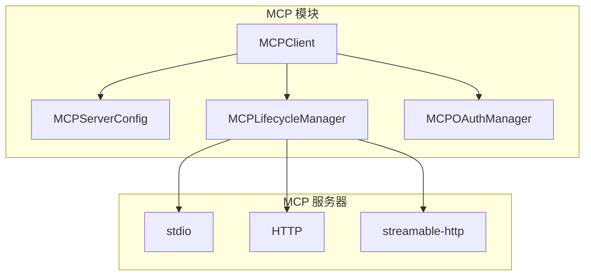

# MCP 服务器集成

<!--
Copyright 2026 SimmerChan

Licensed under the Apache License, Version 2.0 (the "License");
you may not use this file except in compliance with the License.
You may obtain a copy of the License at

    http://www.apache.org/licenses/LICENSE-2.0

Unless required by applicable law or agreed to in writing, software
distributed under the License is distributed on an "AS IS" BASIS,
WITHOUT WARRANTIES OR CONDITIONS OF ANY KIND, either express or implied.
See the License for the specific language governing permissions and
limitations under the License.
-->

## 概述

MCP (Model Context Protocol) 模块提供与外部 MCP 服务器的集成能力，允许 Agent 调用外部工具和服务。

## 架构



## 传输模式

| 模式 | 说明 | 适用场景 |
|------|------|----------|
| `stdio` | 标准输入输出 | 本地进程 |
| `http` | HTTP 请求响应 | 远程服务 |
| `streamable-http` | 流式 HTTP | 大响应 |

## 配置

在 `config.yaml` 中配置 MCP 服务器：

```yaml
mcp:
  servers:
    - name: code-search
      type: stdio
      command: npx /path/to/mcp-server

    - name: remote-api
      type: http
      url: https://api.example.com/mcp
      headers:
        X-API-Key: "${REMOTE_API_KEY}"
```

## 核心组件

### MCPServerConfig

```python
from ascend_op_agent.mcp.server_config import MCPServerConfig, TransportType

config = MCPServerConfig(
    name="code-search",
    type=TransportType.STDIO,
    command="npx /path/to/server",
    env={"KEY": "value"},
)
```

### MCPClient

```python
from ascend_op_agent.mcp.client import MCPClient, MCPClientPool

# 单个服务器
client = MCPClient(config)
client.connect()
result = client.send_request("tool_name", {"param": "value"})
client.disconnect()

# 服务器池
pool = MCPClientPool()
pool.add_server(config)
pool.connect_all()
```

### MCPLifecycleManager

管理 MCP 服务器生命周期：

```python
from ascend_op_agent.mcp.lifecycle import MCPLifecycleManager

manager = MCPLifecycleManager()
manager.start_server(config)
manager.is_server_running("server-name")
manager.stop_server("server-name")
```

### MCPOAuthManager

处理 OAuth 认证：

```python
from ascend_op_agent.mcp.oauth import MCPOAuthManager

oauth = MCPOAuthManager(
    server_name="github",
    oauth_config={"client_id": "...", "client_secret": "..."}
)
auth_header = oauth.get_auth_header()
```

## 使用示例

### 基本使用

```python
from ascend_op_agent.mcp.client import MCPClient
from ascend_op_agent.mcp.server_config import MCPServerConfig, TransportType

# 创建配置
config = MCPServerConfig(
    name="calculator",
    type=TransportType.STDIO,
    command="python -m mcp_server",
)

# 使用上下文管理器
with MCPClient(config) as client:
    result = client.send_request("add", {"a": 1, "b": 2})
    print(result)
```

### 服务器池

```python
from ascend_op_agent.mcp.client import MCPClientPool
from ascend_op_agent.mcp.server_config import MCPServerConfig, TransportType

pool = MCPClientPool()

# 添加多个服务器
pool.add_server(MCPServerConfig(name="server1", type=TransportType.STDIO, ...))
pool.add_server(MCPServerConfig(name="server2", type=TransportType.HTTP, ...))

# 批量连接
results = pool.connect_all()
print(results)  # {'server1': True, 'server2': True}

# 获取客户端
client = pool.get_client("server1")

# 清理
pool.cleanup()
```

## 故障排除

### 连接超时

```python
# 增加超时时间
config = MCPServerConfig(
    name="slow-server",
    timeout=60,  # 60秒超时
    ...
)
```

### OAuth 令牌刷新

```python
oauth = MCPOAuthManager(...)
oauth.set_refresh_token("new-token")
```

### stdio 通信问题

检查进程是否正确启动：

```python
# 查看服务器输出
proc = lifecycle.processes.get("server-name")
if proc:
    print(proc.stdout.readline())
```
