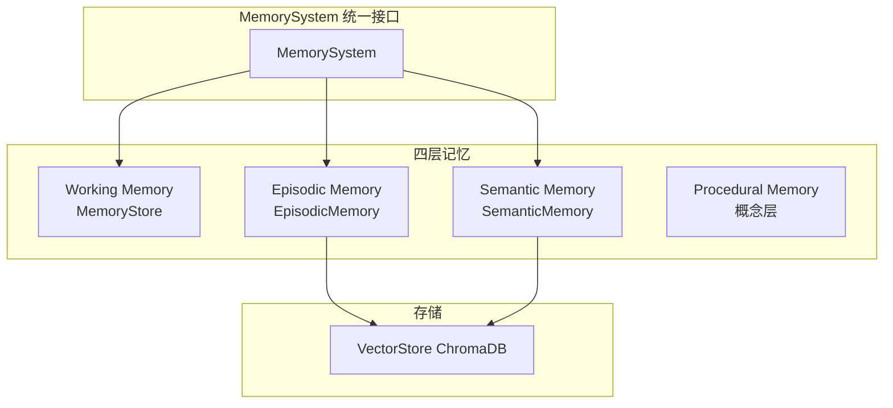

# 记忆系统

<!--
Copyright 2026 SimmerChan

Licensed under the Apache License, Version 2.0 (the "License");
you may not use this file except in compliance with the License.
You may obtain a copy of the License at

    http://www.apache.org/licenses/LICENSE-2.0

Unless required by applicable law or agreed to in writing, software
distributed under the License is distributed on an "AS IS" BASIS,
WITHOUT WARRANTIES OR CONDITIONS OF ANY KIND, either express or implied.
See the License for the specific language governing permissions and
limitations under the License.
-->

## 概述

记忆系统采用四层记忆架构，由 `MemorySystem`（`memory/system.py`）统一整合：
Working Memory（当前会话上下文）、Episodic Memory（会话历史）、Semantic Memory
（Skill 知识向量）、Procedural Memory（场景化工作流模板，概念层）。

## 架构



## 四层记忆

### 1. Working Memory（MemoryStore）

当前会话的工作记忆，按 pool（`memory` / `user`）组织：

```python
from ascend_op_agent.agent.memory import MemoryStore

memory = MemoryStore()
memory.add("memory", "实现一个 MatMul 算子")   # 添加到 memory 池
memory.add("user", "用户偏好: 优先 ascendc")

items = memory.get("memory")                    # -> list[str]
text = memory.format_for_system_prompt("memory")  # 格式化为系统 prompt
text = memory.get_full_context("memory")        # 完整上下文

memory.freeze_snapshot()    # 冻结快照
memory.restore_snapshot()   # 恢复快照
memory.clear("memory")      # 清除指定池（None 清全部）
```

特性：自动压缩（超阈值时 `_compress_context`）、快照冻结/恢复。

### 2. Episodic Memory

完整会话历史，持久化到 ChromaDB（经 `VectorStore`）：

```python
from ascend_op_agent.memory.episodic_memory import EpisodicMemory

memory = EpisodicMemory(
    vector_store=vector_store,         # VectorStore 实例
    message_threshold=50,              # 触发摘要的消息数阈值
    token_threshold=4000,              # 触发摘要的 token 阈值
    summarize_episodes=False,          # 是否启用摘要提取
)

# 会话片段生命周期
episode_id = memory.start_episode()             # 开始新片段
memory.add_turn("user", "实现 MatMul 算子")      # 添加对话轮次
memory.add_turn("assistant", "我将帮你实现...")
episode = memory.end_episode()                  # 结束片段

# 相似会话检索
results = memory.search_similar_episodes("MatMul", k=5)
```

数据模型：`Episode`（episode_id + turns + summary + metadata）、`ConversationTurn`
（role + content + timestamp）。

### 3. Semantic Memory

Skill 知识向量存储与检索：

```python
from ascend_op_agent.memory.semantic_memory import SemanticMemory

memory = SemanticMemory()

# 混合检索（向量 + 关键词）
results = memory.semantic_search(query="如何开发矩阵乘法算子", k=5,
                                  op_type="matmul", use_hybrid=True)

# 场景/类型过滤
results = memory.search_by_scenario("gpu-migration")
results = memory.search_by_op_type("matmul")
results = memory.search_by_tags(["ascendc", "matmul"])

# Skill 推荐
recs = memory.get_skill_recommendations(current_op_type="matmul",
                                         current_task="tiling design", k=3)

# 构建 skill 语义索引
count = memory.build_semantic_index(repository)  # 从 SkillRepository 构建
```

### 4. Procedural Memory

场景化工作流模板（概念层，由编排器 `orchestrator/graphs/` 的图定义承载）。
`MemorySystem` 不直接暴露 ProceduralMemory 类；工作流模板对应 `build_new_dev_graph`
/ `build_migration_graph` 构造的 PhaseRunner 节点序列。

## 统一接口（MemorySystem）

```python
from ascend_op_agent.memory.system import MemorySystem

system = MemorySystem()  # 自动初始化三层

# Working Memory
system.add_working_memory("memory", "上下文内容")
items = system.get_working_memory("memory")

# Episodic Memory
episode_id = system.start_episode()
system.add_episode_turn("user", "实现 MatMul")
system.end_episode()
results = system.search_episodes("MatMul", k=5)

# Semantic Memory
skills = system.search_skills("AscendC MatMul", k=5, use_hybrid=True)
recs = system.get_skill_recommendations("matmul", "tiling", k=3)

# 统一检索（自动路由到各层）
results = system.retrieve("MatMul", layers=["working", "episodic", "semantic"], k=5)
# -> {"working": [...], "episodic": [...], "semantic": [...]}
```

## 向量存储

### VectorStore

ChromaDB 封装，提供向量持久化与相似度检索：

```python
from ascend_op_agent.memory.vector_store import VectorStore

store = VectorStore(
    embed_model="sentence-transformers/all-MiniLM-L6-v3",
    persist_dir="~/.ascend_op_agent/vectors",
)

store.add(id="doc-1", text="AscendC MatMul 算子开发", metadata={"type": "skill"})
results = store.search("矩阵乘法", top_k=5)  # -> [{text, score, ...}]
```

## LLM 增强（LlmEnhancer）

使用 LLM 增强记忆检索结果：

```python
from ascend_op_agent.memory.llm_enhancer import LlmEnhancer, LlmEnhancerFactory

enhancer = LlmEnhancerFactory.create()  # 从 config 构建
if enhancer.is_enabled() and enhancer.should_enhance(base_results, min_score=0.6):
    enhanced = await enhancer.enhance(query="MatMul tiling", base_results=base_results)

# 会话摘要
summary = await enhancer.summarize_sessions(sessions)
# 歧义消解
disambiguated = await enhancer.disambiguate(term="tiling", context="AscendC 算子开发")
```

## 配置

```yaml
memory:
  episodic:
    message_threshold: 50
    token_threshold: 4000
    summarize_episodes: false

  semantic:
    use_hybrid: true

  vector:
    model: "sentence-transformers/all-MiniLM-L6-v3"
    dimension: 384

  llm_enhancer:
    enabled: false
```
