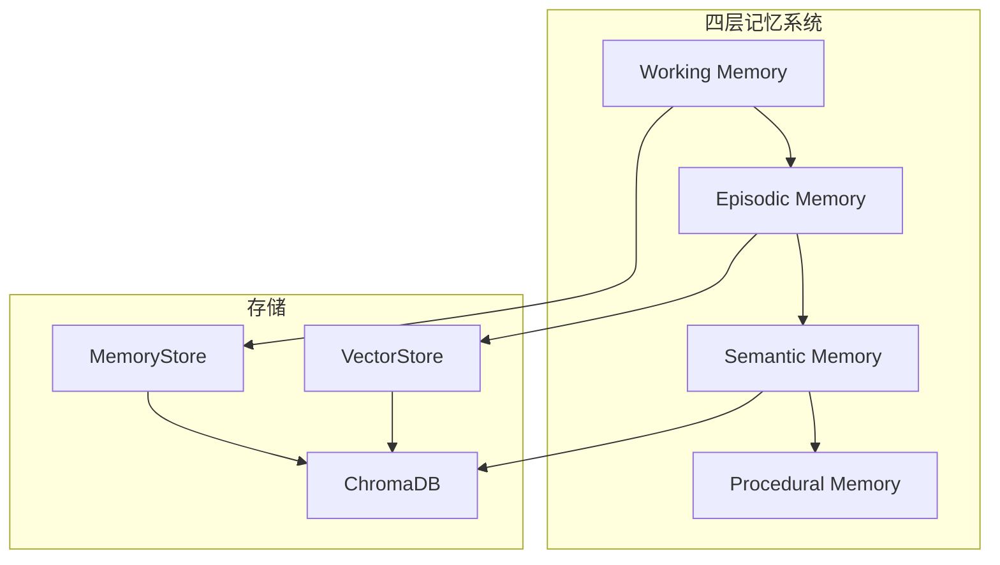

# 记忆系统

<!--
Copyright 2026 SimmerChan

Licensed under the Apache License, Version 2.0 (the "License");
you may not use this file except in compliance with the License.
You may obtain a copy of the License at

    http://www.apache.org/licenses/LICENSE-2.0

Unless required by applicable law or agreed to in writing, software
distributed under the License is distributed on an "AS IS" BASIS,
WITHOUT WARRANTIES OR CONDITIONS OF ANY KIND, either express or implied.
See the License for the specific language governing permissions and
limitations under the License.
-->

## 概述

记忆系统采用四层记忆架构，支持工作记忆、情景记忆、语义记忆和程序记忆。

## 架构



## 四层记忆

### 1. Working Memory

当前会话的工作记忆：

```python
from ascend_op_agent.agent.memory import WorkingMemory

memory = WorkingMemory()

# 添加上下文
memory.add("user_requirement", "实现一个 MatMul 算子")

# 获取上下文
context = memory.get("user_requirement")

# 获取最近对话
recent = memory.get_recent(5)
```

### 2. Episodic Memory

完整会话历史，持久化到 ChromaDB：

```python
from ascend_op_agent.memory.episodic_memory import EpisodicMemory

memory = EpisodicMemory(
    persist_dir="~/.ascend_op_agent/memory/episodes"
)

# 记录对话
memory.add(
    role="user",
    content="实现 MatMul 算子",
    metadata={"timestamp": "2026-05-04"}
)

memory.add(
    role="assistant",
    content="我将帮你实现 MatMul 算子...",
    metadata={"timestamp": "2026-05-04"}
)

# 检索历史
results = memory.search("MatMul", limit=5)
for result in results:
    print(result.content)
```

### 3. Semantic Memory

技能知识向量存储：

```python
from ascend_op_agent.memory.semantic_memory import SemanticMemory

memory = SemanticMemory(
    embed_model="sentence-transformers/all-MiniLM-L6-v3",
    persist_dir="~/.ascend_op_agent/memory/semantic"
)

# 添加技能
memory.add_skill(
    name="ascendc-matmul",
    content="MatMul 算子开发指南...",
    tags=["ascendc", "matmul", "template"]
)

# 语义搜索
results = memory.search("如何开发矩阵乘法算子", limit=5)
```

### 4. Procedural Memory

场景化工作流模板：

```python
from ascend_op_agent.memory.system import ProceduralMemory

memory = ProceduralMemory()

# 获取工作流模板
workflow = memory.get_workflow("ascendc-development")

# 获取最佳实践
practices = memory.get_best_practices("gpu-migration")
```

## 向量存储

### VectorStore

```python
from ascend_op_agent.memory.vector_store import VectorStore

store = VectorStore(
    embed_model="sentence-transformers/all-MiniLM-L6-v3",
    persist_dir="~/.ascend_op_agent/vectors"
)

# 添加向量
store.add(
    id="doc-1",
    text="AscendC MatMul 算子开发",
    metadata={"type": "skill"}
)

# 搜索
results = store.search("矩阵乘法", top_k=5)
for result in results:
    print(f"{result.text}: {result.score}")
```

### 混合检索

```python
from ascend_op_agent.skills.hybrid_search import HybridSearch

search = HybridSearch(
    vector_weight=0.7,
    keyword_weight=0.3,
)

results = search.search("AscendC MatMul", top_k=10)
```

## LLM 增强

### LLMEnhancer

使用 LLM 增强记忆：

```python
from ascend_op_agent.memory.llm_enhancer import LLMEnhancer

enhancer = LLMEnhancer()

# 总结对话
summary = await enhancer.summarize(messages)

# 提取关键信息
entities = await enhancer.extract_entities(conversation)

# 生成检索关键词
keywords = await enhancer.generate_keywords(text)
```

## 会话管理

```python
from ascend_op_agent.agent.memory import AgentMemory

memory = AgentMemory()

# 开始新会话
memory.new_session()

# 添加用户消息
memory.add_user_message("实现 MatMul 算子")

# 添加助手回复
memory.add_assistant_message("我将帮你实现...")

# 搜索历史
results = memory.search_history("MatMul")

# 保存会话
memory.save_session()

# 加载历史会话
memory.load_session("session-id")
```

## 持久化

```python
# ChromaDB 持久化
memory = EpisodicMemory(persist_dir="./episodes")
memory.persist()

# 加载
memory = EpisodicMemory.load(persist_dir="./episodes")
```

## 配置

```yaml
memory:
  episodic:
    persist_dir: "~/.ascend_op_agent/memory/episodes"

  semantic:
    embed_model: "sentence-transformers/all-MiniLM-L6-v3"
    persist_dir: "~/.ascend_op_agent/memory/semantic"

  vector:
    model: "sentence-transformers/all-MiniLM-L6-v3"
    dimension: 384
```
