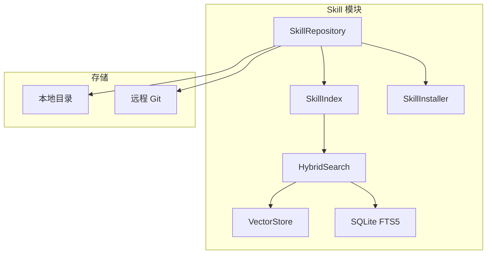
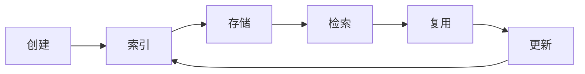

# Skill 知识库

<!--
Copyright 2026 SimmerChan

Licensed under the Apache License, Version 2.0 (the "License");
you may not use this file except in compliance with the License.
You may obtain a copy of the License at

    http://www.apache.org/licenses/LICENSE-2.0

Unless required by applicable law or agreed to in writing, software
distributed under the License is distributed on an "AS IS" BASIS,
WITHOUT WARRANTIES OR CONDITIONS OF ANY KIND, either express or implied.
See the License for the specific language governing permissions and
limitations under the License.
-->

## 概述

Skill 知识库用于积累和复用算子开发经验，支持模板、Bugfix、性能优化等多种维度。

## 架构



## SKILL.md 格式

```markdown
---
name: ascendc-elementwise
description: AscendC 元素级算子开发模板
tags: [ascendc, elementwise, template]
version: 1.0.0
author: SimmerChan
---

# AscendC Elementwise 算子开发模板

## 适用场景
...
```

## 目录结构

```
~/.ascend_op_agent/skills/
├── ascendc_elementwise/           # 模板
│   └── SKILL.md
├── ascendc_elementwise_bugfix/   # Bugfix
│   └── SKILL.md
└── ascendc_elementwise_perf/     # 性能优化
    └── SKILL.md
```

## 核心组件

### SkillRepository

```python
from ascend_op_agent.skills.repository import SkillRepository

repo = SkillRepository(
    local_skills_dir="~/.ascend_op_agent/skills"
)

# 列出所有技能
skills = repo.list_local_skills()
for skill in skills:
    print(f"{skill.name}: {skill.description}")

# 获取单个技能
skill = repo.get_skill("ascendc-elementwise")
if skill:
    print(skill.content)
```

### SkillIndex

```python
from ascend_op_agent.skills.index import SkillIndex

index = SkillIndex()

# 搜索技能
results = index.search("elementwise operator")
for result in results:
    print(f"{result.name}: {result.score}")

# 添加到索引
index.add_skill(skill)
```

### HybridSearch

混合检索结合向量相似度和关键词匹配：

```python
from ascend_op_agent.skills.hybrid_search import HybridSearch

search = HybridSearch(
    vector_weight=0.7,
    keyword_weight=0.3,
)

results = search.search("AscendC elementwise", top_k=5)
```

## Skill 存储

### 本地存储

```python
from ascend_op_agent.skills.storage import LocalSkillStorage

storage = LocalSkillStorage(base_dir="~/.ascend_op_agent/skills")
storage.save(skill)
storage.load("skill-name")
```

### 远程 Git 仓库

```python
from ascend_op_agent.skills.repository import SkillRepositoryDiscovery

discovery = SkillRepositoryDiscovery()

# 克隆或更新仓库
repo_path = discovery.clone_or_update(
    "https://github.com/user/skills-repo.git",
    branch="main"
)

# 获取远程技能列表
skills = discovery.fetch_skill_list("https://github.com/user/skills-repo.git")
```

## Skill 安装

```python
from ascend_op_agent.skills.installer import SkillInstaller

installer = SkillInstaller()

# 从目录安装
installer.install_from_dir("./my-skill")

# 从 Git 安装
installer.install_from_git("https://github.com/user/skill-repo.git")
```

## 检索策略

### 向量检索

使用 sentence-transformers 生成嵌入向量：

```python
from ascend_op_agent.skills.index import SkillIndex

index = SkillIndex(embed_model="sentence-transformers/all-MiniLM-L6-v3")
results = index.search_by_vector(query_embedding, top_k=5)
```

### 关键词检索

使用 SQLite FTS5 全文检索：

```python
results = index.search_by_keyword("elementwise template", limit=10)
```

### 混合检索

```python
results = index.hybrid_search(
    query="AscendC elementwise",
    vector_weight=0.7,
    keyword_weight=0.3,
)
```

## 生命周期


