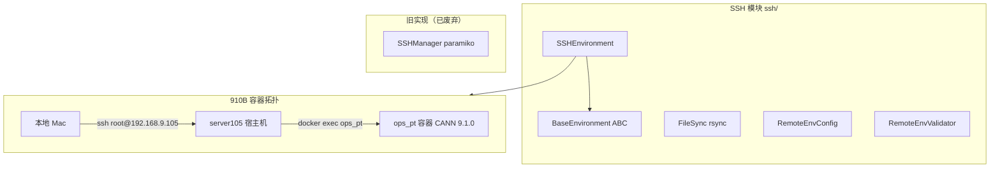

# SSH 远程开发

<!--
Copyright 2026 SimmerChan

Licensed under the Apache License, Version 2.0 (the "License");
you may not use this file except in compliance with the License.
You may obtain a copy of the License at

    http://www.apache.org/licenses/LICENSE-2.0

Unless required by applicable law or agreed to in writing, software
distributed under the License is distributed on an "AS IS" BASIS,
WITHOUT WARRANTIES OR CONDITIONS OF ANY KIND, either express or implied.
See the License for the specific language governing permissions and
limitations under the License.
-->

## 概述

SSH 模块支持通过 SSH 连接远程 Ascend 服务器进行算子开发，提供连接管理、文件同步
（rsync 增量）、命令执行和环境配置功能。910B 开发采用 `ssh -> docker exec ops_pt`
容器拓扑。

## 架构



## 910B 容器拓扑

```
本地 Mac (darwin)
  └─ ssh root@192.168.9.105         # 免密登录
       └─ server105 宿主机
            └─ docker exec ops_pt    # 开发容器（常驻）
                 ├─ 工作目录: /home/hsl/ops_agent
                 ├─ CANN: cann-9.1.0 (aarch64)
                 └─ NPU: 910B3 × 8 卡 (64G HBM/卡)
```

| 项 | 值 |
|------|------|
| SSH 登录 | `ssh root@192.168.9.105`（免密） |
| 开发容器 | `ops_pt`（docker，常驻） |
| 容器工作目录 | `/home/hsl/ops_agent` |
| CANN 版本 | cann-9.1.0，innerversion V100R001C25B114 |
| set_env.sh | `/usr/local/Ascend/ascend-toolkit/set_env.sh` |
| 芯片 | 910B3，`soc_version=Ascend910B3`，aarch64 |

> **坑**：非交互 shell（`bash -lc` / `docker exec`）不加载 CANN env。任何远程命令
> 必须显式 `source /usr/local/Ascend/ascend-toolkit/set_env.sh &&` 前置，否则
> `ASCEND_OPP_PATH` 空、`msopgen` 不在 PATH。`NpuExecutor(remote_env_setup=...)`
> 即为此设计；`container_name="ops_pt"` 时自动包装 `docker exec`。

## 核心组件

### SSHEnvironment（推荐）

基于 `BaseEnvironment` 的 SSH 实现，支持 ControlMaster 连接复用、会话快照、CWD 持久化：

```python
from ascend_op_agent.ssh.manager import SSHEnvironment

env = SSHEnvironment(
    host="192.168.9.105",
    user="root",
    port=22,
    key_path="~/.ssh/id_rsa",
    cwd="/home/hsl/ops_agent",
    timeout=300,            # 默认超时秒
    max_retries=3,
    backoff_factor=2.0,
)

env.ensure_connected()
with env:
    result = env.execute("ls -la /home/hsl/ops_agent")
    print(result.stdout)
```

**特性**：
- ControlMaster socket 连接复用（避免每次重连握手）
- 会话快照（CWD 标记持久化，跨命令保持工作目录）
- 指数退避重连

### SSHManager（已废弃）

基于 paramiko 的旧实现，支持指数退避重连：

```python
from ascend_op_agent.ssh.manager import SSHManager, create_ssh_manager_from_config

# 直接创建
manager = SSHManager(host="192.168.9.105", user="root", key_path="~/.ssh/id_rsa")

# 从配置创建（支持 ${ENV_VAR} 环境变量引用）
manager = create_ssh_manager_from_config(host="...", user="...", password="${SSH_PASSWORD}")
```

> `SSHManager` 将被 `SSHEnvironment` 替代，新代码请使用 `SSHEnvironment`。

### BaseEnvironment

环境抽象基类（`base_environment.py`），`SSHEnvironment` 继承它。定义 `execute` /
`ensure_connected` / `is_connected` 等接口，返回 `ExecuteResult`。

## 文件同步

### FileSync

使用 rsync 增量同步，支持 checksum 验证：

```python
from ascend_op_agent.ssh.sync import FileSync, SyncDirection, SyncResult

sync = FileSync(ssh_manager=env, default_remote_path="/home/hsl/ops_agent")

# 推送本地到远程
result = sync.sync(local_path="./build", remote_path="/home/hsl/ops_agent/build",
                   direction=SyncDirection.PUSH)

# 拉取远程到本地
result = sync.sync(local_path="./output", remote_path="/home/hsl/ops_agent/output",
                   direction=SyncDirection.PULL,
                   exclude_patterns=[".git", "__pycache__"])

print(result.success, result.direction, result.message)
```

`SyncDirection.PUSH`（本地 -> 远程）/ `SyncDirection.PULL`（远程 -> 本地）。
返回 `SyncResult`（success / direction / message）。

## 环境配置

### RemoteEnvConfig

远程开发环境配置，支持三种模式：

```python
from ascend_op_agent.ssh.env_config import RemoteEnvConfig, EnvironmentType, RemoteEnvValidator

# 宿主机环境（无镜像无容器）
config = RemoteEnvConfig(host="192.168.9.105", user="root", key_path="~/.ssh/id_rsa")

# 已有容器（910B 拓扑）
config = RemoteEnvConfig(
    host="192.168.9.105", user="root",
    image_name="py311-cann", container_name="ops_pt",
)

env_type = config.get_environment_type()      # HOST / AUTO_CONTAINER / EXISTING_CONTAINER
desc = config.get_environment_description()   # 人类可读描述
info = config.to_environment_info()           # EnvironmentInfo 数据对象
```

| 模式 | 条件 | 说明 |
|------|------|------|
| `HOST` | 无镜像无容器 | 宿主机环境开发 |
| `AUTO_CONTAINER` | 有镜像无容器 | 自动创建容器开发 |
| `EXISTING_CONTAINER` | 有镜像有容器 | 容器内开发（910B 拓扑） |

`RemoteEnvValidator` 校验环境配置完整性（连通性、镜像/容器存在性等）。

## 命令执行

### ExecuteResult

```python
from ascend_op_agent.ssh.base_environment import ExecuteResult

result: ExecuteResult = env.execute("python test.py")

print(result.return_code)  # 退出码
print(result.stdout)       # 标准输出
print(result.stderr)       # 标准错误
print(result.success)      # 是否成功（return_code == 0）
```

> 注：`ExecuteResult` 定义在 `base_environment.py`；旧 `CommandResult`（paramiko）
> 在 `manager.py`。`ssh/__init__.py` 同时导出两者。

### 超时控制

```python
# 默认 300 秒超时（SSHEnvironment 构造参数）
result = env.execute("long-running-command", timeout=600)
```

## 配置

在 `config.yaml` 中配置远程开发环境：

```yaml
remote:
  host: "192.168.9.105"
  user: "root"
  port: 22
  key_path: "~/.ssh/id_rsa"
  # 或使用密码（通过环境变量）
  # password: "${SSH_PASSWORD}"

  # 910B 容器拓扑
  container_name: "ops_pt"
  cann_setup: "source /usr/local/Ascend/ascend-toolkit/set_env.sh && "
```

## 故障排除

### 连接失败

```python
if not env.is_connected():
    env.ensure_connected()  # 自动重连

# 手动重连
env.cleanup()
env.connect()
```

### 认证失败

```bash
# 检查密钥权限
chmod 600 ~/.ssh/id_rsa

# 测试 SSH 连接
ssh -i ~/.ssh/id_rsa root@192.168.9.105
```

### CANN 环境未加载

```bash
# 错误：msopgen: command not found / ASCEND_OPP_PATH 空
# 原因：非交互 shell 不 source set_env.sh
# 修复：命令前显式 source
ssh root@192.168.9.105 'docker exec ops_pt bash -c "
  source /usr/local/Ascend/ascend-toolkit/set_env.sh &&
  msopgen compile -i /home/hsl/ops_agent/op_add -q
"'
```

### 文件同步失败

```python
# 检查远程目录
result = env.execute("ls -la /home/hsl/ops_agent")
env.execute("mkdir -p /home/hsl/ops_agent/build")
```
