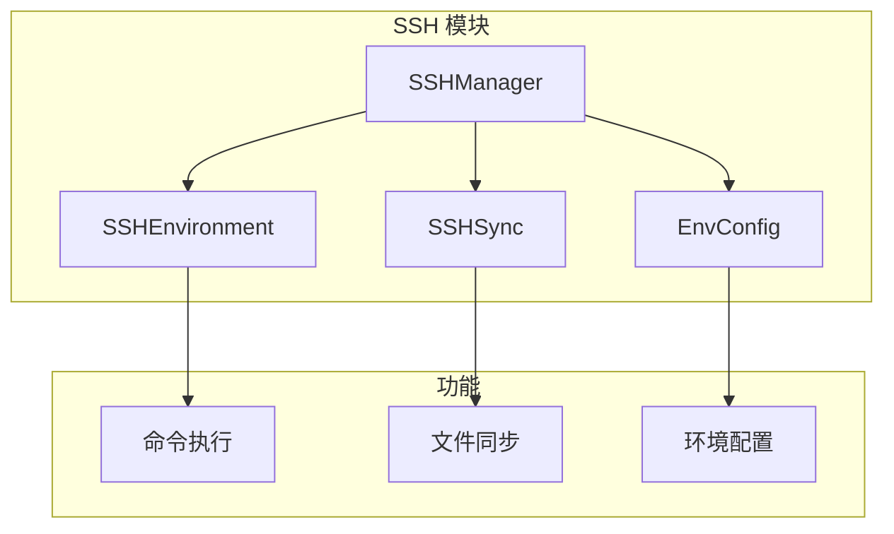

# SSH 远程开发

<!--
Copyright 2026 SimmerChan

Licensed under the Apache License, Version 2.0 (the "License");
you may not use this file except in compliance with the License.
You may obtain a copy of the License at

    http://www.apache.org/licenses/LICENSE-2.0

Unless required by applicable law or agreed to in writing, software
distributed under the License is distributed on an "AS IS" BASIS,
WITHOUT WARRANTIES OR CONDITIONS OF ANY KIND, either express or implied.
See the License for the specific language governing permissions and
limitations under the License.
-->

## 概述

SSH 模块支持通过 SSH 连接远程 Ascend 服务器进行算子开发，提供文件同步、命令执行和环境管理功能。

## 架构



## 核心组件

### SSHManager

传统 SSH 管理器（已废弃，请使用 SSHEnvironment）：

```python
from ascend_op_agent.ssh.manager import SSHManager, create_ssh_manager_from_config

# 直接创建
manager = SSHManager(
    host="192.168.1.100",
    user="root",
    port=22,
    key_path="~/.ssh/id_rsa",
)

# 从配置创建（支持环境变量引用）
manager = create_ssh_manager_from_config(
    host="192.168.1.100",
    user="root",
    password="${SSH_PASSWORD}",  # 从环境变量读取
)
```

### SSHEnvironment

新版 SSH 环境（推荐）：

```python
from ascend_op_agent.ssh.manager import SSHEnvironment

env = SSHEnvironment(
    host="192.168.1.100",
    user="root",
    key_path="~/.ssh/id_rsa",
    cwd="/workspace",
)

with env:
    result = env.execute("ls -la")
    print(result.stdout)
```

**特性：**
- ControlMaster 连接复用
- 会话快照机制
- CWD 持久化

## 文件同步

### SSHSync

```python
from ascend_op_agent.ssh.sync import SSHSync

sync = SSHSync(ssh_env=env)

# 同步本地到远程
sync.push(local_path="./build", remote_path="/workspace/build")

# 同步远程到本地
sync.pull(remote_path="/workspace/output", local_path="./output")

# 双向同步
sync.sync(local_path="./src", remote_path="/workspace/src")
```

### 同步选项

```python
sync.push(
    local_path="./build",
    remote_path="/workspace/build",
    delete=True,        # 删除远程多余文件
    exclude=[".git"],    # 排除模式
    include=["*.py"],    # 包含模式
)
```

## 环境配置

### EnvConfig

```python
from ascend_op_agent.ssh.env_config import EnvConfig

config = EnvConfig(ssh_env=env)

# 获取环境变量
cann_path = config.get("CANN_PATH")

# 设置环境变量
config.set("DEBUG", "1")

# 执行命令（带环境变量）
result = config.run_with_env("python script.py", env={"TF_CPP_MIN_LOG": "1"})
```

## 命令执行

### 执行结果

```python
from ascend_op_agent.ssh.manager import ExecuteResult

result: ExecuteResult = env.execute("python test.py")

print(result.returncode)  # 退出码
print(result.stdout)      # 标准输出
print(result.stderr)      # 标准错误
print(result.success)     # 是否成功
```

### 超时控制

```python
# 默认 300 秒超时
result = env.execute("long-running-command", timeout=600)
```

### 交互式命令

```python
# 使用 PTY
result = env.execute("top", is_tty=True)

# 管道命令
result = env.execute("cat file | grep pattern")
```

## 配置

在 `config.yaml` 中配置远程开发环境：

```yaml
remote:
  host: "192.168.1.100"
  user: "root"
  port: 22
  key_path: "~/.ssh/id_rsa"

  # 或使用密码（通过环境变量）
  # password: "${SSH_PASSWORD}"
```

## 故障排除

### 连接失败

```python
# 检查连接
if not env.is_connected():
    env.connect()

# 手动重连
env.cleanup()
env.connect()
```

### 认证失败

```bash
# 检查密钥权限
chmod 600 ~/.ssh/id_rsa

# 测试 SSH 连接
ssh -i ~/.ssh/id_rsa root@192.168.1.100
```

### 文件同步失败

```python
# 检查远程目录
result = env.execute("ls -la /workspace")

# 手动创建目录
env.execute("mkdir -p /workspace/build")
```
