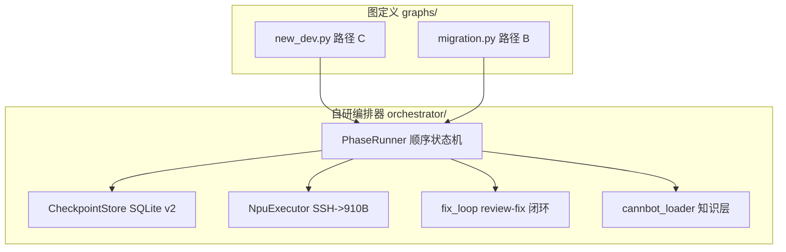

# 工作流引擎

<!--
Copyright 2026 SimmerChan

Licensed under the Apache License, Version 2.0 (the "License");
you may not use this file except in compliance with the License.
You may obtain a copy of the License at

    http://www.apache.org/licenses/LICENSE-2.0

Unless required by applicable law or agreed to in writing, software
distributed under the License is distributed on an "AS IS" BASIS,
WITHOUT WARRANTIES OR CONDITIONS OF ANY KIND, either express or implied.
See the License for the specific language governing permissions and
limitations under the License.
-->

## 概述

工作流引擎由 **自研轻量状态机编排器**（`ascend_op_agent.orchestrator`）实现，无 LangGraph
依赖。它驱动算子开发的三条路径（A/B/C），消费 cannbot-skills 作知识层，并提供 checkpoint
持久化、HITL 暂停/恢复、崩溃恢复和 910B 真编译/精度验证能力。

> **迁移说明**：旧的 `ascend_op_agent.workflow.engine` / `phases` / `adapters`（Phase0-8 六阶段）
> 已被识别为死代码并移除。`workflow/` 目录现在只保留数据契约（`models.py` / `compiler.py` /
> `performance.py`）。所有编排能力由 `orchestrator/` 提供。

## 三条路径

| 路径 | 说明 | 入口 | 状态 |
|------|------|------|------|
| **A** | 模型级选择性批量迁移 | `build_migration_graph`（规划中） | P2 规划中 |
| **B** | 单算子迁移（CUDA / Triton -> Ascend C） | `build_migration_graph(source_type=...)` | P0 ✅ |
| **C** | 单算子全新开发 | `build_new_dev_graph` | P0 ✅ |

路径 B/C 共享后端节点（design / codegen / review_fix / compile / precision / delivery）。

## 架构



## 节点流（Path-C 新开发）

`build_new_dev_graph` 构造的节点顺序（LLM 节点 + 确定性节点 + HITL）：

```
entry -> analyze -> design(HITL) -> codegen_scaffold ->
codegen_kernel -> codegen_host -> codegen_proto ->
review_fix -> compile -> precision -> delivery_mode(HITL) -> framework_adapt -> done
```

- `analyze` / `design` / `codegen_*` / `review_fix`：LLM 节点（`make_llm_node` / `make_hitl_llm_node`，`no_tools=True`）
- `codegen_scaffold`：确定性节点，内联 `add_example` 构建参考工程（CANN 环境配置）
- `design` / `delivery_mode`：HITL 节点，通过 `__interrupt__` 暂停等待用户确认
- `compile` / `precision`：可注入 `fix_loop` 包装节点（review -> fix -> re-review 闭环）；无注入时用占位节点

## 节点流（Path-B 迁移）

`build_migration_graph(source_type="cuda"|"triton")` 构造的节点顺序：

```
entry -> cuda_frontend|triton_frontend -> design(HITL) ->
codegen -> review_fix -> compile -> precision -> delivery_mode -> framework_adapt -> done
```

前端节点解析 CUDA/Triton 源码产 OpInfo（`migration_strategy`），后续节点与 Path-C 共享设计。

## 核心组件

### PhaseRunner

顺序 DAG 状态机。每个节点是 `Callable[[OpState], dict]`，返回 update dict。

```python
from ascend_op_agent.orchestrator import PhaseRunner, Node, CheckpointStore

runner = PhaseRunner(
    nodes=[Node("entry", entry_fn), Node("analyze", analyze_fn), ...],
    store=CheckpointStore("~/.ascend_op_agent/checkpoints/ck.db"),
    phase_callback=lambda phase, event, payload: print(phase, event),
)

# 启动新 thread
state = runner.invoke("实现一个 add 算子", thread_id="t1", task_type="develop")

# HITL 恢复 / 崩溃恢复
state = runner.resume("t1", payload={"approved": True})
```

**reducer 规则**（`apply_update`）：
- `messages` / `phase_history`：list append（累积，不覆盖）
- `memory_pools` / `retry_counts`：dict merge
- 其他字段：last-write-wins
- 控制字段 `__interrupt__` / `__status__` 不进 OpState

**控制字段**：
- `__interrupt__: dict` —— 触发 HITL 暂停，payload 存 `pending_approvals`，status=waiting_confirm
- `__status__: "done" | "failed"` —— 终止执行

### OpState

编排器状态（TypedDict），节点间传递的可序列化状态：

```python
from ascend_op_agent.orchestrator import OpState, initial_state

state = initial_state("t1")
# 字段：thread_id, op_info, design_doc, code_result, compile_result,
#       precision_report, delivery_mode, messages, memory_pools,
#       phase_history, retry_counts, current_phase, pending_confirmation, task_type
```

dataclass（OpInfo/DesignDoc/...）以 **dict** 形式嵌入（JSON 可序列化进 checkpoint）。
`messages` 与 `AIAgent._conversation_history` 同形，rehydrate 时零转换。

### CheckpointStore

SQLite 单文件持久化（3 表 + WAL + v1->v2 迁移）：

```python
from ascend_op_agent.orchestrator import CheckpointStore, STATUS_WAITING_CONFIRM

store = CheckpointStore("~/.ascend_op_agent/checkpoints/ck.db")
store.save("t1", state, current_phase="design", status="running")
state = store.load("t1")
store.mark_waiting("t1", "design", {"options": ["approve", "reject"]})
pending = store.consume_pending("t1")  # 读 payload + 删除 + status 回 running
```

**3 表**：
- `checkpoints` —— thread 级状态（`skill_loads_json` generated column + `schema_version`）
- `artifacts` —— 大对象索引（sha256 幂等 gate）
- `pending_approvals` —— HITL 暂存

**特性**：
- WAL + `BEGIN IMMEDIATE` + `busy_timeout=30000` 防跨进程 SQLITE_BUSY
- v1->v2 forward migration（启动期原子 ALTER）+ v2->v1 rollback（备份恢复）
- 坏 row quarantine（LRU cap 100）
- `list_pending()` / `list_all_threads()` 供 task 层聚合

### NpuExecutor

封装 CANN 工具链调用（compile + numpy diff 精度验证）：

```python
from ascend_op_agent.orchestrator import NpuExecutor

executor = NpuExecutor(
    ssh_env=ssh_env,
    remote_env_setup="source /usr/local/Ascend/ascend-toolkit/set_env.sh && ",
    container_name="ops_pt",  # 自动包装 docker exec ops_pt bash -c "..."
)
result = executor.compile(operator_path="/home/hsl/ops_agent/op_add", soc_version="Ascend910B3")
# CompileOutcome(success, command, stdout, stderr, return_code, operator_path, soc_version)
```

**910B 容器拓扑**：`ssh root@192.168.9.105 -> docker exec ops_pt -> CANN 9.1.0`。
`container_name` 非空时远程命令自动包装 `docker exec <container> bash -c "..."`。

**编译成功判定**（`_is_compile_success`）：build.sh 末尾 `[ERROR] Package not found or empty`
是已知 false negative（return_code=1 但 `.run` 产物已生成）。检测 stdout 含
`successfully created` + `.run` -> 标 success=True。

### fix_loop

闭环修复控制器（review -> fix -> re-review）：

```python
from ascend_op_agent.orchestrator import run_fix_loop, make_fix_loop_node, ReviewResult

result = run_fix_loop(
    state=state,
    kind="compile",  # "compile" / "precision"
    review_func=review_func,  # callable(state) -> ReviewResult
    fix_func=fix_func,        # callable(state, issues) -> update dict
    max_rounds=5,
)
# {"status": "done"|"failed", "rounds": int, "clean": bool, "reason": "clean"|"fatal"|"max_rounds"}
```

停止条件：review clean / fatal 不可修复信号 / max_rounds 用完。
`compress_transcript(messages, keep_last_n=4)` 压缩跨轮对话（首条 + 最近 N + 中间摘要）。

### cannbot_loader（知识层）

消费华为官方 cannbot-skills（`vendor/cannbot-skills` submodule）作知识层：

```python
from ascend_op_agent.orchestrator import build_skill_bundle, render_skill_bundle_text, SKILL_BUNDLES

# 按 (graph, phase) 查决策表加载 skill bundle
skills = build_skill_bundle(phase="codegen", graph="new_dev")
text = render_skill_bundle_text(skills, phase="codegen", inline_build_template=True)
# text 注入 PromptBuilder Layer 6 作为该阶段 cannbot 知识上下文
```

`SKILL_BUNDLES` 决策表映射 `(graph, phase) -> [skill 路径]`，例如：
- `("new_dev", "codegen")` -> `ascendc-direct-invoke-template` + `ascendc-simt-best-practices`
- `("migration", "cuda_frontend")` -> `cuda2ascend-simt`

`SkillUsageRegistry`（单例）记录每阶段加载/使用的 skill 名（signal-1 跟踪）。

## HITL 与恢复

### HITL 暂停

节点返回 `{"__interrupt__": payload}` 触发暂停：
1. PhaseRunner 把 payload 写 `state["pending_confirmation"]`
2. `CheckpointStore.mark_waiting` 存 `pending_approvals` + status=waiting_confirm
3. `resume(thread_id, payload)` 时注入 `pending_confirmation` 并重跑当前节点

### 崩溃恢复

- `resume(thread_id)` 无 pending -> 从 current_phase 的下一节点续跑（当前节点已落盘）
- `resume(thread_id)` 有 pending -> HITL 恢复，重跑当前节点

## 数据契约（workflow/ 模块）

`workflow/` 目录保留 3 个数据契约职责（旧 engine/phases/adapters 已移除）：

- `models.py` —— OpInfo / DesignDoc / CodeGenResult / CompileResult / PrecisionReport / PhaseResult 等 dataclass + serde
- `compiler.py` —— `cann_compile` subprocess 封装（确定性编译）
- `performance.py` —— `torch_npu.profiler` 性能采集

## 配置

```yaml
# ~/.ascend_op_agent/config.yaml
checkpoint:
  db_path: "~/.ascend_op_agent/checkpoints/ck.db"

remote:
  host: "192.168.9.105"
  user: "root"
  container_name: "ops_pt"        # 910B 容器拓扑
  cann_setup: "source /usr/local/Ascend/ascend-toolkit/set_env.sh && "
```

## 事件回调

```python
def phase_callback(phase: str, event: str, payload: dict) -> None:
    # event: "started" | "completed" | "interrupted" | "failed"
    print(f"[{phase}] {event} {payload}")

runner = PhaseRunner(nodes=..., store=store, phase_callback=phase_callback)
```

backend 层（`AgentAsyncWrapper`）注入回调，转发为 `agent.progress` JSON-RPC 通知给前端。
