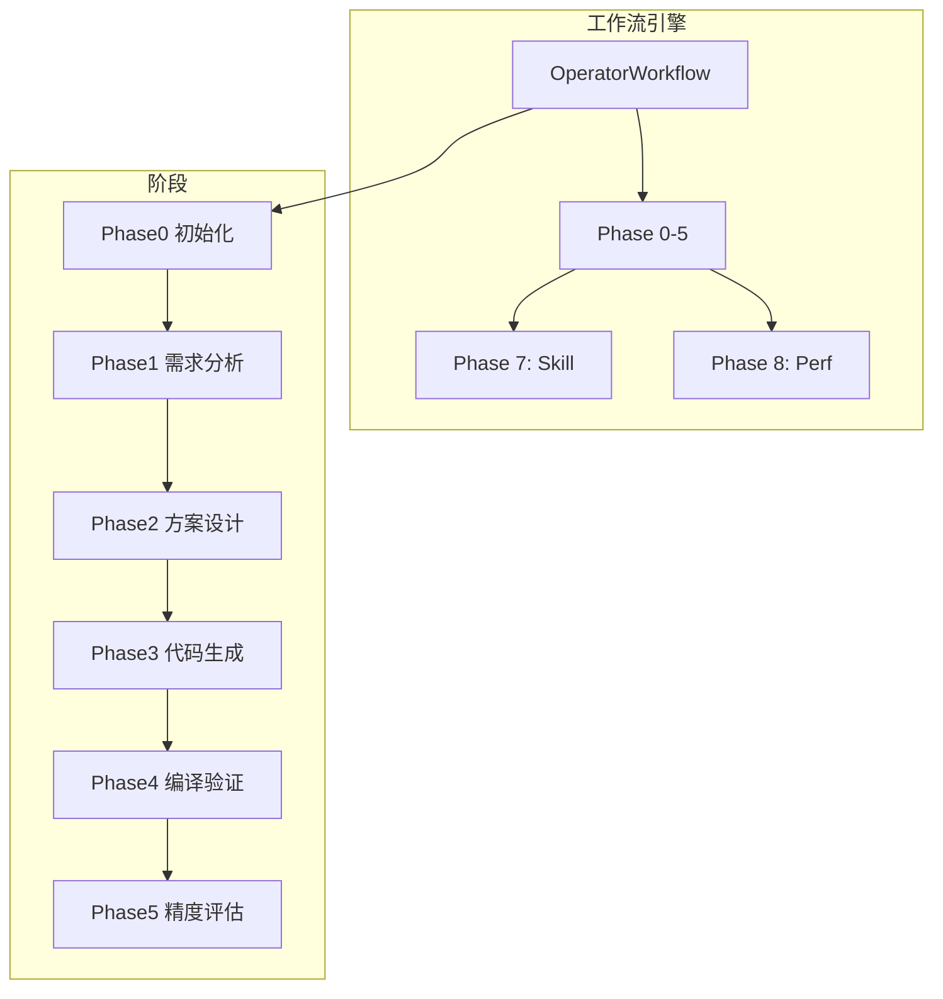

# 工作流引擎

<!--
Copyright 2026 SimmerChan

Licensed under the Apache License, Version 2.0 (the "License");
you may not use this file except in compliance with the License.
You may obtain a copy of the License at

    http://www.apache.org/licenses/LICENSE-2.0

Unless required by applicable law or agreed to in writing, software
distributed under the License is distributed on an "AS IS" BASIS,
WITHOUT WARRANTIES OR CONDITIONS OF ANY KIND, either express or implied.
See the License for the specific language governing permissions and
limitations under the License.
-->

## 概述

工作流引擎实现六阶段算子开发流程（Phase0-5），支持自动化算子开发、编译验证和精度评估。

## 架构



## 阶段说明

### Phase 0: 初始化

环境检测和设置：

```python
from ascend_op_agent.workflow.phases import Phase0

phase = Phase0(workflow_context)
result = await phase.execute()
# result = {"status": "ready", "environment": {...}}
```

### Phase 1: 需求分析

自动分析算子需求：

```python
from ascend_op_agent.workflow.phases import Phase1

phase = Phase1(workflow_context)
result = await phase.execute({
    "requirement": "实现一个 1024x1024 的 MatMul 算子"
})
# result = {"analysis": {...}, "spec": {...}}
```

### Phase 2: 方案设计

架构和 tiling 策略设计（需用户确认）：

```python
from ascend_op_agent.workflow.phases import Phase2

phase = Phase2(workflow_context)
design = await phase.execute({"spec": spec})

# 等待用户确认
user_approved = await phase.wait_confirmation()
if user_approved:
    await phase.proceed()
```

### Phase 3: 代码生成

生成 AscendC/CATLASS/Triton 代码：

```python
from ascend_op_agent.workflow.phases import Phase3

phase = Phase3(workflow_context)
result = await phase.execute({
    "design": design,
    "language": "ascendc"  # ascendc, catlass, triton
})
# result = {"files": {...}, "code": {...}}
```

### Phase 4: 编译验证

自动编译和修复错误：

```python
from ascend_op_agent.workflow.phases import Phase4

phase = Phase4(workflow_context)
result = await phase.execute({
    "code": code,
    "max_attempts": 3  # 最多尝试3次
})
# result = {"status": "success", "build_log": "..."}
```

### Phase 5: 精度评估

验证精度（≥30 测试用例）：

```python
from ascend_op_agent.workflow.phases import Phase5

phase = Phase5(workflow_context)
result = await phase.execute({
    "kernel": kernel,
    "test_cases": 30  # 最小30个用例
})
# result = {"accuracy": 0.9999, "passed": 30, "failed": 0}
```

### Phase 7: Skill 保存

保存经验到知识库：

```python
from ascend_op_agent.workflow.phills import Phase7

phase = Phase7(workflow_context)
result = await phase.execute({
    "skill_name": "matmul-optimized",
    "tags": ["matmul", "performance"],
    "auto": False  # 手动确认
})
```

### Phase 8: 性能报告

生成性能基准：

```python
from ascend_op_agent.workflow.phases import Phase8

phase = Phase8(workflow_context)
report = await phase.execute({
    "kernel": kernel,
    "benchmarks": ["throughput", "latency"]
})
```

## 核心组件

### OperatorWorkflow

```python
from ascend_op_agent.workflow.engine import OperatorWorkflow

workflow = OperatorWorkflow(
    mode="local",  # local, remote
    workspace="./workspace"
)

# 执行完整工作流
async for progress in workflow.run(requirement):
    print(f"Phase {progress.phase}: {progress.status}")

# 或分阶段执行
await workflow.phase0()
await workflow.phase1()
```

### WorkflowEngine

```python
from ascend_op_agent.workflow.engine import WorkflowEngine

engine = WorkflowEngine()

# 添加阶段
engine.add_phase(Phase0())
engine.add_phase(Phase1())

# 执行
result = await engine.execute(context)
```

### WorkflowContext

```python
from ascend_op_agent.workflow.models import WorkflowContext

context = WorkflowContext(
    requirement="MatMul 算子",
    mode="local",
    workspace="./workspace"
)

# 存储数据
context.set("phase0_result", result)
context.get("phase0_result")
```

## 数据模型

### WorkflowContext

```python
@dataclass
class WorkflowContext:
    requirement: str
    mode: str  # "local" | "remote"
    workspace: Path

    # 阶段结果
    phase_results: dict[str, Any]

    # 用户确认状态
    confirmations: dict[str, bool]
```

### PhaseResult

```python
@dataclass
class PhaseResult:
    phase: str
    status: str  # "success" | "failed" | "pending"
    data: dict[str, Any]
    error: Optional[str]
```

## 工作流适配器

### CompilerAdapter

```python
from ascend_op_agent.workflow.adapters import CompilerAdapter

compiler = CompilerAdapter(workspace)

# 编译
result = await compiler.compile(
    source="kernel.cu",
    target="ascend",
    options=["-O3", "-std=c++17"]
)
```

### PerformanceAdapter

```python
from ascend_op_agent.workflow.adapters import PerformanceAdapter

perf = PerformanceAdapter(workspace)

# 性能测试
result = await perf.benchmark(
    kernel="matmul",
    input_shape=[1024, 1024],
    warmup=10,
    iterations=100
)
```

## 配置

```yaml
workflow:
  mode: "local"  # local, remote

  workspace: "./workspace"

  phases:
    phase2:
      auto_confirm: false  # 需要用户确认
    phase4:
      max_attempts: 3
    phase5:
      min_test_cases: 30
```

## 事件和回调

```python
workflow = OperatorWorkflow(...)

# 阶段开始
workflow.on_phase_start += lambda phase: print(f"开始 {phase}")

# 阶段完成
workflow.on_phase_complete += lambda phase, result: print(f"完成 {phase}")

# 错误
workflow.on_error += lambda phase, error: print(f"错误 {phase}: {error}")

# 全部完成
workflow.on_complete += lambda: print("工作流完成")
```
