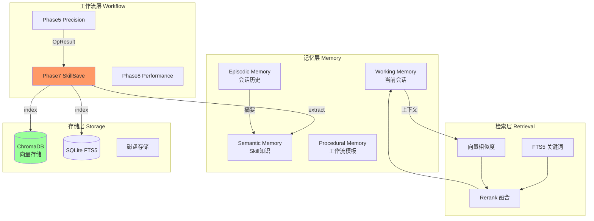
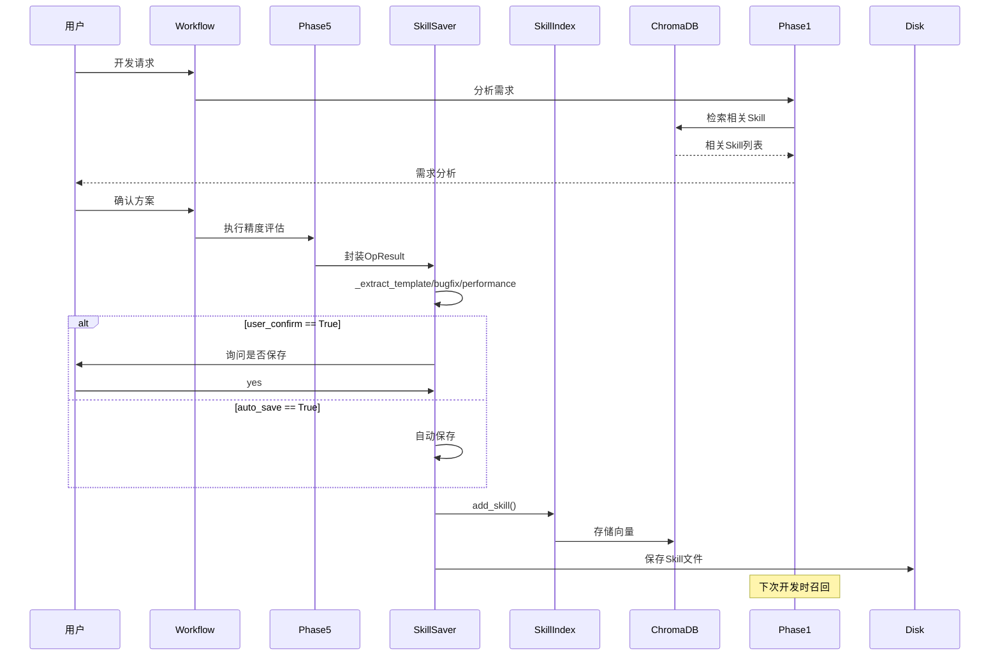
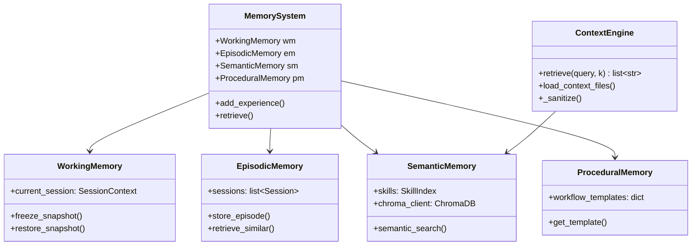

# 自改进闭环能力重构计划

## Overview

将 Ascend Op Agent 的自改进闭环从"半成品状态"重构为真正可用的系统。当前实现中，Skill 提取和存储机制已具备，但向量检索缺失、Workflow 闭环未完成、记忆系统过于简单。与 Hermes Agent 相比存在较大架构差距。

## Problem Frame

**现状问题**:
- `MemoryStore` 仅是内存 Dict，无向量存储、无语义检索
- `SkillIndex` 只有 FTS5 关键词匹配，无向量相似度搜索
- `ContextEngine.retrieve()` 是 TODO 空实现
- Phase7/8 仅存在于文档，无实际代码
- 自改进闭环未真正闭合（SkillSaver 未集成到 Workflow）

**参考差距** (Hermes):
- 记忆系统: 多层级 (Episodic/Semantic/Working/Procedural) + 向量数据库
- 技能系统: 向量+FTS5 混合检索 + LLM 增强召回
- 搜索能力: 语义理解 + 同义词处理 + 上下文感知推荐

## Requirements Trace

- R7: 技能保存阶段 (自动询问、混合维度组织、发布PR)
- R9: Skill仓库管理 (官方+私有+本地、多仓库支持)
- R7.4: 技能自动注入复用 (Agent自动识别并注入相关经验)
- R7.5: 用户选择no时不保存，直接完成

## Scope Boundaries

**In Scope**:
- 向量数据库集成 (ChromaDB)
- 记忆系统分层重构
- Phase7/8 完整实现
- Skill自动触发保存机制
- 语义搜索能力增强

**Out of Scope**:
- 多记忆后端插件化：将在 v2.0 评估（触发条件：MemorySystem 稳定运行 3 个月）
- LLM 增强的跨会话召回：若未来需要，将通过外部 LLM MCP 服务集成，不在本系统内实现
- 外部 MCP 服务器集成：已在 `mcp/lifecycle.py` 中实现，本计划不涉及

## Key Technical Decisions

### Decision 1: 向量数据库选择 ChromaDB

**决策**: 使用 ChromaDB 作为向量数据库，与现有 SQLite FTS5 形成双存储架构
**理由**:
- ChromaDB 存储**向量** (Skill content embedding, 记忆 embedding)
- SQLite FTS5 存储**标量** (Skill name, description, tags, metadata)
- 两者互补：向量处理语义相似度，FTS5 处理精确关键词匹配
- ChromaDB 支持内嵌模式，初期无需外部服务

**数据分离**:
- ChromaDB: `skills` collection 存储 Skill 内容的向量表示
- SQLite FTS5: 存储 Skill 的结构化数据（已有实现，保留）
- 检索时：先用 FTS5 粗筛，再用向量精排

**数据一致性保证**:
- Skill 保存顺序：先写 ChromaDB → 再写 SQLite FTS5
- ChromaDB 写入成功但 FTS5 失败时：回滚 ChromaDB，抛出异常
- ChromaDB 写入失败时：直接返回失败，不写 FTS5
- 版本号机制：两处存储均记录 skill 版本，查询时校验一致性

**替代方案考虑**:
- Milvus/Qdrant: 需要外部服务，开发复杂度高，不适合本地开发场景
- FAISS: 缺少持久化层，需要额外封装
- Pgvector: 需要 PostgreSQL，引入额外依赖

### Decision 2: 记忆系统分层与现有 MemoryStore 兼容

**决策**: 在现有 `MemoryStore` 基础上扩展为四层记忆，与原接口保持兼容

**与现有 MemoryStore 的映射**:
| 现有 Pool | 新层级 | 说明 |
|-----------|--------|------|
| `memory` | Working Memory | 当前会话上下文，复用现有实现 |
| `user` | Working Memory (偏好) | 用户偏好，并入 Working Memory |
| 新增 | Episodic Memory | 完整会话存储（摘要作为可选项） |
| 新增 | Semantic Memory | Skill 知识向量，与 SkillIndex 协同 |
| 新增 | Procedural Memory | 场景化工作流模板（非 Phase 序列） |

**Episodic Memory 策略明确**:
- 主存储：完整会话记录到 ChromaDB
- 摘要提取：作为**可选项**，需用户主动触发（`memory.summarize_episodes: true`）
- 摘要触发：会话超过 50 条消息或 token 超 4K（仅当 summarize_episodes=true 时）

**演进策略**:
- Phase 1: 保持 `MemoryStore` 接口，内部扩展
- Phase 2: 逐步引入 Episodic/Semantic Memory
- Phase 3: Procedural Memory 与 Workflow 模板同步

**Procedural Memory 对齐**:
- Procedural Memory 存储**场景化工作流模板**（不是运行时 Phase 序列）
- 模板来源：从成功开发会话中提取的典型模式（如"GPU MatMul 迁移流程"）
- 自定义模板存储在 `workflow/templates/`
- `OperatorWorkflow` 的 Phase 序列是默认执行路径，不是模板存储

**迁移策略**:
- 阶段 1: `MemoryStoreAdapter` 包装 `MemorySystem`，保持 `MemoryStore` 接口兼容
- 阶段 2: 逐步将 `AgentCore` 调用迁移到 `MemorySystem`
- 阶段 3: 移除适配器，完成完整迁移

### Decision 3: Phase7 触发机制与配置

**决策**: Phase5 完成后触发 Skill 保存，支持 auto_save 和 user_confirm 两种模式

**触发状态机**:
```
Phase5 完成
    │
    ├─► success == True && compile_errors 为空
    │       → 触发 TEMPLATE + PERFORMANCE 提取
    │
    ├─► success == True && compile_errors 不为空
    │       → 触发 TEMPLATE + BUGFIX + PERFORMANCE 提取
    │
    └─► success == False
            → 仅提取 BUGFIX（从 compile_errors）
            → 不提取 TEMPLATE（代码未经验证）

    提取过程异常（如 LLM 不可用）→ 记录错误，跳过保存
```

**配置项** (在 `config.yaml` 或环境变量):
```yaml
skill_saver:
  auto_save: false          # true=自动保存, false=询问用户
  user_confirm: true       # 是否询问用户（auto_save=false时生效）
  dimensions:              # 保存哪些维度（与状态机协同）
    - template
    - bugfix
    - performance

memory:
  vector_db_path: ~/.ascend_op_agent/vector_db  # ChromaDB 数据路径
  embedding_model: sentence-transformers/all-MiniLM-L6-v3  # 向量模型
  embedding_dim: 384  # 向量维度（从模型自动推导，可手动覆盖）
```

**配置与状态机的协同**:
- dimensions 配置是最终过滤层：即使状态机触发某维度，若 dimensions 中不包含则跳过
- 例：若 dimensions 为 `[template]`，状态机触发 TEMPLATE+PERFORMANCE 时只提取 TEMPLATE
- 提取过程异常（如 embedding 模型不可用）→ 记录错误，跳过保存，使用 FTS5 回退

**与 R7.5 的关系**:
- `auto_save: false` + `user_confirm: true` → 用户可选择 no（符合 R7.5）
- `auto_save: true` → 自动保存，无需用户确认
- 默认行为：`auto_save: false, user_confirm: true`（询问但不强制）

### Decision 4: 三层搜索架构与入口

**决策**: FTS5 + 向量 + Rerank 三阶段搜索，明确入口分离

**搜索入口分离**:
| 入口 | 方法 | 用途 |
|------|------|------|
| Skill 检索 | `SkillIndex.hybrid_search(query, k)` | 检索可复用的 Skill |
| 上下文补充 | `ContextEngine.retrieve(query, k)` | 为当前任务补充相关记忆 |
| Phase1 历史借鉴 | `MemorySystem.retrieve_similar(query)` | 查找类似任务的解决经验 |

**三层搜索流程**:
1. **Phase 1 - FTS5 关键词匹配** (已有): `skills MATCH ?` → BM25 排序 → top-N 候选
2. **Phase 2 - 向量相似度召回**: 对候选计算向量相似度 → top-K 重排
3. **Phase 3 - 结果融合**: 加权融合 FTS 分数和向量分数 → 最终排序
- 默认权重: α=0.4 (FTS) + β=0.6 (向量)
- 分数归一化: 将 FTS BM25 和向量相似度分别归一化到 [0,1]
- 可通过配置调整权重比例

**Embedding 模型选型**:
- 模型: `sentence-transformers/all-MiniLM-L6-v3` (384 维)
- 理由: 轻量级 (80MB)，效果好，适合本地场景
- 首次使用自动下载，缓存到 `~/.cache/huggingface/`
- 向量维度: 384 (固定，不可配置)

**与现有接口的关系**:
- `SkillIndex.search()` → 保留为兼容接口，内部调用 `hybrid_search()`
- `SkillIndex.hybrid_search(query, k)` → 对外唯一入口，实现 FTS5+向量两阶段搜索
- `ContextEngine.retrieve()` → 重实现，调用 `MemorySystem.retrieve()`

## High-Level Technical Design

### 整体架构



### 闭环流程



### 记忆系统分层



## Implementation Units

### Phase 1: 向量数据库集成

- [ ] **Unit 1.1: ChromaDB 集成**

**Goal:** 建立向量存储基础设施

**Requirements:** R9, R7.4

**Dependencies:** None

**Files:**
- Create: `src/ascend_op_agent/memory/vector_store.py`
- Modify: `pyproject.toml` (添加 chromadb 依赖)
- Test: `tests/unit/memory/test_vector_store.py`

**Approach:**
- 集成 ChromaDB 客户端
- 实现 Collection 管理 (skills, memories)
- 支持内嵌模式，无需外部服务

**Patterns to follow:**
- `skills/index.py` 中的缓存模式

**Test scenarios:**
- 初始化 ChromaDB 客户端
- 创建/获取 Collection
- 添加/查询向量

**Verification:**
- 单元测试通过
- 可以存储和检索向量

---

- [ ] **Unit 1.2: Skill 向量索引**

**Goal:** Skill 内容可向量检索

**Requirements:** R7.4

**Dependencies:** Unit 1.1

**Files:**
- Modify: `src/ascend_op_agent/skills/index.py`
- Create: `tests/unit/skills/test_vector_index.py`

**Approach:**
- Skill 保存时同步存储向量到 ChromaDB
- 实现 `search_by_vector()` 方法
- 混合检索: FTS5 + 向量

**Test scenarios:**
- Skill 添加时同步向量
- 语义搜索召回相关 Skill
- FTS5 + 向量混合排序

**Verification:**
- `SkillIndex.search()` 支持向量检索
- 语义相似度结果合理

---

### Phase 2: 记忆系统分层重构

- [ ] **Unit 2.1: WorkingMemory 重构**

**Goal:** 增强当前会话记忆能力

**Requirements:** R1 (会话初始化)

**Dependencies:** None

**Files:**
- Modify: `src/ascend_op_agent/agent/memory.py`
- Create: `tests/unit/agent/test_working_memory.py`

**Approach:**
- 保持现有 `MemoryStore` 接口
- 内部重构为 WorkingMemory 实现
- 添加上下文压缩 (当记忆超长时)

**Patterns to follow:**
- `agent/memory.py` 现有接口

**Test scenarios:**
- 基本 add/get 操作
- 上下文超长时压缩
- freeze/restore 快照

**Verification:**
- 现有测试兼容
- 上下文压缩正常工作

---

- [ ] **Unit 2.2: EpisodicMemory 实现**

**Goal:** 会话历史可追溯

**Requirements:** R7.4

**Dependencies:** Unit 1.1

**Files:**
- Create: `src/ascend_op_agent/memory/episodic_memory.py`
- Create: `tests/unit/memory/test_episodic.py`

**Approach:**
- 完整会话存储到 ChromaDB（主存储策略）
- 摘要提取作为可选项（需 `memory.summarize_episodes: true`）
- 摘要触发：会话超过 50 条消息或 token 超 4K
- 相似会话检索基于完整记录（不依赖摘要）

**Test scenarios:**
- 保存完整会话
- 提取会话摘要
- 检索相似会话

**Verification:**
- 会话可完整保存和召回
- 摘要保留关键信息

---

- [ ] **Unit 2.3: SemanticMemory 实现**

**Goal:** Skill 知识语义检索

**Requirements:** R7.4

**Dependencies:** Unit 1.2

**Files:**
- Create: `src/ascend_op_agent/memory/semantic_memory.py`
- Modify: `src/ascend_op_agent/agent/context.py`
- Create: `tests/unit/memory/test_semantic.py`

**Approach:**
- 基于 SkillIndex 构建语义层
- ChromaDB 存储 Skill 向量
- 支持按场景/类型/标签检索

**Test scenarios:**
- Skill 语义索引构建
- 场景化检索 (如"寻找 MatMul 算子经验")
- 多维度筛选

**Verification:**
- SemanticMemory.semantic_search() 可基于 SkillIndex 检索
- 语义检索结果可传入 ContextEngine
- ChromaDB 向量存储正确（Unit 1.2 成果）

---

- [ ] **Unit 2.4: MemorySystem 整合**

**Goal:** 统一记忆接口

**Requirements:** R7.4

**Dependencies:** Units 2.1, 2.2, 2.3

**Files:**
- Create: `src/ascend_op_agent/memory/system.py`
- Modify: `src/ascend_op_agent/agent/core.py`
- Create: `tests/unit/memory/test_system.py`

**Approach:**
- `MemorySystem` 类整合四层记忆
- 统一 `retrieve()` 接口
- 自动路由到合适记忆层

**Test scenarios:**
- 多层记忆协同检索
- 记忆添加触发索引更新
- 会话切换保持记忆一致

**Verification:**
- Agent 可跨会话利用历史经验

---

### Phase 3: Phase7/8 完整实现

- [ ] **Unit 3.1: Phase7 SkillSaver 集成**

**Goal:** 自改进闭环真正闭合

**Requirements:** R7, R7.4

**Dependencies:** Unit 1.2 (Skill 向量索引)
- 完整语义召回依赖 Unit 2.3 (SemanticMemory)
- 与 Unit 2.4 (MemorySystem 整合层) 解耦：可独立完成 Skill 保存功能

**Files:**
- Modify: `src/ascend_op_agent/workflow/phases.py`
- Modify: `src/ascend_op_agent/workflow/engine.py`
- Create: `tests/integration/workflow/test_phase7.py`

**Approach:**
- Phase5 完成后触发 `OpResult` 封装
- 根据配置 (`auto_save` / `user_confirm`) 决定保存行为
- SkillSaver 三维度提取自动执行
- Phase7 依赖 Unit 1.2（Skill 向量索引），与 Unit 2.4（MemorySystem 整合层）解耦
- 完整语义召回需等 Unit 2.3 (SemanticMemory) 完成

**触发集成方式**:
- 在 `OperatorWorkflow.run()` 的 Phase5 yield 后增加 Phase7 处理
- 新增 `Phase7SkillSave` 类，继承 Phase 基类
- `context['op_result']` 存储 Phase5 输出，Phase7 读取并传递给 SkillSaver
- Phase7 执行完成后重新 yield 回主流程

**Patterns to follow:**
- `workflow/phases.py` Phase 结构
- `workflow/skill_save.py` 提取逻辑

**Test scenarios:**
- Phase5 完成后自动触发保存
- 用户选择 yes/no 正确处理
- auto_save 模式正常工作

**Verification:**
- 成功开发的算子自动保存为 Skill
- Skill 可被后续开发召回

---

- [ ] **Unit 3.2: Phase8 性能评测**

**Goal:** 性能数据自动收集

**Requirements:** R5.4 (性能报告)

**Dependencies:** Unit 3.1

**Files:**
- Create: `src/ascend_op_agent/workflow/phase8.py`
- Modify: `src/ascend_op_agent/workflow/engine.py`
- Create: `tests/integration/workflow/test_phase8.py`

**Approach:**
- Phase8 专门处理**性能基准测试**（Phase5 关注精度评估）
- Phase8 收集：延迟(ms)、吞吐(GFLOPS)、内存占用(MB)
- Phase7 可选触发 Phase8（取决于 `skill_saver.dimensions` 是否包含 performance）
- 生成与 Phase5 PrecisionReport 格式不同的独立性能报告

**Test scenarios:**
- Phase8 正常执行
- 性能数据收集完整
- 报告格式正确

**Verification:**
- 性能报告包含延迟/吞吐/内存指标

---

### Phase 4: 搜索增强

- [ ] **Unit 4.1: 混合检索实现**

**Goal:** FTS5 + 向量混合搜索

**Requirements:** R7.4

**Dependencies:** Units 1.2, 2.3

**Files:**
- Modify: `src/ascend_op_agent/skills/index.py`
- Create: `tests/unit/skills/test_hybrid_search.py`

**Approach:**
- 实现 `hybrid_search()` 方法
- FTS5 和向量结果融合
- 基于相关性的重排算法

**Test scenarios:**
- 混合搜索结果质量
- 多关键词 + 语义组合
- 结果相关性验证

**Verification:**
- 搜索结果同时包含字面匹配和语义相似

---

- [ ] **Unit 4.2: ContextEngine 修复**

**Goal:** 实现 TODO 的 retrieve()

**Requirements:** R2.3 (需求分析参考历史)

**Dependencies:** Unit 4.1

**Files:**
- Modify: `src/ascend_op_agent/agent/context.py`
- Create: `tests/unit/agent/test_context.py`

**Approach:**
- 基于混合检索实现 retrieve()
- 支持按场景/类型过滤
- 缓存检索结果

**Test scenarios:**
- 相似算子经验召回
- 上下文相关的 Skill 推荐
- 多轮对话中的记忆利用

**Verification:**
- Phase1 需求分析可利用历史经验

---

### Phase 5: 收尾与测试

- [ ] **Unit 5.1: 端到端集成测试**

**Goal:** 完整自改进闭环验证

**Requirements:** SC1, SC2

**Dependencies:** Units 3.1, 3.2, 4.2

**Files:**
- Create: `tests/integration/test_self_improvement_loop.py`
- Modify: `tests/conftest.py`

**Approach:**
- 模拟完整开发流程
- 验证 Skill 保存和召回
- 测试记忆跨会话

**Test scenarios:**
- 算子开发 → 自动保存 Skill
- 新会话检索历史 Skill
- 性能报告生成

**Verification:**
- 完整闭环正常工作

---

- [ ] **Unit 5.2: 文档更新**

**Goal:** 更新 SOUL.md 和 README

**Requirements:** None

**Dependencies:** All units

**Files:**
- Modify: `SOUL.md`
- Modify: `docs/architecture.md` (如存在)

**Approach:**
- 更新 Phase7/8 描述
- 更新自改进闭环文档
- 添加新架构图

**Verification:**
- 文档与实现一致

---

## System-Wide Impact

- **Workflow Engine**: Phase7/8 集成影响 `engine.py` 和 `phases.py`
  - `OperatorWorkflow.__init__` 中添加 `Phase7SkillSave` 和 `Phase8Performance`
  - Phase5 完成后，通过 `yield` 机制进入 Phase7
  - 新增 `context.post_phase_results` 用于 Phase 间数据传递
- **Agent Core**: 记忆系统变化影响 `core.py` 的 prompt 组装
  - `MemorySystem` 替代 `MemoryStore` 作为记忆提供方
  - `format_for_system_prompt()` 扩展支持四层记忆
- **Skill System**: 向量索引变化影响存储和检索接口
  - `SkillStorage` 配合 ChromaDB 同步存储向量
  - `SkillIndex.search()` 扩展为 `hybrid_search()` 入口
- **Config**: 新增配置项:
  ```yaml
  skill_saver:
    auto_save: false
    user_confirm: true
    dimensions: [template, bugfix, performance]
  memory:
    vector_db_path: ~/.ascend_op_agent/vector_db
    embedding_model: sentence-transformers/all-MiniLM-L6-v3
  ```

## Risks & Dependencies

| Risk | Mitigation |
|------|------------|
| ChromaDB 版本兼容性 | 锁定版本号，CI 测试 |
| 向量检索质量不足 | FTS5 回退机制保留 |
| Phase7 影响开发流程 | 配置开关，默认询问 |
| 记忆膨胀 | 定期清理 + 摘要压缩 |
| 首次启动 embedding 模型下载延迟 | 异步下载，下载期间显示进度提示 |
| ChromaDB 内嵌模式并发写入限制 | 应用层写入队列化，或升级到 Client-Server 模式 |
| Skill 版本管理（同一算子多次开发） | 新版本追加，旧版本标记为 deprecated |

## Phased Delivery

### Phase 1 (Vector DB Integration)
- **Goal**: 基础设施就绪
- **Delivery**: ChromaDB 集成 + Skill 向量索引

### Phase 2 (Memory Layer)
- **Goal**: 记忆系统分层完成
- **Delivery**: Working/Episodic/Semantic/Procedural Memory

### Phase 3 (Phase7/8)
- **Goal**: 闭环真正闭合
- **Delivery**: Skill 保存自动触发 + 性能报告

### Phase 4 (Search Enhancement)
- **Goal**: 搜索能力增强
- **Delivery**: 混合检索 + ContextEngine 实现

### Phase 5 (Verification)
- **Goal**: 可验证可用
- **Delivery**: 端到端测试 + 文档

## Documentation Plan

- `docs/architecture/self-improvement-loop.md` - 自改进闭环架构文档
- `docs/skills/management.md` - Skill 管理文档
- `SOUL.md` - 更新 Phase7/8 描述

## Operational / Rollout Notes

- 新增配置项需在 `config.yaml` 示例中添加
- ChromaDB 数据默认存储在 `~/.ascend_op_agent/vector_db/`
- 向量维度使用 384 (all-MiniLM-L6-v3)
- 首次使用自动下载 embedding 模型

## Sources & References

- **Origin document:** [docs/brainstorms/2026-04-29-ascend-op-from-scratch-workflow-requirements.md](docs/brainstorms/2026-04-29-ascend-op-from-scratch-workflow-requirements.md)
- **Hermes reference:** `agent/memory_manager.py`, `hermes_state.py`
- **Current implementation:**
  - `agent/memory.py` - 现有记忆存储
  - `skills/index.py` - Skill 索引
  - `workflow/skill_save.py` - 技能提取
  - `workflow/phases.py` - Phase 定义
  - `agent/context.py` - 上下文检索 (TODO)