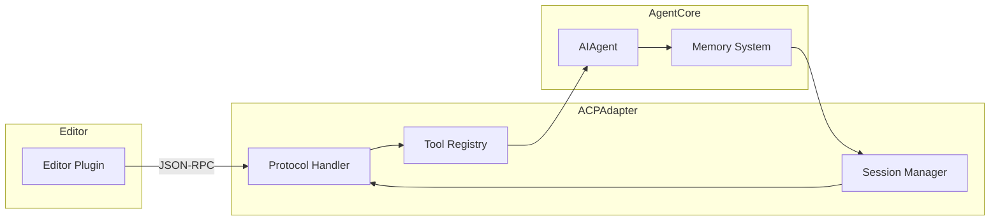

# ACP 编辑器集成

## Overview

为 Ascend Op Agent 添加 ACP（Agent Client Protocol）适配器，使其可以作为 VS Code、Zed、JetBrains 等编辑器的 AI 后端运行。通过 `ascend-op-agent acp` 命令启动，使用 JSON-RPC 2.0 通过 stdio 通信。

## Problem Frame

目前 Ascend Op Agent 只支持 TUI 交互模式（双进程架构），无法直接作为编辑器的 AI 助手后端集成。参考 Hermes Agent 的 `acp_adapter/` 设计，需要实现类似的编辑器集成能力，让开发者可以在自己喜欢的编辑器中直接使用 Ascend Op Agent。

## Requirements Trace

- R1. 支持通过 `ascend-op-agent acp` 命令启动 ACP 服务模式
- R2. 实现与主流编辑器的 JSON-RPC 2.0 通信协议
- R3. 支持编辑器特定的工具调用（如代码补全、诊断等）
- R4. 保持与现有 TUI 模式后端共享相同的 Agent 核心

## Scope Boundaries

**包含：**
- ACP 适配器模块开发
- JSON-RPC 通信协议扩展
- 编辑器工具调用处理
- ACP 启动命令 CLI 集成

**不包含：**
- 编辑器插件开发（VS Code、Zed 等各自的插件）
- 编辑器特定 UI 功能
- 远程 ACP 模式（网络通信）

## Context & Research

### Relevant Code and Patterns

- `src/ascend_op_agent/backend/rpc/protocol.py` - 现有 JSON-RPC 2.0 协议实现
- `src/ascend_op_agent/backend/rpc/server.py` - 现有 RPC 服务端实现
- `src/ascend_op_agent/backend.py` - Python 后端入口，TUI 模式使用
- `src/ascend_op_agent/agent/core.py` - AIAgent 核心，需要复用
- `src/ascend_op_agent/backend/rpc/agent_service.py` - Agent 异步封装

### Architecture

```
# ACP 模式架构
Editor (VS Code/Zed/JetBrains)
    │
    │ stdio JSON-RPC
    ▼
ascend-op-agent acp (Python 进程)
    │
    ├── ACPAdapter (新建: acp/adapter.py)
    │     ├── 编辑器协议解析
    │     ├── 工具调用路由
    │     └── 状态管理
    │
    └── AgentCore (复用现有 AIAgent)
          ├── ToolRegistry
          ├── ContextEngine
          └── MemorySystem
```

### Key Technical Decisions

1. **共用现有 RPC 基础设施 vs 独立实现**：
   - 选择：扩展现有 `backend/rpc/` 模块
   - 理由：减少代码重复，协议已实现

2. **stdio vs TCP Socket**：
   - 选择：stdio（与 TUI 模式一致）
   - 理由：所有主流编辑器 ACP 实现都使用 stdio

3. **工具调用协议 vs 完整 ACP 协议**：
   - 选择：实现完整的 Agent Client Protocol 1.0
   - 理由：与 Hermes Agent 保持兼容，便于生态集成

## High-Level Technical Design

> *This illustrates the intended approach and is directional guidance for review, not implementation specification.*

### ACP 协议结构



### 核心方法

| 方法 | 方向 | 描述 |
|------|------|------|
| `initialize` | Editor→Agent | 初始化会话，传递客户端能力 |
| `agent.run` | Editor→Agent | 运行 Agent 对话 |
| `tools/list` | Editor→Agent | 列出可用工具 |
| `tools/call` | Editor→Agent | 调用工具 |
| `agent/compose` | Editor→Agent | 发送组合消息 |
| `notifications/status` | Agent→Editor | 推送状态更新 |

### 与 TUI 模式共享

- `backend/rpc/protocol.py` - 共用 JSON-RPC 编解码
- `backend/rpc/server.py` - 共用 RPC 服务器框架
- `backend/rpc/agent_service.py` - 共用 Agent 异步封装

## Implementation Units

- [ ] **Unit 1: 创建 ACP 适配器模块结构**

**Goal:** 创建 `src/ascend_op_agent/acp/` 目录结构和基础文件

**Requirements:** R1, R4

**Dependencies:** None

**Files:**
- Create: `src/ascend_op_agent/acp/__init__.py`
- Create: `src/ascend_op_agent/acp/adapter.py`
- Create: `src/ascend_op_agent/acp/protocol.py`
- Create: `src/ascend_op_agent/acp/session.py`

**Approach:**
- 参考 Hermes Agent 的 `acp_adapter/` 设计
- 使用现有 `backend/rpc/` 基础设施进行扩展
- 适配器模式隔离编辑器协议与 Agent 核心

**Patterns to follow:**
- `src/ascend_op_agent/backend/rpc/server.py` - RPC 服务器模式
- `src/ascend_op_agent/backend/rpc/protocol.py` - JSON-RPC 协议

**Test scenarios:**
- 模块导入成功
- 适配器实例化成功

**Verification:**
- `python -c "from ascend_op_agent.acp import ACPAdapter; a = ACPAdapter()"` 无错误

---

- [ ] **Unit 2: 实现 ACP 协议处理器**

**Goal:** 实现 ACP 协议解析和消息路由

**Requirements:** R2, R3

**Dependencies:** Unit 1

**Files:**
- Modify: `src/ascend_op_agent/acp/protocol.py`
- Modify: `src/ascend_op_agent/acp/__init__.py`
- Test: `tests/unit/acp/test_protocol.py`

**Approach:**
- 扩展现有 JSON-RPC 协议以支持 ACP 方法
- 实现 `initialize`、`agent.run`、`tools/list`、`tools/call` 等核心方法
- 编辑器能力协商（capabilities handshake）
- 方法名白名单验证，拒绝未知方法
- 参数 schema 验证，防止畸形输入

**Technical design:**
```python
class ACPProtocol:
    """ACP 协议处理器"""
    # ACP 方法定义
    INITIALIZE = "initialize"
    AGENT_RUN = "agent.run"
    TOOLS_LIST = "tools/list"
    TOOLS_CALL = "tools/call"

    def handle_initialize(self, params: dict) -> dict:
        # 返回服务器能力
        return {
            "protocolVersion": "1.0",
            "capabilities": {...}
        }
```

**Patterns to follow:**
- `src/ascend_op_agent/backend/rpc/protocol.py` - 协议处理模式

**Test scenarios:**
- `initialize` 方法正确返回服务器能力
- `agent.run` 方法正确调用 Agent
- `tools/list` 方法返回可用工具列表
- `tools/call` 方法正确路由工具调用

**Verification:**
- 单元测试覆盖全部 6 个 ACP 方法（initialize, agent.run, tools/list, tools/call, agent.compose, notifications/status）

---

- [ ] **Unit 3: 实现会话管理器**

**Goal:** 管理 ACP 会话状态，包括编辑器会话和 Agent 上下文

**Requirements:** R1, R2

**Dependencies:** Unit 2

**Files:**
- Create: `src/ascend_op_agent/acp/session.py`
- Test: `tests/unit/acp/test_session.py`

**Approach:**
- Session 管理器跟踪每个编辑器连接的状态
- 维护与 AIAgent 的会话上下文
- 处理会话生命周期（创建、更新、销毁）
- 会话超时默认 30 分钟，可配置
- 超时后自动清理会话并释放资源

**Patterns to follow:**
- `src/ascend_op_agent/backend/rpc/agent_service.py` - Agent 封装模式

**Test scenarios:**
- 创建新会话
- 会话上下文正确维护
- 会话重置功能
- 会话超时处理

**Verification:**
- 单元测试覆盖会话生命周期

---

- [ ] **Unit 4: 实现工具调用路由 (R3)**

**Goal:** 将编辑器工具调用路由到 Agent 工具系统

**Requirements:** R3

**Dependencies:** Unit 3

**Files:**
- Modify: `src/ascend_op_agent/acp/adapter.py`
- Test: `tests/unit/acp/test_tools.py`

**Approach:**
- 复用现有 `ToolRegistry` 系统
- ACP 工具名称映射到内部工具
- 处理工具结果格式化返回

**Patterns to follow:**
- `src/ascend_op_agent/agent/tool_registry.py` - 工具注册模式

**Test scenarios:**
- 工具列表正确返回
- 工具调用正确路由
- 工具结果正确格式化
- 未知工具返回错误

**Verification:**
- 单元测试覆盖工具调用流程

---

- [ ] **Unit 5: CLI 命令集成**

**Goal:** 添加 `ascend-op-agent acp` 命令启动 ACP 服务

**Requirements:** R1

**Dependencies:** Unit 4

**Files:**
- Modify: `src/ascend_op_agent/cli.py`
- Test: `tests/test_cli.py`

**Approach:**
- 在 CLI 中添加 `acp` 子命令
- 调用 ACP 适配器启动服务
- 处理 stdin/stdout 通信

**Patterns to follow:**
- `src/ascend_op_agent/backend.py` - 后端启动模式

**Test scenarios:**
- `ascend-op-agent acp --help` 正常显示
- ACP 服务正确启动
- 正确的 JSON-RPC 响应格式

**Verification:**
- CLI 测试通过

---

- [ ] **Unit 6: 集成测试**

**Goal:** 创建完整的 ACP 适配器集成测试

**Requirements:** R1, R2, R3

**Dependencies:** Unit 5

**Files:**
- Create: `tests/integration/test_acp.py`
- Create: `tests/integration/test_acp_e2e.py`

**Approach:**
- 使用 stdio 模拟编辑器通信
- 测试完整的 ACP 方法调用流程
- 端到端测试 Agent 响应

**Patterns to follow:**
- `tests/integration/test_json_rpc_integration.py` - 集成测试模式
- `tests/integration/test_tui_e2e.py` - E2E 测试模式

**Test scenarios:**
- 完整的初始化握手流程
- Agent 对话完整流程
- 工具调用完整流程
- 错误处理和恢复

**Verification:**
- 集成测试全部通过

## System-Wide Impact

- **Interaction graph:** ACP 适配器作为独立模式，与 TUI 模式并列，共享 Agent 核心
- **Error propagation:** ACP 错误通过 JSON-RPC error 响应返回，不影响 Agent 核心
- **State lifecycle risks:** 会话管理需要正确清理，避免资源泄漏
- **API surface parity:** ACP 方法与 TUI RPC 方法有部分重叠，但协议不同

## Risks & Dependencies

- **风险：** 编辑器协议可能有兼容性差异
  - **缓解：** 实现标准 ACP 1.0，参考 Hermes Agent 实现
- **风险：** stdio 通信在某些环境下可能有问题
  - **缓解：** 参考现有 TUI 模式的实现，已有充分测试

## Open Questions

### Resolved During Planning

- **Q: 是否复用现有 backend/rpc 代码？**
  - **A:** 是的，扩展现有模块，避免代码重复

### Deferred to Implementation

- **编辑器特定功能：** 不同编辑器的特定功能（如 VS Code 的诊断）需要在各自插件中实现
- **多编辑器同时连接：** 暂不支持多编辑器同时连接，后续可扩展

## Documentation / Operational Notes

- 添加 `docs/acp-guide.md` - ACP 使用指南
- 添加 `docs/architecture.md` ACP 集成说明
- CLI 帮助信息中添加 ACP 模式说明

## Sources & References

- Hermes Agent `acp_adapter/` 设计思路
- JSON-RPC 2.0 规范
- 现有 `backend/rpc/` 实现