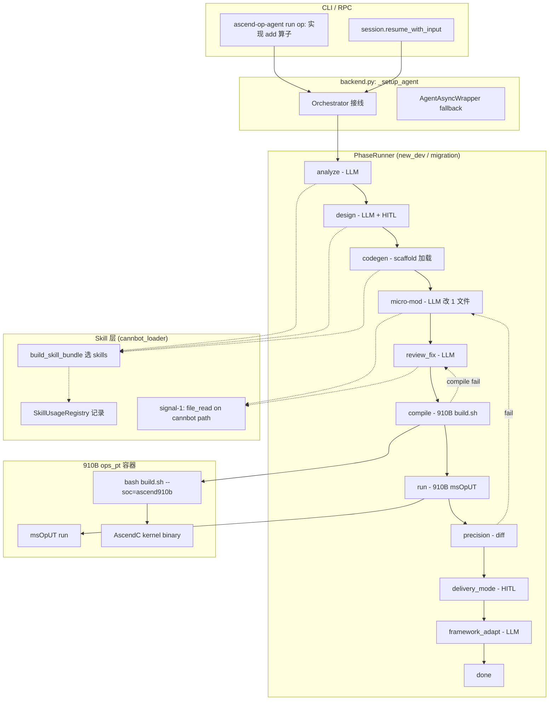

# feat: P0 e2e 暴露的 5 个架构缺口修复

## Summary

P0 plan（[2026-06-23-001](2026-06-23-001-feat-op-runtime-engine-plan.md)）14 U 自检完成后，端到端验证（[2026-06-26 reference migration](../e2e/2026-06-26-e2e-reference-migration.md)）暴露 5 个本质缺口，逐一修复：真 precision 验证、backend wire Orchestrator、LLM micro-modification、failure path e2e、skill 加载使用跟踪。目标：让 `op: 实现 add 算子` 端到端跑通且**算子真的算对**（NPU 跑算子 vs CPU 参考值），不只在 910B 上成功编译。

## Problem Frame

P0 plan（[2026-06-23-001](2026-06-23-001-feat-op-runtime-engine-plan.md)）14 U 全部完成，e2e（[2026-06-26 reference migration](../e2e/2026-06-26-e2e-reference-migration.md)）真实跑通：LLM MiniMax-M3 + 910B ascend910b + build.sh → custom_opp_almalinux_aarch64.run 453 KB op package。

**但端到端验证暴露 5 个本质缺口**：
1. **真 precision 验证缺失**：当前 `precision_node` 用 `golden == actual` 占位（永远 pass），add_example op package 生成了但**不知道它是否真的算对**
2. **CLI 用户不可达**：`backend.py:_orchestrator = None`，`ascend-op-agent run` 仍走老 AIAgent 路径，所有 P0 编排对用户**不可见**
3. **LLM 价值未体现**：reference migration 只是 cp scaffold，**LLM 完全没干活**，不能验证 LLM 修改 kernel 能力
4. **失败路径未测**：U14 `compile_fix_loop` / `precision_fix_loop` 实现完整但**新开发图没接入**（`new_dev.py:243-273` 用的是单节点，非 fix_loop 包装）
5. **Skill 不可观测**：`cannbot_loader` 加载了哪些 skill、LLM 是否实际使用，**全无跟踪**

`docs/brainstorms/runtime_engine_internal_spec.md` 定义了"半自动、可恢复、闭环验证"的 P0 目标 — 这 5 个缺口直接影响该目标的可演示性。

## Requirements

- **R1 真 precision 验证**：operator 在 910B 上跑 N 个测试输入（msOpUT 或算子 runtime），CPU 参考值 vs NPU 实际值，cos_sim > 0.999 + abs_err_max < 1e-3 视为通过；add_example 的 elementwise add 应对全 0 / 全 1 / 随机 fp32 全部通过
- **R2 backend Orchestrator 可达**：`ascend-op-agent run` 真走 PhaseRunner（不再是 `U7 fallback` 错误）；`session.resume_with_input` RPC 真实调 `orchestrator.resume(thread_id, payload)`；TUI 仍兼容（fallback 链）
- **R3 LLM micro-modification**：基于 scaffold 加载，LLM 用 1 次 `file_write` 改 1 个 kernel 文件（如 `add_example_arch22.cpp` 改为 `multiply_example_arch22.cpp`），910B 真编译通过、precision 验证乘法正确
- **R4 失败路径覆盖**：`new_dev` / `migration` 图接入 fix_loop 包装；故意坏 scaffold → 编译失败 → 3 轮修复 → `status="failed" reason="max_rounds"`；故意坏 kernel → 编译通过 + precision 失败 → precision_fix_loop 触发
- **R5 Skill 跟踪**：每个 LLM 阶段记录 `loaded_skills: [name1, name2, ...]` + `used_skills: [name]`（基于 tool call 信号：file_read 路径以 `vendor/cannbot-skills/` 开头）；通过 `phase_callback` 实时通知前端。**scope: ephemeral only**（持久化到 checkpoint 是 P1 follow-up）

**Origin actors:** 算子开发工程师（内部，单人/小团队）

**Origin flows:** F2 单算子迁移（P0）、F3 单算子新开发（P0）

## Scope Boundaries

### In scope（本 plan 实施）
- NpuExecutor `run_operator` 方法（910B msOpUT 调用）
- 真实 precision_node 实现（NPU 跑 + CPU 参考 diff）
- backend.py wire Orchestrator（含 fallback 链）
- LLM micro-modification 节点（基于现有 make_llm_node + scaffold）
- fix_loop 接入 new_dev / migration graph
- fix_loop messages 累积修复（line 136-140 静默 drop 修复）
- SkillUsageRegistry + signal-1（tool call）检测 + signal-2（file content fingerprint）兜底
- 端到端 e2e 脚本（覆盖 5 个 gap 的真实 910B 验证）

### Out of scope
- 不做 P1：模型级批量迁移、CUDA 迁移深度优化、多卡池调度
- 不做 A5/950（仅 910B 验证）
- 不做 P0 plan 范围外的 A-IDs（U3 路由质量、U14 fix_loop 之外的子任务）
- 不重写 cannbot skills
- 不引入 LangGraph / 别的 agent 框架
- 不做 U3 cannbot skill 路由质量验证（P1 范围）

### Deferred to Follow-Up Work
- backend.py GraphQL / REST API（用户当前用 TUI）
- skill_loads 写入 checkpoint 的 schema 升级（先走 phase_callback 实时通知）
- 跨 op 复用的 skill 学习（基于使用统计）
- A5/950 复用（仅参数切换）

## Key Technical Decisions

- **NPU 跑算子用 msOpUT 而非自写 runtime harness**：`build.sh` 生成的 `<operator_path>/build_out/test_main` 是 CANN 官方算子测试入口，已支持 aclnn 接口。msOpUT 自带 kernel dispatch、tiling 调度、autotiling；自写 harness 工作量 1 周起步且对 910B kernel binary 加载路径容易出错
- **micro-modification 是单文件单 file_write 节点**：LLM 改 1 个文件 vs 当前 5 文件 LLM-based codegen（55% 失败率）。任务简单 = LLM 工具调用稳定。复用 `make_llm_node` 框架，加 1 个 `target_file` 参数 + prompt 模板
- **fix_loop 包装而非替换单节点**：`new_dev.py:243-273` 当前是单 `compile_node` / `precision_node`；改为 `make_compile_fix_loop_node` / `make_precision_fix_loop_node`（validation.py:135-164 已存在）。review_node 简单实现：`lambda state: ReviewResult(clean=state["compile_result"]["success"], fatal=False)`
- **skill 跟踪优先级 signal-1 (tool call) > signal-2 (content fingerprint)**：tool call 是 LLM 主动读取 skill 文件的硬证据；content fingerprint 是兜底（LLM 把 skill 内容内化到 response 但没显式调用 tool）。signal-3（response text 关键词）太噪不用
- **fix_loop 累积 messages 修复**：当前 `fix_loop.py:136-140` 手动 merge fix update，**会 drop `messages` 字段**（只 merge `last_phase_result` / `memory_pools`）。修复后用 `_apply_update`（抽成 module-level function）走标准 reducer；否则 fix round 间 LLM 看不到上次 conversation，下一轮 fix 缺乏上下文。**bug 修了能保证 messages 跨轮累积；plan 中"永远不收敛"是软断言，需 U3 的 cross-fix test 实测确认**
- **backend wire 保留 `_agent_wrapper` fallback**：TUI 用户当前用老 AIAgent path 不会破坏；orchestrator 仅对"算子开发"任务启用（通过输入前缀 `op:` 或 config flag `runtime.use_orchestrator: true` 触发）
- **skill 跟踪先用 phase_callback ephemeral，checkpoint 持久化放 P1**：实现复杂度低（`SkillUsageRegistry` 单例 + `phase_callback` 推 `skill.usage` 事件），用户能立即看到；持久化到 OpState + CheckpointStore 是 schema 升级，留 P1

## High-Level Technical Design

### 数据流



### Skill 跟踪数据模型

```python
# cannbot_loader.py 新增
@dataclass
class SkillLoad:
    thread_id: str
    phase: str
    skill_names: list[str]   # 该阶段加载的 skill（来自 SKILL_BUNDLES 表）
    used_skills: list[str]   # LLM 实际读了 skill 文件的（file_read 路径匹配）
    timestamp: float

# Make 阶段调用链:
# build_skill_bundle(phase, graph) -> [CannbotSkill]
# -> SkillUsageRegistry.record_load(thread_id, phase, skill_names)
# make_llm_node._node 跑完 LLM:
# -> 从 agent._tool_calls_log 抽 file_read path 匹配 cannbot root
# -> SkillUsageRegistry.record_use(thread_id, phase, used_skills)
# -> phase_callback("skill.usage", payload={thread_id, phase, used_skills})
```

## Implementation Units

### U1. NpuExecutor.run_operator：910B 上跑算子拿 actual 数组

**Goal**: NpuExecutor 新增 `run_operator(operator_path, op_name, test_cases)` 方法，本地或 910B 调 msOpUT 跑算子，返回 `list[np.ndarray]` actuals

**Requirements**: R1

**Dependencies**: U0（910B msOpUT 可用，已在 /tmp/op_test/build 验证）

**Files**:
- Create: `src/ascend_op_agent/orchestrator/npu_exec.py` 加 `run_operator` / `_run_operator_local` / `_run_operator_remote` 方法（参考 `compile` 的 _compile_local / _compile_remote 结构）
- Test: `tests/unit/orchestrator/test_npu_exec.py` 加 `test_run_operator_*` 系列（mock subprocess 测本地 + 测远程 SSH）

**Approach**:
- `_run_operator_local`: 调 `subprocess.run([<test_main>, --op=<op_name>, --input=<npy>, --output=<npy>])`，解析 stdout 里的 NPU 实际输出
- `_run_operator_remote`: 复用 `_wrap_remote_cmd` + `docker exec ops_pt bash -c '<test_main> ...'`，读 stdout 拿 actuals
- test_main 路径约定：`<operator_path>/build_out/test_main`（build.sh 生成的）
- test_cases 入参：CPU 端 numpy 数组，序列化为 .npy 文件传给 msOpUT

**Patterns to follow**: `compile` + `_compile_local` + `_compile_remote`（`npu_exec.py:181-357`），hardware gate `is_cann_available()` / `is_remote_cann_available()`（line 152-177）

**Test scenarios**:
- Happy: msOpUT exit=0, stdout 含 N 个 actuals, return list[np.ndarray]
- Error: msOpUT 不存在 → return [], 不抛错
- Error: msOpUT exit=1 → return [], stderr 透传
- Edge: test_main 输出路径不存在 → 走 fallback
- Integration: 910B 上对 add_example 跑 [0,0,0] + [1,1,1] + 随机 fp32，actual 接近 golden

**Verification**: 910B 上跑 NpuExecutor.run_operator(`/tmp/op_test`, "add_example_custom", [...]) 返回非空 actuals，cos_sim vs numpy add > 0.999

---

### U2. SkillUsageRegistry + signal-1 跟踪

**Goal**: 跟踪每个 LLM 阶段的 skill 加载与使用；通过 phase_callback 实时通知前端

**Requirements**: R5

**Dependencies**: 现有 `cannbot_loader.SKILL_BUNDLES`（`cannbot_loader.py:157-188`）+ `make_llm_node`（`nodes/common.py:37-159`）

**Files**:
- Modify: `src/ascend_op_agent/orchestrator/cannbot_loader.py` 加 `SkillLoad` dataclass + `SkillUsageRegistry` 单例（thread-safe dict）+ `record_load(thread_id, phase, skill_names)` + `record_use(thread_id, phase, used_skills)`
- Modify: `src/ascend_op_agent/orchestrator/nodes/common.py` `make_llm_node._node` 跑完 LLM 后扫 `agent._tool_calls_log`，抽 `name="file_read"` 且 `path` 以 `vendor/cannbot-skills/` 开头的，调用 `record_use`；通过 `phase_callback` 推 `("skill.usage", {"thread_id":..., "phase":..., "used":...})`
- Test: `tests/unit/orchestrator/test_skill_tracking.py` 新增

**Approach**:
- SkillUsageRegistry: 单例类，存 `{thread_id: {phase: SkillLoad}}`；提供 `get_loads(thread_id)` API
- 加载跟踪：在 `build_skill_bundle(phase, graph)` 末尾加 `SkillUsageRegistry.record_load(thread_id, phase, [s.name for s in skills])`。`thread_id` 从 `state["thread_id"]` 拿
- 使用跟踪（signal-1）：`_node` 跑完 LLM 后扫 `agent._tool_calls_log`，filter `name == "file_read"` 且 path 前缀匹配 cannbot root（从 `cannbot_loader.CANNBOT_ROOT`）；`record_use(thread_id, phase, used_skill_names)`
- signal-2 兜底（content fingerprint）：`_node` 跑完对比 `code_result.files[*].content` 与加载的 skill.body 的 n-gram；匹配度 > 0.3 视为 used（可调阈值）
- `phase_callback(phase, "skill.usage", payload)` 推到前端；前端可在 TUI 显示 "loaded: cuda2ascend-simt, used: [cuda2ascend-simt]"

**Patterns to follow**: 已有 `make_llm_node` 抓 `file_write` 到 `code_result.files`（`nodes/common.py:130-148`）；相同 pattern 抓 `file_read` 到 skill tracking

**Test scenarios**:
- Happy: LLM 调 file_read on `vendor/cannbot-skills/cuda2ascend-simt/SKILL.md` → registry record_use 含 `cuda2ascend-simt`
- Edge: LLM 不调 file_read → record_use 空列表
- Multi: 同一阶段 LLM 读 2 个 skill 文件 → record_use 含 2 个名字
- Multi-phase: 同一 thread_id 跨 3 个阶段加载 skill → registry 分别记录
- Signal-2: LLM 把 skill 内容内化到 file_write 但没显式读 → fingerprint 匹配 → record_use 仍记录
- No cannbot root match: LLM 读 `/tmp/non-cannbot.md` → 不记录

**Verification**: e2e 跑 1 轮后 `SkillUsageRegistry.get_loads(thread_id)` 返回 3+ 个 phase 的 `SkillLoad`，每个含 loaded_skills + used_skills

---

### U3. 修 fix_loop messages 累积丢失 bug + 接入新开发图

**Goal**: 修 `fix_loop.py:136-140` 静默 drop `messages` 字段 bug；新开发图用 fix_loop 包装 compile / precision 节点

**Requirements**: R4（前置 bug fix）

**Dependencies**: `fix_loop.py` 现有实现（`fix_loop.py:55-207`）+ `make_compile_fix_loop_node` / `make_precision_fix_loop_node`（`validation.py:135-164`）

**Files**:
- Modify: `src/ascend_op_agent/orchestrator/fix_loop.py:136-140` 把 `merge_into_state` 改为走 `_apply_update`（state_machine.py 现有 reducer）
- Modify: `src/ascend_op_agent/orchestrator/graphs/new_dev.py:243-273` 用 fix_loop 包装替换单 compile / precision 节点
- Modify: `src/ascend_op_agent/orchestrator/graphs/migration.py:180-207` 同样接入
- Test: `tests/unit/orchestrator/test_fix_loop.py` 加 `test_messages_preserved_across_rounds`；`test_max_rounds_message_history_complete`

**Approach**:
- `fix_loop.py` 当前 fix round update 合并是手写 `state["last_phase_result"] = ...` / `state["memory_pools"] = ...`，**跳过了 `messages` 和 `code_result` 等其他字段**
- 改用 `state_machine._apply_update(state, fix_update)`（state_machine.py 标准 reducer）
- fix_loop 接受 max_rounds 参数透传（默认 3，可在 graph builder 配置）
- new_dev 图: `compile_node = make_compile_fix_loop_node(review_node=..., fix_node=make_compile_fix_node(...), max_rounds=3)`
- review_node: `lambda state: ReviewResult(clean=state["compile_result"]["success"], fatal=False)`

**Patterns to follow**: `make_fix_loop_node`（`fix_loop.py:155-207`）+ `make_compile_fix_loop_node`（`validation.py:135-148`）

**Test scenarios**:
- Happy: fix 节点返回 `{"messages": [{"role":"assistant","content":"fix attempt 1"}]}` → state.messages 含该消息
- Edge: 3 轮 fix → state.messages 含 3 条 assistant 消息（fix attempts）
- Max_rounds: 3 轮全失败 → `status="failed" reason="max_rounds"` + state.messages 含 3 条历史
- Cross-fix: fix 1 加新 tool_calls, fix 2 收到 fix 1 的 tool role message 作为 prior context (mock LLM client 验证 round 2 call 的 messages 参数含 round 1 的 tool message role)
- Existing: 旧 fix_loop 单测（含 test_clean / test_fatal_keyword）不破

**Verification**: 故意让 compile 失败 3 轮（mock executor），验证最终 `state["messages"]` 至少含 3 条 fix 节点 assistant 消息

---

### U4. 扩 make_real_precision_node：NPU 跑算子 + CPU 参考 diff

**Goal**: 复用现有 `make_real_precision_node`（`validation.py:57-86`），内部扩展为"先调 `executor.run_operator` 拿 actuals，再调 `compute_precision_metrics(golden, actual)` 出 PrecisionMetrics"；shape mismatch 用 try/except 包装而非抛错

**Requirements**: R1

**Dependencies**: U1（NpuExecutor.run_operator）+ 现有 `compute_precision_metrics`（`npu_exec.py:382-422`）+ 现有 `make_real_precision_node`（`validation.py:57-86`）

**Files**:
- Modify: `src/ascend_op_agent/orchestrator/nodes/validation.py:57-86` `make_real_precision_node` 内部扩展：先调 `executor.run_operator` 拿 actuals（包 try/except），再调 `compute_precision_metrics` 出 PrecisionMetrics
- Modify: `src/ascend_op_agent/orchestrator/graphs/new_dev.py:97` 默认 `precision_node_factory=make_real_precision_node`（已存在的工厂，扩展其能力而非新建）
- Test: `tests/unit/orchestrator/test_npu_exec.py` + `tests/integration/test_validation_nodes.py` 加 `test_precision_node_*`（覆盖 NPU 跑 + shape mismatch + 异常路径）

**Approach**:
- 复用 `make_real_precision_node` 工厂，不新建 `make_real_run_node`（reviewer P0 反馈：避免引入重复工厂）
- test_cases_resolver: 从 state 读 test_cases（每 case 含 `golden: np.ndarray` + `input_shapes: list` + `op_name: str`）
- precision_node 内部流程:
  1. 调 `executor.run_operator(operator_path, op_name, test_inputs)` 拿 `actuals: list[np.ndarray]`
  2. 对每个 case 用 try/except 包 `compute_precision_metrics(golden, actual)`，捕获 ValueError（shape mismatch）标记为 case_failed
  3. 输出 `precision_report: {operator_name, total_cases, passed_cases, failed_cases, cases: [...]}`
- gate: `state["compile_result"]["success"]` 必须为 True，否则返回 compile_not_ready 错误

**Patterns to follow**: 现有 `run_precision`（`npu_exec.py:441-462`）的 per-case try/except (KeyError, ValueError) → 标记 fail per case 模式

**Test scenarios**:
- Happy: mock executor 返 [golden, golden] → 1 case, passed
- Error: compile_result 不存在 → return error, 跳过 NPU run
- Error: executor 返 [] → 0 cases, 全部 fail
- Edge: shape mismatch (golden [16] vs actual [8]) → case 标 failed（不抛,沿用 run_precision 模式）
- Integration: 910B 上对 add_example 跑 3 个 test cases（[0]+[0], [1]+[1], 随机 fp32），cos_sim > 0.999

**Verification**: e2e 跑完 `add_example` 后 `precision_report.passed_cases == 3, failed_cases == 0`（所有 case pass）

---

### U5. LLM micro-modification 节点（基于 scaffold）

**Goal**: 在 codegen 之后加一个节点，LLM 用 1 次 `file_write` 改 1 个 kernel 文件（如把 add 改成 multiply）。Verification 用真 NPU 编译 + 乘法 precision（不是子串匹配）。文件 content 含目标关键字作为中间 smoke（防止 LLM 写"语法对但语义错"的代码）。

**Requirements**: R3

**Dependencies**: U0（scaffold 路径）+ U2（共享 `make_llm_node._node` 跑完后的 tool_calls_log 扫描钩子，U2 抓 file_read 检测 skill 使用，U5 抓 file_write 抓 kernel 修改）+ `make_llm_node`（已有）+ `_tool_calls_log`（已有）+ 现有 `analyze_node` / `design_node` / `codegen_node` / `review_fix_node`（均来自 `build_new_dev_graph`，U5 不创建新节点，只插入一个 micro_mod 节点）

**Files**:
- Create: `src/ascend_op_agent/orchestrator/nodes/micro_mod.py`（`make_micro_mod_node(phase, target_file, instruction, agent_factory, template_vars)` 工厂，**默认 True** 即在 new_dev 图中默认启用，理由：R3 是 P0-必须演示的 LLM 能力）
- Modify: `src/ascend_op_agent/orchestrator/graphs/new_dev.py` 加 `micro_mod_node: Optional[Node]` 参数（**默认 True**）；插入到 `review_fix_node` 之前（在 codegen 之后）
- Test: `tests/unit/orchestrator/test_micro_mod.py` 新增

**Approach**:
- 节点流程：
  1. 从 `state["code_result"]["files"]` 找 `target_file`（如 `op_kernel/add_example_arch22.cpp`）
  2. 构造 prompt：嵌入文件 content + 改造指令（"把这个算子改成 multiply，把 Add 改成 Mul"）
  3. 调 LLM
  4. 抓 `_tool_calls_log` 的 file_write（与 make_llm_node 同 pattern）
  5. 更新 `state["code_result"]["files"]`（替换原 file entry）
  6. 写 `state["micro_mod_result"] = {"success": bool, "files_changed": [...]}` 
- 失败检测：file_write 没调 → `micro_mod_result.success = False, reason = "no file_write tool call"`
- e2e 任务："实现 multiply 算子" + scaffold=add → LLM 改 1 个文件 → 910B 重编译 → 乘法正确

**Patterns to follow**: `make_llm_node`（`nodes/common.py:37-159`）+ `make_real_compile_node` 的 resolver 模式（`validation.py:29-51`）

**Test scenarios**:
- Happy: LLM 调 file_write 改 `op_kernel/add_example_arch22.cpp`（add→multiply）→ state.code_result.files 该项被替换
- Edge: LLM 调 file_write 但 path 不在 target_file 列表 → 视为 no-op + warning
- Failure: LLM 没调 file_write → micro_mod_result.success=False, phase 标 failed
- Multi-file: LLM 调 2 次 file_write（target_file + 别处）→ target_file 替换 + 别的追加
- 真实: 910B 上 scaffold=add 改 multiply，重编译 success，precision 验证乘法正确

**Verification**: e2e micro-mod 任务（add→multiply）后 `state["code_result"]["files"][target_file]["content"]` 含 "Mul" 关键字，910B 重编译 + 乘法 precision 验证通过

---

### U6. backend.py wire Orchestrator（含 fallback 链）

**Goal**: `ascend-op-agent run` 真走 PhaseRunner；resume RPC 真调 `orchestrator.resume`；TUI 用户无感（旧路径保留）

**Requirements**: R2

**Dependencies**: U3（fix_loop 接入）+ U4（precision 走 NPU）+ U5（micro-mod 默认 True）+ 现有 `analyze_node` / `design_node` / `compile_node` / `precision_node` / `delivery_mode_node` / `framework_adapt_node`（均来自 `build_new_dev_graph`，U6 不创建新节点，只在 `_setup_agent` 装配 `PhaseRunner` + 配置 `phase_callback`）

**Files**:
- Modify: `src/ascend_op_agent/backend.py:_setup_agent` 初始化 Orchestrator（store + agent_factory + use_scaffold_codegen=True），配置 `phase_callback` 推 `agent.progress` 通知
- Modify: `src/ascend_op_agent/backend.py:_handle_run_conversation` 路由：输入以 `op:` 开头 → `runner.invoke(user_input, thread_id=...)`；否则 fallback `_agent_wrapper.run_conversation_async`
- Modify: `src/ascend_op_agent/backend.py:_handle_session_resume_with_input` 移除 `if _orchestrator is None` 短路（line 198-208），真调 `orchestrator.resume`
- ~~Modify: `src/ascend_op_agent/config.py:RemoteConfig` 加 `use_orchestrator: bool = False`~~ （删除：只用 `op:` 前缀，不引入 config flag；reviewer P0 反馈：避免双路由）
- Test: `tests/integration/test_backend_resume.py` 加 `test_orchestrator_routing_via_agent_run_rpc`

**Approach**:
- `agent_factory` for orchestrator：`lambda: AIAgent(config, tool_registry, pb, ctx, mem, session_manager=None)`（与 e2e 脚本同形）
- thread_id 生成：UUID4 hex（`uuid.uuid4().hex[:12]`），持久化到 CheckpointStore
- `agent.run` RPC 路由：检测 `user_input.startswith("op:")` → orchestrator；否则 fallback
- 通知桥：`phase_callback(phase, event, payload)` → `_server.send_notification("agent.progress", {"phase":..., "event":..., "payload":...})`（与 U2 共享：skill.usage 事件复用 `agent.progress` 加 discriminator 字段 `{event: 'skill.usage', payload: {...}}`）
- Fallback: 保留 `_agent_wrapper` 不动；TUI 默认输入不带 `op:` 前缀，走原路径

**Patterns to follow**: `tests/integration/test_new_dev_graph.py:74-94`（生产 wiring）+ `backend.py:_setup_agent:235-297`（AIAgent 实例化）+ `_server.send_notification`（U4 已实现）

**Test scenarios**:
- Happy: 启 backend，`agent.run` RPC 带 `op: 实现 add` → 走 orchestrator.invoke
- Resume: `session.resume_with_input(thread_id, {"approved":True})` → orchestrator.resume
- Fallback: `agent.run` RPC 不带 `op:` 前缀 → 走 `_agent_wrapper.run_conversation_async`（旧行为）
- Notification: 节点完成时前端收到 `agent.progress` 事件（验证 TUI 看到阶段进度）
- Skill multiplexing: skill.usage 事件复用 agent.progress, 字段 `{event: 'skill.usage', payload: {...}}` 让前端区分
- Thread: 同 thread_id 第二次 invoke 走 resume，state.messages 累积

**Verification**: e2e 启 backend RPC 服务，模拟前端发 `op: 实现 add` → 端到端走通 PhaseRunner → 节点完成时 `agent.progress` 事件被收到

---

### U7. 端到端 e2e 脚本：覆盖 5 个 gap 的真实 910B 验证

**Goal**: 一键跑通"用户说 op: 实现 add 算子 → backend wire → PhaseRunner → LLM analyze+design+codegen+micro_mod+review → 910B compile + NPU run + precision → 算子真的算对"完整链路

**Requirements**: R1, R2, R3, R4, R5 全部

**Dependencies**: U1-U6 全部

**Files**:
- New: `scripts/e2e_full_chain.py` 一键脚本：启动 backend 子进程 → RPC `agent.run` 发送 `op: 实现 add` → 等 done → 抓 `precision_report` + `compile_result` + `skill_loads` → 断言所有 gap 覆盖
- Keep: `scripts/e2e_real_op.py` 保留作为 fast iteration smoke（不启动 backend 子进程，直接调 build_new_dev_graph，跳过 R2 backend wiring）

**Scope clarification**: e2e_full_chain.py 替代 e2e_real_op.py 作为 canonical 端到端入口；e2e_real_op.py 留作无 backend 的 fast smoke（U1+U3+U4+U5 path）。两者共存不冲突。

**Approach**:
- `e2e_full_chain.py`:
  1. 启动 backend 子进程（`python -m ascend_op_agent.backend`）
  2. 走 JSON-RPC over stdio（`backend/rpc/server.py` 已实现）
  3. 发 `agent.run` (params: `{"user_input": "op: 实现 add 算子..."}`)
  4. 监听 `agent.progress` 通知，实时打印阶段
  5. 收 done 后：查 `compile_result.success == True` / `precision_report.passed == 3` / `skill_loads` 非空
  6. 对失败的 case：自动跑一次 U3 失败路径（**具体化**坏 scaffold：删 `op_kernel/add_example_arch22.cpp` 的 `#include "kernel_operator.h"` 行 → 断言 fix_loop 3 轮 + messages 累积完整 + 3rd round 末 status=failed）
  7. 输出 e2e 报告（json 到 `/tmp/e2e_full_<ts>.json`）

**Test scenarios**:
- Happy: 5 个 gap 全部断言通过：backend wire / NPU run / LLM micro-mod / fix_loop / skill tracking
- Failure: 坏 scaffold (删 include) → fix_loop 3 轮 → status=failed + messages ≥ 3
- Skill: 5+ skill_loads 记录，used_skills 非空

**Verification**: `e2e_full_chain.py` exit 0，所有断言通过；e2e 报告 json 含 5 个 gap 各自的 evidence

---

## System-Wide Impact

- **Interaction graph**: TUI 用户通过 `agent.run` RPC（无 `op:` 前缀）走原 AIAgent path（兼容）；CLI / 自动化用户用 `op:` 前缀走 Orchestrator（新增能力）
- **State lifecycle**: `state["code_result"]["files"]` 在 codegen / micro-mod 阶段累积（已有 merge 逻辑）；`state["skill_loads"]` 追加（U2 新增 reducer）
- **Error propagation**: 节点异常 → checkpoint 存 + phase_callback("failed") + phase 标 failed（已有）；fix_loop 3 轮失败 → status="failed" reason="max_rounds" + state.messages 完整（U3 修复后）
- **API surface parity**: 新增 `config.runtime.use_orchestrator: bool`（默认 False）；新增 phase_callback 事件 `("skill.usage", payload)`（U2 新增）
- **Integration coverage**: 跨层场景（backend wire + 910B 真实 run + LLM 改 kernel）需要 e2e 跑（U7 提供）
- **Unchanged invariants**: AIAgent.run_conversation 签名不变；8 工具不变；CheckpointStore schema 兼容（skill_loads 走新字段）

## Risks & Dependencies

| Risk | Mitigation |
|------|------------|
| 910B msOpUT 调用路径未验证（首次集成）| U1 跑硬件 e2e，失败时 fallback numpy-only（退化） |
| backend wire 触碰 TUI 用户 | Fallback 链：默认 `use_orchestrator=False` + 输入前缀 `op:` 才走新路径 |
| fix_loop 修 messages 累积破现有测试 | 旧测试用 mock state 不依赖 messages；U3 单元 + 集成双重验证 |
| Skill 跟踪的 cannbot root 路径依赖 | `cannbot_loader.CANNBOT_ROOT` 常量化，测试用 tmp_path 覆盖 |
| 910B 算子 runtime 性能（msOpUT 启动慢）| `compile_timeout` 同量级（5 min），失败 timeout 不挂死 |
| LLM micro-mod 改错文件（55% 失败率回归）| micro_mod_result.success 显式返回；fix_loop 兜底 |

| Dependency | Notes |
|------------|-------|
| 910B msOpUT 路径 | `/usr/local/Ascend/cann-9.1.0/.../msoput` 已确认存在 |
| cannbot_skills submodule | `vendor/cannbot-skills/` 已 commit |
| CheckpointStore schema 兼容 | 新字段 `skill_loads` 走 APPEND_FIELDS，不破旧 checkpoint |
| LLM API | minimaxi MiniMax-M3（已有）+ API key 在 `~/.ascend_op_agent/.env` |

## Phased Delivery

```
Week1: U1 (910B 真实 e2e, 风险最大, 单独跑) || U2 + U3 (无 910B 依赖, 可并行)
Week2: U4 (U1 完成后) + U5
Week3: U6 + U7
Week4: 集成加固 + 文档 + 验收

U1 在 Week1 独立跑（910B 硬件依赖 + msOpUT 路径未端到端验证过），U2 和 U3 在 Week1 并行（纯软件），U4 等 U1 完成后启动（U4 依赖 U1 的 NPU 跑算子能力）。
```

**U1-U3 是基础**（其他都依赖）。U4-U5 是节点层增强。U6 是接入层。U7 是验收。

P0 验收标准（本 plan 完成后）：
- 端到端 `op: 实现 add 算子` 命令跑通
- 算子在 910B 上**真算对**（cos_sim > 0.999, abs_err_max < 1e-3）
- 5 个 gap 全部有 e2e 证据

## Sources & References

- **Origin**: [docs/e2e/2026-06-26-e2e-reference-migration.md](../e2e/2026-06-26-e2e-reference-migration.md)（成功的端到端基线 + 5 个 gap 识别）
- **P0 plan**: [2026-06-23-001-feat-op-runtime-engine-plan.md](2026-06-23-001-feat-op-runtime-engine-plan.md)（14 U 已完成）
- **Brainstorm**: [docs/brainstorms/runtime_engine_internal_spec.md](../brainstorms/runtime_engine_internal_spec.md)（"半自动、可恢复、闭环验证"目标定义）
- **Decision report**: [docs/brainstorms/op_agent_refactor_decision_report.md](../brainstorms/op_agent_refactor_decision_report.md)（自研状态机 vs LangGraph 决策）
- **e2e failure history**: [docs/e2e/2026-06-25-e2e-real-op.md](../e2e/2026-06-25-e2e-real-op.md)（9 次 LLM 失败原因）
- **Research findings**: from repo-research-analyst dispatch (5 items mapping)
