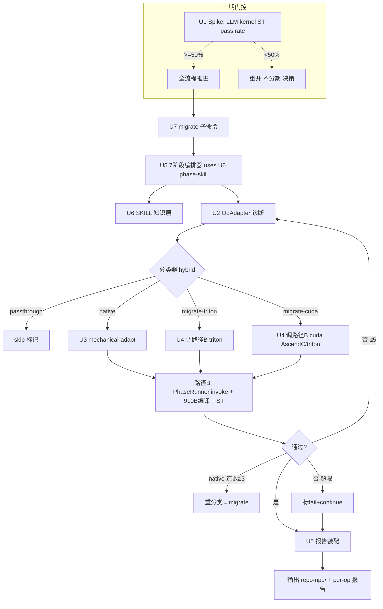

# feat: Path A 模型级批量迁移

## Summary

新增 `OpAdapter` lib(`src/ascend_op_agent/migrate/`)+ `ascend-op-agent migrate` click 子命令,编排 npu-model-migration SKILL 的 7 阶段在 model 级别跑:实测诊断 unsupported op → 按源类型四类分流(passthrough/native/migrate-triton/migrate-cuda)→ 自动机械适配 + custom 类调路径 B 兜底 → 910B 真编译 + ST 精度 → 输出 NPU 适配脚本 + per-op 报告。复用 P0/P1 全部现有能力,一期建终态全流程,由 pre-build kernel spike 引导"不分期"决策。

---

## Problem Frame

GPU 工程师把 PyTorch 模型迁 NPU,卡在"哪些算子不支持"。npu-model-migration SKILL 已把人工诊断循环沉淀成 7 阶段指南,但循环本身耗时、经验不固化、批量迁不动。Path A 把"人按 SKILL 执行"提升为"agent 编排 SKILL 执行",路径 B(单算子 kernel 迁移)降级为 custom 类兜底。v1 brainstorm 误把模型当 `.pt` 静态解析,v2(本 plan 的 origin)修正为实测驱动 + 脚本输入。

---

## Requirements

### 诊断

- R1. `migrate` 子命令接受 repo local path + `run.py` 入口 + 单 model(+ 可选 GPU `torch.profiler` chrome trace);框架型 repo 先问用户选哪个 model。
- R2. 实测 analyze 产出完整 op 诊断列表:`transfer_to_npu` 尝试 → continue-on-error harness 跑 `run.py` 收集全部报错 → 静态 aten 等价查询作枚举加速器 → optional profiling 交叉验证。
- R3. op 分类按源类型 + 优先级 `passthrough > native > migrate-triton > migrate-cuda`;分类器 = 报错解析(主)+ aten-coverage 静态查询 + LLM 判定(歧义兜底)。

### 迁移

- R4. passthrough 类不处理(`transfer_to_npu` 已搞定),仅报告标记。
- R5. native 类自动 device/API adapt + `torch.aten` 等价替换 + `transfer_to_npu` 注入(机械改动)。
- R6. migrate-triton 类调路径 B(参考 cannbot `ops/triton-op-coding` skill)。
- R7. migrate-cuda 类调路径 B(参考 cannbot `ops-lab/cuda2ascend-simt` skill);方案阶段 LLM 推荐 AscendC/triton + 用户 HITL 确认目标。

### 验证与输出

- R8. 每个 migrated op 在 910B `ops_pt` 容器内 `build.sh --soc=ascend910b` 真编译 + ST 驱动精度验证(复用 `NpuExecutor` + `nodes/validation.py`)。
- R9. 输出并行目录(`<repo>-npu/` 镜像,不改原码)的 NPU 适配脚本 + per-op 报告 + SKILL `migration-report-template` 格式迁移报告;fail op 报告须含末次编译错 / 末次精度 delta / 迭代数。

### 编排

- R10. 编排 SKILL 7 阶段(目标分析 → `transfer_to_npu` 尝试 → 方案设计 HITL → 代码迁移 → NPU 验证 → 调试迭代 → 报告)。
- R11. 单点 HITL(方案设计后确认一次);native 类在模型级验证(阶段 4)连续失败 / 数值发散 ≥3 次(说明 aten 不等价 —— native 无 op 级 ST,信号取模型级)触发重分类到 migrate,避免误分类不可恢复。

### 复用与边界

- R12. 复用 PhaseRunner / NpuExecutor / ST 驱动 / cannbot-loader / CheckpointStore 不重写;Path A 加 model-level 编排 + native mechanical-adaptation(不写 kernel)。
- R13. npu-model-migration SKILL 作知识层加载(mirror `cannbot_loader.py` 模式),不作自研编排。

### 一期门控

- R14. pre-build spike 测 LLM kernel ST pass rate,< 50% 重开"不分期"决策。
- R15. success criteria:≥3 个 demo 端到端跑通(≥1 含 migrate-cuda op、≥1 含 migrate-triton op)+ migrated kernel 全过 ST + 分类准确率 ≥80%(辅助)。

---

## Key Technical Decisions

- **KTD1 — CLI 集成:`ascend-op-agent migrate` click 子命令**:挂现有 `cli.py` 的 `@click.group` main,非 origin 写的 `python -m ascend_op_agent.cli.migrate`(那需 `cli.py`→`cli/` 包重构,破坏现有 `ascend-op-agent` script 入口)。
- **KTD2 — 分类器 = hybrid(报错解析 + aten 查询 + LLM 兜底)**:报错 stack-trace regex 作主信号,静态 `torch.aten` 等价查询作枚举加速 + native 判定,LLM 仅在歧义(多分类候选)时兜底。纯 LLM 不可复现、纯规则覆盖不全。
- **KTD3 — 实测枚举:continue-on-error harness**:run.py 首错即 abort 只露 1 op;harness = AST-wrap 每个 suspected unsupported-op 调用点于 try/except(确定性枚举)+ traceback-regex 把报错归因到 op,枚举全部 unsupported op,而非 N 次 fail-fix 循环。
- **KTD4 — 路径 B 复用:per-op `PhaseRunner.invoke`**:Path A 自身只做 thin loop(调 invoke + 累积 MigrationResult + continue-on-fail),不重写 invoke 内部(对齐 origin R14 + coherence 修复)。
- **KTD5 — npu-model-migration SKILL 加载 = mirror cannbot_loader**:vendor 到 `vendor/npu-model-migration` + phase→skill 决策表(`orchestrator/cannbot_loader.py:161-177` 模式),非自研 7 阶段硬编码。
- **KTD6 — HITL 复用 `pending_confirmation` TUI 通道**:复用 backend.py `session.resume_with_input` + PhaseRunner `_migration_design_payload_builder`(`graphs/migration.py:132-139`,wired at :150),不加新 UI。
- **KTD7 — spike 阈值:ST pass rate < 50% 重开"不分期"**:默认值,plan 实测后可调;3-persona 共指风险的量化门。
- **KTD8 — 输出目录:`<repo>-npu/` sibling 镜像**:对齐 SKILL"并行目录,不改原码"约束;原码不动,git 友好。

---

## High-Level Technical Design

组件拓扑:`migrate/` 包内 `adapter.py`(OpAdapter facade)→ `analyzer.py`(R2)+ `classifier.py`(R3)→ `native_adapter.py`(R5)+ `dispatcher.py`(R4/R6/R7)→ `orchestrator.py`(R10 7 阶段)→ `reporter.py`(R9)→ `skill_loader.py`(R13)。`cli.py` 加 `migrate` 子命令调 OpAdapter。

---

## Implementation Units

### U1. Pre-build kernel feasibility spike

- **Goal:** 量化 LLM 写 AscendC/triton kernel 的 ST pass rate,gate "不分期"决策(R14)。
- **Requirements:** R14。
- **Dependencies:** 无(最先跑,gate 后续 U4/U8 投入)。
- **Files:** `scripts/spike_kernel_feasibility.py`(新)、`tests/integration/test_spike_kernel_feasibility.py`(新,hardware-gated)。
- **Approach:** 从 demo model 采 N(≥5)个真实 custom CUDA op,逐个调现有路径 B(`PhaseRunner.invoke` 全流程:codegen → 910B 编译 → ST 精度),统计 ST pass rate。复用 `scripts/e2e_real_op.py` 的 SSH→docker exec→build.sh 调度模式。产出 spike 报告(pass rate + 失败原因分类)。
- **Patterns to follow:** `scripts/e2e_real_op.py`(单 op e2e 调度)、`pytest -m hardware`(hardware-gated 测试)。
- **Test scenarios:**
  - Happy:5 个已知 custom op 跑完,产出 pass rate 报告(hardware-gated e2e)。
  - Edge:某个 op PhaseRunner.invoke 抛异常 → spike 记 fail 不崩,继续下一个(对齐 continue-on-fail)。
  - Error:910B SSH 不可达 → spike 早退 + 明确报错(不挂起)。
- **Verification:** spike 报告落地;pass rate ≥50% → U4/U8 全力推进,< 50% → 触发"不分期"重开对话(停 U4/U8,回用户)。

### U2. OpAdapter 诊断层(analyzer + classifier)

- **Goal:** 实测跑 run.py + 静态查询,产出完整 op 诊断列表 + 四类分类(R2、R3)。
- **Requirements:** R2, R3。
- **Dependencies:** 无(基础层,U3/U4/U5 依赖其输出)。
- **Files:** `src/ascend_op_agent/migrate/__init__.py`、`src/ascend_op_agent/migrate/adapter.py`(OpAdapter facade)、`src/ascend_op_agent/migrate/analyzer.py`、`src/ascend_op_agent/migrate/classifier.py`、`tests/unit/test_analyzer.py`、`tests/unit/test_classifier.py`。
- **Approach:** analyzer 实现 continue-on-error harness(try/except 包裹 + 逐 suspected-op 注入跑 run.py)+ 合并可选 profiling + 静态 aten 等价查询(枚举加速)。classifier 按 KTD2 hybrid:stack-trace regex(主)→ aten-coverage 查询(native 判定)→ LLM 兜底(歧义)。输出 `OpReport`(op_name/source_type/error/profile_evidence/recommended/target)。
- **Patterns to follow:** cannbot skill 的 description 触发词路由模式(`orchestrator/cannbot_loader.py`)。
- **Test scenarios:**
  - Happy:mock run.py 抛 3 个不同 op 的错 → analyzer 收齐 3 个(continue-on-error 生效)。Covers AE1, AE2.
  - Happy:pure PyTorch op 跑通 → classifier 标 passthrough。Covers AE1.
  - Happy:报错 op 有 aten 等价 → 标 native。Covers AE2.
  - Happy:GPU triton kernel source → 标 migrate-triton。Covers AE3.
  - Happy:custom CUDA op 无 aten 等价 → 标 migrate-cuda。Covers AE4.
  - Edge:一个 op 同时有 aten 等价 + 是 triton source → 优先级 native > migrate-triton 胜出(R3)。
  - Error:run.py 超时/OOM → analyzer 标该 op unknown_type + warn(对齐 origin OQ5 warn+skip)。
- **Verification:** 单测全过;诊断列表 op 数 ≥ 实际报错 op 数(continue-on-error 不漏)。

### U3. Native mechanical-adaptation

- **Goal:** native 类自动做 device/API adapt + aten 替换 + transfer_to_npu 注入(R5)。
- **Requirements:** R5。
- **Dependencies:** U2(消费 OpReport 的 native 类 op)。
- **Files:** `src/ascend_op_agent/migrate/native_adapter.py`、`tests/unit/test_native_adapter.py`。
- **Approach:** 三步机械改动:(1) 入口注入 `import torch_npu; from torch_npu.contrib import transfer_to_npu`;(2) grep 替换 `cuda→npu` 残留(`autocast.*cuda`、`is_cuda`,对齐 SKILL 阶段 1.5.3 + 3.1.2 设备替换规则;`backend="nccl"→"hccl"` HCCL 留 TODO marker,二期 deferred —— 本期 native 输出不触分布式通信);(3) aten 等价替换(用 analyzer 提供的等价映射)。产物写 `<repo>-npu/` 镜像。
- **Patterns to follow:** SKILL 阶段 3.1.2 设备替换规则表、阶段 3.3 API 替换。
- **Test scenarios:**
  - Happy:含 `tensor.cuda()` + `torch.cuda.is_available()` 的脚本 → 注入 transfer_to_npu + 替换为 `.npu()` 系列,产物可 import。
  - Edge:`autocast('cuda')` 字符串 → 替换 `npu`(SKILL 遗漏项)。
  - Error:无等价 aten 的 native 标记 → 不替换,回标 migrate-cuda 经 U5 orchestrator 路由到 U4 HITL 路径(不在 U3 内部重分类,保 HITL 一致)。
- **Verification:** 产物脚本 `python -c "import"` 不报 syntax/name 错(不保证跑通,跑通由 U5 验证阶段判)。

### U4. Migrate dispatcher + 路径 B 集成

- **Goal:** migrate-triton / migrate-cuda 类调路径 B per-op;HITL 确认 cuda 目标;reclassify 通道(R6、R7、R11 重分类)。
- **Requirements:** R6, R7, R11。
- **Dependencies:** U2(OpReport)、U1(spike pass,< 50% 则停 U4/U8 回用户)。
- **Files:** `src/ascend_op_agent/migrate/dispatcher.py`、`tests/unit/test_dispatcher.py`、`tests/integration/test_dispatcher_path_b.py`(hardware-gated)。
- **Approach:** dispatcher 是 thin loop(KTD4):per migrate op 调 `PhaseRunner.invoke(op)`(全流程 codegen→compile→precision)+ 累积 `MigrationResult` + continue-on-fail。migrate-cuda 在调 invoke 前,LLM 读 op signature + cannbot skill 上下文推荐 AscendC/triton,经 HITL(KTD6 pending_confirmation)确认 target;target 编码进 invoke 的 user_input prompt(不改 PhaseRunner.invoke 签名,cuda frontend 节点回读),实现期若 LLM 抽取不可靠则 fallback 扩 `op_info.hint` 通道。native 类 op 若模型级验证连败 / 发散 ≥3(由 U5 反馈,native 无 op 级 ST)→ dispatcher 重分类为 migrate-cuda 重跑。**triton contingency**:若 U6 核实 migrate-triton 路径 B 端到端未覆盖(`make_triton_frontend_node` 跑不通),U4 吸收为新建子任务(对齐 origin R6 contingency),加独立 test scenario。
- **Patterns to follow:** `backend.py` `_handle_run_conversation` op: 前缀路由 + `session.resume_with_input` HITL 模式;`orchestrator/graphs/migration.py` 路径 B 入口。
- **Test scenarios:**
  - Happy:mock PhaseRunner.invoke,migrate-cuda op 经 HITL 确认 AscendC → 调 invoke 传 target=AscendC。Covers AE4.
  - Happy:migrate-triton op → 调 invoke 走 triton 路径(无 HITL,triton 是源类型直迁)。Covers AE3.
  - Integration(hardware):1 个真 custom CUDA op → invoke 全流程 + 910B 编译 + ST(happy 路径,不 cover fail-continue)。
  - Error:invoke 迭代超限 → MigrationResult 标 fail + continue 下一个。Covers AE5.
  - Reclassify:native op 连败 ≥3 → 重分类 migrate-cuda 重跑(触发 U3 跳过、U4 接管)。
- **Verification:** dispatcher 对 N op 跑完产出 N 个 MigrationResult(pass/fail 全标记),无中途崩。

### U5. 7 阶段编排器 + 报告装配

- **Goal:** 编排 SKILL 7 阶段;串 U2/U3/U4/U6;单点 HITL;输出报告(R9、R10)。
- **Requirements:** R9, R10, R12(reuse mandate,由 System-Wide Impact 不重写声明落地)。
- **Dependencies:** U2, U3, U4, U6。
- **Files:** `src/ascend_op_agent/migrate/orchestrator.py`、`src/ascend_op_agent/migrate/reporter.py`、`tests/integration/test_migrate_orchestrator.py`。
- **Approach:** orchestrator 顺序跑 7 阶段(阶段 3 后插 HITL 确认 op 分类 + cuda 目标 + 改动清单);HITL 通过 pending_confirmation(KTD6)。reporter 装配 SKILL `migration-report-template` 格式报告 + per-op 报告(fail op 必含末次编译错/精度 delta/迭代数,R9)。debug 迭代上限 5(阶段 5),native 连败 ≥3 触发 U4 reclassify。
- **Patterns to follow:** `orchestrator/state_machine.py` PhaseRunner 14 节点状态机(本 plan 不重写,只借鉴 HITL + checkpoint 模式);`orchestrator/cannbot_loader.py` phase_callback 推前端。
- **Test scenarios:**
  - Happy:mock 全链,passthrough+native+migrate 各 1 op → 7 阶段跑完,报告含 3 op 结果 + 改动清单。
  - Integration:框架型 repo → 阶段 1 问用户选 model 再继续(R1)。
  - Error:某 op fail → 报告含 fail 诊断状态(非空,对齐 R9)。Covers AE5.
- **Verification:** 7 阶段全跑 + HITL 触发一次 + 报告 schema 完整(含 fail op 诊断字段)。

### U6. npu-model-migration SKILL 知识层加载

- **Goal:** 把 npu-model-migration SKILL 当知识层加载 + 验证 migrate-triton 路径 B 端到端覆盖(R13;P0/P1 仅验证 AscendC 路径,triton 路径未验证)。
- **Requirements:** R13。
- **Dependencies:** 无(与 U1 并行)。
- **Files:** `src/ascend_op_agent/migrate/skill_loader.py`、`vendor/npu-model-migration/`(新,vendored)、`tests/unit/test_skill_loader.py`。
- **Approach:** mirror `cannbot_loader.py`:vendor SKILL 到 `vendor/npu-model-migration`,建 `(graph, phase)→skill` 决策表(SKILL_BUNDLES key 顺序,7 阶段 → 对应 SKILL 段落),phase 内 LLM 读 SKILL description 路由;`build_skill_bundle(phase=..., graph=...)` 强制 kwargs(避免 cannbot_loader 自身的 key-order 陷阱)。**先核 migrate-triton 路径 B 端到端覆盖**(P0/P1 验证的是 AscendC 路径,triton→昇腾 triton 未验证):若未覆盖,R6 当一期新建而非纯复用,回 U4 补。
- **Patterns to follow:** `orchestrator/cannbot_loader.py:161-177` SKILL_BUNDLES 决策表 + `:123` load_skill_dir。
- **Test scenarios:**
  - Happy:vendor 目录在 → loader 按 (phase, graph) 查表加载对应 SKILL 段。
  - Edge:SKILL 目录缺一段 → loader warn + 跳过(不崩)。
  - Verification(手动):`make_triton_frontend_node`(`nodes/migration.py:223`)真能跑通一个 triton op 端到端(否则该覆盖风险坐实,U4 补建)。
- **Verification:** SKILL 段可按 phase 加载;migrate-triton 路径 B 覆盖结论落地(verified 或 需补建)。

### U7. `migrate` CLI 子命令

- **Goal:** `ascend-op-agent migrate` click 子命令入口(R1)。
- **Requirements:** R1。
- **Dependencies:** U5。
- **Files:** `src/ascend_op_agent/cli.py`(改,加 `@main.command() migrate`)、`tests/test_cli.py`(改,加 migrate 用例)。
- **Approach:** KTD1:挂现有 `@click.group` main,加 `migrate` 子命令,选项 `--repo PATH --run-entry PATH [--profile PATH] [--report-only]`。进度打印 `[1/N] analyze... [2/N] migrate op1 ✓/✗ ...`。退出码 0=全 pass,1=有 fail。调 OpAdapter(U5 orchestrator)。
- **Patterns to follow:** `cli.py` 现有 `run`/`viewer` 子命令结构(`@main.command()` + click options + rich console)。
- **Test scenarios:**
  - Happy:`migrate --repo X --run-entry Y` → CliRunner 断言退出码 + 调用 OpAdapter。
  - Edge:`--report-only` → 只跑 U2 analyze,跳 U3/U4。
  - Error:repo 路径不存在 → click 报错退出(非异常崩)。
- **Verification:** `ascend-op-agent migrate --help` 列出选项;`pytest tests/test_cli.py` migrate 用例过。

### U8. E2E + fixtures + success-criteria 度量

- **Goal:** fixture model + hardware-gated e2e + 度量 success criteria(R15)。
- **Requirements:** R15。
- **Dependencies:** U5, U7。
- **Files:** `scripts/e2e_model_migrate.py`(新)、`tests/integration/test_model_migrate_e2e.py`(新,hardware-gated)、`tests/fixtures/models/`(新,fixture model)。
- **Approach:** fixture = SKILL 案例库(AutoInt/DeepFM/DIN/Wide&Deep)+ ≥1 含 custom CUDA op 的 demo(满足 R15 的 ≥1 migrate-cuda op 要求,防止 passthrough-heavy demo 绕过门槛)。e2e 跑全链,度量:跑通 model 数 / migrated kernel ST pass / 分类准确率(对比手工标注)/ agent vs manual 耗时(自动化增量 baseline)。
- **Patterns to follow:** `scripts/e2e_real_op.py`(hardware-gated e2e)、`scripts/ship_ready.py`(boolean gate 度量)。
- **Test scenarios:**
  - Integration(hardware):1 个 SKILL 案例 demo 端到端跑通(产出能跑 NPU 脚本 + 数值输出)。
  - Integration(hardware):1 个含 custom CUDA op demo → migrate-cuda 路径验证。
  - Measurement:分类准确率 ≥80%(对 fixture 标注)。
- **Verification:** ≥3 demo 跑通(含 ≥1 migrate-cuda、≥1 migrate-triton)+ kernel 全过 ST + 准确率达标。

---

## Acceptance Examples

- AE1. pure PyTorch op + transfer_to_npu 跑通 → passthrough → 不处理,报告标记。Covers R2, R3.
- AE2. pure PyTorch op + 报错 + aten 等价 → native → U3 自动 adapt。Covers R3, R5.
- AE3. GPU triton kernel source → migrate-triton → U4 调路径 B triton。Covers R3, R6.
- AE4. custom CUDA op + 无 aten 等价 → migrate-cuda → HITL 确认 AscendC/triton → U4 路径 B。Covers R3, R7, R11.
- AE5. migrated op 迭代超限 → 标 fail + continue + 报告含诊断状态,不阻断 batch。Covers R8, R9, R11.
- AE6. native op 模型级验证连败 / 发散 ≥3 → 重分类 migrate-cuda → U4 接管(单点 HITL 误分类可恢复)。Covers R11.
- AE7. run.py 首错即 abort → continue-on-error harness 仍枚举出全部 unsupported op。Covers R2.

---

## Scope Boundaries

### Deferred for later(二期)

- 分布式 HCCL 适配(一期单卡/推理)。
- 训练循环深度改造(一期训练只做 device 适配层)。
- git url 自动 clone + 多 model 框架批量(一期 local path + 单 model)。
- 性能优化 / 瓶颈修复(归 `torch_npu.profiler` 外部)。

### Outside this product's identity

- 自动模型转 Ascend(只做脚本/算子适配)。
- 自造 AscendC/triton kernel writer(继续调路径 B)。
- CI / 质量门集成(留未来评估)。

### Deferred to Follow-Up Work

- spike(< 50%)触发的分期 plan B(U1 输出后另起 plan)。
- cannbot triton 兄弟 skill(`triton-op-designer`/`verifier`/`latency-optimizer`)深度集成(一期只用 `triton-op-coding` 主 skill)。
- continue-on-error harness 的 op 归因(stack-trace → op 映射)对异构框架的扩展(一期 cover PyTorch 主流入口)。

---

## Risks & Dependencies

- **高风险 — LLM kernel 成功率未知**:U1 spike 量化;< 50% 触发"不分期"重开(KTD7)。3-persona 共指(origin doc-review flagged high-risk)。
- **高风险 — `transfer_to_npu` 覆盖未验证**:R4 passthrough + R5 native 全靠它;U8 fixture 核验 device-API 覆盖率(origin doc-review flagged coverage unverified)。
- **风险 — migrate-triton 路径 B 覆盖未验证**:P0/P1 验证的是 AscendC 路径;U6 先核 `make_triton_frontend_node` 端到端,未覆盖则 R6 当新建(origin S6)。
- **风险 — run.py 异构性**:各类模型入口(train/eval/main)差异大;U2 continue-on-error harness 一期 cover PyTorch 主流,异构框架留 follow-up。
- **依赖**:P0/P1 闭环(PhaseRunner / NpuExecutor / ST / cannbot-loader / CheckpointStore,verifier 核验 `state_machine.py`/`npu_exec.py`/`nodes/validation.py`/`cannbot_loader.py`/`checkpoint.py` 均 confirmed)、cannbot-skills vendored、npu-model-migration SKILL(gitcode)、910B 远程环境(192.168.9.105 / ops_pt)。

---

## System-Wide Impact

- 新增 `ascend-op-agent migrate` 入口(click 子命令),不改现有 `op:` 前缀路由 / TUI / backend RPC。
- 新增 `migrate/` 包 + `vendor/npu-model-migration/`,不动 `orchestrator/` 现有模块(纯复用)。
- cannbot 知识层模式扩展:`skill_loader.py` 新增一路 SKILL 源,与现有 `cannbot_loader.py` 并存,不替换。
- 不影响现有 ship gate(`scripts/ship_ready.py`)—— Path A 有自己的 e2e(`scripts/e2e_model_migrate.py`),不并入 P0/P1 gate。

---

## Open Questions

- **U1 spike 阈值 50% 是否合适**:默认值,用户可调;spike 实测后可校准。
- **fixture 含 custom op 的 demo 从哪找**:SKILL 案例库(AutoInt 等)是推荐模型、passthrough/native 重,需外部找 ≥1 含 custom CUDA op 的 demo 满足 R15。plan 实施期解决。
- **continue-on-error harness 的 op 归因机制**:stack-trace → op 映射对复杂训练循环的覆盖率,实现期看真实 run.py 报错模式再定。

---

## Sources / Research

- Origin: `docs/brainstorms/2026-07-06-003-path-a-model-migration-requirements.md`(经 5-persona review 收敛,14 处修订落地)。
- npu-model-migration SKILL: https://gitcode.com/Ascend/agent-skills/blob/master/official/MindSeriesSDK/RecSDK/npu-model-migration/SKILL.md — 7 阶段方法论 + 案例库。
- cannbot-skills: https://gitcode.com/cann/cannbot-skills — 路径 B 知识层,由 `orchestrator/cannbot_loader.py:161-177` 加载(`ops/triton-op-coding` + `ops-lab/cuda2ascend-simt` 已核实)。
- P0 plan: `docs/plans/2026-06-23-001-feat-op-runtime-engine-plan.md` — PhaseRunner / NpuExecutor / ST 基础。
- P1 plan: `docs/plans/2026-06-30-001-feat-p1-production-readiness-plan.md` — production readiness。
- Reuse 核验:本会话 verifier 子代理 confirmed 7 条复用声明(`state_machine.py:29-31,244-259` HITL、`npu_exec.py:106-139,168,206` SSH→docker exec→build.sh、`graphs/migration.py:1,69` + `nodes/migration.py:126,223` 路径 B、`nodes/validation.py:29-49,57-107` ST、`checkpoint.py:28,55-75` SQLite、src/ model-level greenfield 0 命中)。
