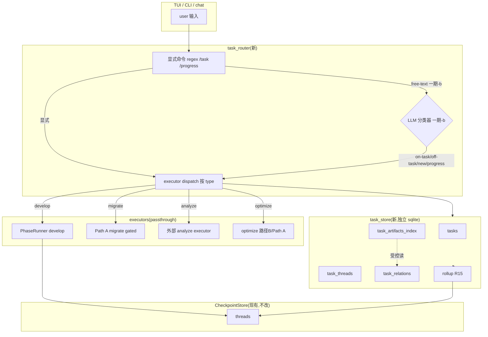
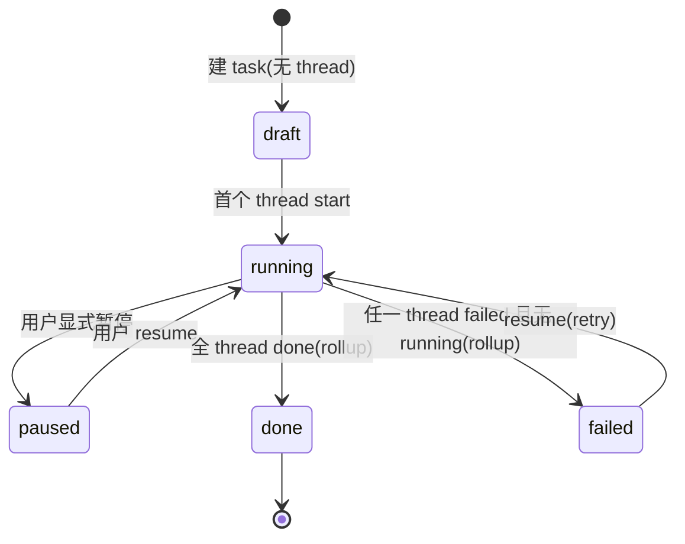

# feat: 任务管理层 + 交互路由

## Summary

在 ascend agent 之上加 runtime 任务层(不自建 domain flow,4 type passthrough 到执行器):task store(独立 sqlite,sit CheckpointStore 之上)+ typed graph 关系 + 任务级上下文隔离 + 意图路由分类器。按 origin phased-delivery 拆两期:一期-a 验证痛点(task list/选/查 + develop 复用 + 显式命令 + falsifier gate),一期-b 全层(typed graph + isolation + LLM 分类器,默认 explicit-only)。

---

## Problem Frame

origin brainstorm(经 2 轮 5-persona review 收敛)定义:现状三种交互不统一(`op:`/CLI/chat)、无任务抽象(上下文 bleed)、无结构化进展查询、性能分析/优化无 first-class 通道。本层把"任务"做成 first-class,统一入口 + 隔离上下文 + 显式跟踪。层 = runtime passthrough(4 type 路由到 PhaseRunner/Path A/外部 executor,不自建 domain flow),对齐 positioning pivot。

---

## Requirements

### 任务模型与 store

- R1. task = (type ∈ {migrate, analyze, optimize, develop}, object payload, state, context, relations);独立 task store(sit CheckpointStore 之上,不重写)。
- R2. 任务关系 = typed graph 一期 `spawned-by` / `depends-on`(`related-to` / `blocks` / `supersedes` 延后);suggest + 用户确认(非 silent)+ 手动 add/remove。
- R3. 关联任务经 `spawned-by` 表达父子;不同任务独立进行(无隐式阻塞,除非 `depends-on`)。
- R4. task 坐 CheckpointStore thread 之上(1 task = 1+ threads,task_threads 映射表)。

### 交互路由

- R5. 显式选/切 active task;路由分类 on-active-task / off-task / new-task / progress-query;**hybrid**:显式命令 bypass + LLM free-text + 低置信默认 on-active-task + disambiguation;**opt-out**(always-on-task / explicit-only,一期-b 默认 explicit-only)。
- R6. off-task 简答 + 软牵引(nudge off/soft/firm 可配,默认 soft);一期宽松。
- R7. new-task 拆解诉求 → 识别 type + object → 建 task + 自动 suggest 关系(用户确认)→ 设 active。
- R8. progress-query = net-new 聚合(读 R15 rollup single-source + 关系遍历 + 产物索引,sit above `list_pending`,需扩 list_all_threads 含 done)。

### 上下文隔离

- R9. active task context(memory + 对话 + checkpoint)为执行主域,不混入其他 task context。
- R10. 受控跨任务读:按 `depends-on` 读关联 task 产物;`related-to` 权限随关系延后。

### 任务类型(passthrough)

- R11. migrate → Path A(delivery-gated,Path A plan-done + executor spike 通过前不启动)。
- R12. analyze → 外部 executor(本层不自建 flow,边界 vs Path A inline 诊断:独立 analyze = 模型级独立性能分析)。
- R13. optimize → 算子开发(路径 B)/ Path A native-composition(边界 vs Path A inline 优化:独立 optimize = 脱离迁移的瓶颈算子替换/新实现)。
- R14. develop → PhaseRunner 复用(`op:` flow)。

### 生命周期

- R15. task state = R15 rollup(running/done/failed 自 thread states)+ task-layer-native(draft/paused,CheckpointStore 无这俩);混合优先级 `running > waiting_confirm > failed > paused > done`。

### 门控

- R16. 一期-a → 一期-b go/no-go falsifier gate:dogfood 度量(用户自发切任务 ≥N 次/周 或 手动 juggling 投诉超阈值);未达则 abandon task 层(task 层 kill-switch,R5 fallback 只管 router)。

---

## Key Technical Decisions

- **KTD1 — task store = 独立 sqlite** (`~/.ascend_op_agent/tasks.db`):非 extend CheckpointStore;**独立 db 真实理由 = task 层 kill-switch 隔离**(R16 abandon 时可整库 drop 不动 CheckpointStore)+ 保 R12 "不重写" 不变式。**CheckpointStore 只加 read-only 方法(如 `list_all_threads`),不改 `list_pending`/`save`/`resume` 语义** + byte-identical 回归测试守门。tables(一期-a): tasks / task_threads(`task_relations` 推 U5,`task_artifacts_index` 推 U6/U8)。
- **KTD2 — 意图分类 = hybrid**:显式命令(`/task` `/progress`)regex bypass(一期-a 唯一路径)+ LLM free-text 分类(一期-b)+ 低置信默认 on-active-task + disambiguation prompt。
- **KTD3 — task state = rollup + native**:running/done/failed 自 thread states rollup;draft(无 thread)/paused(用户标志)= task-layer-native(无 thread analog);混合优先级 deterministic。
- **KTD4 — 关系 = suggest + confirm**:LLM 分析新 task + active context 推荐 spawned-by/depends-on,用户确认才落库(非 silent auto-build,origin success criteria ≥80% 建议准确率)。
- **KTD5 — 上下文隔离 = task-scoped + 受控跨任务读**:active task 执行 context task-scoped;跨任务读按 depends-on 读关联 artifacts(不混执行上下文)。
- **KTD6 — phasing = 一期-a 验证痛点 → 一期-b 全层**:一期-a 显式命令 + develop 复用 + falsifier gate;一期-b graph + isolation + LLM 分类器。
- **KTD7 — 一期-b classifier 默认 explicit-only**:fixture 校准达阈后再 default-on;规避 off-task 误伤。
- **KTD8 — migrate/analyze/optimize = passthrough**:本层不自建 flow;migrate delivery-gated on Path A。

---

## High-Level Technical Design

任务状态机(R15 rollup + native):

---

## Implementation Units

> **模块子集标注**:一期-a 仅创建 U1-U4 涉及的 6 模块(`store`/`models`/`rollup`/`progress`/`executor_dispatch`/`commands`);`relations`/`relation_builder`/`context_scope`/`intent_classifier` 随 U5-U8 增量建,不在 一期-a 落地。

### 一期-a(验证痛点)

### U1. Task store + task 模型 + R15 rollup

- **Goal:** 独立 task store(sqlite)+ task/thread 数据模型 + R15 state rollup。
- **Requirements:** R1, R4, R15。
- **Dependencies:** 无(基础层,U2-U8 依赖)。
- **Files:** `src/ascend_op_agent/task_store/__init__.py`、`src/ascend_op_agent/task_store/store.py`、`src/ascend_op_agent/task_store/models.py`、`src/ascend_op_agent/task_store/rollup.py`、`tests/unit/test_task_store.py`、`tests/unit/test_rollup.py`。
- **Approach:** KTD1 独立 sqlite(`~/.ascend_op_agent/tasks.db`,WAL + busy_timeout,镜像 CheckpointStore 模式)。tables(一期-a):tasks(id/type/object_payload/state_native/created_at)、task_threads(task_id/thread_id);`task_relations` 推 U5、`task_artifacts_index` 推 U6/U8(随 writer 落,一期-a 不建)。KTD3 rollup 函数:running/done/failed 自 CheckpointStore thread states(pending/running/waiting_confirm/done/failed)rollup;draft/paused task-layer-native(state_native 字段);混合优先级 deterministic。**cross-db 读协议**:rollup 先查 CheckpointStore(thread status 权威,PhaseRunner 写)再查 task_threads;加跨读测试(两次读之间 mutate CheckpointStore status,断言 rollup 反映 live 值);rollup = best-effort eventually-consistent,**永不持久化为 source of truth**(只实时计算)。
- **Patterns to follow:** `orchestrator/checkpoint.py`(sqlite + WAL + busy_timeout + schema_version)。
- **Test scenarios:**
  - Happy:建 task + 关联 3 thread(各 status)→ rollup 按 R15 优先级出正确 state。Covers AE12.
  - Edge:draft = task 无 thread → state=draft;paused = 用户标 state_native=paused(无 thread 暂停机制)。
  - Edge:混合(running + failed + waiting_confirm)→ 优先级 running 胜出。
  - Error:thread_id 不存在于 CheckpointStore → rollup 标 task inconsistent + warn。
  - Integration:task→thread join 查询正确。
- **Verification:** rollup 对 5 state + 4 混合组合全覆盖;task store CRUD 单测全过。

### U2. Progress-query 聚合(R8 net-new)

- **Goal:** 实现 R8 progress-query,net-new 聚合 sit above list_pending。
- **Requirements:** R8。
- **Dependencies:** U1。
- **Files:** `src/ascend_op_agent/task_store/progress.py`、`tests/unit/test_progress.py`、`tests/integration/test_progress_aggregation.py`。
- **Approach:** aggregator = 读 U1 rollup 的 task state(single source,不重算)+ 关系遍历(一期-a relations 空)。**一期-a progress 不含 artifact index**(只 state/阶段/子任务;artifact index 随 U6/U8 writer 落);需扩 CheckpointStore 加 `list_all_threads`(含 done,现 `list_pending` 过滤 done;加新 read-only 方法,保 R12/KTD1)。
- **Patterns to follow:** `orchestrator/checkpoint.py` `list_pending`(模式 + 扩展为新方法)。
- **Test scenarios:**
  - Happy:3 task(各含 thread + artifact)→ progress-query 列表 + 单任务进展(state + 阶段 + 子任务 + 产物)。Covers AE5.
  - Edge:空 task list → 进展报告空(不崩)。
  - Edge:task 无 thread(draft)→ 进展标 draft。
  - Error:artifact 路径失效 → 进展标 missing 不崩。
  - Integration:progress 读 rollup(single source,验证不重算)。
- **Verification:** progress 报告 schema 完整 + 读 R15 rollup 不重算。

### U3. Develop 任务路由(复用 PhaseRunner)

- **Goal:** develop type task → 路由 PhaseRunner(op: flow 复用),task 关联 thread。
- **Requirements:** R14。
- **Dependencies:** U1。
- **Files:** `src/ascend_op_agent/task_router/__init__.py`、`src/ascend_op_agent/task_router/executor_dispatch.py`、`tests/unit/test_executor_dispatch.py`、`tests/integration/test_develop_dispatch.py`。
- **Approach:** dispatcher 按 task.type 路由;develop → 调 backend `_handle_run_conversation` 的 op: 路径(PhaseRunner.invoke(user_input, thread_id)),task 经 task_threads 关联该 thread。**插入点(定)**:task 层只接 non-op: 输入(op: 仍直走 PhaseRunner,保兼容);develop type 时 dispatch 内转 op: 调用。一期-a 只实现 develop(passthrough),migrate/analyze/optimize stub(标 "gated"/"需 一期-b 或 Path A")。
- **Patterns to follow:** `backend.py` `_handle_run_conversation` op: 前缀路由(`backend.py:113`)+ `session.resume_with_input` HITL。
- **Test scenarios:**
  - Happy:develop task("开发 add 算子")→ PhaseRunner.invoke 被调 + thread 关联 task。Covers AE8.
  - Edge:unknown type → dispatcher 报 "unsupported type"。
  - Error:PhaseRunner 不可用(orchestrator=None)→ task 标 failed + 报错。
  - Integration:develop task 端到端(invoke + thread 关联 + 进展可查)。
- **Verification:** develop task 端到端跑通 + thread 正确关联 task。

### U4. 显式命令 + 一期-a falsifier gate

- **Goal:** 显式 `/task` `/progress` 命令(TUI/chat + CLI)+ 一期-a dogfood falsifier 度量。
- **Requirements:** R5(一期-a explicit-only 部分)、R7(explicit new-task)、R16(falsifier)。
- **Dependencies:** U1, U2, U3。
- **Files:** `src/ascend_op_agent/task_router/commands.py`、`src/ascend_op_agent/cli.py`(改,加 `task` 子命令组)、`tests/unit/test_commands.py`、`tests/integration/test_task_commands.py`、`scripts/falsifier_baseline.py`(dogfood 度量脚本)。
- **Approach:** 显式命令解析(`/task list` `/task <id>` `/task new <type>` `/progress`)→ 一期-a 不经 LLM 分类器(纯命令);active task 选择 + 持久化(active task id);falsifier = `falsifier_baseline.py` 度量 dogfood 2 周(自发切任务次数 / 手动 juggling 投诉),产 baseline 报告;未达阈值 → 触发 R16 abandon 决策。
- **Patterns to follow:** `cli.py` `@click.group` 子命令模式(`run`/`viewer`)。
- **Test scenarios:**
  - Happy:`/task list` 列任务;`/task <id>` 切 active;`/progress` 查进展;`/task new develop` 建任务。Covers AE2, AE5.
  - Edge:无 active task 时 `/progress` → 提示先选。
  - Error:未知命令 → help。
  - Integration:一期-a 端到端(列/选/查/develop 跑通)。
  - Falsifier:`falsifier_baseline.py` 产出 baseline 报告(切任务次数 + 投诉计数)。
- **Verification:** 显式命令全通 + falsifier 脚本产 baseline(供 一期-a→b gate 决策)。

### 一期-b(全层)

### U5. Typed graph + 关系 suggest+confirm

- **Goal:** typed graph(spawned-by/depends-on)+ LLM suggest + 用户确认 + 手动 add/remove。
- **Requirements:** R2, R3, R7(new-task auto-relation)。
- **Dependencies:** U1, U4。
- **Files:** `src/ascend_op_agent/task_store/relations.py`、`src/ascend_op_agent/task_router/relation_builder.py`、`tests/unit/test_relations.py`、`tests/unit/test_relation_builder.py`、`tests/integration/test_relation_lifecycle.py`。
- **Approach:** KTD4 task_relations 填充(src_task_id/dst_task_id/relation_type);relation_builder = LLM 读新 task + active task context 推荐 spawned-by/depends-on(低置信不推荐),用户 `/task link` 确认才落库(非 silent);手动 `/task link/unlink`;循环检测(拒循环关系);related-to/blocks/supersedes 延后(无 2nd consumer)。
- **Patterns to follow:** `orchestrator/cannbot_loader.py` description-triggered routing(LLM 读 context 推荐 skill 模式)。
- **Test scenarios:**
  - Happy:新 analyze task(active=migrate)→ LLM suggest spawned-by migrate → 用户确认 → 落库。Covers AE3.
  - Happy:手动 `/task link <a> <b> depends-on` → 落库。Covers AE6.
  - Edge:LLM 低置信 → 不 suggest(不 silent 落)。
  - Error:循环关系(a spawned-by b, b spawned-by a)→ 拒。
  - Integration:suggest 准确率 fixture ≥80%(一期-b success criteria)。
- **Verification:** suggest 非 silent + 准确率 ≥80% + 无循环。

### U6. 上下文隔离 + 受控跨任务读

- **Goal:** active task context task-scoped 隔离 + depends-on 受控读关联产物。
- **Requirements:** R9, R10。
- **Dependencies:** U1, U5。
- **Files:** `src/ascend_op_agent/task_router/context_scope.py`、`tests/unit/test_context_isolation.py`、`tests/integration/test_cross_task_read.py`。
- **Approach:** KTD5 active task 执行时 context = task-scoped;**一期-b 用 thread-scoped memory(filter by thread_id,现有,无 schema 改)兜底 R9**(task_id 维度 memory 隔离 deferred —— 实测 thread-scoped 不足再加,避免 net-new memory schema);对话 thread-scoped;checkpoint thread-scoped via PhaseRunner。受控跨任务读 = 按 depends-on 关系读关联 task 的 artifacts(经 task_artifacts_index,U6/U8 writer 标),不混入执行上下文;related-to 无读权限(随关系延后)。
- **Patterns to follow:** `backend.py` `_handle_run_conversation` thread-scoped 执行模式。
- **Test scenarios:**
  - Happy:active migrate 执行,analyze task 的 context(对话/memory)不混入 migrate 执行上下文。Covers AE11.
  - Integration:analyze depends-on migrate → analyze 执行时读 migrate 的迁移报告(受控跨任务读)。Covers AE4.
  - Edge:active task 无 depends-on 关系 → 跨任务读拒绝。
  - Error:artifact 不存在 → 读返回 missing 不崩。
- **Verification:** 隔离单测(active 执行无其他 task context 泄漏)+ depends-on 受控读通。

### U7. LLM 路由分类器 + fallback + opt-out

- **Goal:** LLM 意图分类 + 低置信 fallback + nudge + opt-out 模式。
- **Requirements:** R5(一期-b LLM 部分)、R6。
- **Dependencies:** U4(explicit commands 一期-a)、U6(context for classification)。
- **Files:** `src/ascend_op_agent/task_router/intent_classifier.py`、`tests/unit/test_intent_classifier.py`、`tests/integration/test_routing.py`。
- **Approach:** KTD2 hybrid:显式命令 regex bypass(U4)+ LLM free-text 分类(4 类)+ 低置信默认 on-active-task + disambiguation prompt;off-task → 简答 + 软牵引(KTD nudge off/soft/firm 可配,默认 soft);KTD7 opt-out = always-on-task / explicit-only 配置,一期-b 默认 explicit-only(fixture 校准达阈后 default-on)。
- **Patterns to follow:** `agent/prompt_builder.py`(LLM 调用)+ `orchestrator/cannbot_loader.py` description routing。
- **Test scenarios:**
  - Happy:on-task 输入 → 在 active context 执行;off-task(明显闲聊)→ 简答 + 牵引。Covers AE1.
  - Happy:new-task("帮我迁这个模型")→ 拆解建 task。Covers AE2.
  - Edge:低置信 → 默认 on-active-task + disambiguation prompt(不 silent spawn)。
  - Error:LLM 不可用(timeout)→ 默认 on-active-task(不崩)。
  - Integration:explicit-only 模式下 free-text 不分类(只显式命令生效)。
- **Verification:** 误判率 plan 实测校准 + off-task 不误伤 on-task + opt-out 模式可切。

### U8. Migrate/analyze/optimize passthrough executor 接入

- **Goal:** dispatcher 扩 migrate(Path A delivery-gated)/ analyze / optimize passthrough。
- **Requirements:** R11, R12, R13。
- **Dependencies:** U3(dispatch 框架)、Path A delivery gate。
- **Files:** `src/ascend_op_agent/task_router/executor_dispatch.py`(扩,加 3 type 分支)、`tests/unit/test_executor_dispatch.py`(扩)、`tests/integration/test_passthrough_dispatch.py`。
- **Approach:** KTD8 dispatcher 扩 3 type:migrate → Path A(plan-done + executor spike 通过后启用,delivery gate;未通过 → task 标 "gated, 不可启动");analyze/optimize → 外部 executor(passthrough,本层不自建 flow);R12/R13 边界 vs Path A inline(独立 task = 脱离迁移单跑)。
- **Patterns to follow:** U3 dispatch 模式。
- **Test scenarios:**
  - Happy:Path A gate 通过 → migrate task 可启动 → 路由 Path A。
  - Edge:gate 未通过 → migrate task 报 "gated on Path A" + 不可启动。
  - Happy:analyze task → passthrough 到外部 executor(接口约定)。
  - Error:外部 executor 不可用 → task failed + 报错。
  - Integration:4 type 全可路由(develop/migrate 实跑;analyze/optimize passthrough)。
- **Verification:** 4 type 全 dispatch 通;migrate gate 可强制禁用。

---

## Acceptance Examples

- AE1. off-task(闲聊)→ 简答 + 软牵引回 active task。Covers R5, R6. (U7)
- AE2. "帮我迁这个模型" → new-task → 建 migrate task + 设 active。Covers R7. (U4 一期-a explicit / U7 一期-b LLM)
- AE3. 迁移中发现瓶颈 → suggest analyze task(spawned-by migrate)+ 用户确认。Covers R2, R3, R7. (U5)
- AE4. analyze depends-on migrate → 读 migrate 报告(受控跨任务读)。Covers R10. (U6)
- AE5. "进展怎么样" → 列任务 + active 进展。Covers R8. (U2 aggregator / U4 command surface)
- AE6. 手动 add relation:optimize depends-on analyze。Covers R2. (U5)
- AE7. paused task → resume → 从 checkpoint 续跑。Covers R15. (U3 resume 执行 via resume_with_input;U1 只 own state rollup)
- AE8. "开发 add 算子" → new-task develop → PhaseRunner。Covers R1, R14. (U3)
- AE9. analyze passthrough 路由(脱离迁移单跑)。Covers R12. (U8)
- AE10. optimize passthrough(读 analyze 报告 → 路径 B/native-composition)。Covers R13. (U8)
- AE11. active migrate 执行时 analyze context 不混入(隔离)。Covers R9. (U6)
- AE12. migrate task 跨 3 thread,task state = rollup。Covers R4, R15. (U1)

---

## Scope Boundaries

### Phased delivery(origin 继承,一期-a → 一期-b go/no-go gate)

- 一期-a:U1-U4(task store + progress + develop 复用 + 显式命令 + falsifier)。**不含 migrate/optimize**(gated on Path A)。
- 一期-b:U5-U8(typed graph + isolation + LLM 分类器 + passthrough 接入)。**默认 explicit-only 模式**(fixture 达阈后 default-on 分类器)。
- go/no-go gate(R16):一期-a dogfood 度量未达阈值 → abandon task 层,记录 finding(R5 fallback 只管 router,本 gate 是 task 层 kill-switch)。

### Deferred to Follow-Up Work

- analyze/optimize 内部 flow(本 plan passthrough,flow 在 Path A / 外部 executor plan)。
- related-to / blocks / supersedes 关系类型(延到出现 2nd consumer)。
- 任务图可视化(一期 CLI/TUI 文字)。
- LLM 分类器 default-on(一期-b 默认 explicit-only,fixture 校准后切)。

### Outside this product's identity

- 通用 chat bot(off-task 软牵引回任务)。
- 多用户协作 / 任务调度优先级队列(一期单用户、手动驱动)。

---

## Risks & Dependencies

- **高风险 — LLM 意图分类准确率**:U7 hybrid + fallback + opt-out(explicit-only 默认)缓解;fixture 校准 + 一期-b 默认 explicit-only 规避误伤。
- **高风险 — task 层本身无 falsifier**:R16 go/no-go gate(U4 falsifier_baseline)是 task 层 kill-switch;一期-a 验证痛点,未达则 abandon。
- **风险 — task store 独立 sqlite vs CheckpointStore 一致性**:两 db 跨进程;WAL + busy_timeout + task_threads 映射表保一致性。PhaseRunner thread 状态变更需 task store rollup 能读到(读 CheckpointStore,非自身缓存)。
- **风险 — Path A 未建**:U8 migrate delivery-gated;Path A plan-done + executor spike 通过前 migrate task 不可启动。
- **依赖**:PhaseRunner(`orchestrator/state_machine.py`,develop)、Path A(`docs/plans/2026-07-07-001-...`,migrate,delivery-gated)、CheckpointStore(`orchestrator/checkpoint.py`,task 坐其上,R15 rollup 数据源)、backend.py:113(dispatch 插入点)。

---

## System-Wide Impact

- 新增 `task_router/` + `task_store/` 包 + `~/.ascend_op_agent/tasks.db`,不动 `orchestrator/` 现有模块(纯复用 PhaseRunner/CheckpointStore)。
- backend.py `_handle_run_conversation` 插入 task 路由层(**在 op: 分发之后**:task 层只接 non-op: 输入,op: 仍直走 PhaseRunner;develop type 时 task 层 dispatch 转 op: 调用,不污染 op: 分发)。
- cli.py 加 `task` 子命令组(U4),不改现有 `run`/`viewer`。
- 不影响现有 ship gate —— task 层有自己的 falsifier(U4),不并入 P0/P1 gate。

---

## Open Questions

### Resolve Before Planning(无 — 全下方 deferred)

### Deferred to Planning / Implementation

- ~~backend.py task 路由插入点~~ **已定**(见 U3 Approach + System-Wide Impact):task 层接 non-op:,develop type 转 op: 调用,op: 仍直走 PhaseRunner。
- task store schema 细节(索引、外键、migrations 版本)。
- falsifier 阈值具体数字(一期-a dogfood 后定)。
- LLM 分类器 prompt 模板 + fixture 标注集。
- analyze/optimize 外部 executor 接口约定(本层 passthrough 的 contract)。

---

## Sources / Research

- Origin: `docs/brainstorms/2026-07-08-001-feat-task-management-layer-requirements.md`(经 2 轮 5-persona review,24 处修订落地)。
- 现有 routing:`backend.py:113`(`op:` 前缀 → orchestrator,else → 通用 agent)—— task 路由插入点。
- CheckpointStore thread 级:`orchestrator/checkpoint.py:5-7,56-76`(`thread_id` PK,status enum pending/running/waiting_confirm/done/failed —— 无 paused/draft,R15 这俩 task-layer-native)。
- PhaseRunner:`orchestrator/state_machine.py:134,144`(invoke/resume with thread_id,U3 develop 复用)。
- Path A:`docs/plans/2026-07-07-001-feat-path-a-model-migration-plan.md`(U8 migrate delivery-gated on Path A)。
- verifier 核验(本会话):CheckpointStore/PhaseRunner/Path A/backend.py:113 全 confirmed;task 层 clean additive(替一行 dispatch + 加独立 store,非 rework)。
