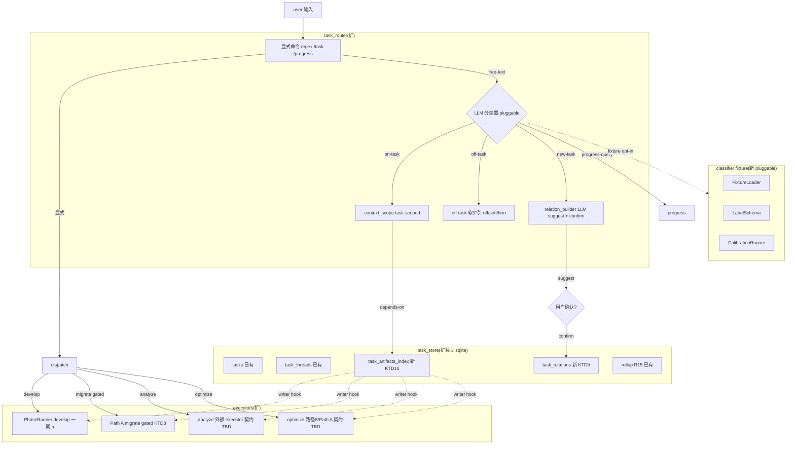
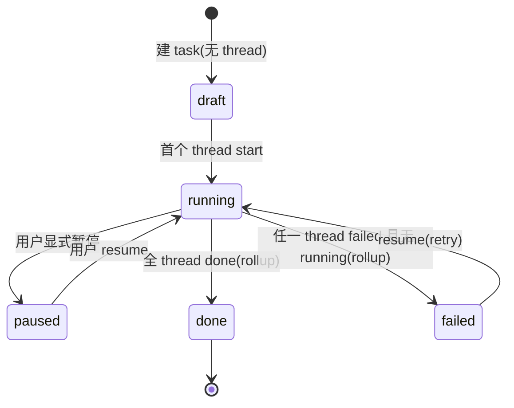

# 任务管理层一期-b

## Summary

在已 ship 的一期-a(task store + 显式命令 + falsifier,2026-07-08 merge 到 develop)之上,接续一期-b ——

- **typed graph**:任务关系 `spawned-by` / `depends-on`,LLM suggest + 用户确认(KTD4),手动 add/remove + 循环检测
- **上下文隔离**:active task 上下文 task-scoped(KTD5 兜底实现 = thread-scoped memory filter),`depends-on` 受控读关联产物
- **LLM 路由分类器**:pluggable fixture framework + happy-path coverage,默认 **explicit-only**(KTD7),fixture 校准达阈后切 default-on
- **4-type executor passthrough**:develop→PhaseRunner(已 ship)、migrate→Path A(delivery-gated,KTD8)、analyze/optimize→外部 executor(契约待定,plan-time spec 接口)

task 层 = runtime passthrough,不自建 domain flow(对齐 positioning pivot)。

## Origin & Predecessor

- **Origin**(产品意图 + AE):`docs/brainstorms/2026-07-08-001-feat-task-management-layer-requirements.md`
- **Predecessor**(KTD + HTD + U5-U8 design sketches + Scope Boundaries "一期-b" 段):`docs/plans/2026-07-08-001-feat-task-management-layer-plan.md`
  - 本 plan 继承该文档的 KTD1-KTD8 + HTD + state machine;**新增** Implementation Unit 详细结构 + 测试场景 + 处理 scope guardian 6 findings + cross-db 一致性 + missing memory schema 风险
  - 该 predecessor 文档的 U5-U8 design sketches **应删除或 redirect 到本 plan**(避免双源)

---

## Problem Frame(继承 origin,补一期-a ship 后现状)

origin 已定义痛点(三种交互模式不统一 / 无任务抽象 / 无结构化进展查询 / 性能分析优化无 first-class flow)。一期-a ship 解决了:

- ✓ 任务抽象(R1)+ 显式选/切 active + 4 type 接入 develop
- ✓ progress-query(R8)+ 显式 `/task` `/progress` 命令
- ✓ falsifier baseline(R16 gate 起点)

一期-b 解决的 gap:

- **关系缺失**:多任务并行时无法表达 spawned-by / depends-on,关联靠人脑记(R2)
- **LLM 分类缺失**:free-text 输入无分类,on/off/new/progress 全靠显式命令规避(R5/R6)
- **隔离缺失**:active task 执行时其他 task context 可能 bleed(R9)
- **受控跨任务读缺失**:analyze task 无法读 migrate 报告除非手动复制(R10)
- **migrate/analyze/optimize 仅 develop 可启**:其他 3 type 一期-a gated(R11/R12/R13)

痛点验证(go/no-go):一期-a dogfood 须达 R16 gate(`spontaneous_task_switches ≥ 阈值` 或 `context_juggling_complaints > 0`)才进 一期-b;未达则 abandon task 层。

---

## Requirements(继承 origin R2/R3/R5/R6/R7/R9/R10/R11/R12/R13 + R16)

- **R16**(继承 origin Scope Boundaries "Phased delivery" 段,见 `docs/brainstorms/2026-07-08-001-feat-task-management-layer-requirements.md` "Phased delivery" 段 + predecessor KTD6):task 层 go/no-go gate —— 一期-a dogfood 须出 measurable 痛点验证(`spontaneous_task_switches ≥ 阈值` 或 `context_juggling_complaints > 0`),未达则 abandon task 层,记录 finding(R5 fallback 只管 router,本 gate 是 task 层 kill-switch)。本 plan 不阻塞:R16 gate 是 **gating 条件**,不是 in-plan deliverable;但 U5-U8 都 ship 须假定 R16 gate 通过(否则全 abandon)。

- **R2**. 任务关系 = typed graph:一期 `spawned-by` / `depends-on`(各 ≥1 consumer);`related-to` / `blocks` / `supersedes` 延后到出现第 2 个 consumer。agent 自动 **suggest + 用户确认**(非 silent auto-build)+ 用户手动 add/remove。
- **R3**. 一个任务可含多个关联任务(`spawned-by` 边表达父子);不同任务独立进行(无隐式阻塞除非 `depends-on`)。
- **R5**. 用户显式选/切 active task;agent 路由分类用户输入为 on-active-task / off-task / new-task / progress-query。**兜底**:低置信默认 on-active-task + disambiguation prompt;**opt-out**:配置 always-on-task / explicit-only,**一期-b 默认 explicit-only**(KTD7),fixture 校准达阈后再 default-on。
- **R6**. off-task(闲聊):简答 + 软牵引回 active task;**nudge 模式可配**(off/soft/firm,默认 soft)。
- **R7**. new-task:agent 拆解诉求 → 识别 type + object → 建 task + 自动关系 → 设为 active。
- **R9**. active task context 为执行主域(memory + 对话 + checkpoint),执行时不混入其他任务 context。
- **R10**. 受控跨任务读:agent 按关系图读关联任务产物;`depends-on` 可读关联产物;`related-to` 权限随该关系本身延后。
- **R11**. **migrate**:输入 model repo + 入口脚本 + 可选 profiling;输出 NPU 适配脚本 + 迁移报告。复用 Path A。
- **R12**. **analyze**:输入 model/op + 可选 profiling;输出分析报告。**边界 vs Path A**:Path A 内置诊断(inline);独立 analyze task 脱离迁移单跑。passthrough 到外部 executor。
- **R13**. **optimize**:输入 analyze 报告 / 瓶颈 op;输出优化 + 优化报告。**边界 vs Path A**:Path A 内置优化(inline);独立 optimize task 脱离迁移单跑,passthrough 到路径 B 或 Path A。

成功标准(origin):
- 任务关系 suggest 准确率(spawned-by / depends-on)≥ 80%(对比手工标注,fixture 校准)
- off-task 软牵引不误伤 on-task(误判率实测校准,一期宽松)
- 任务上下文隔离:active 执行不混入其他 task context(单测)
- 4 type 可独立 start + 各自产出报告/产物

---

## Key Technical Decisions

**继承自 predecessor(KTD1-KTD8,见 predecessor 文档 § KTD)**:

- **KTD1** task store = 独立 sqlite(Kill-Switch 隔离)
- **KTD2** 意图分类 = hybrid(显式 regex + LLM free-text)
- **KTD3** task state = rollup + native
- **KTD4** 关系 = suggest + confirm(非 silent)
- **KTD5** 上下文隔离 = task-scoped + 受控跨任务读
- **KTD6** phasing = 一期-a 验证痛点 → 一期-b 全层
- **KTD7** 一期-b classifier 默认 explicit-only
- **KTD8** migrate/analyze/optimize = passthrough;migrate delivery-gated on Path A

**新增(本 plan 范畴)**:

- **KTD9 — task_relations = adjacency table on tasks.db**:非 in-task JSON column。schema = `(src_task_id, dst_task_id, relation_type, confidence, created_at, created_by)`;索引 `(src_task_id)` + `(dst_task_id, relation_type)`;FK 不强制(允许 dangling,记录 audit)。理由:支持反向遍历(R10 跨任务读 `dst.depends-on → src.产物`)+ 索引高效 + 跨 db 仍单源。
- **KTD10 — 受控跨任务读 = artifact registry,不直读 src task context**:`task_artifacts_index` 表 `(task_id, artifact_type, path, written_by, written_at)` + writer hook(U5 relation builder / U8 dispatch executor 在 task 终态时写)。读权限由 U6 解析关系图决定(只 `depends-on` 边的 dst task 可读 src 的 artifacts);读 = `get_artifacts(task_id)`,不复制到执行上下文。理由:避免 memory schema 改动(对齐 missing memory schema 风险) + 单源 products。
- **KTD11 — Cross-db 一致性 = 复用已 ship 的 CheckpointStore.list_all_threads() + 任务侧 thread_id 过滤**:CheckpointStore 已 ship 无参 `list_all_threads()`(`checkpoint.py:374`),不动其签名、不改 `list_pending`/`save`/`resume` 语义。task store 读 = `get_task_threads(task_id)` 拿 task→thread_id 映射 → `list_all_threads()` 拿全部 threads → 任务侧按 thread_id 过滤(KTD1 任务-线程映射表即为此设计,rollup.py 已用 `thread_status_fn` 模式)。busy_timeout 30s + IMMEDIATE 事务保锁竞争不退化。理由:不动 CheckpointStore(KTD1)+ 不引入 task_id-parameterized 签名(避免与 KTD1 kill-switch 隔离矛盾)+ 跨 db 读 = 单 pass + 任务侧 filter,eventual consistency 与 thread-state 变更并发(声明 staleness 容忍窗口 = rollup 周期)。
- **KTD12 — Fixture framework = pluggable**:`FixtureLoader` + `LabelSchema`(on-task/off-task/new-task/progress-query + optional nudge flag)+ `CalibrationRunner`(对比 fixture labels vs classifier predictions,产 accuracy 报告);CLI flag `--classifier-fixture <path>` opt-in;默认 explicit-only 仍走 KTD7。理由:fixture 数据渐进扩充 + dogfood opt-in 测可达性 + 80% 校准 follow-up。
- **KTD13 — Classifier timeout = 默认 on-active-task + 软牵引提示**:LLM 不可用 / 超时(>5s)→ 默认 on-active-task(不崩)+ 输出"分类超时,已按 active task 处理"。理由:R5 兜底 + UX 不阻塞。

---

## High-Level Technical Design

一期-b 在 predecessor HTD 基础上扩展(以下为新增/调整部分,完整图见 predecessor):

任务状态机(R15 + 一期-b 增 paused/resume,见 predecessor,本 plan 沿用):

---

## Implementation Units

> U-ID 沿用 predecessor(U5-U8),稳定不重排。本 plan 把 predecessor 的 design sketch 扩成完整结构。

---

### U5. Typed graph + 关系 suggest+confirm

- **Goal**:实现 `spawned-by` / `depends-on` typed graph(adjacency 表),LLM suggest + 用户确认 + 手动 add/remove/edit + 循环检测。
- **Requirements**:R2, R3, R7(new-task auto-relation)。
- **Dependencies**:U1, U4(task_store + commands 已 ship)。
- **Files**:
  - `src/ascend_op_agent/task_store/relations.py`(新)
  - `src/ascend_op_agent/task_router/relation_builder.py`(新)
  - `src/ascend_op_agent/task_router/commands.py`(扩,加 `link` / `unlink` / `suggest` 命令)
  - `src/ascend_op_agent/cli.py`(扩,`task link/unlink/suggest` 子命令)
  - `tests/unit/test_relations.py`(新)
  - `tests/unit/test_relation_builder.py`(新)
  - `tests/integration/test_relation_lifecycle.py`(新)
- **Approach**:
  - KTD9 adjacency 表:`(src_task_id, dst_task_id, relation_type, confidence, created_at, created_by, updated_at)`,FK 不强制
  - `relation_builder` = LLM 读新 task `object_payload` + active task context,推荐 spawned-by/depends-on(KTD4 suggest + confirm,非 silent)
  - **低置信不 recommend**(threshold 由 fixture 校准,默认 0.6 占位)
  - 循环检测:`add_relation` / `edit_relation` 前 DFS 检查 src↔dst 是否产生环;**DFS scope = per relation_type**(spawned-by 与 depends-on 各成独立 DAG,KTD9 表同存但 cycle detection 按 type 隔离;见 Test scenarios 锁);有则 raise `RelationCycleError`
  - 手动命令:`task link <src> <dst> <relation-type> [--confidence N]` / `task unlink <src> <dst>` / **`task edit-relation <src> <dst> --type <new-type> [--confidence N]`**(改 type / confidence,**不删 + 重插**,保留 audit trail + FK 引用;origin R2 显式要求 add/remove/**edit**)
  - user-confirm:relation 仅在 `confirm` 后落库;LLM suggest 输出到 stdout 等 user input
- **Patterns to follow**:
  - `src/ascend_op_agent/task_store/store.py`(sqlite + WAL + IMMEDIATE,见 KTD11)
  - `src/ascend_op_agent/orchestrator/cannbot_loader.py` description-triggered routing(LLM 读 context 推荐模式)
- **Test scenarios**:
  - Happy:新 analyze task(active=migrate)→ LLM suggest spawned-by migrate → 用户 `/task link confirm` → 落库。Covers AE3.
  - Happy:手动 `task link <a> <b> depends-on` → 落库。Covers AE6.
  - Happy:手动 `task edit-relation <a> <b> --type spawned-by --confidence 0.8` → in-place 更新(不删 + 重插,audit trail + updated_at 改)。Covers R2(edit)。
  - Edge:LLM 低置信 → 不 suggest(不 silent 落)。
  - Edge:同一 src→dst 重复 add → idempotent(无重复行)或 raise 由 decide。
  - Edge:**A spawned-by B,B depends-on A**(mixed-type,不构成同 type cycle)→ add 通过(per-type DFS 隔离)。
  - Error:循环关系(a spawned-by b, b spawned-by a)→ `RelationCycleError`(per spawned-by DFS)。
  - Error:`task edit-relation` 目标不存在 → raise。
  - Integration:跨 session 持久化(reopen TaskStore,relation 仍可读)。
- **Verification**:`RelationCycleError` 单测 + happy path 单测(包含 edit 路径)+ per-type DFS 隔离 + fixture-driven suggest 准确率(由 U7 框架支持,本 unit 只验"框架可调用",不验 ≥80%)。

---

### U6. 上下文隔离 + 受控跨任务读

- **Goal**:active task 上下文 task-scoped(KTD5 兜底实现 = thread-scoped memory filter);`depends-on` 受控读关联 task 的产物(经 `task_artifacts_index`,KTD10,不混入执行上下文)。
- **Requirements**:R9, R10。
- **Dependencies**:U1, U5。
- **Files**:
  - `src/ascend_op_agent/task_router/context_scope.py`(新)
  - `src/ascend_op_agent/task_store/artifacts.py`(新,KTD10)
  - `src/ascend_op_agent/task_store/relations.py`(扩,KTD9 — 同时承担跨 db 过滤:rollup 用 `get_task_threads(task_id)` + CheckpointStore `list_all_threads()` + 任务侧 thread_id filter)
  - `tests/unit/test_context_isolation.py`(新)
  - `tests/unit/test_artifacts.py`(新)
  - `tests/integration/test_cross_task_read.py`(新)
- **Approach**:
  - **上下文隔离(KTD5 兜底)**:利用现有 thread-scoped memory / 对话 / checkpoint(均已 thread_id-keyed),active task 执行时 filter `thread_id in task_threads`;**task_id 维度 memory schema 推迟**(origin 已决定)—— 实测 thread-scoped 不足再加
  - **跨任务读(KTD10)**:不复制 src context 到 dst;而是按 `task_artifacts_index` 读 src 标过的产物路径;权限 = U5 解析 `depends-on` 边
  - artifact writer hook:PhaseRunner / Path A / 外部 executor 在 task 终态或阶段性产物产出时调 `artifacts.write(task_id, type, path)`;**本 plan 仅 spec 接口 + 提供 mock writer,具体 executor integration 在 U8 串**
  - **跨 db 读(KTD11)**:复用 ship 的 `CheckpointStore.list_all_threads()`(无参,已 ship)+ 任务侧 filter(thread_id in `get_task_threads(task_id)`);**不修改 CheckpointStore**(KTD1)+ 不引入 task_id-parameterized 签名
  - **byte-identical 回归**(KTD1):`list_pending` / `save` / `resume` 语义 + 输出 + 签名不变;CheckpointStore 完全不动
- **Patterns to follow**:
  - `src/ascend_op_agent/backend/rpc/agent_service.py` `_handle_run_conversation` thread-scoped 执行模式
  - `src/ascend_op_agent/task_store/store.py` WAL + IMMEDIATE 事务模式
- **Test scenarios**:
  - Happy:active migrate 执行,analyze task 的 context(对话 / memory)不混入 migrate 执行上下文。Covers AE11.
  - Integration:analyze depends-on migrate → analyze 执行时按 `task_artifacts_index` 读 migrate 标过的产物路径(受控读,不复制 context)。Covers AE4.
  - Edge:active task 无 `depends-on` 关系 → 跨任务读 API 拒(返回空 + audit log)。
  - Error:artifact 不存在 → 读返回 missing 不崩。
  - Edge:CheckpointStore `list_all_threads()`(shipped,无参)跨 db 读,WAL busy 时不挂死(< 30s timeout);**任务侧 thread_id filter** 在 task_store/relations.py 实现,不污染 CheckpointStore(KTD1)。
- **Verification**:隔离单测(active 执行无其他 task context 泄漏)+ depends-on 受控读通 + CheckpointStore `list_pending` / `save` / `resume` 输出 + 签名 byte-identical(对照 一期-a baseline)+ `list_all_threads()` 签名不被修改。

---

### U7. LLM 路由分类器 + pluggable fixture framework

- **Goal**:实现 intent classifier(on-task / off-task / new-task / progress-query),pluggable fixture 框架(FixtureLoader + LabelSchema + CalibrationRunner,KTD12),low-confidence 兜底(KTD13 timeout/default on-active-task),nudge 模式可配,KTD7 默认 explicit-only 不变。
- **Requirements**:R5(LLM 部分), R6。
- **Dependencies**:U4(显式命令已 ship), U6(context 给 classifier)。
- **Files**:
  - `src/ascend_op_agent/task_router/intent_classifier.py`(新)
  - `src/ascend_op_agent/task_router/fixture.py`(新,FixtureLoader + LabelSchema + CalibrationRunner)
  - `src/ascend_op_agent/task_router/nudge.py`(新,off/soft/firm 模式)
  - `src/ascend_op_agent/agent/prompt_builder.py`(扩,加 classifier prompt section)
  - `src/ascend_op_agent/cli.py`(扩,`--classifier-fixture <path>` opt-in flag + `task calibrate` 子命令)
  - `src/ascend_op_agent/task_router/__init__.py`(扩,导出)
  - `config.yaml`(扩,classifier 配置节:default_mode / nudge_mode / timeout_s)
  - `tests/unit/test_intent_classifier.py`(新)
  - `tests/unit/test_fixture.py`(新)
  - `tests/unit/test_nudge.py`(新)
  - `tests/integration/test_routing.py`(新)
  - `tests/fixtures/classifier_minimal.jsonl`(新,~20 标注示例)
- **Approach**:
  - **Classifier 抽象**:`IntentClassifier.classify(user_input, active_task_context) → (label, confidence, suggested_task_type)`;4 label = on-task / off-task / new-task / progress-query
  - **pluggable fixture**(KTD12):
    - `LabelSchema`:`{"input": str, "active_task_id": str | null, "label": str, "nudge": bool, "confidence": float}`
    - `FixtureLoader.load(path)`:读 JSONL,validate schema,返回 list[LabeledExample]
    - `CalibrationRunner.run(classifier, fixture)`:对每个 example 调 `classify`,对比 label,产 `{accuracy, confusion_matrix, per_label_precision/recall}` 报告
  - **低置信兜底**(KTD13):`confidence < threshold`(默认 0.6)→ 默认 on-active-task + disambiguation prompt(不 silent spawn)
  - **timeout 兜底**(KTD13):LLM 调用 >5s → 默认 on-active-task + 输出 "分类超时,已按 active task 处理"
  - **nudge 模式**(R6):`nudge_mode ∈ {off, soft, firm}`,默认 soft;soft = 简答 + 牵引提示;firm = 简答 + 阻断回 active task
  - **配置**(KTD7 不变):`config.yaml` `classifier.default_mode = "explicit-only"`;一期-b ship 时不切 default-on
  - **CLI opt-in**:`--classifier-fixture <path>` 启用 fixture loader;`task calibrate --fixture <path>` 跑 CalibrationRunner,打印 accuracy 报告
  - **happy-path 覆盖**(本 plan 验收):4 label 各 ≥1 example;低置信 fallback + timeout fallback 各 1 example;explicit-only 模式下 free-text 不分类(走显式命令)
- **Patterns to follow**:
  - `src/ascend_op_agent/agent/prompt_builder.py` LLM 调用模式
  - `src/ascend_op_agent/orchestrator/cannbot_loader.py` description routing
  - `src/ascend_op_agent/task_router/executor_dispatch.py` factory + dependency injection
- **Test scenarios**:
  - Happy:on-task 输入 → 在 active context 执行;off-task(明显闲聊)→ 简答 + 牵引。Covers AE1.
  - Happy:new-task("帮我迁这个模型")→ 拆解建 task。Covers AE2.
  - Edge:低置信 → 默认 on-active-task + disambiguation prompt(不 silent spawn)。
  - Error:LLM 不可用 / timeout → 默认 on-active-task(不崩,KTD13)。
  - Integration:explicit-only 模式下 free-text 不分类(只显式命令生效,KTD7)。
  - Integration:`task calibrate --fixture tests/fixtures/classifier_minimal.jsonl` → 输出 accuracy 报告(KTD12 框架跑通)。
- **Verification**:误判率 plan 实测校准 + off-task 不误伤 on-task + opt-out 模式可切 + fixture 框架 happy-path 通(KTD12 ship 门槛)。**80% 准确率是 follow-up plan 门槛**(非本 unit Verification 字段,见 deferred Q)。

---

### U8. Migrate/analyze/optimize passthrough executor 接入

- **Goal**:dispatcher 扩 3 type 分支(migrate→Path A delivery-gated / analyze→外部 executor / optimize→路径 B 或 Path A);新增 `task_artifacts_index` writer hook(U6 spec 接口的 executor 端)。
- **Requirements**:R11, R12, R13。
- **Dependencies**:U3(dispatch 框架已 ship),U6(artifacts spec),Path A plan-done + executor spike 通过(仅 migrate 启用;analyze/optimize 不依赖 Path A,仅需外部 executor 接口契约)。
- **Files**:
  - `src/ascend_op_agent/task_router/executor_dispatch.py`(扩,加 3 type 分支)
  - `src/ascend_op_agent/task_router/executors/path_a.py`(新,Path A adapter,migrate)
  - `src/ascend_op_agent/task_router/executors/analyze_external.py`(新,analyze passthrough)
  - `src/ascend_op_agent/task_router/executors/optimize_external.py`(新,optimize passthrough)
  - `src/ascend_op_agent/task_router/executor_contract.py`(新,Executor ABC + 契约定义)
  - `tests/unit/test_executor_dispatch.py`(扩,加 3 type)
  - `tests/unit/test_executor_contract.py`(新)
  - `tests/integration/test_passthrough_dispatch.py`(新)
- **Approach**:
  - **dispatch 3 type 分支**:`TASK_TYPE_MIGRATE → Path A adapter`(KTD8 delivery-gated)/ `TASK_TYPE_ANALYZE → analyze_external executor`(契约)/ `TASK_TYPE_OPTIMIZE → optimize_external executor`(契约)
  - **Path A delivery gate**(KTD8):
    - 探测:`Path A availability check`(检查 Path A 入口存在 + executor spike 通过标志 `~/.ascend_op_agent/path_a.spike_passed`)
    - gate 未通过 → migrate task `start` 抛 `TaskGatedError("Path A plan-done + executor spike 通过前 migrate task 不可启动")`,task state 不变(still draft / paused)
    - gate 通过 → 正常 dispatch
  - **Executor 契约**(本 plan spec,实现 follow-up):
    - `Executor.run(task: Task, input: str) → ExecutorResult(artifacts: list[Artifact], report_path: str | None)`
    - `Executor.artifact_writer(task_id) → Callable[[Artifact], None]`(U6 spec 的 writer hook 实例)
    - `analyze_external` / `optimize_external` 默认是 noop adapter + 显式 raise `ExecutorNotImplemented("外部 executor 契约 TBD,follow-up plan 实现")`,确保不 silent fail
  - **artifact writer hook 集成**(U6 KTD10):每个 executor adapter 在 `run()` 末尾调 writer 标 `(task_id, type, path)`;**PhaseRunner 集成在 U8 同期**(让 develop type 也写 artifacts,任务图跨 type 一致)
- **Patterns to follow**:
  - `src/ascend_op_agent/task_router/executor_dispatch.py` 现有 dispatch 模式(U3 已 ship)
  - `src/ascend_op_agent/orchestrator/state_machine.py` PhaseRunner 终态处理模式
- **Test scenarios**:
  - Happy(Path A gated 通过):migrate task → 路由 Path A adapter → 写 artifacts。Covers R11.
  - Edge(Path A gated 未通过):migrate task `start` → `TaskGatedError` + task state 不变 + 错误消息清晰。
  - Happy:analyze task → passthrough `analyze_external` → 契约 raise `ExecutorNotImplemented`(明确 follow-up 边界)。Covers AE9.
  - Happy:optimize task → passthrough `optimize_external` → 同上。Covers AE10.
  - Error:外部 executor 不可用 → task failed + 报错。
  - Integration:4 type 全可路由(develop/migrate 实跑;analyze/optimize passthrough raise 边界)。
- **Verification**:4 type 全 dispatch 通(KTD8 + 契约);migrate gate 可强制禁用(spike 标志删掉 + 测试应抛 `TaskGatedError`);artifacts writer hook 集成 PhaseRunner develop 路径。

---

## Acceptance Examples(继承 origin AE1/AE2/AE3/AE4/AE6/AE9/AE10/AE11)

- **AE3** Covers R2, R3, R7. 迁移中发现瓶颈 → suggest analyze task(spawned-by migrate)→ 用户确认。(U5)
- **AE4** Covers R10. analyze task `depends-on` migrate → 读关联 migrate 的迁移报告(受控跨任务读)。(U6)
- **AE6** Covers R2. 用户手动 add relation:optimize task `depends-on` 另一 analyze task。(U5)
- **AE9** Covers R12. analyze 任务(passthrough 路由):用户单独跑模型级性能分析(脱离 migrate)→ 路由到外部 analyze executor → 契约 raise(明确 follow-up)。(U8)
- **AE10** Covers R13. optimize 任务(passthrough):读 analyze 报告 → 路由到算子开发(路径 B)/ Path A native-composition → 契约 raise。(U8)
- **AE11** Covers R9. active migrate task 执行时,analyze task 的 context 不混入 migrate 执行上下文(隔离单测)。(U6)

---

## Scope Boundaries

### 一期-b 本 plan scope

- U5 / U6 / U7 / U8 四个 Implementation Unit + KTD9-KTD13 + 处理 cross-db 一致性 + missing memory schema 风险
- 默认 explicit-only(KTD7);fixture 框架 ship,happy-path 通,80% 校准 follow-up
- Path A migrate = delivery-gated(KTD8);gate 未通过 → migrate task 标 gated 不可启动 UX
- analyze / optimize 外部 executor 契约 spec + noop adapter;实际实现 follow-up plan

### Deferred to Follow-Up Work

- **analyze / optimize 外部 executor 真正实现**:本 plan 仅 spec 契约 + noop adapter raise `ExecutorNotImplemented`;外部 executor(本层不自建 flow,passthrough)由独立 plan 实现
- **任务关系扩展**(`related-to` / `blocks` / `supersedes`):延到出现第 2 个 consumer 再加(origin R2)
- **任务图可视化**:一期 CLI/TUI 文字(origin scope)
- **LLM classifier default-on 切换**:fixture 校准达阈后(≥80%)由 follow-up plan 切 KTD7 默认 explicit-only → default-on
- **task_id 维度 memory schema**:实测 thread-scoped 不足再加(origin 已决定)
- **多用户协作 / 任务调度优先级队列**:origin scope boundary
- **Path A 自身实现**:独立 plan `docs/plans/2026-07-07-001-feat-path-a-model-migration-plan.md` 拥有

### Outside this product's identity

- 通用 chat bot(off-task 软牵引回任务主线,不是闲聊 OS)

---

## Risks & Dependencies

### 高风险

- **Cross-db 一致性**:task store 读 CheckpointStore 跨 db;**缓解**:KTD11 复用 ship 的无参 `list_all_threads()` + 任务侧 thread_id filter,WAL + busy_timeout + IMMEDIATE 保锁竞争;**验证**:CheckpointStore `list_pending` / `save` / `resume` 输出 + 签名 byte-identical(对照 一期-a baseline)+ `list_all_threads()` 签名不被修改
- **Missing memory schema → U6 隔离**:task_id 维度 memory 缺;**缓解**:KTD5 兜底 = thread-scoped filter(不引入 net-new schema);**验证**:active 执行单测无其他 task context 泄漏;**升级路径**:实测 thread-scoped 不足再升级(已 deferred)
- **LLM classifier 误判 / 误伤**:on-task 输入误判 off-task → 软牵引打偏;**缓解**:KTD7 explicit-only 默认 + KTD13 low-confidence fallback + KTD12 pluggable fixture 渐进校准
- **Path A delivery gate 漂移**:executor spike 通过后 Path A 内部变更可能 break migrate dispatch;**缓解**:spike 标志 + 集成测试 + `task_artifacts_index` writer hook 解耦 executor 端

### 中风险

- **Fixture staleness**:改 classifier prompt → fixture 重标;**缓解**:pluggable 框架 + 数据/代码分离,fixture 不绑版本
- **循环关系攻击面**:恶意构造 src↔dst 环;**缓解**:DFS 环检测 + 关系数量上限(每 task 出边 ≤ N,N=占位 16)
- **artifacts index 容量增长**:每 task 终态写多 artifact,长跑膨胀;**缓解**:TTL + 定期 prune 留给 follow-up,本 plan 仅 spec 写入

### 依赖

- **predecessor plan U1-U4**(已 ship):TaskStore / TaskCommands / TaskRouter dispatch / falsifier_baseline
- **Path A plan**(独立):migrate dispatch 启用前置;Path A 未 plan-done + executor spike 通过 → migrate 标 gated(不阻 U8 ship)
- **LLM provider**:`config.yaml` LLM 配置已就位;classifier 复用现有 LLM client
- **canister**:None(本层不引入新依赖)

---

## System-Wide Impact

- **chat/TUI/CLI 接入点**:U7 classifier 接入 `agent/core.py` user_input 处理;U5 / U8 扩 CLI `task` group(link/unlink/suggest/calibrate)+ chat `/task link/unlink/suggest/calibrate`(follow-up 补 TUI/chat handler,predecessor 已识别 scope gap)
- **CheckpointStore**:**不动**(KTD1 + KTD11);task 侧用 ship 的无参 `list_all_threads()` + 任务侧 thread_id filter
- **memory / session**:不动 schema(KTD5 thread-scoped 兜底)
- **config.yaml**:扩 `classifier` 节(default_mode / nudge_mode / timeout_s)
- **ship gate 影响**:本 plan 不并入 P0/P1 ship gate(沿用 predecessor KTD6 — task 层独立 falsifier);一期-b ship 后,新增 `task calibrate` accuracy ≥80% 作为 follow-up 门槛

---

## Open Questions

### Resolve Before Implementation(本 plan 阶段,需在 U5-U8 implementation 启动前决定)

- **Q1**. Path A plan-done + executor spike 当前状态?(决定 U8 migrate 是否 ship 时即 active 或仍 gated;**plan 不阻**,U8 都 ship,gate 状态由运行时决定)
- **Q2**. 关系类型初始集 = `{spawned-by, depends-on}` 是否最终?若 product 用例先出 `related-to` 需回 plan 改 KTD9 schema(KTD9 已留 `relation_type` TEXT 容纳扩展)
- **Q3**. `--classifier-fixture` opt-in 入口暴露在 CLI 主入口还是 `task calibrate` 子命令?(建议后者,主入口干净)

### Deferred to Implementation(随 U5-U8 推进解决)

- **D1**. LLM 分类器 prompt 模板细节(predecessor 已 deferred)
- **D2**. analyze / optimize 外部 executor 接口 JSON 契约具体 schema(本 plan spec ABC + raise 边界,具体 JSON follow-up)
- **D3**. tasks.db schema 索引 / 外键 / migrations 版本细节(predecessor 已 deferred;KTD9 / KTD10 表已 spec,索引细节 implementation-time)
- **D4**. falsifier 阈值具体数字(≥80% 是 origin 给的建议起点,**最终值**由 dogfood 后定,follow-up plan 切 default-on 时校准)
- **D5**. fixture 集规模(~20 是 ship 起点,production calibration 需 ≥80-120,follow-up plan)
- **D6**. artifact TTL + prune 策略(deferred 到运行期容量问题出现)
- **D7**. classifier threshold 0.6 占位的实际校准(fixture-driven,follow-up)

### Open Architecture(超出本 plan)

- TUI/chat handler `/task link/unlink/suggest/calibrate`(predecessor 已识别,本 plan 不实现)
- 任务图可视化(独立 plan)

---

## Sources / Research

- **Origin**: `docs/brainstorms/2026-07-08-001-feat-task-management-layer-requirements.md`(R2 / R5 / R6 / R9 / R10 / R11 / R12 / R13 + AE3 / AE4 / AE6 / AE9 / AE10 / AE11)
- **Predecessor**: `docs/plans/2026-07-08-001-feat-task-management-layer-plan.md`(KTD1-KTD8 + HTD + state machine + Scope Boundaries "一期-b" 段 + U5-U8 design sketches)
- **Path A**: `docs/plans/2026-07-07-001-feat-path-a-model-migration-plan.md`(migrate dispatch delivery gate 依赖)
- **positioning-pivot memory**: task 层 = 运行时层;知识层引 cannbot-skills,不自研
- **Path A premise correction memory**: 输入 = 原始 Python 脚本/repo,不是 .pt/.onnx;分析靠实测 + profiler,不是静态解析
- **Scope guardian review 6 findings**(observation 8331):本 plan 通过 KTD11(CheckpointStore read-only 桥接 + byte-identical 守门)+ KTD5(兜底 thread-scoped,延后 task-scoped memory schema)+ artifacts index(KTD10 不入 memory schema)消化
- **Cross-db 一致性 + missing memory schema risks**(observation 8328):同上 KTD5 / KTD10 / KTD11
- **一期-a ship evidence**:
  - `src/ascend_op_agent/task_store/`(store / models / rollup / progress)+ `task_router/`(commands / executor_dispatch)55 unit tests 全绿
  - `scripts/falsifier_baseline.py` + `docs/dogfood/2026-07-08-phase-1a-baseline/`(commit 19f707f / fcb10f2)

---

## Self-Review Checklist(plan-write 自查)

- [x] plan 不发明 product behavior(全部 R / AE / KTD 继承 origin 或 predecessor)
- [x] bounded planning bootstrap = 一期-a ship 后现状 gap(由 predecessor + origin 提供)
- [x] 每 KTD grounded(origin 或新增有 rationale)
- [x] Implementation Unit concrete + dependency-ordered(U5 → U6 → U7;U8 独立但依赖 U6 artifacts spec)
- [x] Test scenarios 含 happy / edge / error / integration 四类
- [x] deferred items 显式(D1-D7)
- [x] HTD 反映 trigger(3+ 组件 + 3+ 决策点 + 3+ state + lifecycle + DSL surface)✓
- [x] file paths 全 repo-relative,no absolute
- [x] U-ID 稳定沿用 predecessor(U5-U8,不重排)
- [x] Scope Boundaries 三段(本 plan scope / Deferred / Outside)
- [x] Risks 标 high / medium + 缓解 + 验证