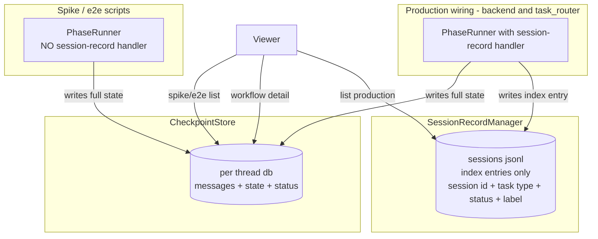

## Goal Capsule

- **Objective:** Unify session storage at the index layer by making workflow tasks write lightweight index entries to the session record store, so that store becomes the single list source for production sessions. Conversation messages remain only in the checkpoint store.
- **Product authority:** This is the production-side complement to the already-shipped Direction A (viewer-side aggregation). Direction A made the viewer read both stores; Direction B makes production write to one. Together they unblock a stable workflow-conversation consumption contract for skill crystallization and any successor consumers.
- **Open blockers:** None blocking. Three mechanism choices are deferred to planning: how `task_type` reaches the index writer at hook time, whether the handler reuses the existing per-node phase callback or stands alone, and the backfill dedupe key.

## Product Contract

### Summary

PhaseRunner emits session-level lifecycle events; the production wiring registers a handler that turns them into lightweight index entries in the session record store. The index entry carries the thread id (as session id), task type, status, updated timestamp, and a human label. Conversation messages remain only in the checkpoint store, so the two stores carry non-overlapping content. After a one-time backfill of historical production threads, the viewer reads the session record store as the single list source for production sessions and cross-references checkpoint state for workflow detail. Spike and e2e scripts stay on the existing checkpoint-scan path.

### Problem Frame

The session record store currently indexes only chat sessions; workflow tasks invoked via `op:` or task_router write only to the checkpoint store. The shipped Direction A fixed the viewer display by scanning both stores, but storage itself stays split. That split blocks the architecture's next move: a downstream consumer (skill crystallization's `/learn` flow) needs a uniform way to enumerate and read workflow conversations. Without a unified index, every consumer must replicate Direction A's dual-store scan and the split keeps getting load-bearing.

### Key Decisions

- **Light index, zero redundancy on message content.** The session record store holds workflow index markers (session id, task type, status, updated timestamp, label) alongside the existing chat full-conversation entries; workflow conversation messages never appear in it. "Non-overlapping" holds for workflow message content, not for every field — status and updated_at are intentionally denormalized into the index for fast listing. A consumer reading the directory distinguishes workflow marker entries from chat full-entries by `task_type` (workflow types versus `chat`). Because the index is event-sourced, a hard process termination (SIGKILL/OOM) mid-workflow can leave the index status behind the checkpoint's authoritative state, so R-recon requires a reconciliation path (a startup reconcile job that corrects non-terminal index entries against checkpoint status, plus next-event retry).
- **Hook lives in the shared orchestrator.** PhaseRunner emits per-node lifecycle signals (`started` / `interrupted` / `completed` / `failed` at `state_machine.py:225-290`); the production wiring registers a thin aggregator that maps them to session-level transitions — first `started` after `invoke` writes the `started` entry; `interrupted` writes `waiting_confirm`; the next `started` after `resume` (which runs through `consume_pending` at `state_machine.py:144-198` with no explicit event) writes `running`; terminal `completed` / `failed` writes `done` / `failed`. Status changes inside PhaseRunner (HITL interrupt, mid-node failure, resume-to-running) are unreachable from entry points; the shared hook captures all of them and covers every graph and both entry points (`op:` handler and task_router develop dispatch) automatically.
- **SessionRecordManager is the single list source for production sessions.** Production sessions are chat plus workflow tasks invoked through `op:` or task_router (and future migration). Spike and e2e scripts are not production sessions and stay on the checkpoint-scan listing.
- **One-time backfill of historical production threads.** Pre-Direction-B production checkpoint threads are indexed in a single migration run so the single-source list is complete on day one.
- **Thread id equals session id, no format migration.** Workflow threads reuse their existing 12-char hex thread id as the session-record session id. Chat sessions keep their existing uuid4 36-char session id. The session record store keys files by session-id string and accepts both formats.

### Actors

- A1. **Operator developer** (human) — runs operator work through `op:` or task_router; reviews sessions in the viewer; consumes workflow conversations through downstream tooling.
- A2. **Production wiring** (`backend.py`) — constructs the PhaseRunner used by the `op:` prefix handler and the task_router develop dispatch. Registers the session-record handler on those constructions. Runs the one-time backfill migration.
- A3. **SessionRecordManager** — owns the chat JSONL store; this deliverable adds index-marker entries alongside the existing full-conversation entries.
- A4. **CheckpointStore** — owns the per-thread state and messages. Untouched on the write side; continues to be the single source of truth for conversation messages.
- A5. **Viewer** — reads SessionRecordManager for the production session list and checks entry task type to decide between chat (open JSONL entries) and workflow (fetch state from CheckpointStore). Keeps a separate checkpoint-scan listing for spike and e2e runs.
- A6. **Spike/e2e scripts** — construct their own PhaseRunner without registering the session-record handler. Their runs land only in checkpoint dbs.

### Requirements

**Index entry shape and lifecycle**

- R1. A workflow task emits a session-level event at invoke start, which writes an initial `started` index entry; once execution reaches steady-state node progression, a `running` index entry is written (trigger: the first per-node `started` after the invoke-time entry).
- R2. A workflow task emits a session-level event on terminal completion, which writes a `done` index entry; on terminal failure it writes a `failed` entry.
- R3. A workflow task emits a session-level event when entering an HITL pause, which writes a `waiting_confirm` entry; when the wait clears via resume, a follow-up `running` entry is written (trigger: the first per-node `started` after `consume_pending`).
- R4. Each index entry carries `session_id` (the thread id), `task_type`, `status`, `updated_at`, `label`, and `origin` (`runtime` for entries written by the live hook, `backfill` for entries written by the one-time migration).
- R5. The `task_type` field uses one unified value space: `chat` for chat sessions; the task_router task type (`develop`, `migrate`, future types) for workflow sessions; and `unknown` for workflow entries whose task-store link is not recoverable (ad-hoc `op:` runs without a task entry).

**Production wiring**

- R6. Production wiring registers the session-record handler when constructing the PhaseRunner used by the `op:` handler and the task_router develop dispatch.
- R7. Chat path's SessionRecordManager usage is unchanged: chat sessions continue to receive full conversation entries.

**Backfill**

- R8. A one-time migration enumerates production checkpoint threads (excluding spike and e2e dbs, discriminated by reusing `ckpt_reader.source_from_filename()` — filename `checkpoints.db` = production, `spike_*` / `e2e_*` = excluded; top-level db path from `backend.py:373` `CheckpointStore.from_config(config.checkpoint)`) and writes one initial index entry per thread.
- R9. The migration tags each backfill entry with a discriminator that marks it as not runtime-authored, so audit and replay can distinguish the two origins.
- R10. The migration is idempotent under re-run, keyed on `thread_id` plus `origin=backfill` (a stable attribute of every entry a backfill writes); re-run reports already-present entries and writes zero new ones.

**Viewer**

- R11. The viewer's production-session list is read from SessionRecordManager only; production threads no longer route through the checkpoint-scan list source.
- R12. Opening a workflow session in the viewer resolves its detail by reading CheckpointStore state for the recorded thread id.
- R13. The viewer retains a separate checkpoint-scan listing for spike and e2e scripts so their runs remain visible.
- R16. The viewer's production-session list groups SessionRecordManager entries by `session_id` and renders a single row per session whose status reflects the most-recent entry, so a session's lifecycle transitions (started → running → waiting_confirm → running → done) surface as one row rather than one row per event.
- R17. The viewer visually marks sessions whose `task_type` is `unknown` distinct from typed sessions (`develop` / `migrate`), so operators can spot ad-hoc runs that lack a task-store link rather than reading them as ordinary workflow sessions.

**Consumer contract**

- R14. Workflow conversation messages appear nowhere in the session-record JSONL files; the directory's `*.jsonl` payload growth is bounded by the size of index marker entries.
- R15. The thread id used as session id matches the value the checkpoint store keys by, so a consumer's cross-reference is a single-key lookup.

### Key Flows

- F1. New workflow invoke
  - **Trigger:** User issues `op: <request>` or task_router dispatches a develop task.
  - **Actors:** A2, A3, A4
  - **Steps:** Backend generates a thread id, constructs a PhaseRunner with the session-record handler registered, and calls invoke. The handler writes an initial `started` index entry keyed by that thread id. Each subsequent status change (HITL wait, wait clear, terminal) writes a follow-up entry. Chat continues to write full conversation entries as before.
  - **Outcome:** SessionRecordManager carries one entry per status change under the same session id; CheckpointStore carries the full state including messages.
  - **Covers:** R1, R2, R3, R4, R5, R6, R7

- F2. One-time backfill
  - **Trigger:** First deployment that enables Direction B, or an explicit operator command.
  - **Actors:** A2, A3, A4
  - **Steps:** A migration script enumerates production checkpoint threads, skips spike and e2e dbs, records the checkpoint's last-known state per thread, and writes one initial index entry per thread to SessionRecordManager with the backfill discriminator. Re-running the script does not duplicate entries.
  - **Outcome:** Pre-Direction-B production threads appear in the viewer list alongside runtime entries; spike and e2e threads do not enter the production list.
  - **Covers:** R8, R9, R10

- F3. Viewer reads the unified list
  - **Trigger:** User opens the viewer.
  - **Actors:** A5, A3, A4
  - **Steps:** The viewer reads SessionRecordManager for the production list, sorts by recency, and for chat sessions opens the JSONL entries directly. For workflow sessions, the viewer reads the recorded thread id and fetches detail state from CheckpointStore. Spike and e2e runs surface through a separate checkpoint-scan listing.
  - **Outcome:** A single source for production reads; spike and e2e remain visible without contaminating the production list.
  - **Covers:** R11, R12, R13, R14, R15

### Acceptance Examples

- AE1. (R1, R4) A user runs `op: develop vector_add`. Within 30 seconds, the viewer's production list shows the session with `task_type=develop`, status `started` (subsequently `running`), and a label derived from task_type plus a request slug (not the raw user input), so the user input itself never appears in the session-record store.
- AE2. (R3, R4) The same workflow reaches an HITL design confirmation. Within 30 seconds, the viewer's session row shows status `waiting_confirm`. The user confirms the prompt; within 30 seconds of resume, the row shows status `running` again, and on completion shows `done`. No duplicate session rows appeared during the transition.
- AE3. (R5) A task_router develop dispatch runs a `migrate` task type. The index entry carries `task_type=migrate`. The viewer's task-type filter returns the session under `migrate`, not under `develop`.
- AE4. (R6) A spike script (`scripts/spike_kernel_feasibility.py`) runs end-to-end. No session-record index entry is written for that run; its threads surface only in the viewer's separate spike checkpoint-scan listing, never in the production list.
- AE5. (R8, R10, R13) The backfill migration runs once against a CheckpointStore containing 13 pre-Direction-B production threads and 1 spike thread. After backfill, SessionRecordManager reports 13 new index entries (none for the spike thread). Re-running the migration reports 13 already-present entries and writes zero new ones. The viewer's production list shows those 13 plus any runtime entries; the spike row appears only in the separate spike listing.
- AE6. (R14, R15) `grep` across `~/.ascend_op_agent/sessions/` for the workflow's user input string or any of its assistant output returns zero matches. `~/.ascend_op_agent/checkpoints.db` (and `~/.ascend_op_agent/checkpoints/*.db`) still contains the workflow conversation messages.
- AE7. (R5, R17) A backfilled `op:` thread with no task-store link appears in the viewer's production list with `task_type=unknown` and a visual marker distinct from `develop` / `migrate` sessions.

### Success Criteria

- The viewer's production-session list source is SessionRecordManager alone; production threads no longer reach the viewer through the checkpoint-scan list source.
- A consumer (the skill crystallization `/learn` flow, or any successor) lists workflow sessions from SessionRecordManager, picks one, and reads the conversation via a single thread-id-to-CheckpointStore lookup.
- Session-record JSONL file growth is bounded by the size of index marker entries; no assistant or tool payload bytes appear under `~/.ascend_op_agent/sessions/`.
- After backfill runs to completion, the count of production sessions visible to the viewer equals the count of production checkpoint threads plus runtime entries, with zero duplicates and zero spike runs mixed in.

### Scope Boundaries

**Deferred for later (Direction B does not deliver)**

- **Skill crystallization `/learn` consumer integration.** The `/learn` flow that consumes this index is owned by the existing skill crystallization requirements doc and is out of scope here. Direction B produces the index; the consumer sits above it.
- **L3 background review fork hook.** Same documentation; not Direction B's concern.

**Outside this product's identity (explicit non-goals)**

- **Full message mirror into SessionRecordManager.** Rejected: the redundancy cost (every write twice, consistency maintenance between two stores that record the same messages) outweighs the single-source-reader benefit. The cross-reference is a one-key lookup.
- **Entry-point handler wiring.** Rejected: the entry points cannot observe HITL interrupts or mid-node failures, which are the lifecycle events the index must capture.
- **CheckpointStore save-path hook.** Rejected: couples an orchestrator-layer component to an agent-layer one and entangles the spike and e2e scripts that share CheckpointStore.
- **Format migration of chat session id.** Rejected: chat JSONL filenames accept any session-id string already; unifying to a single format would require renaming legacy chat files for no functional gain.
- **CheckpointStore schema or v1/v2 changes.** Out of scope: index entries live in SessionRecordManager, not in CheckpointStore.
- **Spike/e2e scripts writing SessionRecordManager index entries.** Rejected: their runs stay in the separate checkpoint-scan listing rather than enter the production list.

### Dependencies / Assumptions

- The `common.py` rehydration contract holds: agents inside PhaseRunner reconstruct their conversation history from checkpoint state via a same-shape copy (`orchestrator/nodes/common.py:89`), so a single thread-id pointer is sufficient for any downstream consumer to recover the conversation without an extra entry-by-entry append log in SessionRecordManager.
- SessionRecordManager accepts arbitrary session-id strings (filename-keyed) and appends entries asynchronously; there is no schema or capacity barrier to the marker entry shape.
- PhaseRunner is graph-agnostic and constructed per call site; the register-the-handler-vs-do-not contract is enforceable at the construction call.
- Backfill recovery of `task_type` for old threads: threads created through task_router carry a link via the task store; ad-hoc `op:` runs without a task-store link are recorded with `task_type=unknown` and surfaced explicitly so the viewer can flag them.

### Outstanding Questions

**Deferred to Planning**

- **`task_type` source at hook time.** PhaseRunner is graph-agnostic and the hook fires from inside it; the mechanism that puts `task_type` into the index entry (PhaseRunner carries task-type metadata set at construction, the backend passes it at invoke time, or a separate handler-level registry) is a planning decision.
- **Session-record handler versus the existing phase callback.** PhaseRunner already exposes a per-node `phase_callback`. Whether the new handler reuses that surface or is a separate callback (so scripts keep the phase callback while opting out of session-record writes) is a planning decision.
- **Backfill dedupe key.** The backfill migration must not duplicate entries when re-run. Whether the dedupe uses an existing session-record key (no natural one for marker entries) or a check-then-write against the source checkpoint is a planning decision.

### Sources / Research

- `src/ascend_op_agent/backend.py` — chat path entry (`_setup_agent` near line 318), workflow entry (`_handle_run_conversation` near line 93, `thread_id` generation at line 116), and the agent factory that omits the session manager (`_orchestrator_agent_factory` near line 450).
- `src/ascend_op_agent/agent/session_manager.py` — SessionRecordManager entry append and the glob-based `list_sessions` reader.
- `src/ascend_op_agent/agent/session_record.py` — Entry dataclass shapes that the index entries reuse.
- `src/ascend_op_agent/orchestrator/checkpoint.py` — CheckpointStore, including `list_all_threads` at line 374 and the thread-id primary key that becomes the cross-reference target.
- `src/ascend_op_agent/orchestrator/state_machine.py` — PhaseRunner invoke and resume paths; the per-status-change save points in `_run_from`.
- `src/ascend_op_agent/orchestrator/nodes/common.py:89` — the zero-conversion rehydration that lets a single thread id reconstruct a conversation.
- `src/ascend_op_agent/task_router/executor_dispatch.py` — task_router develop dispatch and the thread-id generation it carries.
- `viewer/backend/src/services/unified_reader.py` and `viewer/backend/src/services/ckpt_reader.py` — Direction A's dual-store aggregation that this deliverable supersedes for production reads.
- Memory: `checkpointstore-is-generic-workflow-layer` — frames CheckpointStore and PhaseRunner as graph-agnostic layers; light double-write avoids message redundancy.
- Memory: `positioning-pivot-to-runtime-engine` — project positioning and skill crystallization as the downstream consumer.
- `docs/brainstorms/2026-07-12-skill-crystallization-requirements.md` — the downstream consumer that depends on a stable session id and uniform workflow-conversation reads.

## Deferred / Open Questions

### From 2026-07-12 review

- **Premature unification: Direction A already gives single-consumer dual-scan** — Goal Capsule / Problem Frame (P1, product-lens + adversarial, confidence 100)

  Direction A (shipped) is exactly the dual-store scan this deliverable wants to avoid replicating. The plan argues every consumer must replicate Direction A to consume workflow conversations — but today there is one such consumer (skill crystallization `/learn`, itself deferred). Building a storage-unification layer, a backfill migration, and a production-vs-spike boundary mechanism to spare one consumer from a 30-line scan is a high-maintenance bet on a consumer count that does not yet exist.

- **Goal unblocked but not achieved: `/learn` integration is the stated end and it is out of scope** — Goal Capsule / Scope Boundaries (P1, product-lens, confidence 75)

  The Goal Capsule names the end state as a stable workflow-conversation consumption contract for skill crystallization. This deliverable produces the index that `/learn` will read, then defers the consumer integration. There is no validation step that confirms the index shape actually satisfies `/learn`'s needs — Direction B can ship with full acceptance coverage and still leave `/learn` blocked if the index shape is wrong.

- **Direction A reader already routes production threads through the checkpoint-scan path that R11 says to bypass** — Viewer (R11) and Sources/Research (P1, feasibility, confidence 75)

  Direction A's viewer reader (already shipped) calls `list_all_checkpoints()` which returns all threads from every db tagged with source. R11 says production threads no longer route through the checkpoint-scan list source. Implementing R11 requires changing `unified_reader.list_unified_sessions()` to filter `source=production` rows out of the checkpoint path and adding a SessionRecordManager `source=workflow` path. The plan frames Direction A as shipped and Direction B as a write-side change, but R11 cannot land without an explicit Direction A reader change the plan never names.

- **Production-vs-spike boundary is implicit, enforced only at construction site** — Requirements / Production wiring (R6, R13) + AE4 (P1, product-lens, confidence 75)

  R6 places the boundary at production wiring registering the session-record handler when constructing the PhaseRunner. A script that imports the production factory, or a future script author unaware of this convention, will silently write production index entries. AE4 tests the positive case (spike stays out) but no requirement catches the negative case (anything that accidentally opts in).
