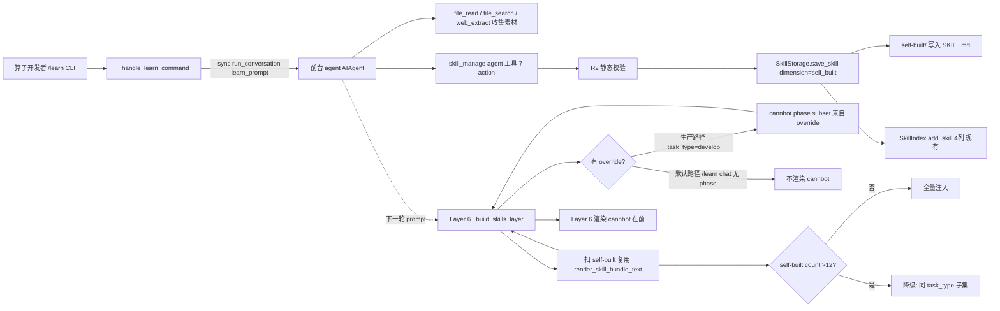
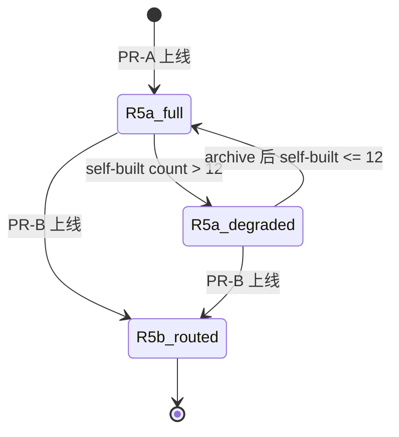

## Goal Capsule

让 ascend_op_agent 在 develop task_type 执行 + `/learn` 手动沉淀路径上沉淀可复用的自研 skill,并在新会话中自检索。**PR-A scope(2026-07-12-T2 收缩后)**:`skill_manage` agent 工具(7 action)+ R2 静态校验 + `/learn` CLI(**sync 注入**,A2 修订)+ Layer 6 全量注入 + 底层**两件**重构(TaskRouter task_type 传透 develop-only + Layer 6 重写)。

**移出 PR-A(原 F-1 三件底层重构中的 U3 FTS5 + U1 stub/CANBOT_BUNDLE_MAP,由 round-3 ce-doc-review scope 三方汇聚驱动):**
- **U3 FTS5 schema 扩展 → PR-B**(服务 R6 语义检索,PR-A 无消费者)
- **migrate/analyze/optimize stub executors → U8/U9**(PR-A 的 `/learn` crystallization 不经 TaskRouter.dispatch,stub 是死代码直到 U8/U9)
- **CANBOT_BUNDLE_MAP → PR-B R5b**(PR-A 的 R5a 全量注入不按 task_type 路由,无消费者)

PR-B 的 R5b 任务路由 / R6 语义检索 / R7 分组 / R3 LLM self-check 与 V2=L3 的后台 review fork 推到 follow-up plans。

**Product Contract preservation:** Unchanged. All origin R-IDs (R1-R16), A-IDs (A1-A4), F-IDs (F1-F6), AE-IDs (AE1-AE5b) preserved verbatim from origin. PR-A scope 收缩是 **Planning Contract 层**(KTD-1/F-1 的 HOW 决议)修订,不改 Product Contract 的 WHAT(origin R/A/F/AE 全部保留;仅 R6/R14 的 "PR-A satisfied via" 映射随 U3 defer 调整为 PR-B/U4)。

## Problem Frame

STRATEGY.md 第 47-55 行 "Skill Crystallization" track 宣告方向("将调试、性能优化经验自动固化为可复用 skill"),但当前架构缺落地能力:

- `skills/` 模块虽有 `SkillStorage` 完整 save/load/delete,但**不在 agent 工具表**中
- `orchestrator/cannbot_loader.py` 仅消费 cannbot,自研 skill 写入缺统一入口
- fix_loop 收敛时 / spike 验证后无 hook——经验靠用户记忆手动写笔记
- 上一轮评估已确认要自研「算子经验 skill」,范围限定在 cannbot 未覆盖的项目/硬件特定增量(910B3 + ops_pt + CANN 9.1.0),护栏必须守住这条边界
- **F-1 决议揭示的可达性矛盾(round 2 feasibility P0×3):** TaskRouter 仅 wired develop;Layer 6 是 static literal——PR-A 必须修 task_type 传透 + Layer 6 重写

**2026-07-12-T2 PR-A scope 收缩(LFG ce-doc-review round-3 驱动):** adversarial + feasibility 实测 codebase 后发现 2 个 P0 + scope 三方汇聚:
- **A1(token math 虚构,P0):** KTD-2 原 "~24 skill × 40 chars ≈ 600 tokens" 是虚构。实测 cannbot description first-lines 110-530 chars;`render_skill_bundle_text`(`cannbot_loader.py:419`)**不截断**。默认路径若全量渲染 16 cannbot = 894 tok(chars/4 粗估,中文真实 ~1300+ tok),在注入任何 self-built 之前已超 800 ship gate。
- **A2(`_pending_input` 不存在,P0):** grep across `src/` zero matches。整个 `/learn`→agent 注入机制(F1 step 2 + U5 verification "队列长度+1")依赖缺失的 substrate。
- **scope 三方汇聚(P1):** scope-guardian + product-lens + adversarial 独立指出 U3 FTS5(R6 PR-B deferred)+ stub executors(/learn 不走 dispatch)+ CANBOT_BUNDLE_MAP(R5a 不路由)都是 PR-B/U8/U9 的 prep work 计入 PR-A 工期。
- 收缩后:2 P0 由新设计消除(默认路径只 self-built 消除 A1 全量 cannbot;sync injection 消除 A2),U3 内部 bug 全部 moot(F1-F4 中 U3 相关的 _init_db/Frontmatter/state 链随 defer 消失),U4 storage 缺失链(self-built path F4)在 U4 内修。

## Actors

**A1. 算子开发者**(人)—— GPU 工程师迁移算子到 AscendC 时,用 `/learn` 描述来源(目录/URL/"刚才做的"/笔记),或修正 agent 沉淀的 skill。

**A2. 前台 agent**(`AIAgent` 主循环)—— 多轮工具调用循环中,执行 develop task_type 节点(PhaseRunner 编排);可被 `/learn` 触发一次蒸馏流程(`run_conversation` 同步注入);也接收 V2=L3 review fork 的"建议沉淀"通知(仅展示)。

**A3. 后台 review fork**(`AIAgent` 子实例,V2=L3 引入)—— 每 N 轮 fork 独立 agent 实例,重放对话历史,使用同一 `skill_manage` 工具写入 skill;父子不共享 prompt cache(不同 model key),同模型时共享 `_cached_system_prompt`。

**A4. SkillCrystallizer**(V2 reserved,L3 引入)—— L1/PR-A 不实现,仅预留。L3 承担:控制 review fork 触发节奏、把 fork 写入结果经 A2 回调展示、把 fork 的 `skill_manage` 调用写入 provenance(`write_origin="background_review"`)。

## Requirements

R-IDs preserved from origin verbatim. Brief re-statement of how PR-A(收缩后)satisfies each:

| R-ID | Requirement (brief) | PR-A satisfied via |
|------|---------------------|---------------------|
| R1 | `skill_manage` 7 action schema | U4 |
| R2 | 静态校验(必填字段、name class-level、TaskType+Topic、cannbot 不重名、Project Scope 首段) | U4 |
| R3 | LLM self-check | **PR-A 不实现**(Q6 决议:80/20 折中,推迟到 PR-B 或 skill 数 >20) |
| R4 | provenance 写入 | U4 |
| R5a | Layer 6 全量注入 self-built skill name+description | U2 + U6 |
| R5b | 路由命中收敛 | PR-B(U2 留 hook) |
| R6 | 语义检索 | **PR-B**(U3 FTS5 schema 扩展整体移 PR-B;PR-A 的 U4 search 用 frontmatter 扫描替代) |
| R7 | cannbot 在前/自研在后排序 | U2 |
| R8 | `/learn` CLI + `build_learn_prompt` + `_AUTHORING_STANDARDS` | U5 |
| R9 | V2=L3 review fork | V2 plan |
| R10 | TaskType+Topic 元数据 + 存储分离 | U4(frontmatter 元数据)+ U1(cannbot 不落盘边界) |
| R11 | Project Scope 首段 | U4 |
| R12 | cannbot 同名拒绝(patch 也拦截) | U4(用 U1 的 list_cannbot_skill_names) |
| R13 | `dimension="reference"` 扩展 | U4(storage 层 dimension 分支微扩展,独立于 FTS5) |
| R14 | 增量 rebuild(用 add_skill) | U4(用现有 `add_skill` 4 列,**无 schema 变更**——U3 defer 后 FTS5 schema 不动) |
| R15 | archive action | U4 |
| R16 | 结构化错误 | U4 |

## Acceptance Examples

AE-IDs preserved from origin verbatim. PR-A coverage:

| AE-ID | Behavior | PR-A covered in |
|-------|----------|-----------------|
| AE1 (PR-A) | `/learn ops_pt build.sh 配置` → create skill → Layer 6 可见 | U5 + U6 integration test |
| AE2 (PR-B) | env-dep 不被拦截 | 已知代价,U6 量化 false-negative 基线 |
| AE3 (PR-A 部分) | develop 任务中 `tiling_pitfalls` 命中 | U6 integration test(仅 develop path;migrate/analyze/optimize dispatch 移 U8/U9) |
| AE4 | patch cannbot skill 拒绝 | U4 test |
| AE5a (PR-A) | `/learn` 无参数返回教学错误 | U5 test |
| AE5b (PR-B/V2) | session-replay 蒸馏 | 推到 PR-B/V2(依赖 Direction B 先 ship,见 Cross-Plan Dependencies) |

## Scope Boundaries

### Deferred for later(V2 评估后再做,carry from origin)

- L3 后台 review fork
- fix_loop 收敛时 hook
- spike 验证后 hook

### Outside this product's identity(明确不做,carry from origin)

- 自研通用迁移知识(cannbot 已覆盖)
- 覆盖或修改 cannbot 官方 skill
- skill 库云端同步 / 团队共享
- skill 版本号管理与升级提示

### Deferred to Follow-Up Work(plan-local,PR-A 不做)

- **PR-B(独立 plan):** R5b 任务路由收敛 / R6 语义检索 / R7 分组渲染 / R3 LLM self-check / **U3 FTS5 schema 扩展(task_type+topic 列 + schema_meta + `--migrate-skill-index`,整体从 PR-A 移入)** / **CANBOT_BUNDLE_MAP(SKILL_BUNDLES 键空间 1:1 映射,从 U1 移入)**
- **V2 = L3(独立 plan):** SkillCrystallizer(A4)实现 / 后台 review fork / fix_loop hook / spike hook
- **Q4:** L3 review fork N 轮节奏与 profile disable
- **后续 U8/U9:** TASK_TYPE_MIGRATE 真业务逻辑(Path A 迁移 executor,含 stub executor)/ ANALYZE + OPTIMIZE 真业务逻辑(含 stub executor)
- **R5a → R5b 数值化 trigger:** self-built >30 时紧急晋升 PR-B R5b(F-4 降级是临时机制)
- **F-2 V2 进入 checklist:** ≥8 skills + ≤2 patch 冲突 + 0 R2 regression
- **F-6 metric delta:** PR-B R3 启用后用同一 held-out 集复测 false-negative
- **R13 `dimension="reference"` AE 覆盖:** 当前 U4 包含 storage 扩展但无 PR-A AE(后续 `/learn` 加 references 时补)
- **codegen `inline_build_template` 修复(独立 codebase bug,round-3 实测发现):** `_render_build_template_section` 在 codegen bundle(`ascendc-direct-invoke-template`/`ascendc-simt-best-practices`)下找不到 `references/add_example`(add_example 实际在 `ascendc-registry-invoke-template`,不在 codegen bundle)。当前 codegen 内联未生效。不属于 PR-A 引入,记入 follow-up。

## Approach

Plan enriches origin Product Contract by enumerating how each requirement lands in PR-A implementation units。**2026-07-12-T2 收缩后 PR-A = 5 个 active U(U1 瘦身 + U2 + U4 + U5 + U6),U3 defer 到 PR-B。** 工期从 round-2 估计 ~3-4 周收缩到 ~2 周(砍 U3 FTS5 migration + U1 stub/CANBOT_BUNDLE_MAP + 其 integration 测试)。

收缩的依据不是"省事",是 round-3 ce-doc-review 实证:被砍的部分在 PR-A 无消费者(/learn 不经 dispatch、R5a 不路由、R6 deferred),且 U3 内部 _init_db 设计有 silent-data-corruption bug、token math 虚构、`_pending_input` 不存在——继续保留只会把 P0 带进实现。

## Key Technical Decisions

**KTD-1(F-1 重开,2026-07-12-T2):** PR-A 含 **2 件**底层重构(① TaskRouter task_type 传透 **develop-only**;② Layer 6 from-scratch 重写)。原 F-1 第三项"SKILL_BUNDLES 键空间不兼容"由 **PR-B R5b 时处理**(CANBOT_BUNDLE_MAP 移 PR-B,PR-A 的 R5a 全量注入不按 task_type 路由,无需映射表)。原 round-2 把第三项 reinterpret 成 FTS5 schema 扩展是误读——FTS5 服务 R6(PR-B deferred),非 F-1 可达性硬前置。逆命题:不做这两件,PR-A 的 develop path + /learn 沉淀是空头支票。

**KTD-2(F-4 + A1 实测重算,2026-07-12-T2):** Layer 6 渲染分两条路径,token 预算基于实测(`render_skill_bundle_text` + chars/4 粗估;真实 tokenizer 在 U6 ship gate 用 tiktoken 校准):
- **生产路径(PhaseRunner 节点传 `skills_layer_override`,task_type=develop):** cannbot **phase subset**(实测 62-266 tok,最大 triton_frontend 5 skills=266)+ self-built section。triton phase 最重时 cannbot 266 + self-built budget ≈ 500 tok 留给 ~12 个 self-built。
- **默认路径(无 override,如纯 `/learn` 聊天,task_type=None):** **只渲染 self-built,不渲染 cannbot**。cannbot 是 phase-specific,默认路径无 phase context,渲染全部 16 cannbot(实测 894 tok,中文真实 ~1300+ tok)既超 budget 又无意义。**这一条消除 A1。**
- **降级(F-4):** self-built >**12** 时按 task_type 子集注入(task_type 缺失时回退全量,避免空集)。阈值 12 基于实测:生产最重 triton(266 tok)+ 12 self-built(≈480 tok)+ header/footer(≈50)≈ 796 tok ≤ 800。不读 last-loaded 历史(消除 jsonl 反向依赖)。降级是 PR-A 临时机制,PR-B R5b 上线后取消。
- **不截断 description:** `render_skill_bundle_text` 现状不截断,实测 per-phase subset 可控,保持现状(截断是 dead code);复用该函数渲染 self-built(A6)。

**KTD-3(F-5):** Topic 枚举在 PR-A 阶段是 free-form label,不参与 R5a 渲染、不作为 R2 必填校验(仅 warning)。等证据足再冻结。

**KTD-4(F-6):** R2 静态护栏 false-negative 基线(5 条语义违规案例预期 ≥60% false-negative)作为 PR-A ship gate 必跑项。PR-B R3 启用后用同一 held-out 集复测。

**KTD-5(Q6):** PR-A 不实现 R3 LLM self-check。原因:内部工具定位 + GLM rate-limit 脆弱性 + 初期 skill 少时静态校验 + 人工 review 够用。

**KTD-6(Q9):** Skill 名仅 topic(`tiling_pitfalls`),task_type 只留 metadata。命名跨 task_type 复用。

**KTD-7:** 7-action 单一工具。L3 fork 调用方零改动;护栏/provenance 集中。R13 `add_reference` action 当前无 PR-A AE 覆盖,作为 storage 扩展先就位。

**KTD-8(R14 修订,2026-07-12-T2):** U3 defer 后,FTS5 schema **不变更**(保持现有 4 列)。R14 直接用现有 `add_skill`(`skills/index.py:139`,4 列 upsert)作为热路径写入,`rebuild_index` 保留为全量刷新路径。R13 的 `dimension="reference"` 是 SkillStorage.save_skill dimension 分支加一档的微扩展(U4 内,独立于 FTS5)。R6 语义检索的 task_type/topic FTS5 列整体移 PR-B。

## High-Level Technical Design

PR-A 数据流(2026-07-12-T2 收缩后,用户手动沉淀 + sync 注入):



Layer 6 R5a → R5b 状态机(F-4 + PR-B 演进):



底层依赖(U3 defer 后;U-ID 稳定性:U3 留 gap):

```mermaid
flowchart TB
    U1[U1 task_type 传透 develop + list_cannbot_skill_names] --> U2[U2 Layer 6 重写]
    U1 --> U4[U4 skill_manage 工具]
    U2 --> U4
    U4 --> U5[U5 /learn CLI sync 注入]
    U1 --> U5
    U2 --> U5
    U5 --> U6[U6 ship gate]
    U4 --> U6
    U2 --> U6
    U6 --> [*]
```

## Implementation Units

### U1. TaskRouter task_type 传透链路(develop-only)+ cannbot 加载器 list_cannbot_skill_names

- **Goal:** 建立 `task.type` → PhaseRunner → run_conversation → PromptBuilder 的 task_type 传透链路(让 U2 Layer 6 能拿到 task_type 做降级),仅 develop path;migrate/analyze/optimize 的 stub executor 与 CANBOT_BUNDLE_MAP **移出 PR-A**(→ U8/U9、PR-B)。cannbot_loader 暴露 `list_cannbot_skill_names()` 给 R12 用。这是 F-1 决议(2026-07-12-T2 重开)第一项。
- **Requirements:** F-1 第一项(develop path);R12(cannbot 同名校验依赖);R10(cannbot 不落盘边界);R5a 降级(task_type 传透是 U2 降级前置)。
- **Dependencies:** 无(PR-A 第一个 U)。
- **Files:**
  - `task_router/executor_dispatch.py` 的 `_dispatch_develop` —— 调 `orchestrator.invoke` 前把 `task.type` 写到 PhaseRunner thread state(`state["task_type"] = task.type`)。**关键(A2 同类坑避免):** `PhaseRunner.invoke`(`orchestrator/state_machine.py:134`)内部创建 state(TaskRouter 不能在 invoke 前 dict-assign),所以 task_type 经 invoke 的 keyword param 传入(`invoke(..., task_type=task.type)`),invoke 内 `initial_state` 后写 `state["task_type"]`。**`orchestrator/state_machine.py` 列入本 U Files。**
  - `orchestrator/nodes/common.py:122` —— `run_conversation` 调用处改为 `agent.run_conversation(task_prompt, skills_layer_override=skill_bundle_text, task_type=state.get("task_type"))`
  - `orchestrator/nodes/micro_mod.py:108` —— 同上
  - `agent/core.py` —— `AIAgent.run_conversation(self, ..., task_type: Optional[str] = None)` 加关键字参数;内部存到 `self._current_task_type`;`build_system_prompt` 读它传给 `_build_skills_layer(override, task_type)`
  - `agent/prompt_builder.py` —— `build_system_prompt(self, ..., task_type: Optional[str] = None)` 接 task_type,传给 `_build_skills_layer`
  - `orchestrator/state_machine.py` —— `invoke(self, user_input, thread_id, task_type: Optional[str] = None)` 加 param,`initial_state` 后写 `state["task_type"]`
  - `orchestrator/cannbot_loader.py` —— 加 `list_cannbot_skill_names(root: Path | None = None) -> set[str]`(`@functools.lru_cache(maxsize=1)` 进程内缓存,不落盘);遍历 `SKILL_BUNDLES` 所有 paths 对应 skill_dir 的 frontmatter name 汇总
- **Approach:**
  - **task_type 传透链路三段式:** TaskRouter dispatch 经 invoke keyword → invoke 内 `initial_state` 后写 `state["task_type"]` → PhaseRunner 节点从 state 取出传 `run_conversation(task_type=...)` → AIAgent 存 `self._current_task_type` → `build_system_prompt` → `_build_skills_layer(override, task_type)`。非 PhaseRunner 路径(如纯 `/learn` 聊天)task_type=None,U2 默认路径走"只 self-built"。
  - **不新增 stub executor / 不新增 CANBOT_BUNDLE_MAP**(2026-07-12-T2 收缩):migrate/analyze/optimize 仍走现有 `TaskGatedError`(不动),stub 推 U8/U9;CANBOT_BUNDLE_MAP 推 PR-B R5b。develop path 现有 dispatch 已 wired,只需补 task_type 传透。
  - `list_cannbot_skill_names` 复用 `load_skill` 读 frontmatter name,不落盘 cache(submodule 未初始化时返回空 set 且不抛,供 U4 R12 fail-closed 决策)。
- **Patterns to follow:** `task_router/executor_dispatch.py:69-76` 的 `TASK_TYPE_DEVELOP` 分支结构;`cannbot_loader.py:122` 的 `load_skill`;`functools.lru_cache` 进程内缓存模式。
- **Test scenarios:**
  - Happy: develop task `create_task` + `dispatch` 后 PhaseRunner thread state 含 `task_type=develop` 字段
  - Happy: **task_type 传透端到端**——develop task dispatch 后 next prompt 的 Layer 6(U2)能拿到 task_type=develop
  - Happy: `list_cannbot_skill_names(CANNBOT_ROOT)` 在 vendored cannbot 路径返回非空 set;二次调用走 lru_cache 不重扫
  - Happy: migrate/analyze/optimize task 仍抛 `TaskGatedError`(确认未动现有 gated,stub 推 U8/U9)
  - Edge: vendored cannbot submodule 未初始化时 `list_cannbot_skill_names` 返回空 set 且不抛
  - Error: invoke 的 task_type param 在 `initial_state` 之前不可用(避免 A2 同类"在 invoke 前 dict-assign state"坑)
- **Verification:** develop dispatch 后 thread state + Layer 6 都含 task_type;`list_cannbot_skill_names` 空/非空两态 + lru_cache 命中;migrate/analyze/optimize 仍 gated。

### U2. PromptBuilder Layer 6 重写(override 合并 + 双源 join + 实测降级 + 复用 render_skill_bundle_text)

- **Goal:** 让 Layer 6 在**生产路径**(override = cannbot phase subset)下也渲染 self-built skill;**默认路径**只渲染 self-built(不渲染 cannbot,消除 A1)。重写 `_build_skills_layer(override, task_type)`:`override`(cannbot)在前 + self-built 段在后;self-built 段**复用 `render_skill_bundle_text`**(A6,不从零写子函数)。self-built 数超阈值时按 task_type 子集降级。这是 F-1 第二项 + F-4 + A1 实测重算。
- **Requirements:** R5a(PR-A 全量注入)、R7(cannbot 在前)、R10(跨源 join)、F-4(降级阈值)、A1(token budget 实测)。
- **Dependencies:** U1(task_type 上下文 + list_cannbot_skill_names)。
- **Files:**
  - `agent/prompt_builder.py:81-85` —— **关键改动:** 把 `if skills_layer_override is not None: layers.append(skills_layer_override) else: layers.append(self._build_skills_layer())` 改为 `layers.append(self._build_skills_layer(skills_layer_override, task_type))`——override 不短路,作为参数传入,与 self-built 段合并渲染。
  - `agent/prompt_builder.py:151-162` —— 重写 `_build_skills_layer(self, override, task_type)`:
    - 生产路径(override 非空):`override`(cannbot phase subset 文本)+ self-built 段(`render_skill_bundle_text(self_built_skills)` 渲染 name+desc)
    - 默认路径(override 为 None):**只 self-built 段**(不渲染 cannbot——A1 消除)
  - **复用 `cannbot_loader.render_skill_bundle_text`(A6 修订):** self-built SKILL.md frontmatter 形状与 CannbotSkill 兼容(name/description),用 thin adapter 构造 CannbotSkill 实例后调 `render_skill_bundle_text`。不新增 4 个 `_build_self_built_section`/`_build_cannbot_section`/`_merge_sections`/`_maybe_degrade` 子函数(原 round-2 设计,被 adversarial A6 否决:重复造已存在的 tested 渲染路径)。
  - **不引入新存储文件**(`skill_loads.jsonl` 反向依赖 + 并发写无保护)。降级只按 task_type 过滤,不读 last-loaded。
- **Approach:**
  - **合并策略:** `_build_skills_layer(override, task_type)` 统一构造:`override`(cannbot,来自 orchestrator 节点,生产路径)在前;`render_skill_bundle_text(self_built_skills_as_cannbot)`(扫 `~/.ascend_op_agent/skills/self-built/`)在后。无 override 时只渲染 self-built 段。
  - **self-built 加载:** 扫 `self-built/` 目录(由 U4 `dimension="self_built"` 写入,见 F4 修复),每个 SKILL.md 经 thin adapter → CannbotSkill → `render_skill_bundle_text`。frontmatter 解析失败的 skill 跳过不阻塞。
  - **降级(F-4 + A1 实测):** self-built >12 时按 task_type 子集(task_type 缺失时回退全量)。阈值 12 基于 KTD-2 实测算预算。
  - Layer 6 不注入 body,只 name+description 摘要(沿用 cannbot 设计)。`list_cannbot_skill_names()`(U1)过滤 self-built 与 cannbot 同名污染。
- **Patterns to follow:** `cannbot_loader.py:376` `render_skill_bundle_text`(复用而非重写);`agent/prompt_builder.py` 现有 `_build_*_layer` 函数族;`skills/storage.py` 的 YAML frontmatter 解析。
- **Test scenarios:**
  - Happy: **生产路径**(override=cannbot phase subset)Layer 6 含 cannbot 段 + self-built 段
  - Happy: **默认路径**(无 override,/learn chat)Layer 6 **只含 self-built 段,无 cannbot**(A1 消除验证)
  - Happy: 0 self-built + 生产路径 → Layer 6 仅含 cannbot 段
  - Happy: 5 self-built → 全量注入
  - Edge: 13 self-built + 生产路径 → 降级(同 task_type 子集),cannbot 仍在前
  - Edge: task_type 缺失(默认路径)+ self-built >12 → 回退全量不空集
  - Edge: self-built/ 下某 SKILL.md frontmatter 解析失败 → 跳过不阻塞
  - Edge: Layer 6 总长 ≤ 800 tok(生产 triton phase 最重 + self-built ≤12 场景,U6 用 tiktoken 实测校准)
- **Verification:** 生产路径(override 非空)Layer 6 含双段;默认路径(override None)只 self-built 段无 cannbot;降级阈值 13 时剩同 task_type 子集;复用 render_skill_bundle_text(无新增 4 子函数);Layer 6 ≤800 tok(tiktoken 实测)。

### U3. [DEFERRED to PR-B — 2026-07-12-T2] FTS5 schema 扩展 + migration

**此 U 整体移出 PR-A**(round-3 ce-doc-review scope-guardian P1 + product-lens/adversarial 汇聚:服务 R6 PR-B deferred,PR-A 无消费者)。U-ID 留 gap(稳定性规则,不 renumber)。原设计(FTS5 task_type+topic 列 + schema_meta 表 + `--migrate-skill-index` + migration 安全)整体进 PR-B plan,届时一并处理:
- round-3 发现的 _init_db eager-write `schema_version='2'` 与 detection "raise MigrationRequired" 矛盾(feasibility P0 级 silent-data-corruption)
- in-memory backup 对 crash 脆弱(adversarial P1)

PR-A 期间:FTS5 schema 保持现有 4 列(`skills/index.py:127-134`)不动;R14 用现有 `add_skill`(`index.py:139`)4 列 upsert;U4 search action 用 frontmatter 扫描(Python filter,5-10 skill 够用)替代 R6 语义检索。

### U4. skill_manage agent 工具(7-action schema + R2 静态校验 + R16 结构化错误 + self-built 写入路径 + frontmatter search)

- **Goal:** 新建 `agent/tools/skill_manage_tool.py`,7 action 独立 schema + R2 静态校验完整版本 + R16 结构化错误 + provenance 元数据 + **self-built 写入路径(F4 修复)** + search action 用 frontmatter 扫描(U3 defer 后无 FTS5)。**不再依赖 U3**(去 U3 依赖,PR-A.1 contingency 由此可 ship)。
- **Requirements:** R1、R2、R4、R11、R12、R13、R14(现有 add_skill 4 列)、R15、R16、F-5(topic soft 校验)、F4(self-built path)。
- **Dependencies:** U1(list_cannbot_skill_names)。**不再依赖 U3**(U3 defer)。
- **Files:**
  - `agent/tools/skill_manage_tool.py` —— 新建:7 action dataclass(`CreateSkillArgs`/`PatchSkillArgs`/`AddReferenceArgs`/`ArchiveSkillArgs`/`LoadSkillArgs`/`ListSkillsArgs`/`SearchSkillsArgs`)+ ToolRegistry 注册 + `_validate_skill_static()` + `SkillManageError` dataclass(field+reason+remediation_hint)+ `_build_provenance_metadata()` + 调 `SkillIndex.add_skill`(现有 4 列,非 rebuild_index)
  - `agent/tools/__init__.py` —— 注册 skill_manage_tool
  - `skills/storage.py` —— **F4 修复:** `save_skill` dimension 分支加 `dimension="self_built"` → `dir_name` 写到 `skills_dir/"self-built"/{name}`(非扁平 `skills_dir/{name}{suffix}`)。现有 `_bugfix`/`_performance` dimension 不动。**`skills/storage.py` 列入本 U Files(原 round-2 漏列)。**
  - `skills/storage.py` —— **R13 微扩展:** 加 `elif dimension == "reference": dir_name = f"{skill.name}_reference"`(独立于 FTS5)
  - `skills/storage.py:33-35` —— 新增 `SUFFIX_REFERENCE = "_reference"` 常量
- **Approach:** 7 action schema 用 dataclass 独立定义。R2 静态校验清单一次实现完整:(a) 必填 `name`/`description`/`task_type`/`topic`/`body`;(b) `name` regex `^[a-z][a-z0-9-]*[a-z0-9]$` 且不含 PR 号/错误串/日期/具体任务对象;(c) `task_type ∈ TASK_TYPES`;(d) `topic` soft warn(不阻塞);(e) 第一段 body 是 `## Project Scope`;(f) cannbot 同名 → reject。R16 错误响应:`{"success": false, "error": "validation_failed", "field": "...", "reason": "...", "remediation_hint": "..."}`。
  - **search action(U3 defer 后):** 按 task_type 过滤走 **frontmatter 扫描**(扫 `self-built/` 读 frontmatter task_type,Python filter),不走 FTS5。5-10 skill 规模 O(N) 扫描足够。PR-B R6 上线后切到 FTS5 task_type/topic 列。
  - **patch action(full-replacement):** patch schema 字段与 create 相同,调用方重传完整 skill。`SkillStorage.save_skill` 整段覆盖写(无 load-modify-merge)。patch 不传 body → reject。
  - **archive action:** 不走 save_skill。直接读 SKILL.md → 字符串注入 `archive_at`/`archive_reason` 到 frontmatter `metadata.ascend_op_agent` → 移文件到 `.archived/`(目录不存在则 mkdir)。`load_skill` 解析时还原。
  - **R12 vendored 缺失 fail-closed:** `list_cannbot_skill_names` 返回空 set 时:(1) vendored 路径配置存在但不可读(submodule 未初始化)→ **reject 写入**;(2) vendored 路径未配置(CANNBOT_ROOT 不存在)→ warn 但允许。
- **Patterns to follow:** `agent/tools/file_write_tool.py` 的 dataclass + ToolRegistry;`skills/storage.py:57-85` save_skill 的 dimension 分支;`cannbot_loader.list_cannbot_skill_names`(U1)。
- **Test scenarios:**
  - Happy: 7 action schema 各自接受合法输入
  - Happy: create 成功后 `self-built/{name}/SKILL.md` 存在 + frontmatter 含 task_type/topic/provenance.write_origin=manual(F4 验证:写到 self-built/ 子目录,非扁平)
  - Happy: patch(full-replacement)成功后 frontmatter `updated_at` 更新 + body 完整保留
  - Happy: archive 成功后 SKILL.md 在 `.archived/` + frontmatter 含 archive_at/archive_reason + load_skill 还原
  - Happy: search action 按 task_type frontmatter 扫描过滤返回该 task_type 下 self-built skill(无 FTS5)
  - Edge: topic 不在分桶 → soft warning 不阻塞(F-5)
  - Edge: patch 不传 body → reject(full-replacement)
  - Edge: `list_cannbot_skill_names` 空 + vendored 配置存在 → reject(R12 fail-closed)
  - Edge: `list_cannbot_skill_names` 空 + vendored 未配置 → warn 但允许
  - Error: name 含 PR 号 → R16 reject 含 remediation
  - Error: cannbot 同名 → reject
- **Verification:** 7 action schema 覆盖率 100%;patch full-replacement;archive frontmatter 注入 + load 还原;R12 fail-closed;R16 三字段错误响应;self-built 写到 `self-built/{name}/`(F4);search 走 frontmatter 扫描(无 FTS5 依赖 U3);静态校验失败率 ≥99% on 5 条明显违规 held-out set(F-6 ship gate)。

### U5. /learn Python CLI 命令 + sync run_conversation 注入(A2 修复)

- **Goal:** 实现 `/learn` **Python CLI** 命令,把 user_request 经 `build_learn_prompt` 构造后 **sync 调 `agent.run_conversation(learn_prompt)`** 注入(A2 修复:不用不存在的 `_pending_input` 队列);无参数走 AE5a 教学错误。
- **Requirements:** R8(/learn + build_learn_prompt + `_AUTHORING_STANDARDS`)、AE5a、A2(sync 注入)。
- **Dependencies:** U4(skill_manage 工具已注册)、U1(task_type 上下文)。
- **Files:**
  - `cli.py`(ascend-op-agent Python CLI 入口,Click 框架)—— 新增 `_handle_learn_command(user_request: str)`:解析 `/learn <自由文本>` + 内联 `build_learn_prompt(user_request) -> str` + `_AUTHORING_STANDARDS` 常量。**注入方式(A2 修复):** 直接 `agent.run_conversation(build_learn_prompt(user_request))`(sync,阻塞至 skill 写入完成),不引用 `_pending_input`。
  - **PR-A 不动:** TUI frontend、`backend/rpc/server.py`
- **Approach:** `_handle_learn_command` 解析文本:空 → AE5a 教学错误(直接 print,不进 run_conversation);非空 → `build_learn_prompt` 构造 prompt → `agent.run_conversation(prompt)`。`_AUTHORING_STANDARDS` 内嵌 9 段 body 模板(首段 `## Project Scope` + When to Use/Prerequisites/How to Run/Quick Reference/Procedure/Pitfalls/Verification/Related Skills)、**description ≤40 字符**(C5 对齐:与 U2/KTD-2 渲染一致,原 round-2 写 ≤60 是矛盾)、TaskType+Topic 元数据强制、禁止 cannbot 已覆盖通用知识。Agent 在该轮用 file_read/file_search/web_extract 收集素材后调 `skill_manage(action="create"|"patch")`。
  - **A2 sync 语义:** `_handle_learn_command` 在 CLI 进程内持 agent 实例,sync 调 `run_conversation`,阻塞至 agent 完成该轮(skill 写入或返回)。无 async queue、无并发。简单可证伪。
- **Patterns to follow:** hermes `_handle_learn_command` + `build_learn_prompt`;`cli.py` 现有 Click `@click.command`/`@click.group` 子命令注册模式(cli.py 用 Click,**非** slash dispatcher;`/learn` 作为 Click 子命令或 run 命令内的 input 解析)。
- **Test scenarios:**
  - Happy: Python CLI `/learn ops_pt build.sh 配置` → `agent.run_conversation` 被调用一次(prompt 内嵌 `_AUTHORING_STANDARDS` 关键字串)
  - Happy: agent 在该轮调 `skill_manage(action="create")` 成功沉淀 skill(与 U4 集成)
  - Happy: prompt 含 `task_type ∈ TASK_TYPES` 提示 + `topic` 分桶建议
  - Edge: `/learn` 无参数 → 返回教学错误(不进 run_conversation,AE5a)
  - Edge: user_request 含 cannbot 已覆盖通用知识 → prompt 警告
  - Error: `run_conversation` 抛错 → CLI 报错不吞
  - **A2 验证:** 全程不引用 `_pending_input`(grep `_pending_input` in cli.py = zero)
- **Verification:** `/learn` 触发 `run_conversation` 调用(sync);prompt 内嵌 `_AUTHORING_STANDARDS` 9 段标题;description ≤40 字符;TUI frontend 在 PR-A 不暴露 /learn;`_pending_input` 不出现(A2)。

### U6. PR-A 闭环验收:R5a 注入 + F-4 降级 + F-6 false-negative 基线 + token ship gate(实测)+ ship gate

- **Goal:** 验证 PR-A 5 个 active U 串联工作(U1→U2→U4→U5→U2 闭环);建立 R2 静态护栏 false-negative 基线(F-6);**用 tiktoken 实测校准 Layer 6 token ship gate(A1)**;运行 ship gate。
- **Requirements:** F-1(2 件底层重构)、F-3(观测性 metric)、F-4(>12 降级)、F-6(held-out baseline)、A1(tiktoken 实测)。
- **Dependencies:** U1, U2, U4, U5。
- **Files:**
  - `tests/integration/test_skill_crystallization_pr_a.py` —— 端到端:`/learn` → `skill_manage(create)` → SkillStorage 写 self-built/ → Layer 6 注入 → agent 看到
  - `tests/fixtures/skill_false_negative_held_out.yaml` —— 5 条语义违规案例(AE2 是其中之一)
  - `tests/fixtures/skill_obvious_violations_held_out.yaml` —— 5 条明显违规案例(静态护栏召回)
  - `scripts/ship_ready.py` 加 PR-A 验收 step(schema 合规 + 静态护栏召回 + Layer 6 注入可观测 + **tiktoken 实测 token ≤800** + false-negative 基线)
- **Approach:** Held-out 5 条语义违规 fixture,R2 预期 false-negative ≥60%(为 PR-B R3 baseline)。Ship gate 通过条件:(a) U1/U2/U4/U5 集成测试全绿;(b) R2 schema 合规率 100%;(c) 5 条明显违规 R2 全 reject;(d) Layer 6 注入可观测;(e) F-6 false-negative 基线入 metric log;(f) **A1 token 实测:** 用 tiktoken(cl100k_base)实测生产路径(triton phase 最重 + self-built ≤12)+ 默认路径(只 self-built)Layer 6 ≤800 tok,KTD-2 的 chars/4 粗估若与 tiktoken 偏差 >20%,回调降级阈值(12 → 实测安全值)。
- **Patterns to follow:** `scripts/ship_ready.py` 现有 step 模式。
- **Test scenarios:**
  - Integration: 端到端 `/learn` → sync run_conversation → 写入 self-built/ → 注入 → 看到(默认路径只 self-built 段,A1 闭环)
  - Integration: develop task 端到端(生产路径 cannbot subset + self-built,task_type 从 task_router 传透到 Layer 6)
  - Held-out: 5 条明显违规 → R2 全 reject
  - Held-out: 5 条语义违规 → false-negative 率记录(预期 ≥60%)
  - Edge: 13 self-built 时降级(同 task_type 子集)
  - Edge: **A1 tiktoken 实测** Layer 6 ≤800 tok(生产 triton + self-built ≤12;默认只 self-built)
  - Edge: vendored cannbot 不可读 → 生产路径 Layer 6 无 cannbot 段(override 空)+ self-built 段
  - Held-out: `create + add_reference` → SkillStorage dimension=reference 写入后 load_skill 可解析(R13)
- **Verification:** ship gate 6 条全过(含 A1 tiktoken 实测 + 默认路径只 self-built);false-negative 基线入 metric log;Layer 6 ≤800 tok(tiktoken)。

## Verification Contract

PR-A ship gate 6 条(U6 验证):

1. **Schema 合规率 100%:** 合法 skill fixture 集上 R2 通过率 100%。
2. **静态护栏召回:** 5 条明显违规(held-out)R2 全 reject。
3. **Layer 6 注入可观测:** 写入 `self-built/` 的 skill 在下一轮 prompt 的 Layer 6 可见,agent 经 `skill_manage(action="load")` 读到 body。
4. **A1 token 实测(tiktoken):** 生产路径(triton phase + self-built ≤12)+ 默认路径(只 self-built)Layer 6 ≤800 tok。KTD-2 chars/4 粗估与 tiktoken 偏差 >20% 时回调阈值。
5. **静态护栏 false-negative 基线:** 5 条语义违规(held-out)R2 false-negative 率入 metric log(PR-B R3 复测 delta)。
6. **集成测试全绿:** U1/U2/U4/U5 端到端覆盖 develop path × `/learn` sync 流程。
7. **可演进:** skill_manage 工具接口在 L3 review fork 启用时不变更(KTD-7)——origin Success Criteria carry。

## Definition of Done

- U1, U2, U4, U5, U6 全部 ship gate 通过(U3 deferred,U-ID 留 gap)
- PR-A 工期 ~2 周(2026-07-12-T2 收缩后,vs round-2 ~3-4 周)
- `~/.ascend_op_agent/skills/self-built/` 至少 1 个测试 skill 写入 + Layer 6 可见
- F-2 L1→L3 gating 条件记录到 V2 checklist
- F-6 false-negative 基线入 metric log
- 6 项 F-决议产物(held-out fixture、metrics log、降级阈值)有可见产物
- `cannbot_loader.list_cannbot_skill_names` 暴露给 skill_manage 工具
- develop path + `/learn` default path 各至少 1 个端到端集成测试
- **A1/A2 闭环:** Layer 6 token tiktoken 实测 ≤800;`_pending_input` 不出现(sync 注入)

## Risks & Dependencies

### Cross-Plan Dependencies

与 Direction B(Production-Side Storage Unification,见 `docs/plans/2026-07-12-001-feat-direction-b-storage-unification-plan.md`)的关系:

- **PR-A 完全解耦** —— PR-A 的 `/learn` 是用户手动沉淀路径(素材来自 `file_read`/`file_search`/`web_extract`,sync 注入),既不枚举也不读取 workflow conversations,因此**不依赖** Direction B。PR-A 可独立先行。
- **PR-B/V2 的 AE5b(session-replay 蒸馏)依赖 Direction B 先落地** —— AE5b 需要统一枚举 + 单键 cross-reference 读取 workflow conversations。**AE5b 启动前,Direction B 必须 ship。**
- **建议执行顺序:** PR-A(直接实现)→ 观察实际沉淀形态 → Direction B → PR-B/V2 AE5b。
- **文档对齐注:** Direction B plan 把消费者表述为 "skill crystallization's `/learn` flow",实际对应 AE5b(PR-B/V2),非 PR-A 手动 `/learn`。

- **RISK-1 (medium):** Layer 6 改动(U2)触及生产路径 `skills_layer_override` 合并语义 + token budget 实测重算,回归风险高于纯默认路径重写。**缓解:** U6 tiktoken 实测 + 默认路径只 self-built + 生产路径 triton 最重场景覆盖。
- **RISK-2 (medium):** 默认路径(/learn chat)只渲染 self-built、不渲染 cannbot —— 用户在 `/learn` 聊天上下文看不到 cannbot phase knowledge。**缓解:** 这是 by-design(cannbot 是 phase-specific,默认路径无 phase context);生产路径(develop dispatch)仍注入 cannbot phase subset;若 `/learn` 需 cannbot 上下文,后续按显式 phase hint 注入(PR-B 评估)。
- **RISK-3 (low):** 4 task_type × 15 topic 槽位远超 PR-A 目标 5-10 skill,F-5 推迟 topic 冻结。**缓解:** PR-A topic 仅 warning。
- **RISK-4 (medium):** PR-A 工期从 round-2 ~3-4 周收缩到 ~2 周(砍 U3 + U1 stub/CANBOT_BUNDLE_MAP)。若 U2(override 合并 + 实测阈值)overrun,触发 **PR-A.1 contingency**(2026-07-12-T2 修订:U4 已去 U3 依赖,PR-A.1 = U1 + U4 + U5 可 ship——skill_manage 工具可用 + /learn sync 注入,Layer 6 保持现有 static literal 不合并,agent 暂看不到 self-built)。满足 AE1(create)+ AE5a(/learn 教学错误)+ AE4(cannbot 拒绝),不满足 AE3(Layer 6 自发现)。
- **RISK-5 (low):** R13 `dimension="reference"` 当前无 PR-A AE 显式覆盖;U4 实现 storage 扩展但 U6 仅基本 schema 验证。**缓解:** U6 integration test 加 1 条 "create + add_reference" 端到端覆盖。
- **RISK-6 (medium):** migrate/analyze/optimize 仍 `TaskGatedError`(stub 推 U8/U9)—— origin Goal Capsule "4 task_type 执行过程中沉淀" 在 PR-A 只 develop path 落地。**缓解:** PR-A scope 明确收缩(2026-07-12-T2);"4 task_type 执行过程中沉淀"的自动捕获本就是 V2=L3 review fork(非 PR-A);PR-A 的 task_type scope 是元数据校验(skill_manage 接受 task_type=migrate)+ develop path 执行。

## Stakeholders & System-Wide Impact

- **算子开发者(A1):** `/learn` CLI(sync 注入)沉淀/检索经验;Layer 6 注入可观测后无需手动查 `self-built/`
- **agent(A2):** 工具表新增 `skill_manage`,Layer 6 让 agent 自发现已沉淀经验
- **orchestrator 维护者:** TaskRouter task_type 传透(U1 涉及 `state_machine.py:invoke` + `nodes/common.py`/`micro_mod.py` 的 run_conversation 签名)
- **skills 模块维护者:** storage layer dimension 扩展(self_built + reference,U4)
- **CLI 维护者:** `/learn` 命令入口(Click,U5)

## Sources & Research

- **Origin:** [docs/brainstorms/2026-07-12-skill-crystallization-requirements.md](docs/brainstorms/2026-07-12-skill-crystallization-requirements.md) — 完整 Product Contract + Q1-Q9 + F-1~F-6 决议
- **Codebase references:**
  - `task_router/executor_dispatch.py:69-76` — `TASK_TYPE_DEVELOP` 分支
  - `orchestrator/state_machine.py:134` — `PhaseRunner.invoke` 内部 `initial_state`(task_type 经 keyword param 传入,A2 同类坑避免)
  - `agent/prompt_builder.py:81-85` — `skills_layer_override` 短路(将被 U2 改合并)
  - `agent/prompt_builder.py:151-162` — Layer 6 static literal(U2 重写)
  - `orchestrator/cannbot_loader.py:376` — `render_skill_bundle_text`(U2 复用,A6)
  - `orchestrator/cannbot_loader.py:419` — `desc_first = description.strip().split('\n',1)[0]` 不截断(A1 实测点)
  - `orchestrator/cannbot_loader.py:159-190` — `SKILL_BUNDLES` 7 phase bucket
  - `skills/index.py:127-134` — FTS5 schema 4 列(PR-A 不动,U3 defer)
  - `skills/index.py:139` — `add_skill` 现有 4 列 upsert(R14 直接用)
  - `skills/storage.py:57-85` — save_skill dimension 分支(U4 加 self_built + reference)
  - `orchestrator/nodes/common.py:122`、`orchestrator/nodes/micro_mod.py:108` — run_conversation 调用点
- **A1 token 实测(2026-07-12-T2,`render_skill_bundle_text` + chars/4):**
  - 生产 per-phase subset:review 62t / precision_fix 114t / codegen 143t / design 154t / compile_fix 165t / cuda_frontend 168t / triton_frontend 266t(最重)
  - 默认全量 16 cannbot:894t(chars/4,中文真实 ~1300+ tok,tiktoken 待 U6 校准)→ 超 800 ship gate → 默认路径只 self-built
  - desc_first 110-530 chars(cuda2ascend-simt=530 最长)
  - codegen `inline_build_template` 当前未生效(+build_tpl == render,add_example 不在 codegen bundle)→ 独立 codebase bug,follow-up
- **Reference implementation:** hermes `_handle_learn_command` + `build_learn_prompt`(U5 参考实现来源)
- **STRATEGY.md:** Skill Crystallization track + "Skill reuse rate" 指标
- **Round-3 ce-doc-review findings(2026-07-12-T2,驱动本次修订):** adversarial(A1 token math、A2 _pending_input、A3 stub 不 load-bearing、A4 migration crash、A5 cli pattern、A6 reuse render_skill_bundle_text)、feasibility(F1-F4 storage/state 缺失链、F5 codegen token)、scope-guardian(U3 服务 PR-B R6)、product-lens(stub/CANBOT_BUNDLE_MAP premature、PR-A.1 contingency U4→U3 依赖)、coherence(RISK-2 vs U3 矛盾、count/mermaid 修正)。safe_auto 4 条已 apply(F-count、ship gate header、mermaid 依赖图、cli pattern 引用)。

## Open Questions

[carry from origin Q2/Q3/Q4 + 2026-07-12-T2 新增]

- **Q2 (Deferred to Planning):** Layer 6 "路由命中" skill 列表最大长度上限(R5b PR-B)?
- **Q3 (Deferred to Planning):** R3 LLM self-check prompt 模板位置?
- **Q4 (Deferred to Planning):** L3 review fork N 轮节奏配置化?
- **Q-T1 (2026-07-12-T2):** KTD-2 降级阈值 12 基于 chars/4 粗估,U6 tiktoken 实测后若偏差 >20% 调到实测安全值。阈值是否需随 cannbot submodule 增减 skill 动态计算(PR-B 评估)?
- **Q-T2 (2026-07-12-T2):** `/learn` 默认路径只 self-built 不渲染 cannbot —— 若用户在 /learn 聊天显式需要某 cannbot 知识,是否加 phase hint 参数显式拉取(PR-B 评估)?

## Deferred to Follow-Up Work

- **PR-B(独立 plan):** R5b 任务路由收敛 / R6 语义检索 / R7 分组渲染 / R3 LLM self-check / **U3 FTS5 schema 扩展(整体从 PR-A 移入,含 _init_db detection 修复 + crash-safe migration)** / **CANBOT_BUNDLE_MAP(从 U1 移入)**
- **V2 = L3(独立 plan):** SkillCrystallizer(A4)实现 / 后台 review fork / fix_loop hook / spike hook
- **Q4:** L3 review fork N 轮节奏与 profile disable(推到 V2)
- **U8:** TASK_TYPE_MIGRATE 真业务逻辑(Path A 迁移 executor,含 stub executor,替换现有 TaskGatedError)
- **U9:** TASK_TYPE_ANALYZE + OPTIMIZE 真业务逻辑(独立 plan,含 stub executor)
- **R5a → R5b 数值化 trigger:** self-built >30 时紧急晋升 PR-B R5b
- **F-2 V2 进入 checklist:** ≥8 skills + ≤2 patch 冲突 + 0 R2 regression
- **F-6 metric delta:** PR-B R3 启用后复测 false-negative 率
- **R13 `dimension='reference'` AE 覆盖:** 后续 `/learn` 加 references 时补
- **codegen `inline_build_template` 修复(独立 codebase bug):** `_render_build_template_section` 找 add_example 的 skill 范围修正(add_example 在 `ascendc-registry-invoke-template`,非 codegen bundle 的 `ascendc-direct-invoke-template`)
