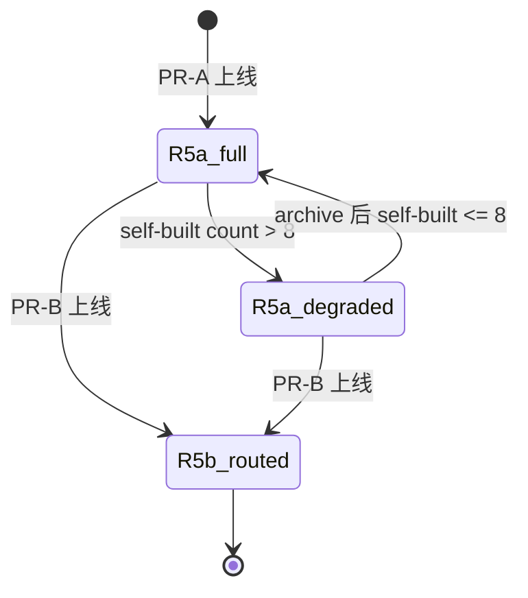

## Goal Capsule

让 ascend_op_agent 在所有 4 个 task_type（migrate / analyze / optimize / develop）执行过程中都能沉淀可复用的自研 skill，并在新会话中自检索。PR-A 范围交付：skill_manage agent 工具（7 action）+ R2 静态校验 + `/learn` CLI + Layer 6 全量注入 + 底层三件重构（TaskRouter 扩展、Layer 6 from-scratch 重写、FTS5 schema 扩展）。PR-B 的 R5b 任务路由 / R6 语义检索 / R7 分组 / R3 LLM self-check 与 V2=L3 的后台 review fork 推到 follow-up plans。

**Product Contract preservation:** Unchanged. All origin R-IDs (R1-R16), A-IDs (A1-A4), F-IDs (F1-F3), AE-IDs (AE1-AE5b) preserved verbatim from origin.

## Problem Frame

STRATEGY.md 第 47-55 行 "Skill Crystallization" track 宣告方向（"将调试、性能优化经验自动固化为可复用 skill"），但当前架构缺落地能力：

- `skills/` 模块虽有 `SkillStorage` 完整 save/load/delete，但**不在 agent 工具表**中
- `orchestrator/cannbot_loader.py` 仅消费 cannbot，自研 skill 写入缺统一入口
- fix_loop 收敛时 / spike 验证后无 hook——经验靠用户记忆手动写笔记
- 上一轮评估已确认要自研「算子经验 skill」，范围限定在 cannbot 未覆盖的项目/硬件特定增量（910B3 + ops_pt + CANN 9.1.0），护栏必须守住这条边界
- **F-1 决议揭示的可达性矛盾（round 2 feasibility P0×3）：** TaskRouter 仅 wired develop；Layer 6 是 static literal；SKILL_BUNDLES (graph, phase) 与新 (task_type, topic) 键空间不兼容——PR-A 必须先修这三处底层

## Actors

**A1. 算子开发者**（人）—— GPU 工程师迁移算子到 AscendC 时，用 `/learn` 描述来源（目录/URL/"刚才做的"/笔记），或修正 agent 沉淀的 skill。

**A2. 前台 agent**（`AIAgent` 主循环）—— 多轮工具调用循环中，按 task_router 路由 + PhaseRunner 编排执行各 task_type（migrate/analyze/optimize/develop）节点；可被 `/learn` 触发一次蒸馏流程；也接收 V2=L3 review fork 的"建议沉淀"通知（仅展示）。

**A3. 后台 review fork**（`AIAgent` 子实例，V2=L3 引入）—— 每 N 轮 fork 独立 agent 实例，重放对话历史，使用同一 `skill_manage` 工具写入 skill；父子不共享 prompt cache（不同 model key），同模型时共享 `_cached_system_prompt`。

**A4. SkillCrystallizer**（V2 reserved，L3 引入）—— L1/PR-A 不实现，仅预留。L3 承担：控制 review fork 触发节奏、把 fork 写入结果经 A2 回调展示、把 fork 的 `skill_manage` 调用写入 provenance（`write_origin="background_review"`）。

## Requirements

R-IDs preserved from origin verbatim. Brief re-statement of how PR-A satisfies each:

| R-ID | Requirement (brief) | PR-A satisfied via |
|------|---------------------|---------------------|
| R1 | `skill_manage` 7 action schema | U4 |
| R2 | 静态校验（必填字段、name class-level、TaskType+Topic、cannbot 不重名、Project Scope 首段） | U4 |
| R3 | LLM self-check | **PR-A 不实现**（Q6 决议：80/20 折中，推迟到 PR-B 或 skill 数 >20） |
| R4 | provenance 写入 | U4 |
| R5a | Layer 6 全量注入 self-built skill name+description | U2 + U6 |
| R5b | 路由命中收敛 | PR-B（U2 留 hook） |
| R6 | 语义检索 | PR-B（U3 提供 FTS5 schema 基础） |
| R7 | cannbot 在前/自研在后排序 | U2 |
| R8 | `/learn` CLI + `build_learn_prompt` + `_AUTHORING_STANDARDS` | U5 |
| R9 | V2=L3 review fork | V2 plan |
| R10 | TaskType+Topic 元数据 + 存储分离 | U4（frontmatter 元数据）+ U1（cannbot 不落盘边界） |
| R11 | Project Scope 首段 | U4 |
| R12 | cannbot 同名拒绝（patch 也拦截） | U4（用 U1 的 list_cannbot_skill_names） |
| R13 | `dimension="reference"` 扩展 | U4（storage 层小扩展） |
| R14 | 增量 rebuild（用 add_skill） | U3 + U4 |
| R15 | archive action | U4 |
| R16 | 结构化错误 | U4 |

## Acceptance Examples

AE-IDs preserved from origin verbatim. PR-A coverage:

| AE-ID | Behavior | PR-A covered in |
|-------|----------|-----------------|
| AE1 (PR-A) | `/learn ops_pt build.sh 配置` → create skill → Layer 6 可见 | U5 + U6 integration test |
| AE2 (PR-B) | env-dep 不被拦截 | 已知代价，U6 量化 false-negative 基线 |
| AE3 (PR-A 部分) | develop 任务中 `tiling_pitfalls` 命中 | U6 integration test |
| AE4 | patch cannbot skill 拒绝 | U4 test |
| AE5a (PR-A) | `/learn` 无参数返回教学错误 | U5 test |
| AE5b (PR-B/V2) | session-replay 蒸馏 | 推到 PR-B/V2 |

## Scope Boundaries

### Deferred for later（V2 评估后再做，carry from origin）

- L3 后台 review fork
- fix_loop 收敛时 hook
- spike 验证后 hook

### Outside this product's identity（明确不做，carry from origin）

- 自研通用迁移知识（cannbot 已覆盖）
- 覆盖或修改 cannbot 官方 skill
- skill 库云端同步 / 团队共享
- skill 版本号管理与升级提示

### Deferred to Follow-Up Work（plan-local，PR-A 不做）

- **PR-B（独立 plan）：** R5b 任务路由收敛 / R6 语义检索 / R7 分组渲染 / R3 LLM self-check
- **V2 = L3（独立 plan）：** SkillCrystallizer（A4）实现 / 后台 review fork / fix_loop hook / spike hook
- **Q4：** L3 review fork N 轮节奏与 profile disable
- **后续 U8/U9：** TASK_TYPE_MIGRATE 真业务逻辑（Path A 迁移 executor）/ ANALYZE + OPTIMIZE 真业务逻辑
- **R5a → R5b 数值化 trigger：** self-built >30 时紧急晋升 PR-B R5b（F-4 降级是临时机制）
- **F-2 V2 进入 checklist：** ≥8 skills + ≤2 patch 冲突 + 0 R2 regression
- **F-6 metric delta：** PR-B R3 启用后用同一 held-out 集复测 false-negative
- **R13 `dimension="reference"` AE 覆盖：** 当前 U4 包含 storage 扩展但无 PR-A AE（后续 `/learn` 加 references 时补）

## Approach

Plan enriches origin Product Contract by enumerating how each requirement lands in 6 PR-A implementation units. The key architectural shift from round 1 estimate: F-1 forced PR-A to absorb 3 底层重构（TaskRouter/Layer 6/FTS5 schema）that were originally thought to be V2/PR-B infrastructure. PR-A scope expanded from ~1-1.5 wk to ~3-4 wk accordingly.

## Key Technical Decisions

**KTD-1 (F-1)：** PR-A 含 3 件底层重构（TaskRouter 扩展 / Layer 6 重写 / FTS5 schema 扩展），是 4 task_type scope 可达性的硬前置。逆命题不成立：不做这三件，scope 扩到 4 task_type 是空头支票。

**KTD-2 (F-4 + feasibility P0 #5)：** R5a 全量注入内置降级阈值（self-built >8 时自动收敛为"同 task_type 子集"——不读 last-loaded 历史，消除 jsonl 反向依赖与并发写问题），不依赖 PR-B R5b 接管。阈值 8（非 20）的依据：cannbot ~16 + self-built 8 = 24 skill × ~40 chars ≈ 600 tokens，留 Layer 6 budget 余量。description 截断 ≤40 字符。降级是 PR-A 期间的临时机制，PR-B R5b 上线后取消。

**KTD-3 (F-5)：** Topic 枚举在 PR-A 阶段是 free-form label，不参与 R5a 渲染、不作为 R2 必填校验（仅 warning）。4 task_type × 15 topic 槽位远超 PR-A 目标 5-10 skill，等证据足再冻结。

**KTD-4 (F-6)：** R2 静态护栏 false-negative 基线（5 条语义违规案例预期 ≥60% false-negative）作为 PR-A ship gate 必跑项。PR-B R3 启用后用同一 held-out 集复测，delta 是 R3 真实价值指标。

**KTD-5 (Q6)：** PR-A 不实现 R3 LLM self-check。原因：内部工具定位 + GLM rate-limit 脆弱性（CLAUDE.md 已记录）+ 初期 skill 少时静态校验 + 人工 review 够用。

**KTD-6 (Q9)：** Skill 名仅 topic（`tiling_pitfalls`），task_type 只留 metadata。命名跨 task_type 复用，910B3→910B4 升级不触发改名风暴。

**KTD-7：** 7-action 单一工具（而非细粒度多工具或透明 Crystallizer 函数）。理由：L3 fork 调用方零改动；护栏/provenance 集中。R13 `add_reference` action 当前无 PR-A AE 覆盖，作为 storage 扩展先就位。

**KTD-8：** R14 用 `SkillIndex.add_skill`（已存在）作为热路径写入，`rebuild_index` 保留为全量刷新路径（task_type schema 变更后）。R13 的 `dimension="reference"` 是 SkillStorage.save_skill dimension 分支加一档的微扩展。

## High-Level Technical Design

PR-A 数据流（用户手动沉淀路径）：

```mermaid
flowchart LR
    A1[算子开发者 /learn CLI] --> U5[/learn handler]
    U5 --> Q[_pending_input 队列]
    Q --> A2[前台 agent AIAgent]
    A2 --> FR[file_read / file_search / web_extract 收集素材]
    A2 --> U4[skill_manage agent 工具 7 action]
    U4 --> R2[R2 静态校验]
    R2 --> SS[SkillStorage.save_skill]
    SS --> FS[self-built/ 写入 SKILL.md]
    SS --> SI[SkillIndex.add_skill 热路径]
    SI --> FTS5[FTS5 task_type+topic 列]
    A2 -.下一轮 prompt.-> U2[Layer 6 _build_skills_layer]
    U2 --> CB[扫 vendored cannbot]
    U2 --> SB[扫 self-built/]
    U2 --> F4{self-built count &gt;8?}
    F4 -->|否| ALL[全量注入 name+description]
    F4 -->|是| SUB[降级: 同 task_type 子集]
    CB --> U2
    SB --> U2
    U2 --> A2next[Layer 6 渲染 cannbot 在前]
```

Layer 6 R5a → R5b 状态机（F-4 + PR-B 演进）：



底层依赖（U1/U2/U3 协调）：

```mermaid
flowchart TB
    U1[U1 TaskRouter 扩展] --> U3[U3 FTS5 schema]
    U1 --> U2[U2 Layer 6 重写]
    U3 --> U2
    U2 --> U4[U4 skill_manage 工具]
    U3 --> U4
    U1 --> U4
    U4 --> U5[U5 /learn CLI]
    U1 --> U5
    U2 --> U5
    U5 --> U6[U6 ship gate]
    U4 --> U6
    U2 --> U6
    U6 --> [*]
```

## Implementation Units

### U1. TaskRouter 扩展 + task_type 传透链路 + cannbot 加载器映射

- **Goal:** 让 migrate/analyze/optimize 3 类 task_type 也能跑过 PhaseRunner 节点；建立 `task.type` → PhaseRunner → run_conversation → PromptBuilder 的完整传透链路（让 U2 Layer 6 能拿到 task_type 做降级）；cannbot_loader 暴露 `list_cannbot_skill_names()` 给 R12 用 + 列全 `(graph, phase) → (task_type, topic)` 1:1 映射。这是 F-1 决议三件底层重构第一项 + **feasibility P0 #2/#3 修订**。
- **Requirements:** F-1 第一项；R12（cannbot 同名校验依赖）；R10（cannbot 不落盘边界）；R5a 降级（task_type 传透是 U2 降级前置）。
- **Dependencies:** 无（PR-A 第一个 U）。
- **Files:**
  - `task_router/executor_dispatch.py` — 给 `TASK_TYPE_MIGRATE` / `ANALYZE` / `OPTIMIZE` 三个分支加 stub executor（pass-through：执行 PhaseRunner 节点 + 收集输出 + 返回结果，不真做迁移/分析/优化业务逻辑）。
  - `task_router/executor_dispatch.py` 的 `_dispatch_*` — 调 `orchestrator.invoke` 前把 `task.type` 写到 PhaseRunner thread state（`state["task_type"] = task.type`），让各 PhaseRunner 节点能从 state 取出
  - `orchestrator/nodes/common.py:122` — `run_conversation` 调用处改为 `agent.run_conversation(task_prompt, skills_layer_override=skill_bundle_text, task_type=state.get("task_type"))`（从 state 取 task_type 透传）
  - `orchestrator/nodes/micro_mod.py:108` — 同上
  - `agent/core.py` — `AIAgent.run_conversation(self, ..., task_type: Optional[str] = None)` 加关键字参数；内部存到 `self._current_task_type`；`build_system_prompt` 读 `self._current_task_type` 传给 `_build_skills_layer(override, task_type)`
  - `agent/prompt_builder.py` — `build_system_prompt(self, ..., task_type: Optional[str] = None)` 接 task_type，传给 `_build_skills_layer`
  - `orchestrator/cannbot_loader.py` — 加 `list_cannbot_skill_names(root: Path | None = None) -> set[str]`（`@functools.lru_cache(maxsize=1)` 进程内缓存，不落盘——scope-guardian：~10-20 skill O(N) 微秒级，落盘 cache 是过度工程且无 invalidation 策略）；加 `CANBOT_BUNDLE_MAP` 常量（见 Approach 列全 1:1 映射）
- **Approach:**
  - **task_type 传透链路（P0 #2 核心）：** 三段式——TaskRouter dispatch 写 thread state → PhaseRunner 节点从 state 取出传给 run_conversation → AIAgent 存 self._current_task_type → build_system_prompt 读它 → `_build_skills_layer(override, task_type)`。非 PhaseRunner 路径（如纯 `/learn` 聊天）task_type=None，U2 降级走"回退全量"。
  - **CANBOT_BUNDLE_MAP 1:1 列全（P0 #3 核心）：** 现有 SKILL_BUNDLES 全部键的显式翻译（无 `topic_from_key` 动态函数）：
    - `("migration", "cuda_frontend") → ("migrate", "cuda_frontend")`
    - `("migration", "triton_frontend") → ("migrate", "triton_frontend")`
    - `("new_dev", "design") → ("develop", "kernel_pattern")`（design 属算子设计，归 kernel_pattern 桶；lossy 但可追溯）
    - `("new_dev", "codegen") → ("develop", "build_env")`（codegen 落 build_env 桶）
    - `("new_dev", "review") → ("develop", "kernel_pattern")`（review 归 kernel_pattern 桶）
    - `("any", "compile_fix") → ("develop", "build_env")`
    - `("any", "precision_fix") → ("develop", "precision")`
    - 映射原则：SKILL_BUNDLES 的 phase（design/codegen/review/compile_fix/precision_fix）是**开发动作**，与 develop topic（tiling/precision/build_env/kernel_pattern/dtype_handling）非同构；采用 lossy 归类（design/review→kernel_pattern，codegen/compile_fix→build_env），在 plan 与 cannbot_loader 注释里写明 lossy 性质。若 PR-B 需要更细粒度，再扩 develop topic 枚举。
  - Stub executor 不真实现业务，只保证 dispatch 不抛 `TaskGatedError` + `task.type` 上下文传透。后续 U8（Path A 迁移 executor）+ U9（analyze/optimize 真 executor）替换 stub。
- **Patterns to follow:** `task_router/executor_dispatch.py:69-76` 的 `TASK_TYPE_DEVELOP` 分支结构；`cannbot_loader.py:159-190` 的 `SKILL_BUNDLES` 静态表；`functools.lru_cache` 进程内缓存模式。
- **Test scenarios:**
  - Happy: 4 task_type 各自 `create_task` + `dispatch` 不抛 `TaskGatedError`
  - Happy: dispatch 后 PhaseRunner thread state 含 `task_type` 字段
  - Happy: **task_type 传透端到端**——develop task dispatch 后 next prompt 的 Layer 6（U2）能拿到 task_type=develop（P0 #2 验证）
  - Happy: `list_cannbot_skill_names(CANNBOT_ROOT)` 在 vendored cannbot 路径上返回非空 set；二次调用走 lru_cache 不重扫
  - Happy: `CANBOT_BUNDLE_MAP` 遍历所有 `SKILL_BUNDLES` 已存在 7 个键都能 1:1 翻译（P0 #3 验证）
  - Edge: vendored cannbot submodule 未初始化时 `list_cannbot_skill_names` 返回空 set 且不抛（U4 R12 据此决定 fail-closed 还是 skip，见 U4）
  - Error: dispatch 在 stub 上执行时 PhaseRunner 节点报错 → stub 返回 error 包到 task_result，不向上抛
- **Verification:** 4 task_type dispatch 后 thread state + Layer 6 都含 task_type（P0 #2 传透闭环）；`CANBOT_BUNDLE_MAP` 7 键 1:1 翻译覆盖率 100%（P0 #3）；`list_cannbot_skill_names` 空/非空两态 + lru_cache 命中。

### U2. PromptBuilder Layer 6 重写（override 合并 + 双源 join + F-4 降级）

- **Goal:** 让 Layer 6 在**生产路径**（PhaseRunner 节点走 `skills_layer_override` 整段替换）下也能渲染 self-built skill。重写 `_build_skills_layer` 只是默认路径——生产路径的 `skills_layer_override` 必须从"整段替换"改为"合并"：override 提供的 cannbot bundle 段落 + `_build_self_built_section()` 生成的 self-built 段落拼接，cannbot 在前 self-built 在后。self-built 殞数超阈值时按 task_type 子集降级。这是 F-1 决议第二项 + F-4 决议 + **feasibility P0 #1/#5 修订**。
- **Requirements:** R5a（PR-A 全量注入）、R7（cannbot 在前）、R10（cannbot 不落盘，跨源 join）、F-4（降级阈值）。
- **Dependencies:** U1（task_type 上下文 + list_cannbot_skill_names + CANBOT_BUNDLE_MAP）。
- **Files:**
  - `agent/prompt_builder.py:81-85` — **关键改动：** 把 `if skills_layer_override is not None: layers.append(skills_layer_override) else: layers.append(self._build_skills_layer())` 改为 `layers.append(self._build_skills_layer(skills_layer_override, task_type))` —— override 不再短路，而是作为参数传入 `_build_skills_layer`，函数内部把 override 段落（cannbot）与 `_build_self_built_section(task_type)` 段落（self-built）合并渲染
  - `agent/prompt_builder.py:151-162` — 重写 `_build_skills_layer(self, override: Optional[str], task_type: Optional[str])`，拆 `_build_self_built_section(task_type)` + `_build_cannbot_section(override)` + `_merge_sections()` + `_maybe_degrade(subset, task_type)` 四个子函数
  - **不引入新存储文件**（feasibility/adversarial/scope-guardian 三重命中：`skill_loads.jsonl` 反向依赖 + 并发写无保护 + PR-A 期间 >20 阈值永不触发是 dead code）。降级路径只按 task_type 过滤，不读 last-loaded 历史
- **Approach:**
  - **合并策略（P0 #1 核心）：** `_build_skills_layer(override, task_type)` 统一构造 Layer 6：`override`（cannbot bundle 文本，来自 orchestrator 节点）在前；`_build_self_built_section(task_type)`（扫 `~/.ascend_op_agent/skills/self-built/` 渲染 name+desc）在后。无 override 时（非 PhaseRunner 路径，如纯 `/learn` 聊天）cannbot 段走 `_build_cannbot_section()` 直接扫 vendored。
  - **token budget 重算（P0 #5）：** 实测 cannbot ~16 skill + self-built 阈值前全量 = 36 skill × ~100 chars ≈ 900 tokens，超出 agent budget。降级阈值从 self-built >20 改为 **self-built >8**（与 cannbot 16 合计 ≤24 skill，~600 tokens 安全）；description 截断从 ≤60 字符改 **≤40 字符**。Verification 测 Layer 6 ≤ 800 tokens（prompt 总量视角，非 Layer 6 单独）。
  - **降级（F-4 修订）：** self-built >8 时按 task_type 子集注入（task_type 缺失时回退全量，避免空集）；不读 last-loaded 历史，消除 jsonl 反向依赖与并发写问题。
  - Layer 6 不注入 body，只注入 `name + description + task_type + topic` 摘要。`list_cannbot_skill_names()`（U1）过滤 self-built 与 cannbot 同名的污染。
- **Patterns to follow:** `agent/prompt_builder.py` 现有 `_build_*_layer` 函数族风格；`skills/storage.py:SkillStorage._build_skill_content` 的 YAML frontmatter 解析。
- **Test scenarios:**
  - Happy: **生产路径**（PhaseRunner 节点传 skills_layer_override=cannbot_bundle）下 Layer 6 含 cannbot 段 + self-built 段（P0 #1 验证）
  - Happy: 0 self-built skill → Layer 6 仅含 cannbot 段（override 或直接扫）
  - Happy: 5 self-built skill → 全量注入
  - Edge: 10 self-built skill → 降级模式（同 task_type 子集），cannbot 仍在前
  - Edge: task_type 缺失（非 PhaseRunner 路径）+ self-built >8 → 回退全量不空集
  - Edge: vendored cannbot 路径不可读 + 无 override → Layer 6 仅含 self-built
  - Edge: self-built/ 下某 SKILL.md frontmatter 解析失败 → 跳过该 skill 不阻塞其他
  - Edge: Layer 6 总长 ≤ 800 tokens（cannbot 16 + self-built ≤8 全量场景实测）
- **Verification:** 生产路径（override 非空）Layer 6 含双段（P0 #1 通过）；降级阈值 10 self-built 时只剩同 task_type 子集；Layer 6 ≤800 tokens；cannbot 在前不依赖 vendored 可读性。

### U3. SkillIndex FTS5 schema 扩展（task_type + topic 列）+ schema_meta 表 + add_skill 热路径

- **Goal:** FTS5 schema 加 `task_type` + `topic` 两列（供 R6 search action 按 task_type+topic 过滤）；schema 版本号存独立 `schema_meta` 表（**非 FTS5 列**——feasibility P0 #4）；R14 改为热路径用 `add_skill`（已存在 line 139）替代全量 `rebuild_index`。这是 F-1 决议第三项 + R14 增量要求 + **feasibility P0 #4 + adversarial migration 安全修订**。
- **Requirements:** R6（PR-B search action 的索引前置）、R13（`dimension="reference"` 小扩展）、R14（增量 rebuild）、F-1 第三项。
- **Dependencies:** U1（cannbot 加载 + task_type 上下文）；可与 U2 并行但 SkillIndex schema migration 协调窗口。
- **Files:**
  - `skills/index.py` — FTS5 virtual table schema 加 `task_type TEXT, topic TEXT` 两列；**新增普通表 `schema_meta(key TEXT PRIMARY KEY, value TEXT)`** 存 schema 版本号（FTS5 virtual table 无常规列结构，`PRAGMA table_info` 只返回伪列，版本号不能放 FTS5 内——P0 #4）；保留 `rebuild_index` 但加注释"only for full refresh, prefer add_skill"
  - `skills/index.py:_init_db` — 同事务 `CREATE TABLE IF NOT EXISTS schema_meta (key TEXT PRIMARY KEY, value TEXT)` + 写入 `('schema_version', '2')`
  - `skills/storage.py:33-35` — 新增 `SUFFIX_REFERENCE = "_reference"` 常量（与 `SUFFIX_BUGFIX`/`SUFFIX_PERFORMANCE` 风格一致）
  - `skills/storage.py:68-73` save_skill dimension 分支 — 加 `elif dimension == "reference": dir_name = f"{skill.name}{SUFFIX_REFERENCE}"`
  - `skills/installer.py:81` — rebuild_index 调用点加注释指向 add_skill 作为热路径替代
  - `ascend_op_agent/cli.py`（或主 CLI 入口）— 新增显式 `--migrate-skill-index` flag 触发一次性 DROP+CREATE+reindex migration（**不**在 SkillIndex.__init__ 自动跑——adversarial：一次性破坏性 op 不该是 agent 启动副作用）
- **Approach:**
  - **schema 版本检测（P0 #4 核心）：** `schema_meta` 是普通 SQLite 表（与 FTS5 同库 `self.db_path`）。`SkillIndex.__init__` 读 `SELECT value FROM schema_meta WHERE key='schema_version'`：值为 '2' = 当前 schema，no-op；值为 '1' 或表不存在 = 需 migration，但 **不自动执行**，而是 raise `SkillIndexMigrationRequired` 提示用户跑 `--migrate-skill-index`。这避免 agent 启动时一次性 DROP+CREATE 阻塞 + 失败后索引空（adversarial：silent wrong）。
  - **migration 安全（adversarial）：** `--migrate-skill-index` 流程——(1) 备份当前 FTS5 内容到内存 list（`SELECT name,description,tags,content FROM skills`）；(2) `DROP TABLE skills` + 重建含 6 列；(3) 重插备份（task_type/topic 暂 NULL）；(4) 写 `schema_meta schema_version='2'`。任一步失败 → restore 备份 + 不升版本号（原子性）。CLI 输出迁移行数 + 耗时。
  - R6 search 在 task_type/topic NULL 上走 name-only fallback（迁移期容错）。
  - `add_skill` 已存在（line 139）upsert，写入路径统一调它而非 `rebuild_index`。R13 `dimension="reference"` 在 save_skill dimension 分支加一档（`SUFFIX_REFERENCE="_reference"`）。
- **Patterns to follow:** `skills/index.py:139` add_skill 已有的 upsert 逻辑；`skills/storage.py:57-85` save_skill 的 dimension 分支；`functools`/原子事务模式。
- **Test scenarios:**
  - Happy: `add_skill` 写入带 task_type+topic 的 skill，FTS5 row 含两列且 value 非空
  - Happy: `add_skill` 后下一次 search 按 task_type 过滤返回该 skill
  - Happy: `dimension="reference"` 写入后目录名 `{name}_reference`，`load_skill({name}_reference)` 能解析
  - Happy: schema_meta 表存在且 schema_version='2' 时 SkillIndex.__init__ no-op 不抛
  - Edge: schema_meta 缺失或 version='1' → SkillIndex.__init__ raise `SkillIndexMigrationRequired`（不自动 DROP，P0 #4 + adversarial）
  - Edge: `--migrate-skill-index` 在空索引上跑 → 创建 schema_meta + version='2'，无数据损失
  - Edge: `--migrate-skill-index` 中途失败（mock disk full）→ restore 备份 + version 不升 + 索引可读
  - Error: `add_skill` 在 FTS5 不可用时（disk full）记录错误不阻塞写入
- **Verification:** schema_meta 表存在 + schema_version 可读（P0 #4）；`--migrate-skill-index` 原子性（失败 restore）；add_skill 单次调用后无需 rebuild 即被 search 命中；rebuild_index 调用频率从每次写入降为 0；`dimension="reference"` 目录名符合 `{name}_reference`。

### U4. skill_manage agent 工具（7-action schema + R2 静态校验 + R16 结构化错误）

- **Goal:** 新建 `agent/tools/skill_manage_tool.py`，7 action 独立 schema + R2 静态校验完整版本 + R16 结构化错误返回 + provenance 元数据生成。
- **Requirements:** R1（7 action）、R2（静态校验）、R4（provenance）、R11（Project Scope 首段）、R12（cannbot 同名拒绝）、R13（dimension 扩展）、R14（用 add_skill）、R15（archive）、R16（结构化错误）、F-5（topic soft 校验仅 warning）。
- **Dependencies:** U1（list_cannbot_skill_names）、U3（add_skill 热路径 + FTS5 schema）。
- **Files:**
  - `agent/tools/skill_manage_tool.py` — 新建：7 action dataclass（`CreateSkillArgs` / `PatchSkillArgs` / `AddReferenceArgs` / `ArchiveSkillArgs` / `LoadSkillArgs` / `ListSkillsArgs` / `SearchSkillsArgs`）+ ToolRegistry 注册入口 + 静态校验函数 `_validate_skill_static()` + 错误响应 dataclass（`SkillManageError` 含 `field` + `reason` + `remediation_hint`）+ provenance 元数据生成 `_build_provenance_metadata()` + 调用 `SkillIndex.add_skill` 而非 `rebuild_index`
  - `agent/tools/__init__.py` — 注册 skill_manage_tool
  - `agent/tools/skill_manage_tool.py` 的 `archive` action 写 provenance 字段（`archive_at` / `archive_reason`）到 SKILL.md frontmatter
- **Approach:** 7 action schema 用 dataclass 独立定义（每个 action 一个 `@dataclass` 类，ToolRegistry 用现有 JSON schema 转换）。R2 静态校验清单一次实现完整版本：(a) 必填字段 `name` / `description` / `task_type` / `topic` / `body`；(b) `name` regex `^[a-z][a-z0-9-]*[a-z0-9]$` 且不含 PR 号/错误串/日期/具体任务对象；(c) `task_type ∈ TASK_TYPES`；(d) `topic` soft warn（`logging.getLogger(__name__).warning(...)`，不阻塞，return 字段含 `warning: {field: 'topic', reason: 'not_in_bucket', hint: 'see TASK_TYPE_TOPIC_BUCKETS in cannbot_loader'}`）；(e) 第一段 body 是 `## Project Scope`；(f) cannbot 同名 → reject（用 U1 的 `list_cannbot_skill_names()`）。R16 错误响应 schema：`{"success": false, "error": "validation_failed", "field": "name", "reason": "...", "remediation_hint": "..."}`。
  - **patch action 语义（feasibility 修订）：full-replacement。** patch schema 字段与 create 相同（name + description + task_type + topic + body + provenance patch），调用方必须重传完整 skill 内容。理由：`SkillStorage.save_skill` 是整段覆盖写（无 load-modify-merge），partial merge 需在工具内部 load + dict merge + 写回，增加复杂度且 R4 provenance 的 `updated_at` 语义在 merge 下含糊。full-replacement 简单可证伪：patch 不传 body → reject `"patch requires full body (full-replacement semantics), not partial merge"`。
  - **archive action 语义（feasibility 修订）：** 不走 save_skill（_build_skill_content 字段白名单无 archive_*）。archive 直接读 SKILL.md → 字符串注入 `archive_at` / `archive_reason` 到 frontmatter `metadata.ascend_op_agent` 子节点 → 移文件到 `.archived/`。`load_skill` 解析时还原 archive_* 到 Skill.metadata。
  - **R12 vendored 缺失处置（adversarial 修订）：fail-closed。** `list_cannbot_skill_names` 返回空 set 时，区分两种情况：(1) vendored 路径配置存在但不可读（submodule 未初始化）→ **reject 写入**，返回 `"cannbot submodule unavailable — refusing write to avoid cannbot-name collision risk; run git submodule update --init"`；(2) vendored 路径根本未配置（CANNBOT_ROOT 不存在）→ warn 但允许（开发者明确禁用 cannbot 的场景）。避免 vendored 缺失时静默放行 cannbot 同名 skill 的污染窗口。
- **Patterns to follow:** `agent/tools/file_write_tool.py` 的 dataclass + ToolRegistry 注册；`skills/storage.py:139` 的 Skill 对象构造；`cannbot_loader.list_cannbot_skill_names`（U1）。
- **Test scenarios:**
  - Happy: 7 action schema 各自接受合法输入
  - Happy: create 成功后 `self-built/` 下有 SKILL.md + frontmatter 含 task_type/topic/provenance.write_origin=manual
  - Happy: patch（full-replacement）成功后 frontmatter `updated_at` 字段被更新 + body 完整保留
  - Happy: archive 成功后 SKILL.md 在 `.archived/` 下 + frontmatter metadata.ascend_op_agent 含 archive_at/archive_reason + load_skill 还原
  - Happy: search action 按 task_type 过滤返回该 task_type 下的 self-built skill
  - Edge: topic 不在分桶枚举 → soft warning 不阻塞（F-5）
  - Edge: patch 不传 body → reject（full-replacement 语义）
  - Edge: `list_cannbot_skill_names` 返回空 + vendored 路径配置存在 → reject 写入（R12 fail-closed，adversarial）
  - Edge: `list_cannbot_skill_names` 返回空 + vendored 路径未配置 → warn 但允许
  - Error: name 含 PR 号 → R16 reject 含 remediation
  - Error: cannbot 同名 → reject `"Refusing write: cannbot-owned skill name collision: <name>"`
  - Error: body 缺 Project Scope → reject
  - Error: 缺 task_type → reject `"task_type must be one of TASK_TYPES: [migrate, analyze, optimize, develop]"`
- **Verification:** 7 action schema 字段校验覆盖率 100%；patch full-replacement 语义（不传 body reject）；archive frontmatter 注入 + load 还原；R12 vendored 缺失 fail-closed（配置存在时 reject）；R16 错误响应含 `field` / `reason` / `remediation_hint` 三字段；静态校验失败率 ≥99% on 5 条明显违规 held-out set（F-6 ship gate）。

### U5. /learn Python CLI 命令 + _handle_learn_command（build_learn_prompt 内联）

- **Goal:** 实现 `/learn` **Python CLI** 命令（ascend-op-agent CLI 入口），把 user_request 注入 agent 输入队列，agent 通过 `skill_manage(action="create")` 沉淀 skill；无参数走 AE5a 教学错误。**PR-A 仅 Python CLI**（feasibility 修订：TUI frontend 的 /learn 涉及前端 keybinding + RPC method + backend handler 三处，推到 PR-B/V2 独立覆盖）。
- **Requirements:** R8（/learn 命令 + build_learn_prompt + `_AUTHORING_STANDARDS`）、AE5a（无参数教学错误）。
- **Dependencies:** U4（skill_manage 工具已注册）、U1（task_type 上下文在 agent prompt 里可用）。
- **Files:**
  - `cli.py`（ascend-op-agent Python CLI 入口）— 新增 `_handle_learn_command(cmd: str)` 解析 `/learn <自由文本>` + 内联 `build_learn_prompt(user_request: str) -> str`（scope-guardian：单函数不新建模块；Q3 决议若抽 `agent/skill_standards.py` 时再迁移，避免一次性中间形态）+ `_AUTHORING_STANDARDS` 常量
  - **PR-A 不动**：TUI frontend（`frontend/` Ink/React）、`backend/rpc/server.py` 的 /learn 相关 RPC method
- **Approach:** `_handle_learn_command` 解析文本：空字符串 → AE5a 教学错误（不注入 agent，直接 print）；非空 → `build_learn_prompt` 构造 prompt 注入 `_pending_input`。`_AUTHORING_STANDARDS` 内嵌 9 段 body 模板：首段 `## Project Scope`（适用范围 + 版本边界）+ 后续 8 段（When to Use / Prerequisites / How to Run / Quick Reference / Procedure / Pitfalls / Verification / Related Skills）、description ≤60 字符、TaskType+Topic 元数据强制、禁止 cannbot 已覆盖通用知识。Agent 在该轮用 file_read/file_search/web_extract 收集素材后调 `skill_manage(action="create"|"patch")`。
- **Patterns to follow:** hermes `_handle_learn_command` + `build_learn_prompt`（参考实现）；`cli.py` 现有 slash 命令分发模式。
- **Test scenarios:**
  - Happy: Python CLI `/learn ops_pt build.sh 配置` → prompt 注入 `_pending_input` 且内嵌 `_AUTHORING_STANDARDS` 关键字串
  - Happy: agent 在该轮调 `skill_manage(action="create")` 成功沉淀 skill（与 U4 集成）
  - Happy: prompt 含 `task_type ∈ TASK_TYPES` 提示 + `topic` 分桶建议
  - Edge: `/learn` 无参数 → 返回教学错误（不进入蒸馏流程，AE5a）
  - Edge: user_request 含 cannbot 已覆盖通用知识 → prompt 警告 agent 不重复
  - Error: `_pending_input` 队列满 → 返回 CLI 错误（不丢消息）
- **Verification:** Python CLI `/learn` 触发后 agent 的 `_pending_input` 队列长度 +1；prompt 内嵌 `_AUTHORING_STANDARDS` 关键字串（含 "Project Scope" + "When to Use" 等 9 段标题）；TUI frontend 在 PR-A 不暴露 /learn。

### U6. PR-A 闭环验收：R5a 全量注入 + F-4 降级 + F-6 false-negative 基线 + ship gate

- **Goal:** 验证 PR-A 6 个 U 串联工作（U1→U2→U3→U4→U5→U2 闭环）；建立 R2 静态护栏 false-negative 基线（F-6 决议）；运行 ship gate。
- **Requirements:** F-1（PR-A 范围决议：3 件底层重构）、F-3（product-level 观测性 metric）、F-4（>8 降级）、F-6（held-out false-negative 基线）。
- **Dependencies:** U1, U2, U3, U4, U5。
- **Files:**
  - `tests/integration/test_skill_crystallization_pr_a.py` — 端到端集成测试：`/learn` → `skill_manage(create)` → SkillStorage 写入 → FTS5 含 → Layer 6 注入 → agent 看到
  - `tests/fixtures/skill_false_negative_held_out.yaml` — 5 条语义违规案例（env-dep / one-shot / 负面断言 / 等，AE2 是其中之一）
  - `tests/fixtures/skill_obvious_violations_held_out.yaml` — 5 条明显违规案例（name 含日期、缺 task_type、与 cannbot 同名、缺 Project Scope、缺必填字段）— 静态护栏召回测试
  - `scripts/ship_ready.py` 加 PR-A 验收 step（schema 合规率 100% + 静态护栏召回 on 明显违规 + Layer 6 注入可观测 + false-negative 基线记录）
- **Approach:** Held-out 5 条语义违规 fixture（取自 hermes 负面清单 + 项目特定的 CANN 9.1.0 set_env.sh env-dep 案例 = AE2），R2 静态校验预期 false-negative ≥60%（确认 R2 本就拦不住语义违规，为 PR-B R3 baseline）。Ship gate 通过条件：(a) U1-U5 集成测试全绿；(b) R2 schema 合规率 100%（在合法 fixture 集上）；(c) 5 条明显违规案例 R2 全部 reject（静态护栏召回）；(d) Layer 6 注入可观测性测试通过；(e) F-6 false-negative 基线值记录到 `~/.ascend_op_agent/state/metrics/skill_guardrail_baseline.json`（含 timestamp + 测试集 hash + false-negative 率）。F-2 的 ≥8 skills + ≤2 patch 冲突 + 0 regression 是 V2 进入条件（PR-A 内不查，记入 V2 checklist）。
- **Patterns to follow:** `scripts/ship_ready.py` 现有 step 模式（lint + unit_test + stress + e2e_tui）。
- **Test scenarios:**
  - Integration: 端到端 `/learn` → 写入 → 注入 → 看到（**生产路径**：PhaseRunner 节点传 skills_layer_override，验证 override 不短路、self-built 段被合并渲染——P0 #1 闭环）
  - Integration: 4 task_type 各自端到端 flow 跑通（task_type 从 task_router 传透到 Layer 6——P0 #2 闭环）
  - Held-out: 5 条明显违规（name 含日期、缺 task_type、与 cannbot 同名、缺 Project Scope、缺必填字段）→ R2 全部 reject
  - Held-out: 5 条语义违规 → false-negative 率记录（预期 ≥60%）
  - Edge: 10 self-built skill 时降级阈值触发（同 task_type 子集，不读 last-loaded）
  - Edge: Layer 6 注入长度 ≤ 800 tokens（cannbot 16 + self-built ≤8 全量场景实测，P0 #5）
  - Edge: vendored cannbot 不可读 → Layer 6 仅含 self-built
  - Held-out: `create + add_reference` 同流程 → SkillStorage 写 dimension=reference 后 load_skill 可解析（R13 PR-A 端到端覆盖，RISK-8 缓解落地）
- **Verification:** ship gate 6 条全过（含 P0 #1 生产路径合并 + P0 #2 task_type 传透）；false-negative 基线值入 metric log；Layer 6 ≤800 tokens；held-out fixture 文件有 schema_version 字段便于后续 PR-B R3 复测。

## Verification Contract

PR-A ship gate 5 条（U6 验证）：

1. **Schema 合规率 100%：** 在合法 skill fixture 集上 R2 静态校验通过率 100%。
2. **静态护栏召回：** 5 条明显违规案例（held-out）R2 全部 reject。
3. **Layer 6 注入可观测：** 写入 `self-built/` 的 skill 在下一轮 prompt 的 Layer 6（R5a 全量或 F-4 降级子集）可见，agent 通过 `skill_manage(action="load")` 读到 body。
4. **静态护栏 false-negative 基线：** 5 条语义违规案例（held-out）的 R2 false-negative 率记录到 metric log（PR-B R3 启用后用同一集复测 delta）。
5. **集成测试全绿：** U1-U5 端到端集成测试覆盖 4 task_type × `/learn` 流程。
6. **可演进：** skill_manage 工具接口在 L3 review fork 启用时不变更（护栏/provenance 自动生效，KTD-7）——origin Success Criteria 第 4 条 carry。

## Definition of Done

- U1-U6 全部 ship gate 通过
- PR-A 工期 ~3-4 周（vs round 1 估计 ~1-1.5 周，因 F-1 加了 3 件底层重构）
- `~/.ascend_op_agent/skills/self-built/` 至少 1 个测试 skill 写入 + 在 Layer 6 可见（集成测试覆盖）
- F-2 L1→L3 gating（≥8 skills + ≤2 patch 冲突 + 0 regression）条件记录到 V2 启动 checklist
- F-6 false-negative 基线值入 metric log，等 PR-B R3 启用后 delta 评估
- 原 origin doc 中所有 5 项 F-决议的产物（held-out fixture、metrics log、降级阈值）有可见产物
- `cannbot_loader.list_cannbot_skill_names` 暴露给 `skill_manage` 工具
- 4 task_type 各自至少 1 个 `/learn` 端到端集成测试覆盖

## Risks & Dependencies

- **RISK-1 (medium):** TaskRouter stub executor 仅做 pass-through；TASK_TYPE_MIGRATE/ANALYZE/OPTIMIZE 真业务逻辑由后续 U8（Path A 迁移 executor）+ U9（analyze/optimize 真 executor）实现，PR-A 不覆盖。**缓解：** PR-A 阶段仅验证 dispatch 不抛错 + task_type 上下文传透，真业务逻辑推迟到 Path A/B 后续 work。
- **RISK-2 (medium):** FTS5 schema DROP+CREATE migration 期间（U3）skill 索引短暂不可用，影响 R6 search action。**缓解：** migration 步骤在 PR-A 初始化时一次执行（`_init_schema_migration_if_needed()` in `SkillIndex.__init__`），运行时不再触发；存量 skill 的 task_type/topic NULL 容错（name-only fallback）。
- **RISK-3 (medium):** Layer 6 改动（U2）触及生产路径 `skills_layer_override` 合并语义（P0 #1）+ token budget 重算（P0 #5），回归风险高于纯默认路径重写。**缓解：** U6 集成测试显式覆盖生产路径（override 非空）+ 0/5/10 self-built 三档 + cannbot 可读/不可读两态 + Layer 6 ≤800 tokens 断言。
- **RISK-4 (low):** 4 task_type × 15 topic 槽位远超 PR-A 目标 5-10 skill，F-5 决议推迟 topic 冻结时机，PR-A 阶段 topic 是 free-form label。**缓解：** PR-A 不查 topic 分桶枚举（仅 warning），PR-B 或 V2 累积 ~10 skill 后再决定冻结。
- **RISK-5 (high):** Origin Problem Frame "TaskRouter 仅 wired develop" 与新 scope 4 task_type 的张力（feasibility P0）需 U1 显式修补——若 U1 stub executor 不完整，整个 F-1 决议失效。**缓解：** U1 是 ship gate 第一个 U；dispatcher 不抛错的覆盖率测试是强制门槛。
- **RISK-6 (medium):** SKILL_BUNDLES `(graph, phase) ↔ (task_type, topic)` 映射表的完备性。**缓解：** U1 阶段映射表覆盖所有现有 SKILL_BUNDLES 条目（CANBOT_BUNDLE_MAP 静态表 + 单元测试 1:1 翻译覆盖）。
- **RISK-7 (medium):** PR-A 工作量从 round 1 估计 ~1-1.5 周扩到 ~3-4 周（因 F-1 3 件底层重构 + feasibility P0 修订进一步细化），若 U2（override 合并）或 U3（FTS5 migration）overrun >1 周，触发 **PR-A.1 contingency（adversarial 建议）**：ship PR-A.1 = U1 + U4 + U5 only（develop-only，Layer 6 保持现有 static literal + skills_layer_override 不合并，skill_manage 工具可用但 agent 暂时看不到 self-built skill），再 PR-A.2 补 U2 + U3。PR-A.1 仍满足 AE1（skill_manage create）+ AE5a（/learn 教学错误）+ AE4（cannbot 拒绝），不满足 AE3（Layer 6 自发现）。这保留 U2/U3 滑期时的可交付进度，不重开 F-1 决议。
- **RISK-8 (low):** R13 `dimension="reference"` 当前无 PR-A AE 显式覆盖（origin 标注为 PR-A 内小扩展但缺 AE 验证场景）；U4 实现 storage 层扩展但 U6 ship gate 仅做基本 schema 验证，不测 add_reference action 的真实使用。**缓解：** U6 integration test 加 1 条 "create + add_reference 同流程" 端到端覆盖（轻量补丁）。

## Stakeholders & System-Wide Impact

- **算子开发者（A1）：** 通过 `/learn` CLI 沉淀/检索经验；Layer 6 注入可观测后无需手动查 `self-built/` 目录
- **agent（A2）：** 工具表新增 `skill_manage`，Layer 6 路由让 agent 自发现已沉淀经验
- **orchestrator 维护者：** TaskRouter stub + PhaseRunner task_type 上下文传递（U1 涉及 `orchestrator/nodes/common.py` 与 `micro_mod.py` 的 run_conversation 签名）
- **skills 模块维护者：** FTS5 schema migration 路径（U3）+ storage layer dimension 扩展（U4）
- **canbot 加载器维护者：** `(graph, phase) ↔ (task_type, topic)` 映射常量维护（U1）
- **CLI 维护者：** `/learn` 命令入口（U5）

## Sources & Research

- **Origin:** [docs/brainstorms/2026-07-12-skill-crystallization-requirements.md](docs/brainstorms/2026-07-12-skill-crystallization-requirements.md) — 完整 Product Contract + Q1-Q9 + F-1~F-6 决议
- **Codebase references（round 2 feasibility P0×3 揭示的硬约束，PR-A 必须解决的）:**
  - `task_router/executor_dispatch.py:69-76` — `TASK_TYPE_DEVELOP` 分支 + `TaskGatedError` raise
  - `agent/prompt_builder.py:151-162` — Layer 6 static literal（即将被 U2 重写）
  - `agent/prompt_builder.py:81-85` — `skills_layer_override` replaces Layer 6 entirely
  - `orchestrator/cannbot_loader.py:159-190` — SKILL_BUNDLES (graph, phase) keys
  - `skills/index.py:127-134` — FTS5 schema 4 列（即将被 U3 加 2 列）
  - `skills/index.py:139` — `add_skill` 已存在（U4 将用作热路径）
  - `skills/index.py:445-455` — `rebuild_index` 是全量 DELETE+INSERT
  - `orchestrator/nodes/common.py:122` — `run_conversation` 调用点（U1 加 task_type 参数）
  - `orchestrator/nodes/micro_mod.py:108` — `run_conversation` 调用点（U1 加 task_type 参数）
- **Reference implementation:** hermes `_handle_learn_command` + `build_learn_prompt`（U5 参考实现来源）
- **STRATEGY.md:** Skill Crystallization track + "Skill reuse rate" 指标

## Open Questions

[carry from origin Q2/Q3/Q4 as Deferred to Planning, re-stated for plan-local context]

- **Q2 (Deferred to Planning):** Layer 6 "路由命中" skill 列表最大长度上限（R5b PR-B）？
- **Q3 (Deferred to Planning):** R3 LLM self-check prompt 模板是写在 `skill_manage_tool.py` 里独立维护，还是抽出到 `agent/skill_standards.py` 与 `/learn` 的 `_AUTHORING_STANDARDS` 共用？
- **Q4 (Deferred to Planning):** L3 review fork N 轮节奏（默认 10）配置化与 profile disable 接口？

## Deferred to Follow-Up Work

- **PR-B（独立 plan）：** R5b 任务路由收敛 / R6 语义检索 / R7 分组渲染 / R3 LLM self-check / CANBOT_BUNDLE_MAP 在 PR-B 阶段补全（U1 仅覆盖现有 SKILL_BUNDLES）
- **V2 = L3（独立 plan）：** SkillCrystallizer（A4）实现 / 后台 review fork / fix_loop 收敛 hook / spike 验证后 hook
- **Q4：** L3 review fork N 轮节奏与 profile disable（推到 V2）
- **U8：** TASK_TYPE_MIGRATE 真业务逻辑（Path A 迁移 executor，替换 U1 stub）
- **U9：** TASK_TYPE_ANALYZE + OPTIMIZE 真业务逻辑（独立 plan，替换 U1 stub）
- **R5a → R5b 数值化 trigger：** self-built skill >30 时紧急晋升 PR-B R5b（F-4 降级是临时机制）
- **F-2 V2 进入 checklist：** ≥8 skills + ≤2 patch 冲突 + 0 R2 regression
- **F-6 metric delta：** PR-B R3 启用后用同一 held-out 集复测 false-negative 率，delta 是 R3 真实价值指标
- **R13 `dimension='reference'` AE 覆盖：** 当前 U4 包含 storage 扩展但无 PR-A AE（后续 `/learn` 加 references 时补）
- **origin Alternatives Considered 中"thinner wrapper"（adversarial P1 finding）：** 此处不引入更激进的简化（已 F-1+F-4 决议覆盖）