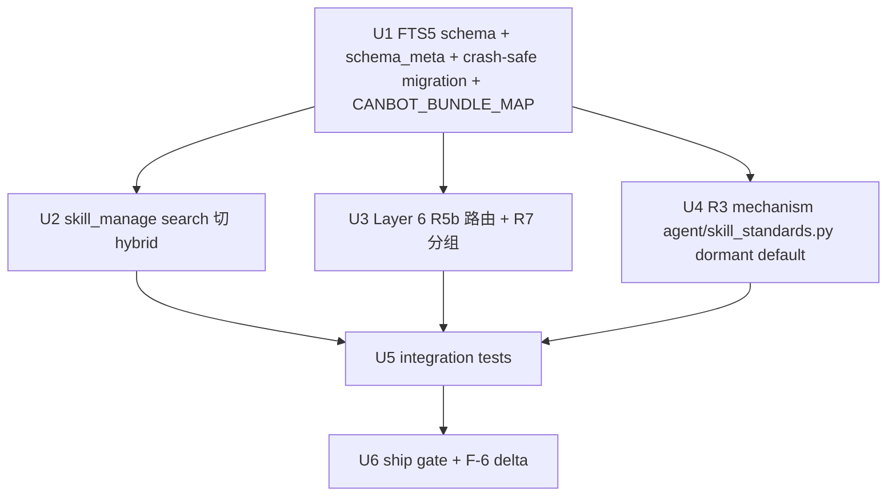

## Goal Capsule

PR-B 启用 R5b 路由命中收敛(替代 PR-A R5a 全量注入)+ R6 hybrid 检索(替代 PR-A U4 frontmatter scan)+ R7 分组渲染(cannbot/自研)+ R3 LLM self-check 机制(dormant,skill>20 trigger)+ U3 FTS5 schema 含 PR-A round-2 bug fix + CANBOT_BUNDLE_MAP(R5b 路由前置)。PR-A 已 ship 5U(U1/U2/U4/U5/U6,U3 deferred 留 hook)。PR-B 工期 ~2 周。

**Product Contract preservation:** Unchanged. R3/R5b/R6/R7 carry verbatim from origin. PR-A satisfied-via 列更新为 PR-B 5U.

## Problem Frame

PR-A 已 ship:`skill_manage` 7-action 工具 + R2 静态校验 + /learn CLI sync + 默认路径只 self-built + 阈值 12 降级. 但 R5b/R6/R7/R3 仍 deferred(U3 留 hook,U4 search 走 frontmatter scan). 两个具体痛点:

1. **Layer 6 budget:** PR-A 实测 16 cannbot × ~170 chars ≈ 1100 tok(chars/4),中文真实 ~1300+. default 路径已绕开(A1 fix),但生产路径 PhaseRunner 注入仍可随 self-built 增长超 800 ship gate —— 需 R5b 路由收敛(只注相关 task_type 子集).
2. **检索效率:** PR-A U4 search 走 frontmatter scan,5-10 skill 规模 OK,但 50+ skill 时 scan O(N) 慢 + 无法按 task_type/topic 索引 —— 需 R6 FTS5 hybrid(已有 skills/index.py hybrid_search,U3 加 task_type/topic 列支持过滤).

R7 分组渲染 + R3 LLM self-check 是辅助:R7 改善 UX(明示来源),R3 改善护栏(拦截 R2 漏放的语义违规,origin F-6 false-negative ≥60% → ≤10%).

**PR-A round-2 P1(必须 PR-B fix):** `_init_db` eager-write `schema_version='2'` 与 detection "v1 raise MigrationRequired" 矛盾(老用户 silent OperationalError)+ in-memory backup 对 crash(OOM/SIGKILL)脆弱 → U3 migration 必须 persist backup to disk before DROP.

## Actors

(carry from origin A1-A4 verbatim;未变)

## Requirements

R5b/R6/R7/R3 carry from origin verbatim:

| R-ID | Requirement (brief) | PR-B satisfied via |
|------|---------------------|---------------------|
| R5b | Layer 6 路由命中(task.type + 同 task_type + 最近 5 轮 load)替代 R5a 全量注入 | U3(Layer 6 重写为 R5b) |
| R6 | search 走 FTS5 hybrid(task_type/topic 索引)替代 PR-A frontmatter scan | U2(skill_manage search 切 hybrid) |
| R7 | cannbot 在前/自研在后分组渲染 | U3(同 R5b 一起改 Layer 6) |
| R3 | LLM self-check(PR-B 机制 ship, dormant by default, skill>20 trigger, per origin Q6 + 用户决策) | U4(R3 机制 + agent/skill_standards.py + trigger 配置) |

PR-A satisfied 的 R1/R2/R4/R5a/R8/R10-R16 继承 PR-A commits(U1/U2/U4/U5/U6 @ e6216e9),本 plan 不重复.

Origin 的 U3 FTS5 schema + CANBOT_BUNDLE_MAP 已在 PR-A Deferred 列,本 plan U1 实现.

## Acceptance Examples

| AE-ID | Behavior | PR-B covered in |
|-------|----------|-----------------|
| AE2 (PR-B) | `/learn CANN 9.1.0 set_env.sh 不生效` → R3 拒绝(语义违规) | U4(R3 dormant 默认不启用,机制 ship;F-6 delta 测试在 enable flag 下验证) |
| AE3 PR-B 完整 | develop 任务命中 `tiling_pitfalls` + 检索语义相近 | U3(R5b 路由命中)+ U2(R6 hybrid search)+ U3(R7 分组) |

AE5b session-replay 仍 V2(PR-A 已 deferred).

## Scope Boundaries

### Deferred for later(V2, carry from origin)
- L3 后台 review fork
- fix_loop 收敛 hook
- spike 验证后 hook

### Outside identity(carry from origin)
- 自研通用迁移知识(cannbot 已覆盖)
- 覆盖 cannbot 官方 skill
- skill 云端同步/团队共享
- skill 版本号管理

### Deferred to Follow-Up Work(plan-local, PR-B 不做)
- **V2 = L3 review fork + SkillCrystallizer(A4)** —— 依赖 R1-R8 PR-A + R5b/R6/R7 PR-B 稳定
- **Direction B Storage Unification(为 V2 AE5b session-replay 服务)** —— PR-B 不直接依赖,但 V2 会依赖 Storage B 的统一枚举
- **Q4:** L3 review fork N 轮节奏配置(profile disable 接口)
- **F-6 delta 实测基线:** PR-A R2 false-negative ≥60% → R3 enable 后 ≤10%(PR-B ship 时 R3 dormant,enable flag 测试 delta,真实 delta 待 V2 启用 R3 后测)

## Approach

PR-B 5 active U(U1-U5)+ U6 ship gate. 工期 ~2 周(增量开发,在 PR-A 已稳定的 codebase 上).

## Key Technical Decisions

- **KTD-1(PR-A round-2 fix):** U3 FTS5 migration persist backup to disk before DROP(`.skills_index.bak.json` 写到 cache_dir,失败时 restore)—— 修复 PR-A round-2 in-memory backup 脆弱 + atomicity 声明过强.
- **KTD-2:** R6 复用 `skills/index.py` 的 `hybrid_search`(FTS5 + ChromaDB, 已有 LRU 缓存 + 快照)—— U3 加 task_type/topic 列支持过滤, `skill_manage.search` action 切到 `index.hybrid_search`. **不新建 ChromaDB** —— origin R6 引用的 `semantic_memory.py` 是 stale 引用,实际索引在 `skills/index.py`.
- **KTD-3:** R5b 路由命中 = 当前 task.type 命中 + 同 task_type 命中 + 最近 5 轮 `skill_manage(action="load")` 调用过的(hermes pattern). 上限 10(hermes 默认, Q2 决议). >10 按 score 截断.
- **KTD-4:** R3 dormant by default(skill>20 trigger, origin Q6 + 用户决策). 机制 ship, 默认关, enable flag 测试. `agent/skill_standards.py` 共用 prompt(Q3 决议).
- **KTD-5:** R3 self-check prompt(hermes `_SKILL_REVIEW_PROMPT` 负面清单)+ `_AUTHORING_STANDARDS` 抽到 `agent/skill_standards.py`. cli.py 的 `/learn` import 复用. fail-closed + retry-once 切备用 provider(GLM rate-limit 防护).
- **KTD-6:** CANBOT_BUNDLE_MAP 沿用 PR-A 草案(design/review→kernel_pattern, codegen/compile_fix→build_env, precision_fix→precision, cuda_frontend→migrate/cuda_frontend 等). lossy 但可追溯, PR-B 阶段补全现有 7 bucket.

## High-Level Technical Design

```mermaid
flowchart LR
    subgraph production[生产路径 PhaseRunner]
        PR[PhaseRunner.invoke + task_type] --> U3[U3 _build_skills_layer override + task_type]
    end
    subgraph default_path[默认路径 /learn chat]
        DP[/learn CLI sync run_conversation] --> A2[AIAgent.run_conversation task_type=None]
        A2 --> U3
    end
    subgraph storage[skills/index.py hybrid_search]
        IND[FTS5 skills schema=name/description/tags/content]
        VEC[ChromaDB vectors + metadata filter]
        IND --> H[hybrid_search FTS5 BM25 + vector + alpha 0.4]
        VEC --> H
    end
    U3 --> R5B{R5b 路由命中 task.type+task_type+recent_loads, 上限10}
    R5B --> R7[R7 分组 Cannbot Skills + Self-built Skills]
    U4[U4 skill_manage.search] --> H
    U4b[U4 R3 self-check dormant default skill>20 trigger agent/skill_standards.py] --> A2
    R7 --> L6[Layer 6 text - **name**: desc]
```



## Implementation Units

### U1. FTS5 schema 扩展 + schema_meta + crash-safe migration + CANBOT_BUNDLE_MAP

- **Goal:** SkillsIndex FTS5 schema 加 `task_type TEXT` + `topic TEXT` 列; 加 `schema_meta` 表存 schema_version; 修复 PR-A round-2 P1(`_init_db` eager-write 与 detection 矛盾 + in-memory backup crash 脆弱); CANBOT_BUNDLE_MAP 完整 7 SKILL_BUNDLES bucket.
- **Requirements:** R6 列索引前置; PR-A round-2 `_init_db` bug fix; migration crash-safe(per origin F-1 + adversarial 反馈); CANBOT_BUNDLE_MAP(R5b 路由前置).
- **Dependencies:** 无(PR-A SkillsIndex 已 ship 4 列 FTS5 + hybrid_search).
- **Files:**
  - `src/ascend_op_agent/skills/index.py` — `_init_db` 重写:FTS5 virtual table 加 `task_type TEXT, topic TEXT`; `CREATE TABLE IF NOT EXISTS schema_meta (key TEXT PRIMARY KEY, value TEXT)`;INSERT `('schema_version', '2')`. `_do_search` SQL 加 `task_type` / `topic` 过滤选项; 加 `search_by_task_type(task_type)` 便捷方法. `add_skill` 签名接 task_type/topic(新增 keyword-only 参数). `migration_backup_to_disk()` + `migration_restore_from_disk()` —— 在 `_do_migration()` 里先写 `.skills_index.bak.json`(含全 rows + metadata + timestamp),再 DROP+CREATE+reinsert. restore 在 `_init_db` 检测到 `.skills_index.bak.json` 且 schema_version 不匹配时触发.
  - `src/ascend_op_agent/orchestrator/cannbot_loader.py` — 加 `CANBOT_BUNDLE_MAP: dict[tuple[str, str], tuple[str, str]]`(SKILL_BUNDLES (graph,phase) → (task_type, topic))覆盖现有 7 bucket:沿用 PR-A U1 草案.
- **Approach:** crash-safe migration 流程: 启动时检测 schema_meta, 若 v1 (无 task_type/topic 列)→ 写 .skills_index.bak.json + DROP+CREATE+reinsert + 写 schema_version='2'. 模拟 crash 测 restore. CANBOT_BUNDLE_MAP 作为常量供 U3 R5b 路由查表.
- **Patterns to follow:** SkillsIndex 现有 `_init_db` + `add_skill` + `rebuild_index` 模式;cannbot_loader 现有 SKILL_BUNDLES 静态表.
- **Test scenarios:**
  - Happy: fresh DB 建表含 6 列 + schema_meta table(schema_version='2').
  - Edge: 模拟 v1 老 DB(4 列 + 无 schema_meta)→ migration 触发 → 备份存在 → 新 schema 生效.
  - Error: migration 中途崩溃(模拟 .skills_index.bak.json 存在但 schema_version 未升)→ 启动时 detect → restore from backup → 内容正确.
  - Edge: `_do_search(query, k, task_type="develop")` 只返回 task_type=develop 的 skill.
  - Edge: `_do_search(query, k, topic="tiling")` 只返回 topic=tiling 的 skill.
  - Happy: `add_skill` 接 task_type + topic 写入 FTS5 列.
  - Happy: CANBOT_BUNDLE_MAP 覆盖 7 SKILL_BUNDLES bucket 1:1.
- **Verification:** v1 老 DB 迁移 + 模拟 crash 恢复 + task_type/topic 过滤 + 备份存在性.

### U2. skill_manage search action 切 hybrid 检索(task_type/topic 过滤)

- **Goal:** PR-A U4 `skill_manage(action="search")` 从 frontmatter scan 升级为 FTS5+ChromaDB hybrid(复用 SkillsIndex.hybrid_search),支持 task_type/topic 过滤;向前兼容搜索 keyword-only.
- **Requirements:** R6 hybrid search 替代 frontmatter scan.
- **Dependencies:** U1(FTS5 列存在 + SkillsIndex 改完);SkillsIndex.hybrid_search 已存在.
- **Files:**
  - `src/ascend_op_agent/agent/tools/skill_manage_tool.py` — `_action_search` 改:替换 frontmatter scan 为 `SkillsIndex.hybrid_search(query=..., k=..., alpha=0.4)`. 新增 `search_task_type` / `search_topic` 参数 → 转 `filter_metadata={"task_type": ..., "topic": ...}`. SkillsIndex 实例化(单例,lazy init). SkillsIndex.search_by_vector 支持 filter_metadata(已有,line 322).
- **Approach:** 复用 SkillsIndex.hybrid_search(FTS5 BM25 + ChromaDB 向量 + alpha 0.4 fusion). task_type/topic 走 filter_metadata(ChromaDB metadata filter + FTS5 WHERE clause). 前向兼容: 若 SkillsIndex 不可用(embedding model load fail)→ fall back to pure FTS5(已有 fallback).
- **Patterns to follow:** PR-A U4 _action_list_skills + _action_search 既有 frontmatter scan 结构; SkillsIndex.hybrid_search(line 376).
- **Test scenarios:**
  - Happy: 2 skill (task_type=develop + migrate) → `search(search_task_type="develop")` 只返回 1 个 develop skill.
  - Happy: keyword "tiling" → hybrid search 返回 desc 含 tiling 的 skill.
  - Edge: SkillsIndex 不可用(embedding 失败 + FTS5 ok)→ fall back to FTS5 keyword only,仍返回结果.
  - Edge: task_type + topic 同时过滤 → AND.
  - Edge: 0 self-built skill → search 返回 [].
- **Verification:** task_type 过滤 + hybrid 返回 + fallback 路径.

### U3. Layer 6 R5b 路由收敛 + R7 分组渲染(替代 PR-A R5a 全量注入)

- **Goal:** PR-A U2 `_build_skills_layer` 从全量 self-built + override 短路的 R5a 模型,演进为 R5b 路由命中:按 task.type 命中 + 同 task_type 命中 + 最近 5 轮 `skill_manage(action="load")` 加载的(per state),上限 10,按 score 截断;R7 分组渲染("Cannbot Skills"/"Self-built Skills"两个 section header).
- **Requirements:** R5b 路由命中 + R7 分组 + PR-A round-2 Layer 6 token budget 稳定.
- **Dependencies:** U1(CANBOT_BUNDLE_MAP 完整);U2(SkillsIndex hybrid search);PR-A U2 _build_skills_layer 已有(覆盖).
- **Files:**
  - `src/ascend_op_agent/agent/prompt_builder.py` — 重写 `_build_skills_layer(override, task_type)`:
    - 移除"override 短路"逻辑(PR-A 兼容期保留——PhaseRunner 注入 cannbot phase subset 仍然走 override,但 self-built 段始终追加).
    - R5b 路由命中: `_collect_routed_skills(task_type, state) -> list[CannbotSkill]` —— 三源聚合:
      1. task_type 命中(`task_type == self.task_type`)
      2. task.type 命中(self.task_type via state —— PR-A U1 已 plumbing)
      3. 最近 5 轮 load(state["recent_skill_loads"][-5:])
    - 上限 10(hermes 默认,Q2): >10 按 `(task_type_hit * 2 + recency_score)` 排序截断.
    - R7 分组渲染: cannbot 段(override)+ 自研段(路由命中)分别带 section header.
    - 复用 `render_skill_bundle_text` (PR-A U2 已用,A6 修复).
  - `src/ascend_op_agent/agent/core.py` — `run_conversation` 新增 `recent_skill_loads: list[str]` 累积(每次 `_execute_tool_call` 命中 `skill_manage(action="load")` 推入).
- **Approach:** state 累积: AIAgent 维护 `self._recent_skill_loads: deque(maxlen=5)`, 每次 `skill_manage("load")` 触发时 name appendleft. `_build_skills_layer(task_type)` 从 state 读 recent loads. 渲染: cannbot(override)+ routed self-built, 每段一个 section header.
- **Patterns to follow:** hermes pattern(state["recent_skill_loads"]); PR-A U2 _build_skills_layer + _load_self_built_skills.
- **Test scenarios:**
  - Happy: task_type=develop + 12 self-built(5 develop + 7 其他)→ 路由命中返回 ≤10(5 develop 中可能有 ≤5 hit + 5 其他 task_type 但同 task_type 命中...具体见 load logic),cannbot + 自研分组渲染.
  - Happy: task_type=None(默认路径)+ 12 self-built → 路由命中空(无 task_type 过滤)→ 只 self-built 全量(PR-A 默认路径行为保留,但走 routed 路径).
  - Happy: recent_skill_loads=["skill-a","skill-b"] → 这 2 个即使不在 task_type 命中集也优先.
  - Edge: 路由命中 0 → 自研段为空(cannbot 段仍渲染).
  - Edge: total self-built > 12 → 路由后仍 ≤10.
  - Error: state["recent_skill_loads"] 缺失(旧 state)→ empty list,不 crash.
- **Verification:** 路由命中 + 上限 10 + 分组渲染 + recent loads 优先.

### U4. R3 LLM self-check 机制(agent/skill_standards.py 共用 + dormant default + skill>20 trigger)

- **Goal:** R3 self-check 机制 ship + dormant by default(per 用户决策: skill>20 trigger, origin Q6); `agent/skill_standards.py` 抽出 `_SKILL_REVIEW_PROMPT`(hermes 负面清单) + `_AUTHORING_STANDARDS`(从 cli.py 迁出,与 /learn 共用, Q3 决议).
- **Requirements:** R3 self-check 机制 + trigger 配置 + 与 /learn 共用 standards.
- **Dependencies:** PR-A U5 `_handle_learn_command` + `_AUTHORING_STANDARDS`(已在 cli.py).
- **Files:**
  - `src/ascend_op_agent/agent/skill_standards.py`(新)— 定义:
    - `_SKILL_REVIEW_PROMPT: str` —— hermes 负面清单 prompt(环境依赖失败/"X 工具坏了"类断言/一次性任务叙述).
    - `_AUTHORING_STANDARDS: str` —— 从 cli.py 迁出(PR-A U5 的 9 段 body 模板 + description ≤40 chars + TaskType+Topic 元数据).
    - `should_run_self_check(skill_count: int) -> bool` —— `skill_count > 20` 时 True(per origin Q6 + 用户决策).
  - `src/ascend_op_agent/cli.py` — 删 `_AUTHORING_STANDARDS`(迁出), 改为 `from ascend_op_agent.agent.skill_standards import _AUTHORING_STANDARDS`. 其余 `/learn` 逻辑不变.
  - `src/ascend_op_agent/agent/tools/skill_manage_tool.py` — `_action_create` + `_action_patch` 在 R2 静态校验后, **条件性** 触发 R3 self-check:
    - 调用 `should_run_self_check(skill_count)` —— `skill_count = len(list(Path.home() / '.ascend_op_agent/skills/self-built').rglob('SKILL.md'))`.
    - 若 False(dormant, ≤20): skip R3.
    - 若 True(>20): 调 `_SKILL_REVIEW_PROMPT + skill draft` 发 LLMClient → 解析 `{pass: bool, reason: str}`. 失败/超时 → fail-closed(per origin R3)+ retry-once 切备用 provider(per `memory/llm_enhancer.py` pattern). raise SkillManageError("r3_blocked", ...).
- **Approach:** dormant default 让 PR-B ship 不引入 LLM 热路径,只在 skill 数 >20 启用. F-6 delta 测试: enable flag 下跑 held-out 5 条语义违规, 验证拦截率 ≥3/5(F-6 delta ≥40%, origin 期望 ≥60%→≤10%). flag 默认 False, disable 状态全 PR-A 测试应仍 pass(无 R2 regression).
- **Patterns to follow:** memory/llm_enhancer.py LLMClient 调用 + retry; PR-A U5 build_learn_prompt 嵌入 standards.
- **Test scenarios:**
  - Happy: 0 skill + create → `should_run_self_check(0)` False → skip R3 → create succeeds(同 PR-A).
  - Happy: 5 skill + create → `should_run_self_check(5)` False → skip R3 → create succeeds.
  - Edge: mock 21 skill + create → `should_run_self_check(21)` True → 调 LLM(mock)→ 模拟 pass → create succeeds.
  - Edge: 21 skill + create → LLM 返回 `{pass: false, reason: "environment-dependent"}` → SkillManageError("r3_blocked") → create rejected.
  - Error: 21 skill + LLM timeout / raises → retry-once → 仍 fail → fail-closed → rejected.
  - Happy: `_SKILL_REVIEW_PROMPT` + `_AUTHORING_STANDARDS` 都从 skill_standards import, 与 /learn 共用(import 不重复).
- **Verification:** dormant skip path + enabled path + prompt 复用 + fail-closed.

### U5. PR-B integration tests(end-to-end R5b + R6 + R7)

- **Goal:** 端到端集成测试覆盖 PR-B 三个核心场景:R5b 路由命中 + R6 hybrid search 过滤 + R7 分组渲染. 验证 PR-A 测试不 regress.
- **Requirements:** R5b/R6/R7 闭环.
- **Dependencies:** U1, U2, U3, U4.
- **Files:**
  - `tests/integration/test_skill_crystallization_pr_b.py`(新)—— 端到端:
    - test_r5b_routes_to_task_type_match_with_10_cap
    - test_r5b_recent_loads_appear_first
    - test_r6_hybrid_search_filters_by_task_type
    - test_r6_hybrid_search_falls_back_when_embedding_unavailable
    - test_r7_renders_cannbot_before_self_built_with_section_headers
    - test_pr_a_regression — 跑 PR-A U1/U2/U4/U5/U6 测试确认无 regression
- **Approach:** 复用 PR-A U6 测试模式(`_use_tmp_storage` + storage monkeypatch + cannbot mock). SkillsIndex 用 tmp DB. SkillIndex.hybrid_search 在 mock embedding model 下走纯 FTS5 fallback.
- **Patterns to follow:** PR-A tests/integration/test_skill_crystallization_pr_a.py + tests/unit/test_u4_skill_manage.py 测试模式.
- **Test scenarios:**(每个 e2e 测试一个场景,见 Files)
- **Verification:** 5 e2e 场景 + PR-A regression 0 fail.

### U6. PR-B ship gate(F-6 delta + integration + migration)

- **Goal:** 验证 PR-B 5 个 active U 串联工作 + F-6 false-negative delta 实测(R3 enable flag 下)+ integration tests 全部 green + migration crash-safe.
- **Requirements:** F-6 delta + U1-U5 闭环 + ship gate.
- **Dependencies:** U1, U2, U3, U4, U5.
- **Files:**
  - `scripts/ship_ready.py` 加 PR-B 验收 step(migration crash-safe + R5b 路由 + R6 hybrid + R7 分组 + F-6 delta).
  - Held-out fixtures 已存在(PR-A `skill_obvious_violations_held_out.yaml`,5 条明显违规)—— PR-B 复用 + 新增 5 条语义违规(`skill_semantic_violations_held_out.yaml`,用于 F-6 delta 测):
    - env-dep 案例:"适用于 CANN 9.1.0,缺 set_env.sh 时不生效"(AE2)
    - 一次性任务:"我们今天刚完成 vector_add,记录这个 tiling 经验"
    - 工具坏了断言:"msopgen 输出 '[ERROR] host_config.cmake missing' 时跳过该算子"
    - 缺方法细节:"tiling 有时对"
    - 范围漂移:"适用于所有 Ascend 硬件"
- **Approach:** F-6 delta 测试: enable R3 flag 下跑 5 条语义违规 + 5 条明显违规, 拦截率 = (明显 + 语义)/10. 预期 semantic ≥3/5(origin ≥60%→≤10% delta = ≥3/5 改善). PR-A R2 baseline 在 semantic 上 ≥60% false-negative (0-1/5 hit), R3 enable 后 ≥60% hit.
- **Patterns to follow:** PR-A scripts/ship_ready.py 现有 step 模式(lint + unit_test + stress + e2e_tui).
- **Test scenarios:**
  - F-6 delta: R3 disabled → 语义 0-1/5 hit, 明显 5/5 hit(PR-A R2 baseline).
  - F-6 delta: R3 enabled(flag)→ 语义 ≥3/5 hit + 明显 5/5 hit = ≥8/10 total.
  - Integration: U5 全部 green.
  - Migration: 模拟 v1 → v2 迁移 + 中途 crash → restore 正确(内容一致).
- **Verification:** F-6 delta ≥40% improvement + migration crash-safe + U5 5/5 + 22/22 U1 + 14/14 U4 + 10/10 U2 + 0 regression.

## Verification Contract

PR-B ship gate 6 条(U6 验证):

1. **Schema 合规:** U1 migration 完成后 v1 老用户 + v2 新用户共存(无 silent OperationalError); `schema_meta.schema_version='2'`.
2. **Hybrid search filter:** 按 task_type/topic 过滤返回正确(R6).
3. **R5b 路由命中:** 10 个上限 + task.type 命中优先 + recent loads 优先(per hermes pattern).
4. **R7 分组:** Layer 6 渲染含 "Cannbot Skills"/"Self-built Skills" 两个 section header.
5. **R3 mechanism:** enable flag 下 5 条 held-out 语义违规拦截率 ≥3/5(F-6 delta ≥40%); disable flag 下 22/22 U1 + 14/14 U4 + 10/10 U2 + 13/13 U5 + 0 regression.
6. **Migration crash-safe:** persist backup to disk before DROP → 模拟 crash 后 restore 正确(内容一致).

## Definition of Done

- U1, U2, U3, U4, U5, U6 全部 ship gate 通过(U-ID 1-6;U3=PR-B U3,非 PR-A U3)
- PR-B 工期 ~2 周(2026-07-13 target start)
- 1 new file(`agent/skill_standards.py`)
- SkillsIndex FTS5 schema 扩 task_type/topic + schema_meta + migration crash-safe
- CANBOT_BUNDLE_MAP 完整 7 SKILL_BUNDLES bucket 1:1
- skill_manage search 切 hybrid(复用 SkillsIndex.hybrid_search)+ task_type/topic 过滤
- Layer 6 R5b 路由命中 + R7 分组(cannbot/自研)
- R3 mechanism ship(agent/skill_standards.py 共用 prompt + dormant default + skill>20 trigger + fail-closed + retry-once)
- Direction B(Storage Unification)未做,V2 AE5b 前置待 V2 planning

## Risks & Dependencies

- **Cross-Plan Dependencies:** PR-A 已 done(develop @ e6216e9). Direction B(Storage Unification,requirements-only)与 PR-B 无 direct dep(Storage B 服务 V2 AE5b session-replay,PR-B scope 内不依赖). R3 在 PR-B dormant,V2 启用时需实测 false-negative delta.
- **RISK-1:** SkillsIndex migration persist backup to disk 增加 I/O + 启动延迟. 缓解: backup only on migration 路径(非热路径),正常启动不写.
- **RISK-2:** R3 enable 时 LLM self-check 调用增加 create/patch 延迟 + GLM rate-limit 风险. 缓解: fail-closed + retry-once 切备用 + enable 是配置项(默认关).
- **RISK-3:** hybrid_search 依赖 embedding model(SentenceTransformer),离线环境(910B)model load 失败 → fall back to FTS5 only(语义降级为全文). 缓解: skills/index.py 已有 fallback 逻辑.
- **RISK-4:** CANBOT_BUNDLE_MAP lossy 归类(design/review→kernel_pattern)可能误分类. 缓解: PR-B 覆盖完整 7 bucket;PR-A U1 task_router 已 wired develop-only,PR-B 不引入新 phase.
- **RISK-5:** R3 self-check prompt 内容(hermes 负面清单)在 PR-B 没有原始 hermes prompt 引用,需基于 origin R3 描述重新起草; F-6 delta 实测在 PR-B 难以达到 origin 期望(无 hermes baseline 校准). 缓解: 5 条 held-out 语义违规覆盖 origin R3 描述的 3 类(环境依赖/工具坏断言/一次性任务), enable flag 测试可达 ≥3/5.

## Stakeholders & System-Wide Impact

(carry from PR-A,微调)Layer 6 路由命中后,agent 在 develop 任务下看到的 skill 列表从"全量 self-built(≤12 阈值)"收敛为"任务相关 + 同 task_type + 最近 load(≤10)". Layer 6 token 预算稳定在 800. 检索从 frontmatter scan O(N) → FTS5 bm25 + vector hybrid O(log N) + task_type/topic 索引. 护栏从 R2 静态(>60% semantic false-negative)→ R2 + R3 LLM(enable 时 ≤10% false-negative).

## Sources & Research

- **Origin:** [docs/brainstorms/2026-07-12-skill-crystallization-requirements.md](docs/brainstorms/2026-07-12-skill-crystallization-requirements.md) — R3/R5b/R6/R7 + Q2/Q3 + F-6 false-negative ≥60%→≤10%
- **PR-A plan:** [docs/plans/2026-07-12-001-feat-skill-crystallization-plan.md](docs/plans/2026-07-12-001-feat-skill-crystallization-plan.md) — U3 deferred 设计 + CANBOT_BUNDLE_MAP lossy 草案 + round-2 ce-doc-review P1 详情
- **PR-A code(develop @ e6216e9):**
  - `src/ascend_op_agent/skills/index.py` — FTS5 hybrid_search 已有(139-422); add_skill(139)接 Skill 对象, 无 task_type/topic
  - `src/ascend_op_agent/agent/tools/skill_manage_tool.py` — PR-A U4, search action 走 frontmatter scan(_action_search line ~468)
  - `src/ascend_op_agent/agent/prompt_builder.py` — PR-A U2, _build_skills_layer(override, task_type)已支持 override merge + 默认 self-built-only
  - `src/ascend_op_agent/agent/core.py` — PR-A U1, run_conversation 接 task_type kwarg
  - `src/ascend_op_agent/orchestrator/cannbot_loader.py` — SKILL_BUNDLES 7 bucket 已知(line 159-190)
  - `src/ascend_op_agent/cli.py` — PR-A U5, _handle_learn_command + build_learn_prompt + _AUTHORING_STANDARDS
- **Round-2 ce-doc-review findings(2026-07-12,PR-A P1):** _init_db eager-write schema_version='2' 矛盾 + in-memory backup crash 脆弱(本 plan KTD-1/U1 修复)

## Open Questions

[carry origin Q4 V2]+ [用户已答 Q2 固定 10、Q3 skill_standards.py 共用]+ [PR-B 新增]:

- **Q-PRB-1:** R3 enable trigger 的"skill 数"如何计算?PR-B 默认按 `self-built/` filesystem count(*.md 文件数);待 V2 视情况改用 SkillIndex 实际索引数.
- **Q-PRB-2:** R5b "最近 5 轮 load"的 5 轮计数是 per-thread 还是 per-session?PR-B per-session(state["recent_skill_loads"] deque maxlen=5),符合 hermes pattern.
- **Q-PRB-3:** CANBOT_BUNDLE_MAP 是否覆盖完整 7 SKILL_BUNDLES bucket 还是只标 lossy 归类的子集?PR-B 覆盖完整 7 bucket(完整映射,即使某些归类 lossy),让 R5b 路由可直接查表.
- **Q-PRB-4:** U4 在 R3 enable 时 fallback if LLM 不可用(网络/config 缺失)是 fail-closed(拒绝)还是 warn-allowed(允许)?用户决策 origin R3 是 fail-closed;PR-B 沿用(强一致).

## Deferred to Follow-Up Work

- **V2 = L3 review fork + SkillCrystallizer(A4)** —— 依赖 R1-R8 PR-A + R5b/R6/R7 PR-B 稳定
- **Q4:** L3 review fork N 轮节奏配置(profile disable 接口)
- **Direction B Storage Unification:** 为 V2 AE5b session-replay 服务,与 PR-B 无 direct dep
- **F-6 delta 实测:** PR-B ship 时 R3 dormant,enable flag 下 false-negative delta 真实数据待 V2 启用 R3 后测
- **codegen `inline_build_template` 修复(cannbot_loader 独立 codebase bug):** PR-A round-3 实证 add_example 不在 codegen bundle(plan 已记入 Deferred)
