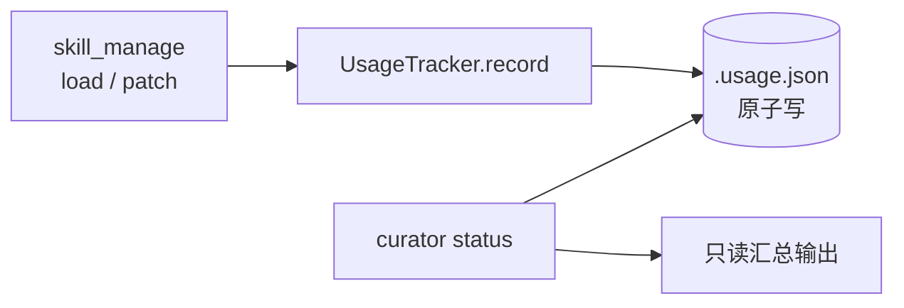
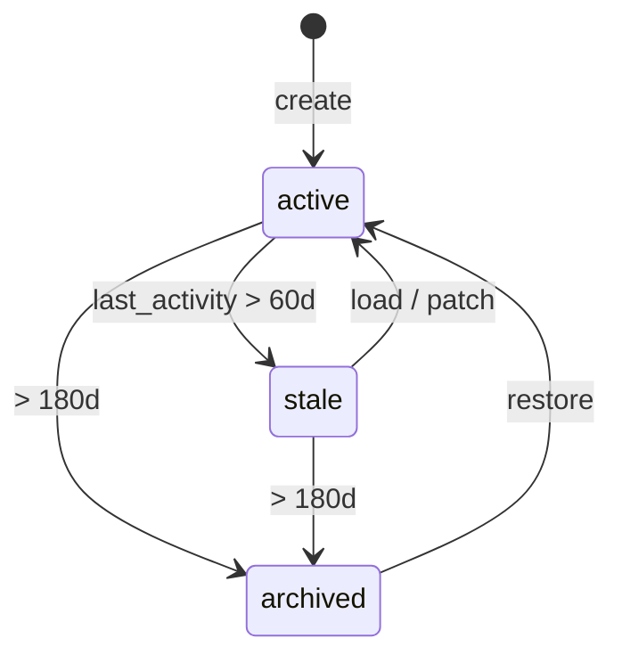

# Skill Curator Lite - Plan

## Goal Capsule

- Objective: 给 self-built skill 加活跃度追踪埋点（Tier 0），提供 usage counts（load/patch 频次，即 STRATEGY.md「Skill reuse rate」的 numerator），让技能使用情况可观测，并为后续技能库自动维护铺数据基础；rate 的分母 defer 到 metric 运营化时定义。
- Product authority: 服务 `STRATEGY.md` 的 Skill Crystallization track 与 key metric "Skill reuse rate — 需要埋点"。Tier 0 提供该 metric 的 numerator（使用计数），分母待 metric 运营化时定。借鉴 hermes-agent 的 Curator 但精简，避免 Direction B 式过度工程。
- Open blockers: 无。
- Stop conditions: Tier 0 三个实现单元 ship + ship gate 过。Tier 1/2 不在本 plan 实现（deferred，标启用门槛）。
- Execution profile: Lightweight，~半天工作量，不依赖 910B。

---

## Product Contract

### Summary

实现 Skill Curator Lite 的 Tier 0：给 self-built skill 加活跃度追踪埋点 + 只读 `curator status` 查看。Tier 1（确定性状态机 + 自动归档）与 Tier 2（LLM 合并伞形）作为 deferred 设计文档化、标启用门槛，不立即实现 —— self-built 停在个位数则它们永不启用，本身作 falsifier。

### Problem Frame

self-built skill 当前仅 1 个（`cann-910b3-compile-pitfalls`），但会随 `/learn` 使用增长。现状有三个缺口：零活跃度追踪（`use_count`/`view_count`/`last_activity` 全无），无法判断一个 skill 还活不活；只有手动单次 archive（`skill_manage` archive action 移 `.archived/`），无基于活跃度的状态机；`STRATEGY.md` 要 "Skill reuse rate" metric 但无埋点。hermes-agent 的 Curator 证明技能库需要维护层（自动归档 + LLM 合并），但全盘照搬是过度工程 —— 它为几十上百个 skill 设计，且自带快照回滚 / cron 重写 / 辅助 LLM 隔离 / 网关触发等重设施。本 plan 先只埋追踪（最小数据基础 + 立刻可观测），把维护逻辑 defer 到规模真正到达时。

### Requirements

**活跃度追踪**

- R1. `skill_manage(action="load")` 成功加载一个已存在的 self-built skill 时，记录一次 use 事件：`use_count` 自增、`last_used_at` 刷新。
- R2. `skill_manage(action="patch")`（经 `_save_self_built` 共用路径）成功保存后，记录一次 patch 事件：`patch_count` 自增、`last_activity_at` 刷新。
- R3. 活跃度持久化到汇总表，原子写（tempfile + `os.replace`）；进程崩溃不留半写文件。
- R4. 追踪范围限定 self-built skill；cannbot vendor skill 永不追踪、永不纳入任何 curator 操作。

**只读可观测性**

- R5. `curator status` 只读输出每个 self-built skill 的 `use_count` / `patch_count` / `last_activity_at`，按最近活动排序；不做状态推导（active/stale/archived 推导是 Tier 1 范围）。
- R6. 汇总表缺失或损坏时，`curator status` 与埋点写入都优雅降级（视为空表 / 重建），不抛异常、不阻塞 `skill_manage` 主操作。

### Scope Boundaries

#### Deferred to Follow-Up Work

- Tier 1（启用门槛：self-built skill 数 > 5）：确定性状态机 `active → stale(60d) → archived(180d)`，被 load/patch 自动重激活；**stale 判定需考虑 Layer 6 task_type 注入**（匹配当前 task 的 self-built skill 即使 use_count=0 也不判 stale，因它正被交付给 agent）；复用已有 `skill_manage` archive 机制（移 `.archived/`，从 prompt_builder Layer 6 注入排除）；CLI `curator run [--dry-run]` 手动触发为主，可选 CLI 启动钩子门控（skill 数 > 门槛 且距上次 > 7 天才跑）。
- Tier 2（启用门槛：self-built skill 数 > 20 且出现零散同类）：LLM 合并伞形（MERGE INTO EXISTING / CREATE NEW UMBRELLA / DEMOTE TO REFERENCES），辅助 LLM 客户端隔离。
- falsifier 语义：self-built 停在个位数 → Tier 1/2 永不启用 = 自动判定技能库不需要自动维护，无需额外决策砍除。

#### Outside this product's identity

- LLM 合并伞形（Tier 2 启用前不做）。
- tar.gz 快照回滚（archive 本身可逆，skill 少无需快照）。
- cron 技能引用重写（本项目 cron 不强依赖 skill）。
- 辅助 LLM 客户端隔离（Tier 0 确定性层无 LLM）。
- 网关 housekeeping 自动触发（本项目无该循环）。
- cannbot skill 维护（vendor，有外部上游）。
- Direction B 的生产 session 统一（已废弃）。

---

## Planning Contract

### Key Technical Decisions

- KTD1. 活跃度存储用单文件 JSON 汇总表（`.usage.json`），非 sqlite、非 SKILL.md frontmatter。usage 是"汇总计数"语义，不是 append-only 事件流（后者才适合 sqlite，如 `task_metrics`）；当前 1 个 skill 数据量极小；免开新 db。**已权衡把 use_count 写进 SKILL.md frontmatter（`_provenance` 已有）的替代方案，选独立 .usage.json：避免每次 load 改写 SKILL.md（写放大 + mtime 抖动影响 prompt 缓存）+ Tier 1 stale/archived 是运行时推导的状态，不该污染作者手写的 SKILL.md 源文件。** 代价是与 `task_store`/`CheckpointStore` 的 sqlite 惯例不一致；若未来要趋势/窗口分析（Tier 1 的 60d/180d 即指向此），汇总模型不够，届时迁 sqlite。
- KTD2. 埋点信号源只取 `skill_manage(action="load")` + `patch`。load = agent 主动加载 = 最强使用信号；prompt_builder Layer 6 每会话被动注入不计（注入只是"放进 prompt"≠"被使用"；但 task_type 匹配的注入说明 skill 与当前工作相关，Tier 1 stale 判定需据此豁免，见 Scope Boundaries）；search 命中 ≠ 使用。忠于"真用"语义，避免行为代理误判（同 R16 complaints 的教训）。
- KTD3. 埋点放 tool 层（`skill_manage_tool`）而非 storage 层（`SkillStorage`）。storage 是纯 CRUD 原语，埋点属行为观察；类比 task 层把 `spontaneous_task_switch` 埋点放 `TaskCommands` 而非 `store.set_active`，保持 storage 行为不变。
- KTD4. `curator` 挂为独立 CLI 子命令组（`curator status` / 后续 `run`…），类比 `task` group，不混入现有 `skill` install 命令。
- KTD5. Tier 1/2 不立即实现，写进 plan 标门槛。分期本身就是 falsifier，避免为不存在的规模建基础设施。**Tier 0 是 exempt baseline**：STRATEGY.md「Skill reuse rate 需埋点」是无条件 mandate（测量层），falsifier 门槛只 gate 维护层（Tier 1/2），不 gate 测量层 —— 所以 Tier 0 不受"为 1 个 skill 建基础设施"的反驳。

### High-Level Technical Design

Tier 0 不涉及状态转换，只追踪 + 只读展示。埋点数据流：

Tier 1 状态机形状（deferred，文档化供未来启用时参照）：

---

## Implementation Units

### U1. 活跃度追踪存储原语（UsageTracker + 汇总表）

- Goal: 提供汇总表的原子读写与 `record` 接口，供埋点调用。
- Requirements: R3, R6
- Dependencies: 无
- Files:
  - create `src/ascend_op_agent/skills/usage_tracker.py`
  - create `tests/unit/test_skill_usage_tracker.py`
- Approach: `UsageTracker(skills_dir=None)` 默认指向 `~/.ascend_op_agent/skills/.usage.json`。`record(name, event)` 做原子读改写（load → 更新对应计数与时间戳 → tempfile + `os.replace`）。`load()` 容错：缺失、非 JSON、**或合法 JSON 但顶层非 dict（如 `[]`）/ 条目值非 dict**，一律返回空表并 warn，不抛（`except` 覆盖范围广于 `JSONDecodeError` + `isinstance(data, dict)` 校验）。tracker 不校验 self-built vs cannbot —— 由调用方（U2）保证只传 self-built 名；cannbot 走独立 `CANNBOT_ROOT`，`skill_manage` 架构上接触不到（R4 由架构保证，U2 测试验证）。
- Patterns to follow: `src/ascend_op_agent/task_store/store.py` 的原子事务语义（这里换成 JSON 版 tempfile+replace）；`cli.py` churn 检测的 best-effort 降级。
- Test scenarios:
  - record use 一次 → `use_count=1`、`last_used_at` 已设；再 record → `2`（Covers R3）
  - record patch → `patch_count` 自增、`last_activity_at` 刷新（Covers R3）
  - 汇总表不存在时 record → 自动创建（Covers R6）
  - 汇总表为非 JSON 损坏时 record/load → 降级返空、不抛（Covers R6）
  - 合法 JSON 但形状错（如 `[]`、或 `{"x": "not-a-dict"}`）→ `load()` 返空不抛（Covers R6）
  - 原子性：写入用 tempfile+replace，无半写中间态暴露给并发读（Covers R3）
- Verification: `test_skill_usage_tracker` 全绿；写入的汇总表可被 `load()` 回读且字段完整。

### U2. skill_manage load/patch 埋点

- Goal: `_action_load` 与 `_save_self_built`（patch 共用路径）成功后调 `UsageTracker.record`。
- Requirements: R1, R2, R4
- Dependencies: U1
- Files:
  - modify `src/ascend_op_agent/agent/tools/skill_manage_tool.py`
  - create `tests/unit/test_skill_manage_usage.py`
- Approach: `_action_load` 在确认 skill 存在并准备返回前 `record(name, "load")`；`_save_self_built` 成功保存后**仅在 `is_update=True` 时** `record(name, "patch")`（`_save_self_built` 是 create+patch 共用路径，不 gate 会让 `create` 误增 `patch_count`）。埋点包在 try/except 内，失败仅 warn、不阻塞主操作（best-effort，同 `cli.py` task select 的 churn 埋点）。reference 维度（`add_reference`）不埋点。
- Patterns to follow: `src/ascend_op_agent/cli.py` task select 的 best-effort 埋点 try/except。
- Test scenarios:
  - load 已存在 skill → 汇总表出现该 skill `use_count=1`（Covers R1）
  - patch 成功 → `patch_count=1`（Covers R2）
  - load 不存在 skill（`not_found`）→ 不埋点（无成功加载）（Covers R1）
  - tracker 抛异常时 `skill_manage` 仍正常返回成功结果（best-effort 不阻塞）（Covers R6）
  - `create()`（`is_update=False`）不增 `patch_count`（共用路径不误埋点）（Covers R2）
  - load/patch 命中 cannbot vendor skill → 不写 tracking（`skill_manage` 只操作 self-built，cannbot 走独立 `CANNBOT_ROOT`）（Covers R4）
- Verification: `test_skill_manage_usage` 全绿；手动 `skill_manage load <self-built>` 后汇总表计数 +1。

### U3. curator status CLI

- Goal: 新增 `curator` 子命令组，`status` 只读汇总各 self-built skill 活跃度。
- Requirements: R5, R6
- Dependencies: U1
- Files:
  - modify `src/ascend_op_agent/cli.py`
  - create `tests/unit/test_curator_cli.py`
- Approach: `@main.group()` 定义 `curator`（结构类比 `task` group）。`curator status` 联合 `UsageTracker.load()` 与 **self-built-only 枚举**（直接遍历 `self-built/` 子目录、或新增 `SkillStorage.list_self_built()`——不沿用 `list_skills()`，后者会混入 `_reference/` 平铺目录，违反 R5），输出表格（name / use_count / patch_count / last_activity_at，按最近活动排序）。汇总表缺失/损坏 → 仍列出 skill、计数显示 0/未使用，不报错。输出用 rich，非 tty 友好。
- Patterns to follow: `src/ascend_op_agent/cli.py` `task` group 结构；`scripts/falsifier_baseline.py` 的 report 输出风格。
- Test scenarios:
  - 有 skill + 有 usage 数据 → status 输出含各 skill 行与计数（Covers R5）
  - 汇总表缺失 → status 仍列 skill、计数 0、不报错（Covers R6）
  - 汇总表损坏 → 降级、列 skill 计数 0（Covers R6）
  - 无 self-built skill → status 输出空提示（Covers R5）
- Verification: `test_curator_cli` 全绿；CLI `ascend-op-agent curator status` 真跑输出表格。

---

## Verification Contract

| Gate | Command |
|------|---------|
| 新单元测试 | `HF_HUB_OFFLINE=1 PYTHONPATH=src python -m pytest tests/unit/test_skill_usage_tracker.py tests/unit/test_skill_manage_usage.py tests/unit/test_curator_cli.py -v` |
| 回归 ship gate | `HF_HUB_OFFLINE=1 PYTHONPATH=src python scripts/ship_ready.py --skip-stress --skip-e2e`（lint + unit_test） |
| 端到端 | `ascend-op-agent curator status`（本地即可，不需 910B） |

`HF_HUB_OFFLINE=1` 必加，否则 embedding 相关测试联网超时。`ship_ready` 的 unit_test step 默认跑 `tests/unit/`。

---

## Definition of Done

- 全局：U1/U2/U3 三个单元 ship；ship gate（lint + unit_test）过；`curator status` 真跑通并在有埋点数据后显示计数。
- 清理：无废弃实验代码；`.usage.json` 是运行时产物（位于 `~/.ascend_op_agent/skills/`），不入 git。
- 分期边界守住：Tier 1/2 未实现、仅文档化于 Scope Boundaries；本 plan 不引入 LLM 合并 / 快照 / cron 重写 / 网关触发。
