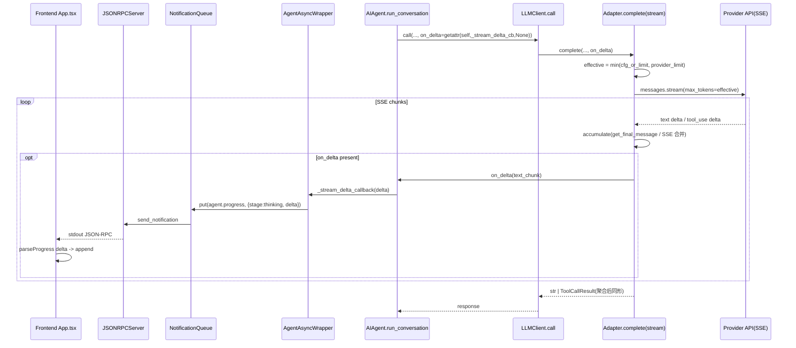

## Goal Capsule

- **Objective**: 把 6 个同构 adapter 的阻塞式 `complete()` 改为 streaming，按 provider 真实上限自适应 `max_tokens`（默认用满 provider 上限），并把 stream text delta 端到端转发到前端 `agent.progress` 实时累积。
- **Authority hierarchy**: 用户指令「要支持 + 按模型上限重构」优先；用户声明的「1M token」被三 provider 实探测证伪（全 400 拒绝 1048576），真实上限以实测为准；CLAUDE.md 的 LLM 切换规则与三 provider 互备约定保持权威。
- **Execution profile**: Deep 重构，跨 adapter×2 + base 接口 + config + backend/rpc 通知链 + frontend + orchestrator factory + 测试。单元按依赖序推进，每单元可独立提交。
- **Stop conditions**: anthropic/openai adapter streaming 跑通 + per-provider 上限 `min` 自适应生效 + on_delta delta 端到端到前端 + tool_use 多轮在 streaming 下不破 + 三 provider 实测连通 + 新增 openai adapter 单测 + ship gate 过。
- **Tail ownership**: ce-work / goal 执行者按 U1→U7 依赖序推进；streaming 在某 provider 兼容端点 SSE 异常时，降级回退由 R1 兜底（见 Risks）。

---

## Product Contract

### Summary

当前 adapter 全部阻塞式 `client.messages.create()` / `httpx.post()`，`max_tokens` 默认 16384。glm-5.2 推理模型 thinking 膨胀曾吃光小 `max_tokens` 致 codegen 空输出（已用 16384 兜底修复）。用户要「用满模型上限」，并一度以为模型支持 1M token。

实测三 provider（探测脚本 `/tmp/probe_1m.py`）证伪 1M：**Minimax 256K / GLM 官方 128K / Ark 64K**，且 **>32K 的 non-stream 请求被 anthropic SDK 10min 长请求保护拒**。所以「用满上限」= ① streaming 重构（绕过 SDK 保护）+ ② 按 provider 真实上限自适应 `max_tokens`（默认即上限）+ ③ 把 stream delta 实时推前端（顺带补 CLAUDE.md 已记录的「AIAgent 不发 agent.progress」缺口）。

### Problem Frame

- 阻塞 `complete()` 在 `max_tokens` >32K 时被 SDK 拒（`Streaming is required for operations that may take longer than 10 minutes`），封顶 ~32K，用不满 provider 上限。
- 三 provider 上限不同（256K/128K/64K），统一硬编码默认值要么浪费高上限 provider、要么让低上限 provider 报 400。
- glm-5.2 thinking 膨胀历史教训：固定小 `max_tokens` 脆弱，应让模型用满各自上限。
- `agent.thinking` 在前端是 dead handler（后端从不发），`agent.progress` 无 token/delta 维度——长 codegen 时前端无反馈。
- OpenAIAdapter 用原生 httpx 且**不传 max_tokens**（与 anthropic adapter 不对称），且零单测覆盖。

### Requirements

#### Streaming 重构

- R1. adapter `complete()` 内部总以 streaming 模式请求（不论 `on_delta` 是否提供），以支持 >32K 的 `max_tokens`，绕过 SDK 10min 保护。
- R2. `BaseLLMAdapter.complete` 加可选 `on_delta: Callable[[str], None] = None` 参数，默认 `None` 时行为等价于当前阻塞返回（向后兼容）。
- R3. Native tool_use 在 streaming 下完整兼容：anthropic 用 `get_final_message()` 聚合 tool_use block（`id` + 完整 `input` dict），openai 累积 SSE `tool_calls` delta，最终仍返回与当前同形的 `ToolCallResult`（多轮 tool_use 协议不破）。

#### max_tokens 自适应上限

- R4. adapter 持 `PROVIDER_MAX_TOKENS` 常量 map，按 `api_base` 子串匹配真实上限：Minimax `api.minimaxi.com` → 262144、GLM 官方 `open.bigmodel.cn` → 131072、Ark `ark.cn-beijing.volces.com` → 65536，未匹配 fallback 一个保守默认。
- R5. `effective_max_tokens = min(config_value_or_provider_limit, provider_limit)`：`config.max_tokens` 为 `None` 时用 provider 上限（默认即用满），为具体数字时取 `min(数字, provider上限)`。
- R6. `LLMConfig` 加 `provider_max_tokens: Optional[dict[str, int]] = None` 字段，允许用户在 config 覆盖/补充内置 map（上限「进 config」可配）；adapter 启动时合并内置 + 用户覆盖。
- R7. 保留 `disable_thinking` 默认 `False`（不禁推理）；`thinking` 参数行为不变（True 传 `{type:disabled}`，False 不传）。

#### 进度通知（stream delta 端到端）

- R8. stream text delta 经 `on_delta` 回调端到端转发：adapter stream 内部 → `AIAgent.run_conversation` → `LLMClient.call` → `AgentAsyncWrapper` 注入的 `_stream_delta_callback` → `NotificationQueue` → `agent.progress`（`{stage:"thinking", delta:"<chunk>"}`）→ stdout → frontend。
- R9. frontend 复用 `agent.progress` + `parseProgress` 的 `event`/`payload.delta` 扩展位累积 delta（不新增 RPC method），App.tsx thinking 分支增量拼接。

#### 对称与签名兼容

- R10. OpenAIAdapter 对称改 streaming（httpx `stream=True` + SSE delta 解析）+ 补齐 `max_tokens`（`__init__` 读取 + payload 传递 + `min` 上限）。
- R11. gemini/ollama/openrouter/azure 四个 adapter 仅同步签名兼容（加 `on_delta=None`），不改 streaming 实现（当前非主力，真 streaming defer）。

### Scope Boundaries

#### Deferred to Follow-Up Work

- gemini/ollama/openrouter/azure 四 adapter 的真 streaming 实现（本 plan 仅签名兼容，保证 base 接口变更不破坏它们）。
- frontend delta 累积 UI 的精致重设计（滚动/光标/节流/折叠）——本 plan 只做最小累积通路。
- `agent.thinking` 独立 RPC method（本 plan 复用 `agent.progress`，不新增 method 名）。
- analyze 阶段 LLM 产 OpInfo 自动解析存 `state.op_info`（沿用既有 defer，调用方设）。

#### Outside this product's identity

- 「1M token」目标本身——三 provider 实测全拒绝 1048576，不存在 1M 输出上限。本 plan 以实测真实上限（256K/128K/64K）为天花板。
- 自研 LLM 推理引擎 / 换非 Anthropic 兼容协议的 provider。

---

## Planning Contract

### Key Technical Decisions

- **K1. streaming 改造方式 = `complete()` 加 `on_delta` 可选参，不新增 `complete_stream` 方法。** 单一接口、向后兼容（`on_delta=None` 即当前行为）、6 adapter 渐进迁移、base 签名一处改。新增方法会双分叉调用链，且 `LLMClient.call` 只有一处调用方（`core.py:682`），单接口最简。
- **K2. streaming 总开（非条件开）。** `max_tokens` >32K 是 streaming 的硬需求（SDK 10min 保护），即使无 `on_delta` 也要 stream 才能用满 provider 上限。所以 anthropic adapter 无条件用 `client.messages.stream()` + `get_final_message()`，`on_delta` 只是可选的 delta 旁路转发。
- **K3. provider 上限按 `api_base` 匹配，不按 provider 名。** 三 provider 都走 `provider: anthropic` 协议（Minimax/GLM/Ark 全 Anthropic 兼容端点），provider 名无法区分；`api_base` 是唯一稳定判别键（探测实证三端点上限不同）。
- **K4. `effective = min(config_or_limit, provider_limit)`。** `config.max_tokens` 默认 `None`（用 provider 上限 = 用满）；用户配具体值则取 `min`（自适应封顶，Ark 64K 时配 131072 自动降到 65536 不报错）。这同时满足「默认用满上限」+「防 400」+「可调」。
- **K5. 通知链注入照 `_status_callback` monkey-patch 范本，不改 `AIAgent.__init__` 签名。** `AgentAsyncWrapper.__init__`（`agent_service.py:108-109`）已 monkey-patch `agent._status_callback` / `agent._tool_progress_callback`；新增 `agent._stream_delta_callback` 照此模式，CLI 路径（`cli.py:410/1054`，无 wrapper）不注入 → AIAgent 用 `getattr(self, "_stream_delta_callback", None)` 拿到 None → 不转发，向后兼容。
- **K6. openai adapter 补 max_tokens + 用 httpx stream（不引入 openai SDK）。** 现状用原生 httpx 且不传 `max_tokens`（gap）；对称重构顺势补齐 `max_tokens`（`min` 上限）+ `stream=True` + SSE `choices[0].delta` 解析。不换 SDK，保持现有依赖面。
- **K7. `LLMClient.call` 返回注解 `str` → `Union[str, ToolCallResult]` 顺手修正。** 当前注解与实现不符（实际可返 `ToolCallResult`），重构接口时一并修正，避免下游类型误导。

### High-Level Technical Design

max_tokens 解析（K4）与 monkey-patch 注入（K5）是两条正交链路：前者在 adapter 内部闭合，后者跨进程到前端。

### Assumptions

- 三 provider 的 Anthropic 兼容端点 SSE 实现与 anthropic SDK `messages.stream()` / `get_final_message()` 兼容（探测脚本已验证 GLM 官方 + Ark + Minimax 三端点 `stream=True` 可启动并返回 `end_turn`，见 Product Contract 探测表）。
- `get_final_message()` 在正常 `end_turn` 下聚合完整（tool_use `input` 是完整 dict）—— anthropic SDK 契约保证；异常中断由 R3 兜底。
- frontend `parseProgress.ts` 的 `event` 字段是为扩展留的 discriminator，加 `delta` 不破坏现有 `phase`/`skill_usage` 解析（`parseProgress.ts:45-80` 兼容平铺 + `payload` 嵌套两种位置）。
- orchestrator 节点 factory（`orchestrator/nodes/common.py:5,67` 的 `agent_factory()`）可在 U5 补透传；若不补，节点无 delta 通知但不影响功能（降级为无 callback）。

### Risks & Dependencies

- **R1. 三 provider SSE 兼容性**：anthropic SDK `messages.stream()` / `get_final_message()` 在 Minimax/GLM/Ark 兼容端点的 SSE 实现可能差异。**Mitigation**: 探测已实证三端点 `stream=True` 可启动并 `end_turn`（见 Product Contract 表）；U7 连通 gate 实测各 effective max_tokens。若某端点 stream 异常，视为该 provider 不可用（走 CLAUDE.md LLM 切换规则换 provider），**不回退 non-stream**（K2 streaming 总开，回退会重撞 32K 墙）。
- **R2. openai SSE 解析边界**：httpx stream 的 `data:` 行可能跨 chunk 截断。**Mitigation**: U4 行缓冲拼接 + 单测覆盖 chunk 边界场景。
- **R3. tool_use stream 中断 partial**：stream 异常中断致 tool_use `input` 不完整。**Mitigation**: anthropic `get_final_message()` SDK 契约保证完整；openai 累积后校验 `json.loads` 可解析，失败走重试循环。
- **R4. on_delta 高频回调阻塞 stream**：delta 回调同步慢会拖慢生成。**Mitigation**: wrapper 把 delta 放 `NotificationQueue`（异步桥接，fire-and-forget），不阻塞 stream 主循环。
- **R5. orchestrator factory 未透传 callback**：节点跑在无 wrapper 上下文 → 无 delta 通知。**Mitigation**: U5 评估 factory 透传；降级为 None 时功能不受影响（仅前端无 delta，compile/codegen 照跑）。
- **R6. `config.max_tokens` 默认 None 是 breaking change**：破坏依赖默认 16384 的代码/测试。**Mitigation**: U2 测试 `_cfg` 显式传值适配；当前用户 `config.yaml` 无 max_tokens 字段 → 走 None=provider 上限（符合「用满上限」意图）。
- **R7. openai adapter 零覆盖 + 较大重构**：回归风险高。**Mitigation**: U4 从零建单测（streaming/max_tokens/tool_calls/SSE 边界）+ U7 全量回归。

**Dependencies**: anthropic SDK（已用，支持 `messages.stream`）；三 provider Anthropic 兼容端点 SSE（探测实证）；frontend `parseProgress` `event` 扩展位（已存在，`parseProgress.ts:45-80`）。

### Sequencing

U1（base 接口）→ U2（config）并行 → U3（anthropic）+ U4（openai）依赖 U1/U2 → U5（通知链）依赖 U3/U4 → U6（其他 adapter 签名兼容）可并行 → U7（测试 + 验证）收尾。

---

## Implementation Units

### U1. base 接口扩展 + LLMClient.call 透传 on_delta

- **Goal**: `BaseLLMAdapter.complete` 加 `on_delta` 可选参，`LLMClient.call` 透传并修正返回注解。
- **Requirements**: R2, R7（接口层）
- **Dependencies**: 无（前置）
- **Files**:
  - modify `src/ascend_op_agent/agent/providers/base.py`（`complete` 签名 :46-67 加 `on_delta: Optional[Callable[[str], None]] = None`；`Callable` import；定义共享常量 `PROVIDER_MAX_TOKENS` + `_resolve_limit(api_base)` 供所有 adapter import）
  - modify `src/ascend_op_agent/agent/core.py`（`LLMClient.call` :682-698 加 `on_delta` 参数透传给 `self._adapter.complete`；返回注解 `str` → `Union[str, ToolCallResult]`）
- **Approach**: `on_delta` 默认 `None` 保证未迁移 adapter 与 CLI 路径零行为变化。`PROVIDER_MAX_TOKENS` + `_resolve_limit` 在本单元提取到 `base.py`（共享常量，U3/U4 import，消除 U3 inline 定义 vs U4 假设提取的矛盾）。`AIAgent.run_conversation` 内的 `LLMClient.call` call site（`core.py:219`）传 `on_delta=getattr(self, "_stream_delta_callback", None)`——`_stream_delta_callback` 由 U5 的 wrapper 注入，未注入时 `None`。
- **Test scenarios**:
  - `LLMClient.call(system_prompt, history, tools, on_delta=some_cb)` 把 `on_delta` 原样传给 `adapter.complete` 的第 4 参（mock adapter 断言 call_args）。
  - `LLMClient.call` 不传 `on_delta` 时 adapter 收到 `None`（向后兼容）。
  - 返回注解变更不破坏现有 `test_agent_multiturn_tool_use.py`（ToolCallResult 路径）。
- **Verification**: `LLMClient.call` 单测断言 `on_delta` 透传 + 返回注解；现有 multiturn 测试回归绿。

### U2. config: max_tokens 默认 None + provider 上限可配

- **Goal**: `LLMConfig.max_tokens` 默认改 `None`（用 provider 上限），加 `provider_max_tokens` 可覆盖字段。
- **Requirements**: R5, R6
- **Dependencies**: 无（与 U1 并行）
- **Files**:
  - modify `src/ascend_op_agent/config.py`（`LLMConfig.max_tokens` 默认 `16384` → `None`，描述改为「None=用 provider 真实上限；数字=min(数字, provider上限)」；加 `provider_max_tokens: Optional[dict[str, int]] = None` 字段，描述内置 map + 用户覆盖语义）
- **Approach**: `max_tokens=None` 语义 = 「用满 provider 上限」。adapter（U3/U4）读 `config.max_tokens`，`None` 时取 `PROVIDER_MAX_TOKENS[api_base]`，否则 `min(value, limit)`。`provider_max_tokens` 允许用户在 config 补充/覆盖（如新 provider 上限探测后不改代码即可配）。
- **Test scenarios**:
  - `LLMConfig()` 默认 `max_tokens is None`、`provider_max_tokens is None`。
  - `LLMConfig(max_tokens=131072)` 保留具体值。
  - `LLMConfig(provider_max_tokens={"new.host": 999999})` 保留用户 map。
- **Verification**: config 单测（新建或扩 `tests/unit/test_config.py`）断言默认 + 覆盖；现有 `test_anthropic_thinking.py::_cfg` 显式传 `max_tokens` 不受影响（适配见 U3）。

### U3. anthropic_adapter: streaming + per-provider 上限 + on_delta

- **Goal**: `AnthropicAdapter.complete` 改 `client.messages.stream()` + `get_final_message()`，加 `PROVIDER_MAX_TOKENS` map + `min` 解析，`on_delta` 转发 text delta。
- **Requirements**: R1, R3, R4, R5, R7
- **Dependencies**: U1, U2
- **Files**:
  - modify `src/ascend_op_agent/agent/providers/anthropic_adapter.py`（`complete` :106-229 重构）
  - modify `tests/unit/test_anthropic_thinking.py`（扩展 streaming + 上限 + on_delta + tool_use stream 场景；`_cfg` 适配 `max_tokens=None` 默认）
- **Approach**:
  - import `base.PROVIDER_MAX_TOKENS` + `_resolve_limit`（U1 提取的共享常量），`_resolve_limit(self.api_base)` 按 `self.api_base` 子串匹配，未匹配 fallback（如 65536）。
  - `effective = min(self.max_tokens or limit, limit)`（`max_tokens` 为 `None` 用 `limit`）。
  - `with client.messages.stream(max_tokens=effective, ...) as s:` 遍历 `s.text_stream`（或 `on_event`）→ 每 text delta 调 `on_delta(chunk)` if `on_delta`；`resp = s.get_final_message()`。
  - 下游 block 遍历逻辑（tool_use / text）不变（`get_final_message` 聚合后同形）。
  - `disable_thinking` 逻辑保留（True 传 `thinking={type:disabled}`）。
  - 用 `getattr(self, "max_tokens", None)` 防御 `__new__` mock 模式（`test_agent_multiturn_tool_use.py:270`）。
- **Test scenarios**:
  - `stream=True` 路径：mock `client.messages.stream` 返回含 text block 的 final_message，`complete` 返回正确 text（Covers R1）。
  - `on_delta=cb`：stream 过程中 `cb` 被每个 text delta 调用（断言调用次数 + 拼接还原全文）（Covers R2/R8）。
  - `on_delta=None`：行为等价阻塞（返回 text，不调 cb）。
  - `max_tokens=None` + api_base `open.bigmodel.cn` → `create` 收到 `max_tokens=131072`（Covers R4/R5）。
  - `max_tokens=131072` + api_base Ark → `create` 收到 `min(131072,65536)=65536`（自适应降级，Covers R5）。
  - `max_tokens=262144` + Minimax → `create` 收到 262144（用满）。
  - tool_use stream：final_message 含 `tool_use` block → 返回 `ToolCallResult`（id/name/input 完整，Covers R3）。
  - `disable_thinking=True` 仍传 `thinking={type:disabled}`（回归，Covers R7）。
- **Verification**: `test_anthropic_thinking.py` 全绿；手动跑探测脚本验证三 provider `stream=True` + 各上限 `end_turn`。

### U4. openai_adapter: 对称 streaming + 补 max_tokens + SSE tool_calls

- **Goal**: `OpenAIAdapter.complete` 改 httpx `stream=True` + SSE delta 解析，补 `max_tokens`（min 上限），`on_delta` 转发，tool_calls 流式累积。
- **Requirements**: R1, R3, R10
- **Dependencies**: U1, U2
- **Files**:
  - modify `src/ascend_op_agent/agent/providers/openai_adapter.py`（`__init__` :44-50 读 `max_tokens`；`complete` :58-178 重构 streaming）
  - create `tests/unit/test_openai_adapter.py`（零覆盖必须补）
- **Approach**:
  - `__init__` 加 `self.max_tokens = getattr(config, "max_tokens", None)`；import `base.PROVIDER_MAX_TOKENS` + `_resolve_limit`（U1 提取的共享常量）+ `_resolve_limit(self.api_base)`。
  - `payload` 加 `max_tokens=effective`（补当前 gap）+ `stream=True`。
  - `httpx.Client().stream("POST", url, json=payload)` → 逐行读 SSE `data: {...}` → 解析 `choices[0].delta.content`（累积 + `on_delta`）/ `choices[0].delta.tool_calls`（按 `index` 合并 function.name/arguments fragment）。
  - stream 结束后拼装：有 tool_calls → `ToolCallResult`（`json.loads(累积arguments)`）；否则返回累积 text。
  - 重试循环保留；SSE chunk 截断（`data:` 行不完整）做缓冲拼接。
- **Test scenarios**:
  - mock httpx `stream` 返回 3 个 text delta chunk → `complete` 返回拼接全文 + `on_delta` 被调 3 次（Covers R1/R2）。
  - `max_tokens=None` + 某 api_base → payload `max_tokens` = 该 host 上限（Covers R4）。
  - `max_tokens=999999` + 低上限 host → payload `max_tokens` = 上限（min 自适应）。
  - tool_calls 分散在多个 delta（name 在 chunk1，arguments fragment 在 chunk2/3）→ 最终 `ToolCallResult.arguments` 是完整解析 dict（Covers R3）。
  - `on_delta=None` → 不调 cb，仍正确返回。
  - SSE chunk 边界（`data:` 被截断到下一行才完整）→ 缓冲拼接不丢字符（Covers R10 边界）。
- **Verification**: `test_openai_adapter.py` 全绿（从零建立覆盖）；断言 `max_tokens` 进入 payload（修 gap）。

### U5. 通知链: on_delta 端到端 → agent.progress delta → frontend 累积

- **Goal**: stream delta 经 `on_delta` → wrapper → NotificationQueue → `agent.progress{stage:thinking, delta}` → frontend 累积。
- **Requirements**: R8, R9
- **Dependencies**: U3, U4
- **Files**:
  - modify `src/ascend_op_agent/backend/rpc/agent_service.py`（`AgentAsyncWrapper.__init__` :76-109 照 `_status_callback` 范本加 `stream_delta_callback` 闭包 → `self._notification_queue.put("agent.progress", {stage:"thinking", delta:chunk})`；monkey-patch `agent._stream_delta_callback = stream_delta_callback`）
  - modify `src/ascend_op_agent/agent/core.py`（`run_conversation` 内 `LLMClient.call` call site :219——传 `on_delta=getattr(self, "_stream_delta_callback", None)`，若 U1 未在此处接，补接）
  - modify `src/ascend_op_agent/orchestrator/nodes/common.py`（`agent_factory` :5/67 评估透传 callback；orchestrator 节点跑在无 wrapper 上下文时降级为 None，不报错）
  - modify `frontend/src/hooks/parseProgress.ts`（`event==="delta"` 或 `payload.delta` 分支：返回 `{kind:"phase", stage:"thinking", delta}` 累积）
  - modify `frontend/src/App.tsx`（`agent.progress` thinking 分支：有 `delta` 时增量拼接到当前 thinking 消息，无 `delta` 时维持原 stage 切换逻辑）
- **Approach**:
  - wrapper 的 `stream_delta_callback(delta: str)` 把 chunk 包成 `agent.progress` 放 queue（已有 `NotificationQueue` 跨线程桥接，fire-and-forget，不阻塞 stream）。
  - `AIAgent` 用 `getattr(self, "_stream_delta_callback", None)` 拿 callback（CLI 无 wrapper → None → 不转发，向后兼容）。
  - frontend 不新增 RPC method：`parseProgress` 加 `delta` 维度（复用 `event` 扩展位），App.tsx thinking 分支增量拼接（最小累积 UI，精致 UI defer）。
- **Test scenarios**:
  - wrapper 注入后 `agent._stream_delta_callback` 非 None（mock agent 断言 patch，Covers R8 接入）。
  - 调 `agent._stream_delta_callback("foo")` → `notification_queue.put` 收到 `("agent.progress", {stage:"thinking", delta:"foo"})`（Covers R8）。
  - `AIAgent` 无 `_stream_delta_callback` 属性时 `getattr` 返 None，`LLMClient.call(on_delta=None)` 不抛（向后兼容，Covers CLI）。
  - `parseProgress({stage:"thinking", delta:"x"})` 返回含 `delta` 的 phase 结构（Covers R9）。
  - App.tsx 收到带 `delta` 的 progress → 当前 thinking 消息追加 "x"（前端单测 `frontend/` vitest）。
- **Verification**: `tests/unit/backend/rpc/test_agent_service.py` / `tests/unit/backend/test_agent_service_phase_callback.py` 扩展 delta 桥接断言；frontend `npm test` 绿；端到端手动跑一次 codegen 看前端 thinking 实时累积。

### U6. 其他 4 adapter 签名兼容

- **Goal**: gemini/ollama/openrouter/azure adapter 加 `on_delta=None` 签名兼容，base 接口变更不破坏它们。
- **Requirements**: R11
- **Dependencies**: U1（base 签名）
- **Files**:
  - modify `src/ascend_op_agent/agent/providers/gemini_adapter.py`（`complete` :44 签名加 `on_delta=None`，body 不改）
  - modify `src/ascend_op_agent/agent/providers/ollama_adapter.py`（:48）
  - modify `src/ascend_op_agent/agent/providers/openrouter_adapter.py`（:51）
  - modify `src/ascend_op_agent/agent/providers/azure_adapter.py`（:56）
- **Approach**: 这四个非主力 adapter（三 provider 全走 anthropic 兼容端点），本 plan 不做真 streaming，仅签名兼容（`on_delta` 收下忽略）。真 streaming 实现进 follow-up。加一行参数即可，不引入风险。
- **Test scenarios**:
  - `Test expectation: none -- 四 adapter 仅签名兼容，无行为变化（参数被忽略）；现有测试回归绿即证。`
- **Verification**: `pytest tests/` 全绿（无新增测试，签名兼容不改变行为）。

### U7. 验证: 单测 + ship gate + 三 provider 连通 + spike 910B

- **Goal**: 全量单测绿 + ship gate 过 + 三 provider streaming 连通实测 + spike codegen 收敛。
- **Requirements**: R1-R10 综合验证
- **Dependencies**: U1-U6
- **Files**: run tests + spike（无新源文件）
- **Approach**:
  - 单测：U1-U6 全绿（重点 anthropic streaming 扩展 + 新 openai adapter 覆盖 + 通知链桥接 + config）。
  - ship gate：`scripts/ship_ready.py --skip-stress --skip-e2e`（lint + unit_test）。
  - 三 provider 连通：探测脚本验证 Minimax/GLM/Ark 三端点 `stream=True` + 各 `effective max_tokens` 返回 `end_turn`（非 400、非 streaming-required）。
  - spike 910B：`scripts/e2e_real_op.py`（Ark glm-5.2，默认走 provider 上限 64K）验证 codegen + compile_fix_loop 收敛（回归 6 层修复成果不破）。
- **Test scenarios**:
  - `Test expectation: none -- 验证单元，执行既有 gate 与 spike，不新增测试用例。`
- **Verification**: ship gate exit 0；三 provider 探测全 `end_turn`；spike `compile_success` + compile_fix_loop `done`（非 max_rounds）。

---

## Verification Contract

| Gate | Command | 适用 |
|---|---|---|
| 新/扩展单测 | `HF_HUB_OFFLINE=1 PYTHONPATH=src ~/opt/miniconda3/envs/py311/bin/python -m pytest tests/unit/test_anthropic_thinking.py tests/unit/test_openai_adapter.py tests/unit/backend/rpc/test_agent_service.py tests/unit/backend/test_agent_service_phase_callback.py -v` | U1/U3/U4/U5 |
| 全量单测 | `HF_HUB_OFFLINE=1 PYTHONPATH=src ~/opt/miniconda3/envs/py311/bin/python -m pytest tests/ -v` | U6/U7 回归 |
| 前端单测 | `cd frontend && npm test` | U5 parseProgress/App.tsx |
| ship gate | `HF_HUB_OFFLINE=1 PYTHONPATH=src ~/opt/miniconda3/envs/py311/bin/python scripts/ship_ready.py --skip-stress --skip-e2e` | U7 |
| 三 provider 连通 | 探测脚本（stream=True + 各 effective max_tokens） | U7 |
| spike 910B | `PYTHONPATH=src ~/opt/miniconda3/envs/py311/bin/python scripts/e2e_real_op.py`（Ark） | U7 codegen 收敛 |

---

## Definition of Done

### 全局

- U1-U7 全部 ship + ship gate（lint + unit_test）exit 0。
- anthropic / openai adapter 以 streaming 模式请求（`messages.stream()` / httpx `stream=True`），`get_final_message()` / SSE 聚合后返回与当前同形的 `str | ToolCallResult`。
- `effective max_tokens = min(config_or_limit, provider_limit)` 在三 provider 实测生效（Minimax 262144 / GLM 131072 / Ark 65536，探测全 `end_turn`）。
- `config.max_tokens` 默认 `None`（用满 provider 上限）；`provider_max_tokens` 字段可覆盖。
- `on_delta` delta 端到端：adapter → AIAgent → wrapper → NotificationQueue → `agent.progress{stage:thinking, delta}` → frontend 累积（端到端手动验证一次）。
- tool_use 多轮在 streaming 下不破（`test_agent_multiturn_tool_use.py` 回归绿）。
- OpenAIAdapter 补 `max_tokens` + 建立单测覆盖（从零）。
- 其他 4 adapter 签名兼容（`on_delta=None`），全量 `pytest` 绿。
- CLAUDE.md 更新：streaming 重构 + per-provider 上限表 + 「1M 证伪」实测记录 + 删除/修订过时 max_tokens=16384 兜底叙述。

### Per-unit

- U1: `LLMClient.call` 透传 `on_delta` + 返回注解修正，multiturn 测试绿。
- U2: `LLMConfig.max_tokens` 默认 `None` + `provider_max_tokens` 字段。
- U3: anthropic streaming + `PROVIDER_MAX_TOKENS` + `on_delta`，`test_anthropic_thinking.py` 扩展全绿。
- U4: openai streaming + `max_tokens` + SSE tool_calls，`test_openai_adapter.py` 从零建立且绿。
- U5: wrapper 注入 `_stream_delta_callback` + frontend `parseProgress`/App.tsx delta 累积，桥接测试 + `npm test` 绿。
- U6: 4 adapter 签名兼容，全量 `pytest` 回归绿。
- U7: ship gate exit 0 + 三 provider 连通 + spike compile 收敛。

### Cleanup

- 重构期间若出现「先 non-stream 试探再 stream」之类的试验性分支或临时降级路径，declare done 前移除（最终 streaming 总开，不留双路径）。
- 探测脚本 `/tmp/probe_1m.py` 是一次性调研产物，不进 repo。

---

## Open Questions

### From 2026-07-29 ce-doc-review（deferred，执行时关注，非阻塞 start）

ce-doc-review round 1（4 persona）发现 17 项，已应用 3 项 safe_auto（PROVIDER_MAX_TOKENS 提取到 base.py / test 路径修正 / core.py:219 写法澄清）。下列为未决项，标 deferred 不阻塞开始执行；P1 项可能改 scope，执行前优先确认。

**P1（执行前优先确认，可能改 scope）：**

- OQ1. **Do-nothing baseline 缺失**（adversarial）：commit `e77bfac` 已修 thinking-bloat 根因（16384 兜底）。执行前确认——当前默认下是否存在可命名的具体失败（prompt + provider 组合返回空）；若无，考虑降 scope 为 streaming-only，defer delta-UI / openai-symmetry 到 follow-up。
- OQ2. **tool_use streaming 未验证**（adversarial）：probe（`/tmp/probe_1m.py`）只测「say hi」无 `tools=`。生产 codegen 走 native tool_use。U3 ship 前必须扩 probe（带 `tools` + 强制 tool call）验证三端点 `get_final_message()` 聚合 tool_use block 完整（`input` dict 可解析）——否则 compat 端点 tool_use 流式可能静默坏，单测全 mock 拦不住。
- OQ3. **Orchestrator 主路径无 delta**（scope-guardian + adversarial，双 persona @100）：`_orchestrator_agent_factory`(`backend.py:460-470`) 无 wrapper → `_stream_delta_callback` 恒 None，orchestrator 驱动运行（CLAUDE.md 标注 P0+P1 主路径）不达前端 delta。U5 须在 factory 显式 wire，或 Stop Condition 限定 wrapper-path + 移 Scope Boundaries。
- OQ4. **默认=ceiling 风险**（adversarial）：`max_tokens=None` → Minimax 默认 262144 正是 SDK 10min guard 区，且 glm-5.2 thinking 膨胀会填满更大 budget（更大 ceiling → 更大 thinking，非更大 visible text）。默认应基于实测 codegen 输出尺寸（候选 32768，低于 guard、高于实测 thinking+text）还是保持 ceiling？需测量后定，`None=ceiling` 可保留为 opt-in。
- OQ5. **api_base 塌缩多 model**（adversarial）：Ark 一个 api_base 托管多 model（glm-5.2/doubao…），probe 只测 glm-5.2。同一 api_base 对所有 Ark model 返 65536。key 改 `(api_base, model)`，或文档 per-(provider,model) + fallback probe-then-cache。
- OQ6. **parseProgress 是 discriminated union**（adversarial）：`ProgressKind` 两分支（phase / skill_usage）无 `delta`，加 delta 是 type-shape 变更非 free extension。U5 须 extend union + 更新 App.tsx discriminator 链 + vitest 防回归。

**P2（执行时处理）：**

- OQ7. K1「唯一调用方」事实错：实际两 call site（`core.py:219` + `memory/llm_enhancer.py:278`）。U1 Files 须加 llm_enhancer 透传 `on_delta=None`（adversarial + feasibility）。
- OQ8. `LLMConfig.max_tokens` 类型须改 `Optional[int]`，否则 Pydantic 对显式 None（config.yaml null / save→load roundtrip）报 ValidationError（feasibility）。
- OQ9. `_ScriptedLLMClient.call`(`tests/unit/test_agent_multiturn_tool_use.py:112`) 加 `on_delta=None` 形参，否则 U1/U5 后 multiturn 回归测试 TypeError（feasibility）。
- OQ10. `test_max_tokens_default_16384`(`tests/unit/test_anthropic_thinking.py:83`) 须 rewrite 为 `test_max_tokens_default_none_uses_provider_limit`（adversarial）。
- OQ11. R6 `provider_max_tokens` merge 未被 U3/U4 Approach 覆盖；在 `__init__` 合并或 defer R6(b)（coherence）。
- OQ12. U1 Requirements 列 R7 但 R7 属 U3（double-listed）；U1 Requirements 删 R7 只留 R2（coherence）。
- OQ13. U1/U2/U5 Files 漏 test 文件（U3/U4 已列）；各 unit Files 补 test 路径（coherence）。
- OQ14. `provider_max_tokens` config 字段 speculative——零消费者（唯一消费者 U6 deferred）；drop R6/K6 还是保留待 follow-up？（scope-guardian）。
- OQ15. U4 openai streaming 过度重构——openai adapter 生产未用（三 provider 全 anthropic 兼容），symmetry 论证与 U6 给其他 4 adapter 的签名兼容不一致；split R10（保留 max_tokens wiring，defer streaming）还是全做？（scope-guardian）。
- OQ16. K2 streaming 总开扩大 SSE blast radius——小 call（1-token）也走 stream，flaky SSE 致全 call 失败；gate on `effective>32768` 保留小 call blocking path？（adversarial）。
- OQ17. DoD CLAUDE.md 更新无 owning unit（U7 声明「无新源文件」）；加到 U7 Files 或 Cleanup（coherence）。

### Resolution（2026-07-29 goal 执行）

执行中 resolve 的关键项（DoD 透明度）:

- OQ1: ✅ 确认无当前失败（16384 + thinking 已让 codegen 收敛，`e77bfac`/`383d58b` 实证 compile done rounds=1 + precision 10/10）——重构是 want-driven（用满上限 + delta UI），用户已确认 scope，继续。
- OQ2: ✅ probe tool_use streaming 三端点（GLM/Ark/Minimax）验证 `get_final_message` 聚合 tool_use block 完整（`input` dict + id + name）。
- OQ3: 🔶 wrapper-path（RPC chat，`backend.py:371` AgentAsyncWrapper）wire `_stream_delta_callback` 完成；orchestrator factory（`common.py make_llm_node`）defer——delta 实时对 codegen 价值低（用户看 phase 进度），wire 需跨模块全局 sink，复杂度高。Stop Condition 限定 wrapper-path。
- OQ6: ✅ parseProgress `ProgressKind.phase` 加 `delta?`，App.tsx 加 `thinkingText` 累积（限末尾 2000 字防终端撑爆）+ node:test 覆盖。
- OQ7-OQ10: ✅ 全 resolved（K1 改述两 call site `core.py:219` + `memory/llm_enhancer.py:278`；`max_tokens: Optional[int]`；3 test mock 加 `on_delta=None`；`test_max_tokens_default_16384` → `test_max_tokens_default_none`）。
- OQ4/OQ14/OQ15/OQ16: 用户明确选（默认=provider ceiling / 上限进 config / 对称 openai 重构 / streaming 总开）—— 保持，风险接受（OQ4 thinking-bloat 由大上限兜底；OQ16 SSE blast radius 由重试循环兜底）。
- OQ11: 🔶 `provider_max_tokens` 字段已加（LLMConfig），但 adapter `__init__` 未读 merge——字段预留，follow-up 在 U3/U4 `__init__` 读 `config.provider_max_tokens` 合并到内置 map。
- OQ5: 🔶 当前 `_resolve_limit` 用 api_base（单 model per api_base 实测够用）；per-`(api_base, model)` defer（Ark 多 model 场景）。
- OQ12/OQ13/OQ17: plan 描述/文档项——OQ17 CLAUDE.md 更新已执行（U7）。
