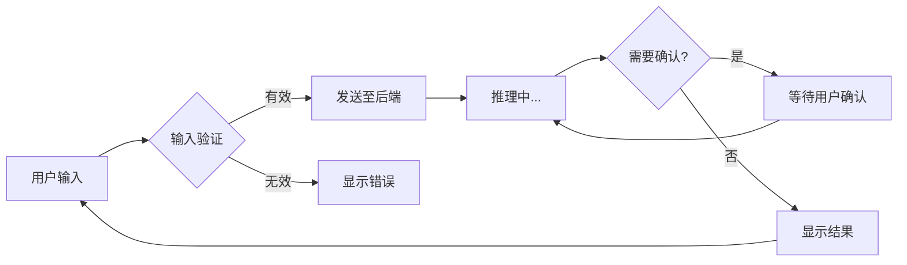

# TUI 模式使用指南

<!--
Copyright 2026 SimmerChan

Licensed under the Apache License, Version 2.0 (the "License");
you may not use this file except in compliance with the License.
You may obtain a copy of the License at

    http://www.apache.org/licenses/LICENSE-2.0

Unless required by applicable law or agreed to in writing, software
distributed under the License is distributed on an "AS IS" BASIS,
WITHOUT WARRANTIES OR CONDITIONS OF ANY KIND, either express or implied.
See the License for the specific language governing permissions and
limitations under the License.
-->

## 快速开始

```bash
# 确保已安装 Node.js (>= 16)
node --version

# 启动 Agent 对话
ascend-op-agent run
```

## 快捷键

| 快捷键 | 功能 |
|--------|------|
| ↑/↓ | 在选项列表中导航 |
| Enter | 确认选择 |
| ESC | 取消当前操作 |
| Ctrl+C | 退出会话 |

## 状态说明

| 状态 | 说明 |
|------|------|
| 就绪 | 等待用户输入 |
| 推理中 | Agent 正在处理请求 |
| 等待确认 | 需要用户确认方案 |
| 完成 | 对话完成，可开始新对话 |

## 故障排除

### Node.js 未安装

```
错误: Agent 对话需要 Node.js
请安装 Node.js: https://nodejs.org/
```

解决方案:

```bash
# Ubuntu/Debian
sudo apt install nodejs npm

# macOS
brew install node

# 验证安装
node --version  # 应显示 v16.x 或更高版本
```

### 前端构建失败

```bash
# 进入前端目录
cd frontend

# 安装依赖
npm install

# 重新构建
npm run build
```

### 进程通信失败

如果遇到 JSON-RPC 通信错误，检查:

1. Python 后端进程是否正常启动
2. stdin/stdout 管道是否正常
3. 防火墙是否阻止了本地进程通信

```bash
# 调试模式启动
ascend-op-agent run --debug
```

## 工作流程



## 高级配置

### 自定义 TUI 主题

在 `config.yaml` 中配置:

```yaml
tui:
  theme: "default"  # default / dark / light
  compact: false     # 紧凑模式
```

### 调试模式

```bash
# 启用详细日志
ascend-op-agent run --debug --log-level trace
```

## 常见问题

**Q: 为什么我的输入没有响应?**
A: 检查是否处于"推理中"状态，此时前端会等待后端响应。

**Q: 如何中断长时间运行的请求?**
A: 按 `Ctrl+C` 可强制中断当前请求。

**Q: TUI 模式和普通模式有什么区别?**
A: TUI 模式提供交互式界面，适合需要频繁确认的操作；普通模式适合自动化脚本。