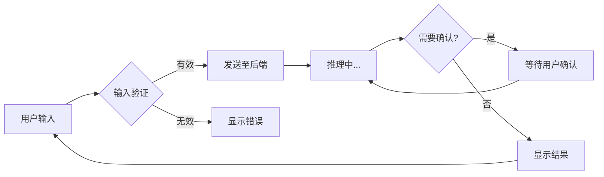

# TUI 模式使用指南

<!--
Copyright 2026 SimmerChan

Licensed under the Apache License, Version 2.0 (the "License");
you may not use this file except in compliance with the License.
You may obtain a copy of the License at

    http://www.apache.org/licenses/LICENSE-2.0

Unless required by applicable law or agreed to in writing, software
distributed under the License is distributed on an "AS IS" BASIS,
WITHOUT WARRANTIES OR CONDITIONS OF ANY KIND, either express or implied.
See the License for the specific language governing permissions and
limitations under the License.
-->

## 快速开始

```bash
# 确保已安装 Node.js (>= 16)
node --version

# 启动 Agent 对话
ascend-op-agent run
```

## 快捷键

| 快捷键 | 功能 |
|--------|------|
| ↑/↓ | 在选项列表中导航 |
| Enter | 确认选择 |
| ESC | 取消当前操作 |
| Ctrl+C | 退出会话 |

## 状态说明

| 状态 | 内部名 | 说明 |
|------|--------|------|
| 就绪 | `idle` | 等待用户输入（`backend.ready` 通知后进入） |
| 推理中 | `running` | Agent 正在处理请求（LLM 推理 / 工具调用） |
| 等待确认 | `waiting_confirm` | HITL 中断，需要用户确认方案（design / delivery_mode） |
| 完成 | `completed` | 对话完成，可开始新对话 |
| 出错 | `error` | 执行出错（`agent.error` 通知） |

## 通知协议

前端通过 stdin/stdout JSON-RPC 2.0 接收后端通知（`frontend/src/hooks/useRPC.ts`）：

| 通知方法 | 触发时机 | payload 关键字段 |
|---------|---------|-----------------|
| `backend.ready` | 后端就绪 | - |
| `agent.progress` | LLM 状态变化 / 工具执行 / stream delta | `stage`: `thinking` / `idle` / `completed` / `waiting` / `tool_executing`；`delta`（streaming 文本增量，由 `_DeltaBatcher` 节流合并） |
| `orchestrator.progress` | PhaseRunner 节点生命周期 | `phase`: 节点名；`stage`: `phase_started` / `phase_completed` / `phase_failed` / `phase_interrupted` |
| `agent.error` | 执行出错 | 错误信息 |

> **stream delta 节流**：大 max_tokens（最高 256K）长生成会产生数千 token chunk，per-chunk 发 `agent.progress` 会洪水 stdout。`agent_service.py` 的 `_DeltaBatcher` 累积 chunk 按 0.1s 间隔合并成单个 `agent.progress{stage:thinking, delta}`，LLM call 结束（idle/completed）时 `finish()` flush 收尾。

## 故障排除

### Node.js 未安装

```
错误: Agent 对话需要 Node.js
请安装 Node.js: https://nodejs.org/
```

解决方案:

```bash
# Ubuntu/Debian
sudo apt install nodejs npm

# macOS
brew install node

# 验证安装
node --version  # 应显示 v16.x 或更高版本
```

### 前端构建失败

```bash
# 进入前端目录
cd frontend

# 安装依赖
npm install

# 重新构建
npm run build
```

### 进程通信失败

如果遇到 JSON-RPC 通信错误，检查:

1. Python 后端进程是否正常启动
2. stdin/stdout 管道是否正常
3. 防火墙是否阻止了本地进程通信

```bash
# 后端日志输出到 stderr（默认 INFO，可在 config.yaml 的 logging 段调级别）
ascend-op-agent run
```

## 工作流程



## 高级配置

### 自定义 TUI 主题

在 `config.yaml` 中配置:

```yaml
tui:
  theme: "default"  # default / dark / light
  compact: false     # 紧凑模式
```

### 调试模式

后端日志输出到 stderr，级别由 `config.yaml` 的 `logging` 段控制（默认 INFO）：

```bash
ascend-op-agent run
```

## 常见问题

**Q: 为什么我的输入没有响应?**
A: 检查是否处于"推理中"状态，此时前端会等待后端响应。

**Q: 如何中断长时间运行的请求?**
A: 按 `Ctrl+C` 可强制中断当前请求。

**Q: TUI 模式和普通模式有什么区别?**
A: TUI 模式提供交互式界面，适合需要频繁确认的操作；普通模式适合自动化脚本。