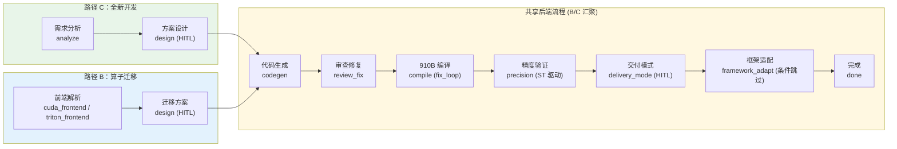
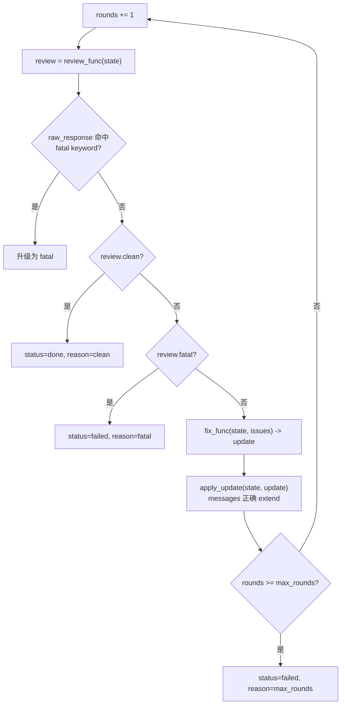

# 工作流说明

<!--
Copyright 2026 SimmerChan

Licensed under the Apache License, Version 2.0 (the "License");
you may not use this file except in compliance with the License.
You may obtain a copy of the License at

    http://www.apache.org/licenses/LICENSE-2.0

Unless required by applicable law or agreed to in writing, software
distributed under the License is distributed on an "AS IS" BASIS,
WITHOUT WARRANTIES OR CONDITIONS OF ANY KIND, either express or implied.
See the License for the specific language governing permissions and
limitations under the License.
-->

## 编排器：自研 PhaseRunner 状态机

Ascend Op Agent 用**自研轻量状态机** `PhaseRunner`（`orchestrator/state_machine.py`）驱动算子开发全流程，而非 LangGraph。P0 单算子顺序执行场景下，约 50 行的 `_run_from` 循环够用且更易调试。

### 核心三件套

| 组件 | 职责 |
|------|------|
| **OpState** (`state.py`) | 节点间传递的可序列化状态（TypedDict，dataclass 以 dict 嵌入保证 JSON 可序列化） |
| **Node** | 最小执行单元 `Callable[[OpState], dict]`，返回 update dict |
| **PhaseRunner** | 按 `nodes` 列表顺序执行 + 应用 reducer + 每节点后 `CheckpointStore.save` + 处理控制字段 |

### Reducer 规则

节点返回的 update dict 含两类键：

**普通字段**（走 reducer，由 module-level `apply_update` 处理）：

| 字段组 | 字段 | Reducer | 意图 |
|--------|------|---------|------|
| APPEND_FIELDS | `messages`, `phase_history` | `list.extend()` 累加 | 对话历史跨节点累积、执行轨迹完整保留 |
| MERGE_FIELDS | `memory_pools`, `retry_counts` | `dict.update()` 字典级合并 | Layer 5 记忆跨节点持久化、各节点重试计数 |
| Last-write-wins | `op_info`, `design_doc`, `code_result`, `compile_result`, `precision_report`, `current_phase`, `delivery_mode`, `task_type` 等 | 直接覆盖 | 每阶段产出物由对应节点覆盖写入 |

**控制字段**（下划线前缀，不进 OpState，由 PhaseRunner 拦截处理）：

- `__interrupt__: dict` -- 触发 HITL 暂停，payload 存 `pending_approvals`，status=waiting_confirm；`resume` 时 payload 注入 `state["pending_confirmation"]` 并重跑当前节点（节点需感知做幂等）
- `__status__: "done" | "failed"` -- 终止执行

## 三路径编排

Ascend Op Agent 支持三条用户旅程，共享同一套运行时后端（PhaseRunner + checkpoint + NpuExecutor），仅前端入口不同：

| 路径 | 场景 | 输入 | 优先级 | 状态 |
|:----:|------|------|:------:|:----:|
| **A** | 模型级选择性迁移 | 客户模型（含 N 个 CUDA/Triton 算子的 python 脚本/repo） | P2 | 规划中 |
| **B** | 单算子迁移（CUDA / Triton） | GPU 源代码 | P0 ✅ | 已交付 |
| **C** | 单算子全新开发 | 算子需求描述 | P0 ✅ | 已交付 |

> **Path A 前提澄清**：输入是 python 脚本/repo 而非 pt 文件；算子分析靠实测运行 + profiling，非 `torch_npu.frontend` 静态解析。



### 节点顺序

以 Path-C（全新开发，`graphs/new_dev.py`）为例，节点链为：

```
entry -> analyze -> design(HITL) -> codegen(可拆多个子节点) -> review_fix
      -> compile(fix_loop) -> precision(ST 驱动) -> delivery_mode(HITL)
      -> framework_adapt(条件跳过) -> done
```

Path-B（迁移，`graphs/migration.py`）的差异仅在入口：`cuda_frontend` 或 `triton_frontend` 替换 `analyze`，后续节点共享。

### 节点工厂

| 工厂 | 类型 | 控制流 | 典型用途 |
|------|------|--------|---------|
| `make_llm_node` | LLM 节点 | 正常完成 / 幂等跳过 | analyze / codegen / review_fix / framework_adapt |
| `make_hitl_llm_node` | HITL LLM 节点 | 首次产 `__interrupt__`，resume 推进 | design 确认 |
| `make_delivery_mode_node` | 纯 Python + HITL | 首次产 `__interrupt__`，resume 推进 | 交付模式选择（sample/torch_npu/pybind） |
| `make_fix_loop_node` | 循环包装节点 | 内部 review->fix 收敛 | compile_fix_loop / precision_fix_loop |
| `make_cuda_frontend_node` / `make_triton_frontend_node` | LLM + JSON 解析 | 正常完成 | 迁移前端解析 |
| 确定性节点（compile/precision） | NpuExecutor 调用 | 正常完成或 fix_loop 包装 | 真编译、精度验证 |

> **条件跳过模式**：PhaseRunner 是顺序 DAG 不支持条件路由，`framework_adapt` 节点在函数体内判断 `delivery_mode != "torch_npu"` 时直接返回 `{"skipped": True}`，让编排器继续推进。

## HITL 人工确认点

三条路径共有两个 HITL 中断点，均通过 `make_hitl_llm_node` 实现：

| 中断点 | 时机 | payload 内容 | 确认后动作 |
|--------|------|-------------|-----------|
| **design** | LLM 生成 DESIGN.md 后 | `design_doc` + `op_info` + `arch_mapping` + `options:[approve,reject]` | approve -> codegen 启动 |
| **delivery_mode** | precision 通过后 | 启发式推荐 + `options:[sample,torch_npu,pybind]` | 选择后 -> framework_adapt |

中断流程：节点返回 `__interrupt__` -> PhaseRunner 先 `save(state, RUNNING)` 再 `mark_waiting`（改 status=waiting_confirm + 存 pending_approvals）-> emit `interrupted` -> 返回。`resume(thread_id, payload)` 时 `consume_pending` 取出 payload 注入 `state["pending_confirmation"]`，重跑当前节点（节点感知 pending_confirmation 幂等跳过 LLM，推进到下一节点）。

## Fix Loop 闭环修复

`fix_loop.py` 的 `run_fix_loop` 将 "review -> fix -> re-review" 循环包装成一个 PhaseRunner Node，使 compile 和 precision 阶段具备自动收敛能力。



### ReviewResult 契约

| 状态组合 | 语义 | fix_loop 行为 |
|---------|------|-------------|
| `clean=True` | 无问题 | 立即 `status=done, reason=clean` |
| `clean=False, fatal=False` | 有可修复问题 | 跑 fix，进入下一轮 review |
| `clean=False, fatal=True` | 确定性不可修复 | 立即 `status=failed, reason=fatal` |

默认 fatal keywords：`unsupported dtype` / `missing hardware feature` / `cannot be implemented`。命中时即使 `review.fatal=False` 也自动升级为 fatal，避免 LLM 隐式表达"不可修复"时无意义重试浪费 token。

### compile/precision 的三层接入

| 接入方式 | 工厂参数 | 行为 |
|---------|---------|------|
| 占位节点 | 不传任何 factory | 返回 `success=True` 的 dummy result（测试用） |
| 单节点 | `compile_node_factory` / `precision_node_factory` | 单次编译/精度验证，失败即终止 |
| Fix Loop | `compile_fix_loop_node_factory` / `precision_fix_loop_node_factory` | review -> fix -> re-review 闭环，最多 N 轮 |

`make_real_compile_fix_loop_node`（`nodes/validation.py`）是针对 LLM codegen 写不对 `build.sh`/`CMakeLists.txt` 场景的强化方案：每轮真跑 compile -> 失败时 LLM 修构建文件（markdown 自动落盘）-> re-compile。

> **U3 修复**：fix_loop 跨轮 messages 合并走 module-level `apply_update`（extend 语义），修复了此前手写 merge 对 list 字段做覆盖致跨轮 conversation 历史丢失的 bug。

## 崩溃恢复

CheckpointStore（SQLite v2）每节点后 `save` 持久化状态。`resume(thread_id, payload)` 支持两种恢复场景：

| 场景 | 判定条件 | 起始节点 | 状态注入 |
|------|---------|---------|---------|
| HITL 恢复 | `pending_approvals` 有记录 | 重跑当前节点 | payload 注入 `pending_confirmation` |
| 崩溃恢复（节点内） | status=FAILED，无 pending | 重跑当前节点 | 无 payload |
| 崩溃恢复（节点间） | status=RUNNING，无 pending | 下一节点 | 当前节点已成功落盘 |

checkpoint 三表：`checkpoints`（thread 级状态）、`artifacts`（大对象 sha256 索引，LLM 节点幂等 gate）、`pending_approvals`（HITL 暂存）。原子性：每方法 `BEGIN IMMEDIATE` + `PRAGMA busy_timeout=30000` + `journal_mode=WAL` 防 SQLITE_BUSY 跨进程。

## 910B 真编译 + ST 驱动验证

NpuExecutor 封装 CANN 工具链调用（`npu_exec.py`）：

- **compile**：`bash build.sh --soc=ascend910b -j8`（SSH -> docker exec ops_pt -> 容器内 source set_env.sh）
- **precision**：跑 scaffold 自带的 C++ aclnn ST 驱动（`tests/st/test_aclnn_<op>.cpp`），NPU 执行 + CPU golden + MERE/MARE 比对，6 步配方：install op 包 -> cmake + make ST 驱动 -> 跑二进制 -> 解析 stdout
- **cosmetic fix**：build.sh 末尾 `[ERROR] Package not found or empty` 是已知 false negative（return_code=1 但 `.run` 产物已生成），`_is_compile_success` 检测 stdout 含 `successfully created` + `.run` -> 标 success=True
- **硬件门控**：`ASCEND_OPP_PATH` 未设时返回 `success=False` 降级结果（不抛错），hardware-gated 测试自动跳过
